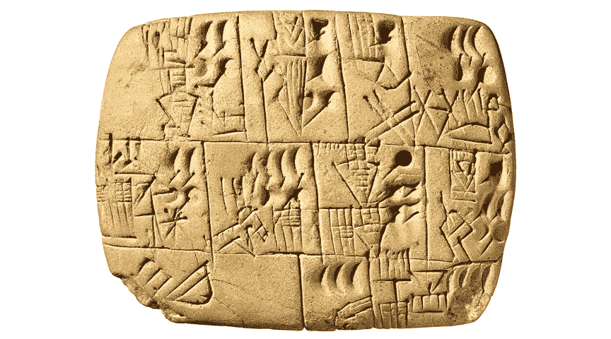
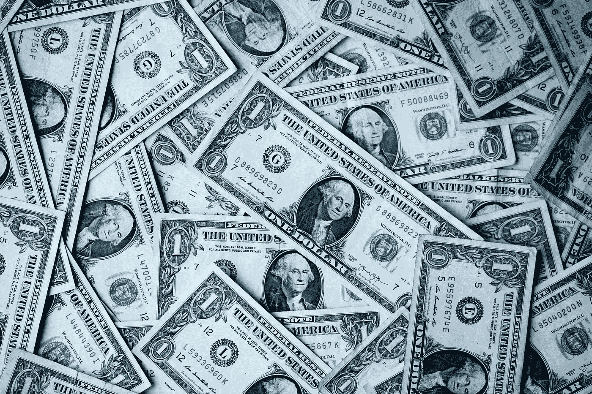
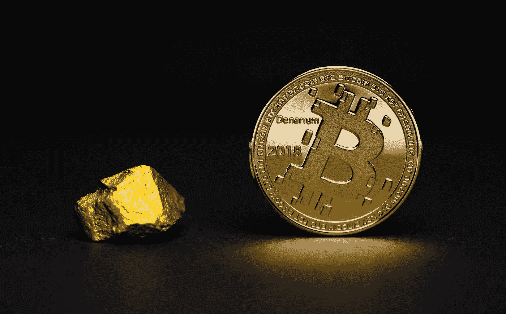
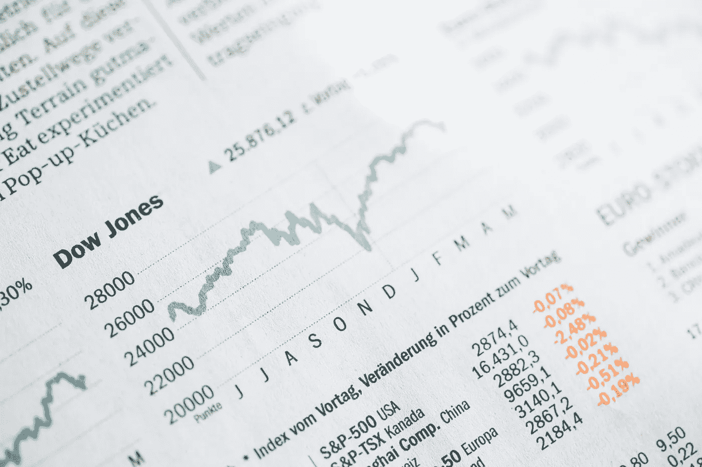

# 如何为世界末日投资

> 原文：<https://medium.datadriveninvestor.com/how-to-invest-for-the-apocalypse-f6f6872a7b63?source=collection_archive---------5----------------------->

Photo by [Tina Rolf](https://unsplash.com/@trolf?utm_source=unsplash&utm_medium=referral&utm_content=creditCopyText) on [Unsplash](https://unsplash.com/s/photos/lighthouse?utm_source=unsplash&utm_medium=referral&utm_content=creditCopyText)

最近新冠肺炎病毒爆发的影响出乎意料且极具破坏性。在大约一个月的时间里，大多数国家都严格限制或禁止国际旅行，学校和商店关门，从纽约证券交易所到比特币的市场价值暴跌。[许多分析师认为市场最糟糕的时刻还在后头。](https://www.bloomberg.com/news/articles/2020-03-17/morgan-stanley-economists-say-global-recession-now-base-case?srnd=premium-europe)

当我和其他数百万在市场上有钱的人一直在焦虑地咬着指甲时，我想知道是否有一种方法可以确保你的资源总是安全的，甚至可以在面临世界末日的事件时蓬勃发展。我确信，和许多人一样，最初我感到现代经济非常脆弱，在面对外部压力时很容易恢复。

似乎如果我想知道当经济结束时会发生什么，我需要研究它们是如何开始的。

# **经济如何增长**

所有的人类经济似乎都是与它们所起源的文明一起发展的。经济随着我们的进步而进步，尤其是与我们的技术同步；我们甚至发明了*写*主要是，因为我们需要记录分配、信用和债务。

Early writing: Allocations of beer in Mesopotamian cuneiform, 3100–3000 B.C.E © Trustees of the British Museum

另一方面，如果文明倒退(比如说，因为全球性的疫情),那么经济也会倒退，市场也会崩溃。

> 在经济发展的每一点上投资

因此，一个有效的方法应该能够通过在经济发展的每一点进行投资来抵御经济衰退。这些“点”非常粗略地对应于克拉克、费舍尔和富拉斯蒂埃在 20 世纪 30 年代和 40 年代开发的三部门模型，所以我用以前的东西来思考现代投资框架。

通过我的研究，我发现尽管三部门模型是最初思考这个问题的好方法，但更合适的是将这种思想用于我如何具体应用于投资。

 [## 数据驱动投资的兴起|数据驱动投资者

### 当 JCPenney 报告其 2015 年 2Q 的财务结果时，市场感到非常震惊。美国零售巨头…

www.datadriveninvestor.com](https://www.datadriveninvestor.com/2019/02/28/the-rise-of-data-driven-investing/) 

鉴于此，我决定将三部门模型调整为我所谓的*三支柱框架*。理解这些支柱中的每一个都会让我们对总体经济有一个更为基础的看法，更具体地说，就是我们如何将其应用到我们的投资策略中。

# 1.主要支柱:农业和自然资源

一般认为 Fourastié等人将第一产业归类为自然资源开采，包括农业、渔业和采矿业。这是经济最基础的一层，这个层次的文明主要关心个人生存和一些小的、局部的贸易。

许多中年经济体坚持在这一水平，今天许多发展中国家也是如此。例如，纳米比亚的粗略国内生产总值仅为 132.4 亿美元(2017 年)；从全球经济的角度来看，这个数字很小，但没有考虑到很大一部分人口生活在基本上与城市经济脱节的自给自足状态中。

Namibia by [Alan J. Hendry](https://unsplash.com/@imedianamibia?utm_source=unsplash&utm_medium=referral&utm_content=creditCopyText) on [Unsplash](https://unsplash.com/s/photos/namibia?utm_source=unsplash&utm_medium=referral&utm_content=creditCopyText)

我们可以合理地假设，一个被灾难性事件摧毁的经济体将完全回归到这一支柱，在这一支柱下，你和我主要关心的是生存，只有在这种情况下，才会有一些潜在的贸易顺差。

## 你如何在这里投资

如果一个经济体被抛回到这一支柱，便利的投资将是那些致力于人类需要的东西的投资，而不管该经济体有多先进(或者该经济体是否存在):

*   *粮食:*以实体农场的形式和各种形式的农业。食物是生命所必需的，即使在完全的世界末日场景中，这也是至关重要的
*   *水:*海水淡化、含水层和其他与水相关的技术和基础设施。另一种对生命至关重要但供应有限的资源。请看:[迈克尔·布里，著名的卖空房地产市场的交易者，投资水资源](https://www.killik.com/the-edit/why-michael-burry-is-investing-in-water/)
*   *电力:*以太阳能、风能、波浪能等可再生离网解决方案的形式。尽管电力并非人类生存的绝对必要条件，但它让我们的许多技术得以实现，如果人类重新启动，它可能是需要重新发现的唯一最重要的技术。参见:[埃隆马斯克和特斯拉](https://tesla.com)。
*   *住房:*以房地产的形式。无论经济状况如何，住房通常都是必需的，而且可能是第一支柱中最容易获得的投资。这个行业显然不能幸免于市场崩溃，但从长期来看，这通常是一个非常有效的投资。

在这一层面上还可以进行其他投资，但有趣的是，第一支柱领域的许多负责任的投资对地球也有好处。我不确定这对许多现代发达经济体意味着什么，但这值得思考。

> 对第一支柱的许多投资对地球也有好处

至少，在这一水平上投资，尽管往往很困难，但将是最能抵御一般市场冲击的，也是最能抵御灾难性事件的。

# 2.第二大支柱:货币

Cash money! Photo by [Sharon McCutcheon](https://unsplash.com/@sharonmccutcheon?utm_source=unsplash&utm_medium=referral&utm_content=creditCopyText) on [Unsplash](https://unsplash.com/s/photos/money?utm_source=unsplash&utm_medium=referral&utm_content=creditCopyText)

传统上，第二产业与制造业相关联；获取原始资源，并将其转化为可以出售给消费者的商品。在这种情况下，一个文明变得足够富裕，不再需要勉强维持生计，它开始在国内和与邻国进行贸易。

> 任何贸易中的规模都需要交换媒介

对于处于这一水平的经济体来说，最大的障碍是任何贸易的规模都变得太大，以物易物或送礼不再有意义；如今，贸易需要一种交易媒介，以使交易和债务信用审计易于执行和标准化。

输入货币。

货币作为交换媒介促进了贸易，使其成为比股票、债券和当今市场上交易的几乎所有其他金融工具(商品除外)更基本的经济工具。

> 事实上，唯一没有在新冠肺炎恐慌中崩溃的市场是外汇市场

这实际上在最近的市场上已经可以观察到，因为几乎唯一没有在新冠肺炎恐慌中崩溃的市场是外汇市场。毕竟，如果不与另一种货币进行比较，我们如何衡量一种货币的崩溃呢？我们用货币价值来衡量一切事物，事实证明，美元和瑞士法郎等货币是在这个世界天翻地覆的时期存放财富的常用工具。

与大多数其他投资工具不同，货币是我们日常生活的基础。

## 你如何在这里投资

交易媒介的问题在于，它的目的是促进交易和价值流动，而不是投资。事实上，投资工具的设计参数——稀缺性、更高的价格、更慢的交易速度——与货币截然相反；你不用比特币买面包是有原因的。

Bitcoin’s design makes it a great store of value, but a poor currency. Photo by [Aleksi Räisä](https://unsplash.com/@denarium_bitcoin?utm_source=unsplash&utm_medium=referral&utm_content=creditCopyText) on [Unsplash](https://unsplash.com/s/photos/bitcoin?utm_source=unsplash&utm_medium=referral&utm_content=creditCopyText)

据我所知，利用货币的最佳方式是始终保持一些现金投资，并尽可能以多种货币进行投资。对于更喜欢冒险的人来说，还有外汇交易，这对于一些尝试过的人(但不是大多数)来说是有利可图的。可以说的是，外汇交易员实际上是新冠肺炎疫情期间唯一不流汗的市场交易员。

在大规模交易的经济中，货币是最基本的工具，因为它易于使用，具有可替代性，并且便于跟踪信贷和债务。

在世界末日的场景中，现金将是王道。

# 3.第三支柱:正常市场工具

最成熟的经济形式，也是当今大多数国家的经济形式，是能够创造出将金融工具置于基础资产之上的市场。

尽管货币对于简化交易非常有用，但在一个全球化的先进文明中，拥有同样先进的金融工具来促进更复杂的交易也是有益的。

Photo by [Markus Spiske](https://unsplash.com/@markusspiske?utm_source=unsplash&utm_medium=referral&utm_content=creditCopyText) on [Unsplash](https://unsplash.com/s/photos/financial-market?utm_source=unsplash&utm_medium=referral&utm_content=creditCopyText)

然而，请注意，因为这些更常规的投资——如股票、债券和期权——与经济的稳定性相关，所以当经济衰退时，它们也是第一个崩溃的。你不需要任何接近世界末日的情景来引发较小的崩盘，而仅仅基于投机的波动已经导致许多人在这个水平上支持投资多元化。

## 你如何在这里投资

第三个支柱包括你将进行的所有常规投资，尤其是股票、债券和期权等纸资产。其中一些工具对经济来说比其他工具更重要(想想哪个会先崩溃:美国政府债券还是美国公司债券？)但所有这些都在发达经济体的保护伞下。

这一层次的投资不像第一支柱和第二支柱那样对人类生存至关重要，因此，如果市场出现任何形式的投机行为，它们都将首先崩溃。真正有问题的事件，如新冠肺炎或核灾难，将导致该行业在进入更基本的经济层面之前几乎立即崩溃。

# 结论

一种投资模式可以将自身分散到一个经济体发展的各个方面，这是对冲灾难性情景的绝佳方式。实践中的做法是我留给你决定的，但在决定如何投资时，看看经济如何与文明同步发展是有益的。

通过至少在第一、第二和第三支柱上进行一些投资，你可以确保无论这个世界变得多么疯狂，你仍然可以拥有一些有价值的资源。

**法律免责声明:**虽然我确实有一些根据该模型构建的投资，但我不是财务顾问，这里给出的建议也不是财务建议。我只是提供了一个新的视角，一种看待经济结构以及这种结构如何影响一个人的投资的方式。