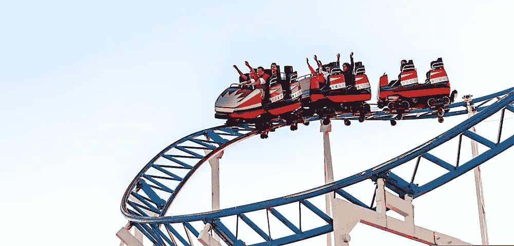

# 如何在波动的股市投资:投资者的 5 个投资策略

> 原文：<https://medium.datadriveninvestor.com/how-to-invest-in-a-volatile-stock-market-5-investment-strategies-for-investors-134d708a157f?source=collection_archive---------10----------------------->

Photo by [Gabriel Valdez](https://unsplash.com/@gabrielvdz?utm_source=unsplash&utm_medium=referral&utm_content=creditCopyText) on [Unsplash](https://unsplash.com/@gabrielvdz?utm_source=unsplash&utm_medium=referral&utm_content=creditCopyText)

作为一种资产类别，股票天生具有波动性。

股票市场的动荡时期对你意味着什么？

**加速波动的最具体的世界事件:**

*   国际和国内经济危机
*   失业率上升和就业不稳定
*   金融市场崩溃
*   信贷机会冻结，就像 2008 年 T2 市场崩盘一样
*   战争、政治问题、自然灾害、坏消息、2020 年的流行病

正如你所看到的，**股票市场的波动有各种各样的原因，这在现实中应该被视为“一个投资机会”。因此，市场波动不应该成为你不投资股票的理由。**

除非整个市场对未来有一致的看法，否则趋势不可能存在，除非趋势存在，否则市场将继续波动。

在你深入投资之前，你应该先教育自己。

在这篇深入的文章中，我将向你展示在你开始投资股票之前你需要知道的一切，特别是如果你今天开始投资一个波动的股票市场。以下是科技界人士可以遵循的投资策略:

# 减少，但不是消除

股市的波动时间可能是减持的绝佳时机，尤其是如果你是指数投资者的话。

即使市场可能产生大约 15%的年回报率，也有很多年市场是反向的。

> 因此，最好不要恐慌性抛售。相反，明智地卖出，重新买入，重新安排你的股票配置！

此外，你还可以在投资组合亏损更大之前卖出亏损的头寸，并将你的现金资本投入非股权投资。

你永远不知道股票的未来会怎样，但你可以采取的最佳策略是变得更加谨慎，尤其是在过去几年的上涨之后。

只要记住:**你没有必要开始大举抛售你投资组合中的股票。从长远来看，做这样的事也会让你付出代价。**

# 提高你的股息股票

作为投资者，你可以通过高股息股票在波动的股市中避险。

这将帮助你获得稳定的股息收入，即使基础股票价格可能下跌。在资本增值不太确定的股市，派息变得非常重要。

由于股息收入可以减少股价下跌，个人投资者通常会被其可靠性所吸引。

> 值得投资研究的股票类别之一是价值股，最好是在 S&P500 指数上市。

**这些股票必须满足特定的流动性和规模要求，并且至少包含连续几年的股息增长。**

分红名单上的一些企业是成功的名字，如强生、百事、麦当劳、沃尔玛、可口可乐、西斯科、沃尔格林、雪佛龙、埃克森等等。

# 购买“被低估”的价值股

从历史上看，投资市场最成功的方式之一就是价值股。

在这里，你可以像世界上最富有的人之一沃伦·巴菲特一样遵循这一投资策略。

> 最基本的概念是对代表廉价的股票进行分类。

这通常是因为企业不受普通投资者的青睐。**基于特定指标，包括低于平均的市净率、高于平均的股息率或低于行业水平的市盈率。**

这可能是由当前一系列可能导致公司股票价值下跌的坏消息造成的。例如，企业可能面临重大诉讼、监管行动、一系列糟糕的收益或负面的媒体关注。值得注意的是，即使可能导致股价下跌的事件已经过去，价格仍有可能不会回升。

> “风险来自于不知道自己在做什么。”—沃伦·巴菲特

投资此类机构可能是合理的长期投资策略之一，因为其股票相对于竞争对手更便宜。

[在我的文章中，你可以学到更多关于如何分析公司股票和安全投资的知识。](https://www.patreon.com/posts/how-to-analyze-40809106)

在标准普尔 500 可能不可靠的股市中，个人投资者可能会密切关注潜在的价值股。在这种情况下，即使大盘下跌，这些股票也可以成为恢复扩大投资组合的一种手段。

# 投资国际市场

在过去的几十年里，股票的走势主要是在标准普尔 500 和纳斯达克。

只有一些行业的表现优于这些指数，导致特定资产类别的投资者资金增加。然而，仅仅因为标准普尔 500 和纳斯达克在历史上提供了可靠的回报，并不意味着不会有市场领导地位的改变。

**驱动股市的机构的微小变化可能会形成不同的动态，因为下跌或持平的市场可能有利于其他行业或股票。**

> 例如，能源和医疗保健是你可以投资的其他领域。尽管股市普遍波动，但医疗保健行业表现良好。鉴于，由于供应能源行业的国际动荡，该行业有可能跑赢市场。

此外，外国新兴市场是你可以投资的另一个主要领域。来自东欧、中国、拉丁美洲新兴市场或日本发达海外市场的国际股票相对而言被低估，而美国股票则被严重高估。当然，风险也更大。不过，市场波动时期可能是你买入国际股票的绝佳机会，前提是你明白自己在做什么。

# 建立流动性

这意味着在动荡时期现金为王。

诚然，你可能会“错过”许多有利可图的机会，但在现实中，**如果你不能轻易承受风险**并且不完全了解更先进的金融工具是如何工作的，现金是你在波动期间可以拥有的最好的东西之一。

在这种情况下，你的额外现金将帮助你提供一个缓冲，以应对裁员或失业。所以，在危机过后的一段时间里，你可以以你的休闲风格重新开始投资。

学会如何在这段时间里从你的工资中腾出额外的现金用于投资也是很有用的，这样你就可以花得更少，投资更多。

# 最后的想法

许多投资者开始质疑他们在动荡时期的投资策略，忘记了**市场波动是市场的自然现象:**随着时间的推移上下波动。

> 作为一个投资初学者，你应该从一个行之有效的投资股市的投资策略开始。

研究在波动市场投资的方法的原因是为了在你的投资组合中创造新的批发变化。

**在我看来，高质量和高收益结合良好的多元化是最好的保护。**

事实上，在波动的股票市场上进行长期大量投资可能会受到相反的市场方向的影响，这可能会使你质疑自己最初的策略。然而，除非你的投资组合 100%由股票组成，否则你不必特别改变策略。

相反，你可以增加对其他资产的配置，并稍微改变你的方向，以加强你的长期投资组合。

*免责声明:作者的观点仅代表其个人观点，不以任何方式构成财务建议。作者发布的任何内容都不构成投资建议，作者发布的任何数据或内容也不应作为任何投资活动的依据。*