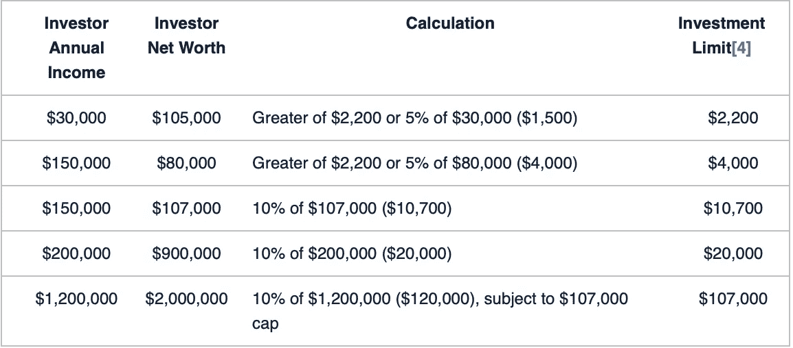
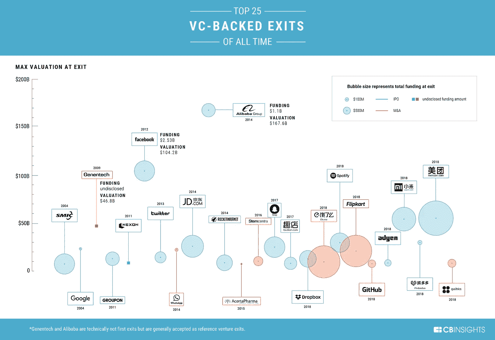

# 如何投资以前买不起的资产

> 原文：<https://medium.datadriveninvestor.com/how-to-invest-in-assets-you-couldnt-afford-before-90d4cb10e1dc?source=collection_archive---------16----------------------->

## 一瞥监管众筹改革投资和财富分配的方式。

Image by [mohamed Hassan](https://pixabay.com/users/mohamed_hassan-5229782/?utm_source=link-attribution&utm_medium=referral&utm_campaign=image&utm_content=4067990) from [Pixabay](https://pixabay.com/?utm_source=link-attribution&utm_medium=referral&utm_campaign=image&utm_content=4067990)

投资有一个简单的悖论，如果你想让你的钱增值，你就需要投资。然而，要想从投资中获得可观的收益，你从一开始就需要一大笔钱。

如果你需要投资房地产，在大多数国家，你至少需要标价的 10%作为首付。

早期投资一家公司，要么你的年收入超过 20 万美元(联合收入超过 30 万美元),要么你的净资产超过 100 万美元(T1 ),这样你就能接触到风险投资基金、对冲基金，要么你自己就是天使投资人。

要投资艺术，要么你有一个强大的艺术家网络来尽早发现人才，要么你有一笔财富来接触一位著名艺术家的作品。

不幸的是，当你想投资时，允许你以各种形式赌博，没有任何进入壁垒的系统变得相当“保护性”。即使你有必要的技能去察觉合适的机会，自己完成尽职调查，也不允许你去追求很多机会。

尽管[证券交易委员会最近决定扩大合格投资者的定义](https://www.wsj.com/articles/sec-gives-more-investors-access-to-private-equity-hedge-funds-11598452858)以允许更多的人投资这些专有资产，但该集团仍然享有很大的特权。

# 众筹的监管

对于小投资者来说，SEC 更相关的决定是[监管众筹](https://www.sec.gov/info/smallbus/secg/rccomplianceguide-051316.htm)。这项法律允许小投资者以有限的金额投资私募基金。该法规于 2016 年 5 月 13 日生效，自 2017 年 4 月 5 日起更新了以下新限值。

The table is public information [provided by the SEC](https://www.sec.gov/info/smallbus/secg/rccomplianceguide-051316.htm).

这个规定为很多创新平台打开了几扇大门，铺平了道路。现在可以用他们授予我们的小额度来参与一个大项目了。然而，这比小投资者现在可以获得初创企业的机会这一事实要重要得多。

让我们先把显而易见的事情说清楚，然后我会在文章的后面强调一些其他不太明显的投资机会。

> 免责声明:下面提到的平台不包括任何附属链接，广告或任何形式的付费赞助。

# 大众投资

在非常早期阶段投资有前途的初创企业，并有机会成为下一个脸书、优步、Airbnb 等的一部分。，太神奇了。

天使投资人和风险投资人在很早的阶段就能接触到这些交易，他们从最初的投资中获得了 5 倍、10 倍、100 倍，有时甚至数千倍的回报。参见下面的视频，了解来自 CBInsights 的一些示例[。](https://www.cbinsights.com/research/best-venture-capital-investments/)

Image from [CB INSIGHTS](https://cbi-research-portal-uploads.s3.amazonaws.com/2018/03/04164509/top-vc-backed-exits-01.04.2019.png)

虽然你在年度报价中可以投资的金额似乎有限，但这些投资有很大的潜在优势。因此，即使你投资 1000 美元，也有可能成为改变人生的机会。

然而，每个人都应该谨慎投资初创公司，因为风险与承诺的回报成正比。请记住，你在这些阶段投资的大多数公司都不会存在很长时间，所以你很可能会失去所有投资。

目的是从你的赢家身上赚到足够的钱，让你忘记在别人身上损失的钱。

一些投资这些早期初创企业的平台有 [Wefunder](https://wefunder.com/) 、[crowd under](https://www.crowdfunder.com/)、 [SeedInvest](https://www.seedinvest.com/) 、 [EquityNet](https://www.equitynet.com/) 和 [Seedrs](https://www.seedrs.com/) 。

既然显而易见的问题已经解决，我想谈谈我归类为**粉碎资产的一组资产。**

这个名字来源于这样一个事实:你不是购买整个投资产品，而是购买其中的一部分。通过这种方式，你可以与身边的投资者分享风险和回报。

# 房地产

由于你现在有资格在一定范围内投资私募股权，你可以投资的资产类别比以前多得多。房地产就是这些投资类型中的一种。

在抵押贷款系统发明之前，你需要现金，相当于房子的价格来购买它。通过分期付款，抵押贷款减轻了拥有房产的负担，但支付首付和每月分期付款仍然是一大笔钱。因此，房地产仍然不是很多人的早期投资选择，因为它有巨大的进入壁垒。

既然私募股权可以被撕成碎片出售给不同的投资者，一些平台应运而生，通过众筹收集全部财产，并代表所有投资者购买房地产。把它想象成一个在私人市场运作的基金。

你不能使用办公空间的一角，也不能住在你自己的房子里，因为这是许多人的共同财产。然而，你仍然会享受它产生的租金，与你在房子里的股份成比例。

以这种方式投资房地产的平台有 [Fundrise](https://fundrise.com/) 、[房产合伙人](https://www.propertypartner.co/)、[地产大亨](https://www.realtymogul.com/)。

# 艺术

另一种可供大众投资的粉碎资产类型是艺术品。

艺术品一直是少数富人的专属投资品种。买一幅梵高、巴斯奎特或安迪·沃霍尔的画要花一大笔钱。唯一的另一种选择是在你的关系网中有一位伟大的艺术家，在他们的作品被发现之前购买他们的作品。这种可能性很低，因为很难知道一个艺术家什么时候会首次登台亮相，即使你肯定他们的才华。

允许艺术品像公司一样在投资者之间分享，使得大多数人都可以投资艺术品。这确实是彻底改变财富分配的一个关键途径。

通过投资获得财富的健康方式是通过不相关的资产进行长期投资。在股市崩盘中损失所有的钱是不可持续的。

蓝筹艺术品价格与标准普尔 500 之间的系数介于 [-0.03 与. 19](https://www.investing.com/studios/article-1012#:~:text=Based%20on%20their%20research%2C%20it,likely%20to%20retain%20its%20value.) 之间。如此低的相关性表明，当股市下跌时，艺术品更有可能保值。

著名艺术品最突出的例子是[杰作](https://www.masterworks.io/)。尽管如此，还是有一些像 Arthena 这样的竞争，或者甚至有可能在已知的大众投资平台上找到个人艺术作品。

# 电影制作

除了初创人群投资平台上的艺术品，这些平台上的其他资产类型还有娱乐公司或单部电影。

是真的！多亏了监管众筹，你不再需要价值数十亿美元的工作室来联合制作一部好莱坞电影。

许多独立电影制作人推销他们的电影理念、工作人员、情节等。，在这些平台上募集资金。一旦电影与观众见面，他们就分配收入。

当然，这是一项有风险的投资，因为不是所有的电影都有票房收入。你甚至可能永远收不回你的钱，但投资一家初创企业就是如此。

# 关键要点

我们生活在一个激动人心的时代，因为通过投资积累财富从未允许小投资者接触如此广泛的资产类型。

证券交易委员会和更多国家的金融监管机构比以往任何时候都更允许小投资者在大投资者联盟中尝试他们的机会。

现在，您可以:

*   与风投和天使投资人共同投资创业公司。
*   从你的第一份薪水开始投资房地产。
*   拥有一幅价值数百万的名画。
*   用你选择不花在新鞋上的钱共同制作一部好莱坞电影。

监管众筹和世界各地所有类似的法律极大地改变了投资和财富分配。它们使我上面列出的所有资产类型对大多数人来说都是可访问的和可用的，这在以前是从来没有过的。

[*订阅*](https://furkansaatcioglu.com/bitsandchips) *到我的简讯* [*位&位*](https://furkansaatcioglu.com/bitsandchips) *获取您邮箱里的未来文章！*

*免责声明:本文仅用于信息或教育目的，并非任何形式的个性化建议。使用这些信息需要您自担风险。*