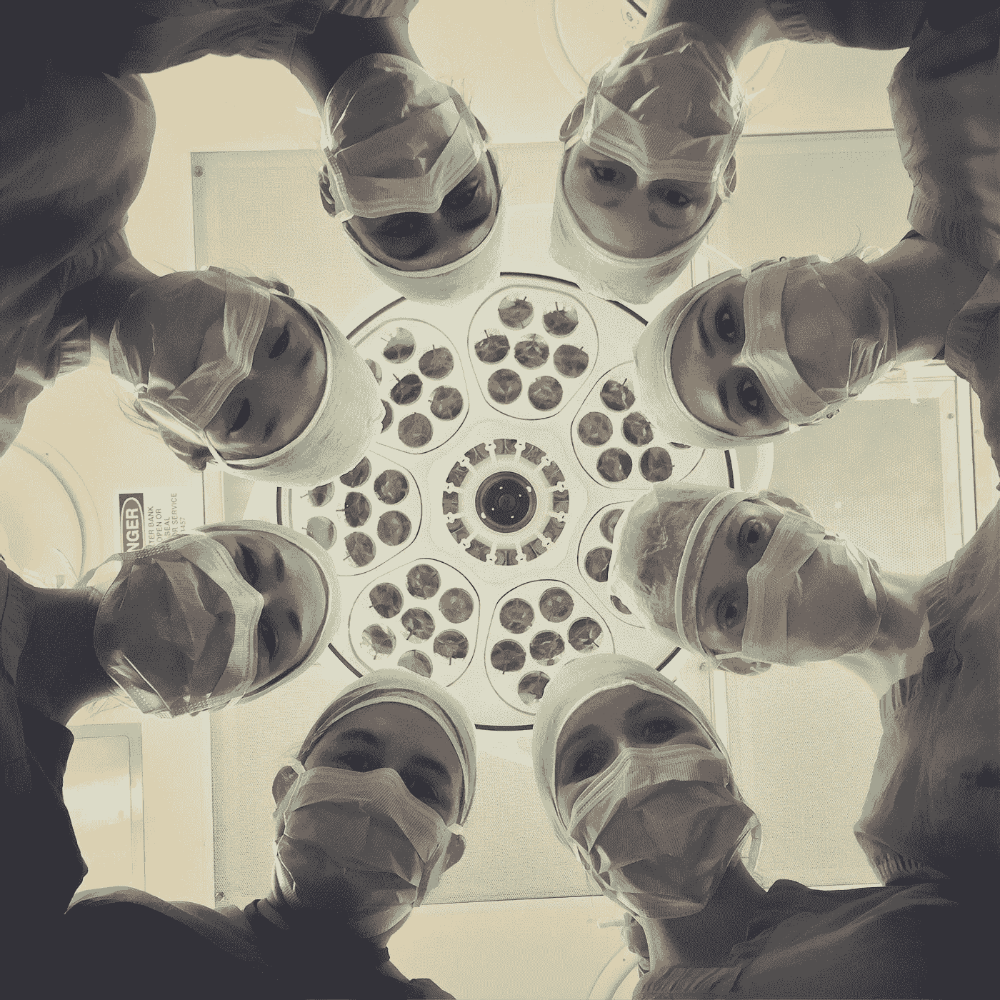

# 如何投资医疗保健

> 原文：<https://medium.datadriveninvestor.com/how-to-invest-in-healthcare-2a285095e149?source=collection_archive---------12----------------------->

我们正处于一个全球性的疫情之中，它影响着全世界每个人的生活。公司和企业已经关闭，让人们呆在家里，减缓冠状病毒的传播。医疗保健是许多人现在最关心的问题，因为我们都在努力确保自己的健康和安全。你可以投资医疗保健和科技的未来，购买在远程医疗方面领先的公司。

Photo by [National Cancer Institute](https://unsplash.com/@nci?utm_source=medium&utm_medium=referral) on [Unsplash](https://unsplash.com?utm_source=medium&utm_medium=referral)

# 什么是远程保健？

远程医疗意味着通过电话或视频与医学专家会面。医生和其他医疗专业人员正在使用远程保健为他们的病人提供更多的灵活性。这意味着你可以去看医生，呆在家里。在这场健康危机中，许多人想呆在家里，避开医生办公室或诊所。许多医务工作者正在使用软件和远程保健平台继续为他们的病人看病。这是一个快速发展的行业，你可以成为投资者。

> *医疗保健的未来是远程保健。你可以投资这个领域的软件和技术。*

# One Medical / 1life Healthcare Inc:(纳斯达克代码:ONEM)

当你加入一家医疗机构，你就步入了未来的医生行列。我已经成为会员 3 年了，我一直对它印象深刻。首先，约会准时开始。光是这一点就很值，因为我一生中有太多约会开始得太晚了。One Medical 也是一款令人难以置信的应用程序，提供与医疗专业人员的全天候视频聊天服务。因此，您可以先进行视频聊天，无需支付共同费用，而不用预约。如果需要，你可以安排一个面对面的约会。对于许多可以通过视频/远程医疗解决的常见医疗相关问题来说，这又是一个巨大的时间和金钱节省。One Medical 确实需要缴纳年费才能成为会员，但它物有所值。如果你付不起这笔费用，你可以试着让它免掉。一些健康保险计划甚至会支付年费。One Medical 在 9 个不同的主要城市拥有 70 多个办事处。你可以在股票市场上购买一家医药公司，股票代码为“ONEM ”,其交易价格约为每股 25 美元。

# 变焦视频通信(ZM)

Zoom 做医疗？是啊！Zoom 现在是一个家喻户晓的名字，因为数百万人使用 Zoom 开会、工作和个人使用。Zoom 还涉足医疗保健领域，用于符合 HIPPA 标准的远程医疗和视频会议。这意味着他们有一个视频服务，医疗专业人员可以用它来召开远程健康会议。HIPPA 合规是一项与患者个人和私人医疗保健信息的安全性和数据相关的美国法规。除了会见医生，你还可以通过 Zoom 会见心理健康专家。他们还与初级卫生保健提供者和许多其他医生合作。在过去的四个月里，Zoom 的使用人数从 1000 万增长到了 3 亿。对于一家软件和技术公司来说，这是不真实的增长。保持警惕，放大视野，考虑将“ZM”加入你的投资组合。ZM 股票现在的交易价格约为每股 169 美元。

# 特拉多克健康中心(TDOC)

Teladoc 是一家全球性公司，通过电话和视频软件提供远程医疗服务。他们也有按需应用程序，提供远程医疗护理，将你与医生、皮肤科医生或心理健康专家联系起来。这使他们成为一家医疗保健公司和技术公司。他们的软件、人工智能和分析工具可以授权给其他公司。Teladoc 正在快速发展，他们大约有 2400 名员工。这家公司在过去 5 年里增长了 10 倍以上。回到 2015 年，他们实现了 7700 万美元的收入。去年，Teladoc 的收入为 5.53 亿美元，今年可能会超过 7 亿美元。这家高增长的科技公司正是我在自己的投资组合中寻找的。在过去的 12 个月中，该股已经上涨了 300%以上，现在以“TDOC”的名义交易，每股约 187 美元

Photo by [National Cancer Institute](https://unsplash.com/@nci?utm_source=medium&utm_medium=referral) on [Unsplash](https://unsplash.com?utm_source=medium&utm_medium=referral)

# 医疗保健的未来？

远程工作并不新鲜，但它正以创纪录的速度越来越受欢迎。世界各地的人们将通过远程保健平台要求工作和医疗保健。在这个疯狂的时期，人们希望呆在家里，保持安全。他们想保护自己的健康和家人。您有机会通过远程医疗平台和软件投资医疗保健的未来。祝你在市场上好运，并请在这场全球健康危机中保持安全。

 [## 在医疗保健中使用人工智能的伦理|数据驱动的投资者

### 人工智能(AI)正被应用于任何管理大量数据的行业，并且在一个…

www.datadriveninvestor.com](https://www.datadriveninvestor.com/2020/03/21/the-ethics-of-using-ai-in-healthcare/) 

请考虑在这里阅读或分享我的文章:[https://medium.com/@james.carter89](https://medium.com/@james.carter89)

*披露:我是个人投资者和作家。这篇文章仅用于教育和娱乐目的。这不是专业的财务建议。我目前持有文章中列出的所有公司的股票:ONEM、ZM 和 TDOC。*