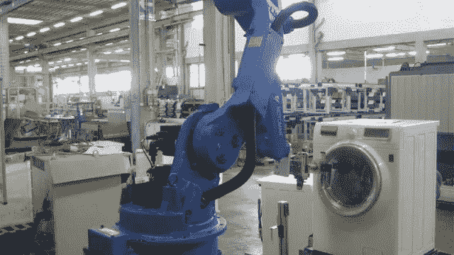

# 2020 年如何投资塞尔维亚？

> 原文：<https://medium.datadriveninvestor.com/how-to-invest-in-serbia-in-2020-6036f854d080?source=collection_archive---------7----------------------->

Competitive labor cost can’t be anymore the unique factor to evaluate an investment in Serbia

正在进行的塞尔维亚经济转型已经需要一种新的投资方式。

**一种“发展”模式的终结**

很长一段时间以来，甚至是今天，塞尔维亚在投资者眼中都是一个廉价劳动力的国家。这种做法是合理的，因为前南斯拉夫解体后出现了非工业化，导致高失业率，需要吸引新的国际投资者。最后但并非最不重要的是(至少在国内)，这个国家在 20 世纪 90 年代的战争中获得了(或被贴上了)不好的形象。最低工资，即所谓的“minimalac”(在塞尔维亚)，旨在适用于正在进行重组或清算的国有企业，远低于贫困线，但它最终成为工厂基本工资框架的参考标准，即使是新开的工厂。创造新的就业机会得到了慷慨的国家激励，这也让善意的企业家变成了贪婪的补贴接受者，*衡量在这个巴尔干国家投资的必要条件*。

这种模式旨在吸引残酷的搬迁、分包商或内部分包，即一个或多个劳动密集型生产阶段的搬迁，然后将半成品送回母公司。基本上，成熟和资本密集型部门的低附加值加工，考虑到不断变化的国际市场条件，往往会在几周内大幅减少甚至关闭。

**经济和工资上涨，工人们疲于奔命**

这种后卫发展模式已经成为批评的对象，因为它似乎没有其他选择，现在又被近 30 个月来成为巴尔干国家特征的新的社会和经济动态大声否定。

[该国正在经历一个宏观经济稳定的阶段](https://www.nbs.rs/internet/latinica/18/18_3/prezentacija_invest.pdf)，这源于常规的 GDP 增长(2018 年为 4.4%，2019 年为 4%，预计 2020 年也为 4%)，低通胀(2%)，2017 年的国家预算盈余约为每年 1%，2019 年前十个月的外国直接投资为 31 亿欧元。这些数字也反映在国际评级机构改进的评估中。就其本身而言，塞尔维亚银行在 12 月进一步将贴现率降至 2.25%，为其历史最低水平。

【2019 年 1 月至 11 月，名义工资增长 10%，实际工资增长 8%。 **今天，塞尔维亚的平均净工资为 56，731 第纳尔(482 欧元)，加上税收和缴款，达到 77，879 第纳尔(662 欧元)**:仅在 2019 年 10 月至 11 月期间，工资就增长了 2.9%。因此，我们离最低工资还很远，自 2020 年 1 月 1 日以来，最低工资已经提高了 11.1%，达到 30，022 第纳尔(258 欧元)。即使是中位数，即工资的价值，也达到了 42.716 第纳尔，或 365 欧元，这是上半部分和下半部分之间的分水岭。在这种情况下，越来越难找到愿意为最低工资工作的工人，即使是在更落后的地区和从事不太复杂的工作。

**2019 年第三季度的失业率为 9.5%，而在 2012 年，失业率达到了创纪录的 25.5%** 。我们正在见证一个新的经济奇迹吗？当然不会，因为几年 4%的增长率不可能导致失业率如此显著的下降。当然，建筑热潮继续需要新的员工，塞尔维亚商会最新的行业公报[报告称，2019 年前 10 个月，该行业比上年增加了 10，000 名员工，总数达到 142，748 个单位；但是，首先是移民，不管合格与否，耗尽了这个国家的工人和技术，呈现出大规模外流的样子。据估计，仅在过去 3 年中，至少有 50，000 名塞尔维亚人，特别是在伏伊伏丁那，获得了匈牙利护照。除此之外，从 2016 年起，申请克罗地亚、保加利亚和罗马尼亚护照使获得通行证能够在欧洲联盟永久工作的塞族人数达到至少 10 万人。](https://usluge.pks.rs/portal/publikacije/316)

还有一些国家多年来一直在有条不紊地寻找最合格的专业人员，特别是在某些部门(首先是医生和护士)，德国大使馆现在甚至有来自柏林的工作人员专门管理这些吸引合格劳动力的渠道。贝尔格莱德街头可以看到以色列的招聘广告，而克罗地亚和斯洛文尼亚的旅游公司正在塞尔维亚寻找员工，以取代那些选择移民到更富裕国家的本国员工。

 [## 算法交易的机器学习|数据驱动的投资者

### 当你的一个朋友在脸书上传你的新海滩照，平台建议给你的脸加上标签，这是…

www.datadriveninvestor.com](https://www.datadriveninvestor.com/2019/01/30/machine-learning-for-stock-market-investing/) 

塞尔维亚突然发现，它不仅是一个移民之地，也是一个移民之地，越来越多的马其顿人甚至阿尔巴尼亚人来到这个国家从事建筑和其他行业的工作。

国际化的新模式

在一个正在经历如此快速转变的环境中，许多为了追求低劳动力成本而来到塞尔维亚的公司发现自己被取代了，并倾向于**用错误的答案**来应对这些挑战，即声称在短短几个学期内达到接近母公司的生产力水平；要求支付最低工资的工人额外加班；以及对旷工的积极抗争，这往往只不过是未加入工会的工人在面对过度工作量时对低工资的个体反应。

这些都是短视的选择，有可能破坏企业的内部平衡，而不会实现承诺的生产率增长。然而，一家因劳动力成本而选择塞尔维亚的公司，不可能在一夜之间开始招聘计算机科学家或有创造力的人。但同样真实的是，许多几乎完全专注于劳动力成本的制造公司，即使在今天也未能专注于流程效率和工人培训、现代机械投资、能源效率、数字化、塞尔维亚产品在新市场的营销或新产品开发。正是丰富而廉价的劳动力的减少使得**有必要以一种更现代的逻辑来重新考虑在塞的投资**；一个国际化 4.0，可以整合该国在 2011 年由德国政府推出的工业 4.0 范式中仍然提供的优势。

正如塞尔维亚是许多中小企业作为外国投资者的第一次经历的游乐场，他们第一次面对新项目的所有复杂性，并且规模对他们来说是可持续的，同样，今天塞尔维亚的子公司可以成为一个试验场，以测试生产和组织流程，这些流程受益于数字化的优势、能源效率(为此有越来越多的激励措施)、新的管理模式以及进入市场和客户的途径。

对老派读者来说，这似乎只是一个猜测，但实际上已经发生了:投资于服务、数字化和环境可持续发展的公司是塞尔维亚政府青睐和最好支持的公司。价值 9000 万美元的位于新贝尔格莱德的 NCR 园区就是一个例子，由生物传感研究所设计并由塞尔维亚政府和欧盟代表团资助的位于巴恰卡帕兰卡附近的数字农场也是如此，同样也是在与中国的关系上，去年 10 月在贝尔格莱德举行的 17+1 峰会期间，塞尔维亚总理安娜·布尔纳比奇表示，塞尔维亚将[中国视为创新发展的重要合作伙伴](http://www.globaltimes.cn/content/1166325.shtml)。在这一愿景中，Kragujevac 新国家数据中心的建设得到了充分体现，该国家投资 3000 万欧元，将加快该国的数字化进程。

另一方面，那些认为酋长国只在建筑、农业和军火工业投资塞尔维亚的人可能不知道[人工智能和机器人领域也在发展强大的合作](https://first.global/in-the-news/our-robot-is-not-only-pure-science-girls-from-serbia-delight-in-robotics-olympiad-in-dubai/) —塞尔维亚代表团将参加 3 月份在迪拜举行的 AI Everything 大会，塞尔维亚大学和穆罕默德·本·扎耶德大学将签署一份关于人工智能的谅解备忘录。

今天的塞尔维亚人，特别是那些不打算逃往国外的塞尔维亚人，渴望一种新的发展模式，这种模式也得到政府的支持，其方案如塞尔维亚创造方案，旨在促进和加强具有创造力和创新精神、受过高等教育和高薪的专业人员。对政府来说，创造的就业机会数量不再是评估投资质量的唯一参数，在该国的一些地区(如 abac 或 Indjija-Nova 和 Stara Pazar 轴线),寻找劳动力开始变得复杂。那些制造成品并发展了当地供应商网络的公司，那些创造利基和优秀产品的公司，那些投资于塞尔维亚劳动力的公司，当然还有那些与最先进技术相关的公司，都是今天受到当地机构青睐和支持的公司。

塞尔维亚试图指出未来的趋势。即使是潜在投资者也不得不开始理解这一点。

[*Biagio Carrano*](https://www.linkedin.com/in/biagiocarrano/)