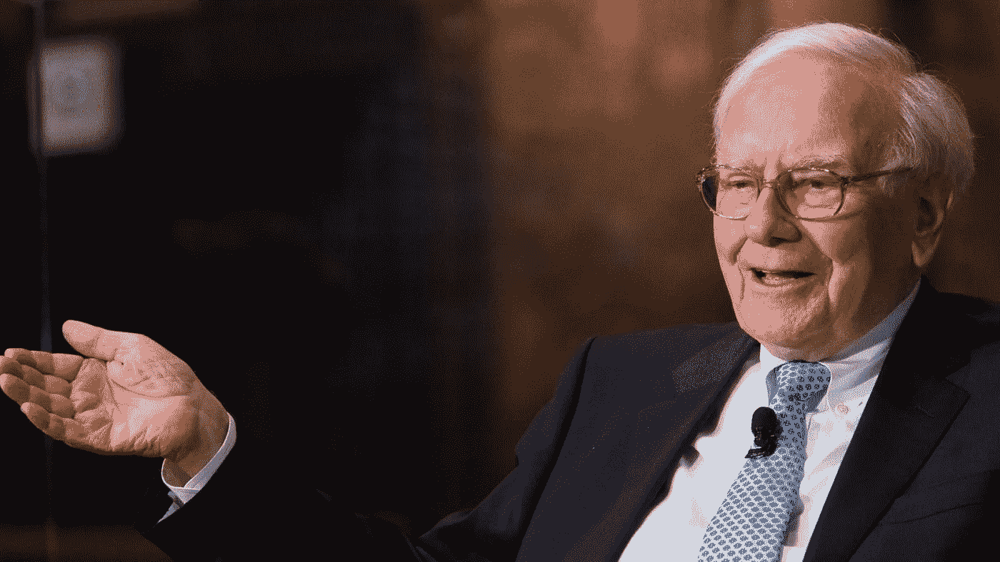
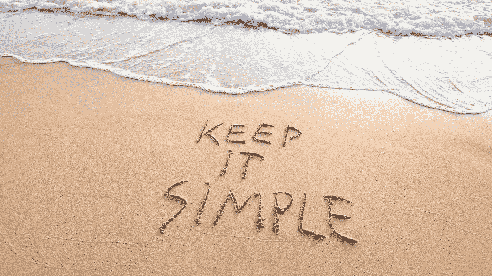
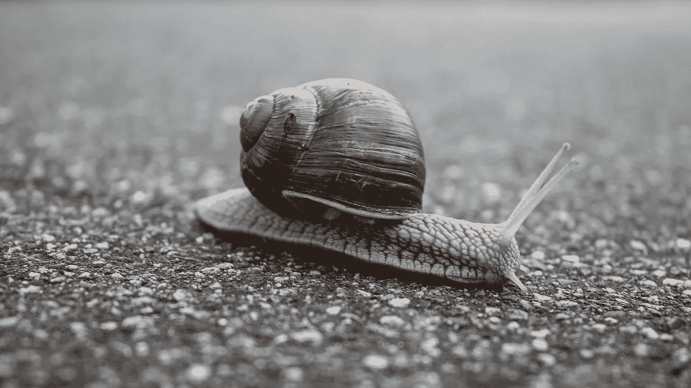

# 如何像沃伦·巴菲特一样投资

> 原文：<https://medium.datadriveninvestor.com/how-to-invest-like-warren-buffett-a309a06b0343?source=collection_archive---------3----------------------->

## 金融知识

## 投资 101

Source: [Inc.com](https://www.inc.com/marcel-schwantes/warren-buffett-career-advice-harvard-business-school.html)

许多人想成为像埃隆·马斯克、杰夫·贝索斯或沃伦·巴菲特那样的富人。

原因很简单。由于大多数人每天都在为生存而挣扎，因此只有很少的钱和大部分的钱问题，他们把安逸的生活与拥有亿万财富联系在一起。

一些苦苦挣扎的人也认为生活不公平，财富分配不均。

不幸的是，他们忽略了一些事实。

世界上大多数最富有的人都是白手起家的。富达投资公司的一项研究表明，88%的净资产超过 100 万英镑的人都是白手起家。

创造这样的财富需要几个素质，没有多少人愿意去发展。

1985 年在[的第一次电视采访中，沃伦·巴菲特解释了通过投资股票市场创造财富的方法。](https://youtu.be/PHMUSyYwiRo)

# 沃伦·巴菲特的投资法则

许多书都是关于投资如何运作的。当我在 90 年代还是个学生的时候，我们阅读了大量复杂的书籍，这些书籍都是关于完美的资产配置以获得最大收益的。

当我在网上冲浪时，我得到许多课程，保证教我如何使每年至少 300%的回报。如果一种方法成功地创造了 300%以上的平均回报，为什么这个人不坐在游艇上享受生活，而是在网上教学？

有一次，我和其中一位培训师进行了一次谈话，他指出当他的方法奏效时，他可能会把他的课程免费放到网上，因为他不需要钱——他认为我的要求是不公平的。

沃伦·巴菲特的规则简单而美好。

1.  不要赔钱
2.  永远不要忘记规则一。

最终，沃伦·巴菲特在 2008 年的金融危机中损失了 230 亿美元。他打破自己的规则了吗？

在他的两条规则中，核心信息是作为一个商人去投资，而不是像一个去赌场赌博的人。带着赚钱的意愿去了解你所投资的行业。

当然，事情有时会像重大金融危机一样发生，但投资态度应该不会。

**如何在现实生活中使用:**

*   在投资之前做好你的功课。

# 不需要很高的智商。

在 1985 年的采访中，沃伦·巴菲特指出了一个人成为成功投资者所需的技能。

高智商都不是。“你不需要在很高的水平上玩三维象棋或桥牌”，他在乔治·古德曼的电视节目“金钱世界”中说。

那么我们需要什么来代替呢？

“稳定的性格，”他回答。

嗯，那是另一种游戏——控制自己的情绪。

“你不需要从从众或反众中获得巨大的快乐。这不是一个你进行民意调查的行业。这是一个你必须思考的行业。”

幸运的是，控制情绪——战斗或逃跑模式——对每个人来说都很自然；这就是为什么关于这个话题的课程很少。

好的。这有点讽刺，但东方哲学最大的问题之一是如何控制自己的气质，并始终保持积极和友好。

**如何在现实生活中应用:**

*   生来就是瓦肯人或者
*   如果你是像我一样的人——冥想，花很多时间思考和阅读关于投资的书籍。

Canva Pro Image

# 保持简单

有很多不同的方法来分析公司的价格变动。这种方法非常适合短期投机。

沃伦巴菲特谈论建立持久的投资成功。他最喜欢的持有期是永远。

这种态度孕育成功，是建立成功投资组合的先决条件。不是价格的变动，而是评估一个企业的 DNA。

投资者应该表现得好像他拥有整个企业，并且必须管理它。有哪些值得关注的重要部分？

我最喜欢的例子是亚马逊。在 1995 年，通过互联网卖书绝对不是独一无二的，我知道至少还有三家公司和杰夫·贝索斯有着同样的想法。

第一个是谁？我不知道，但我知道最后一个站着的是杰夫·贝索斯。

他没有通过互联网卖书；他所追求的帮助顾客做出更好的购买决定。这是他真正的使命。

这些年来，我总是听说亚马逊被高估了，价格上涨了这么多百分比，它不能再高了。

但有了杰夫·贝索斯植入亚马逊的企业 DNA，只要顾客的怪癖盛行，这个团队就一定会成功。

为什么？

给我看一个顾客，他希望被当成白痴，而不是国王或女王…

**如何应用:**

*   企业的服务或产品是否有真正的市场需求？
*   管理团队是否拥有经营企业所需的人才组合？
*   它与供应方和客户有很强的关系吗？
*   比赛进行得怎么样？
*   商业周围的护城河是什么？

# 不要听信谣言

在 1985 年的采访中，沃伦·巴菲特被问及如何才能远离华尔街。

即使回到那个年代，他也指出，没有互联网会太分散注意力，而且很可能会穷得多。

他的职业道德围绕着通过与高管交谈和阅读来自公司和市场研究的报告来理解业务。

在华尔街意味着要花很多时间与投资银行家交往，他认为这会分散人们对成功的注意力。

信息的过度刺激和泛滥可能会导致注意力不集中，而他并不推荐注意力不集中。

**如何在现实生活中应用:**

*   把你的注意力放在企业的价值上，而不是短期的价格聊天上。
*   花时间分析业务
*   客户是谁？
*   公司解决什么问题？
*   执行董事会的视角和才华如何？
*   商业周围的护城河是什么？
*   企业的规划范围是什么？

# 投资是一个智力过程

沃伦·巴菲特认为，投资是一种思维游戏。他建议坐下来定义自己的能力范围。

并开始深入挖掘这个狭窄的领域，让它成为你的能力范围。

在这个领域，找到那些价格相对于其价值来说是最好的公司。简单来说，就是在公司股价便宜的时候收购它们。

我把它解释为乘风破浪，采取逆向投资的方法。在价格低的时候进入公司。

在另一个场合，沃伦·巴菲特用不同的措辞表达了类似的意思:

> “当别人贪婪时要恐惧，当别人恐惧时要贪婪”

在那些市场上涨的日子里，每个人，包括你的优步司机，都在买股票。当沃伦·巴菲特建议宁可担惊受怕，也要想办法确保自己的收益时。

然而，当报纸上充斥着世界末日的预言，声称经济已经死亡，永远不会复苏，是时候向市场大规模投放资金了。

百万富翁是在灾难中炼成的。那些在其能力范围内明智地选择那些在危机中被不公平击败的公司的人，将会取得长期的成功。

当沃伦·巴菲特谈到恐惧和贪婪时，他是站在理智的角度，而不是感情用事。

**如何应用:**

*   定义你的能力水平。我热爱深度科技、生命科学和互联网周围的一切。
*   每天在这些方面进行自我教育。尽可能多读书。
*   知识像投资的钱一样随着时间的推移而复利
*   尽可能多地了解你能力范围内的公司
*   使用互联网、股票报告、像 seekingalpha.com 这样的聊天小组，如果可能的话，参加股东会议。
*   投资那些你认为价格被低估的公司。
*   当你选择的时候，就要坚持下去。
*   远离你不够了解的领域。这是赌博。

Canva Pro Image

# 投资是一个缓慢的游戏，不适合过度活跃的人。

沃伦有时几年都不荡秋千。

在采访中，他将投资比作一场棒球比赛。在游戏中，球棒的家伙需要在一定区域内抛球时摆动。

如果他在三次失误后没有挥棒，他就出局了。

投资股市不同于棒球比赛。市场无时无刻不在向你抛出机会。

但是你不需要挥棒打这些球。游戏中没有罢工。

沃伦巴菲特的建议是，从你的能力水平中，以合理的价格挑选那些机会。

投资不适合极度活跃的人。如果操作得当，高频交易可以产生回报，但沃伦·巴菲特的方法恰恰相反。

好好了解你的领域，明智地选择公司。这是沃伦·巴菲特在演讲中推荐的一种受过教育的选股方法。

这就是沃伦·巴菲特所做的。他觉得自己在科技领域没有竞争力，多年来也没有投资任何高科技。

事实上，他错过了像亚马逊、脸书或谷歌这样的机会。他最近开始投资苹果，并在 2020 年成为他最大的持股，几乎占所有持股的 50%。

成为一个成功的投资者所需要的活动是在你喜欢投资的领域进行自我教育时的高度活跃。

教育越少越好。但在投资方面，它需要冷静的头脑和选择被低估公司的技能。

被低估意味着当前的价格没有反映公司 10 年后的价值。我不认为这是短期的价格波动，而是由于健全的执行董事会、坚实的产品和大规模的客户导向而带来的长期价值收益。

伯克希尔·哈撒韦公司的投资者经常对沃伦·巴菲特不满，因为他没有长期投资，而是持有现金。

**如何在现实生活中应用:**

*   在投资任何东西之前，放松并大量阅读
*   在你投资和正确评估机会之前，一定要保持克制。
*   在投资发生之前，这种可靠的尽职调查方法可能需要几个月或几年的时间。
*   一旦你有了更多的钱，就去了解执行董事会，并学会理解他们的个性。
*   你能想象这些人会在公司呆上二三十年吗？

沃伦·巴菲特是上世纪 60 年代以来最成功的投资者。他有近 80 年的投资记录。

他放松且受过良好教育的方式使他成为这个星球上最富有的人之一。

尽管他错过了很多好机会，因为它们超出了他自己强加的“能力范围”，但他的方法仍然有效。

想想看，根据福布斯排行榜，他凭借对麦当劳、美国银行或可口可乐等无聊投资成为了全球第七大富豪，这让从他的成功中学习变得更加有趣。

自 1999 年以来，我是各行各业公司的执行官、顾问和教练。我专攻企业发展和金融，从种子轮到 IPO 级别，从 2006 年开始专注于生命科学。

[**加入我的邮件列表保持联系！**](https://mailchi.mp/5a50875fb5ea/newsletter)

# **读者:**

[https://www . business news daily . com/2871-how-Most-millionaires-got-rich . html #:~:text = Most % 20 of % 20 当今的% 2000 万富翁% 20% 243.05% 2000 万% 20in %资产](https://www.businessnewsdaily.com/2871-how-most-millionaires-got-rich.html#:~:text=Most%20of%20today's%20millionaires%20weren,with%20%243.05%20million%20in%20assets)。

 [## 沃伦·巴菲特赖以生存的法则

### 伯克希尔·哈撒韦公司首席执行官沃伦·巴菲特可以说是世界上最伟大的股票投资者。他也有点…

www.investopedia.com](https://www.investopedia.com/financial-edge/0210/rules-that-warren-buffett-lives-by.aspx)  [## 沃伦·巴菲特赖以生存的法则

### 伯克希尔·哈撒韦公司首席执行官沃伦·巴菲特可以说是世界上最伟大的股票投资者。他也有点…

www.investopedia.com](https://www.investopedia.com/financial-edge/0210/rules-that-warren-buffett-lives-by.aspx)  [## 早期采访显示，沃伦·巴菲特几十年来一直保持着同样的投资哲学

### 美国股票市场在过去的 34 年里经历了显著的变化，低成本被动…

www.cnbc.com](https://www.cnbc.com/2019/09/22/warren-buffetts-investing-advice-consistent-over-past-35-years.html#:~:text=%22You%20need%20a%20stable%20personality,a%20business%20where%20you%20think.%22)  [## 实时亿万富翁

### 《福布斯》的实时亿万富翁排名追踪了世界上最富有的人的日常生活。的…

www.forbes.com](https://www.forbes.com/real-time-billionaires/#45078ea43d78)