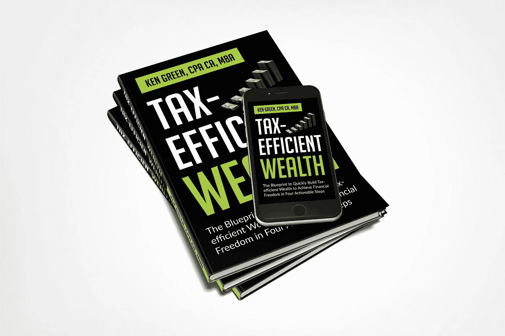

# 如何将同样的钱同时投资在两个不同的地方

> 原文：<https://medium.datadriveninvestor.com/how-to-invest-the-same-money-in-two-different-places-at-the-same-time-9e34769a1437?source=collection_archive---------17----------------------->

## 如何利用免税人寿保险进行二次投资

Photo by [Sara Bakhshi](https://unsplash.com/@sarabakhshi?utm_source=medium&utm_medium=referral) on [Unsplash](https://unsplash.com?utm_source=medium&utm_medium=referral)

> “你买人寿保险不是因为你会死，而是因为你爱的人会活下去。”—未知作者

在我的新书《节税型财富》中，我将免税人寿保险作为一种节税型工具来积累和加速你的财富。

在加拿大税法允许的四种免税选择中，使用免税人寿保险是最不为人知的税收策略之一。你可能对其他三个选项很熟悉——主要住所；免税储蓄账户(TFSA)；和彩票奖金。

根据《加拿大联邦所得税法》第 143(3)节，免税人寿保险合同内的资产积累免于年度应计税。

当您去世时，保单的任何收益将在您的遗产范围之外免税分配给您的受益人，绕过相关费用。

保险是一个显而易见的工具，它允许:

*   延税增长，类似于 RRSP 中的注册资本池(注册退休储蓄计划)
*   退休期间免税收入的潜力
*   你死后的免税分配

> “乐趣就像人寿保险；年纪越大，花费越多。”—弗兰克·麦金尼

以下引自加拿大特许专业会计师协会出版的《PIVOT》杂志:

*“人寿保险仍然是一个很好的投资工具……它是为数不多的允许避税积累资金同时覆盖死亡风险的投资之一。* ***税前复利效应和免税获取这一积累基金是人寿保险的两大吸引力。*** *身故免税到期是终极加分。”*

让我把你的注意力吸引到粗体字上(粗体字都是我的)因为我认为这是免税人寿保险最被理解和低估的好处之一。

免税人寿保险是唯一能让你双重投资的产品。

 [## 现在是用 DeFi 取代银行的时候了吗？数据驱动的投资者

### 当你想到传统银行时，你会想到哪些服务？支票账户贷款储蓄…

www.datadriveninvestor.com](https://www.datadriveninvestor.com/2020/07/17/is-it-now-the-time-to-replace-the-banks-with-defi/) 

换句话说，通过投资免税寿险保单，你有机会获得年复一年的保证回报率。

同时，您可以提取高达 100%的投资资金，并将收益投资于另一个投资工具，以获得额外的回报，而不会对保险单的原始保证回报产生任何影响。

本质上，你可以将 ***相同的*** 资金同时投资于两个不同的地方！

**既然免税人寿保险提供了巨大的税收优势，而且你可以二次投保，那么为什么它的使用不那么普遍呢？**

这可能有很多原因，但以下是我的 5 大原因:

# 1.缺乏知识

这大概是人们不把寿险当作一个税收规划工具，甚至不把它当作一个保障亲人财务福利的工具的最大原因之一。

有这么多关于保险的错误信息，在这种信息中，大多数人很难看到保险作为一种伟大的财务和税务规划工具的真正好处。

> "我讨厌人寿保险代理人:他们总是说我总有一天会死，但事实并非如此。"—斯蒂芬·巴特勒·里柯克

# 2.保险很贵

说实话，保险是昂贵的，尤其是那种适合税务规划的人寿保险(终身寿险和万能寿险)。

维持和管理家庭预算以支付食物、衣服、住房、日托、汽车贷款、孩子教育等费用的成本不断增长。，保险只是钱紧的时候那些“必需品”之外的。

# 3.通过工作提供的保险

许多人得到了人寿保险作为他们员工福利的一部分，但他们通常决定不要额外的保险。

他们忘记了这种由雇主提供的保险通常是不够的。此外，如果你离开了这份工作，这种类型的保险通常不会与你“继续前进”。

# 4.它是无形的

对于像我这样喜欢买真实的东西的人来说，支付我们看不见的保险似乎是浪费你的血汗钱。

你从购买保险中得到的只是一页又一页的合同，你不理解，也可能永远不会去读。

这里需要转变思维，将保险视为一种投资，一种未雨绸缪的保护，一种风险对冲。

# 5.人寿保险——它终于在我的清单上了

人寿保险没有最后期限，政府也没有强制购买。

你的父母可能从未和你谈过它的重要性，这当然不是最令人振奋的话题。因此，大多数人永远也不会得到它。

> “如果孩子、配偶、生活伴侣或父母依赖你和你的收入，你需要人寿保险。”—苏茜·欧曼

# 结论

考虑一下保险的好处，尤其是当它与财富规划和税收优化相关时。从教育自己开始。审查您现有的政策(如果适用)，并聘请知识渊博的专业人员来指导您，并提供符合您独特情况的计划。

附注:我的任务是用金融教育来武装你。这是我开始在媒体上写作的一个原因，也是我写节税型财富的原因。这本书将帮助你以节税的方式加速你的财富。 [***拿一本我的新书《节税型财富***](https://www.5dayspersonalfinancechallenge.com/book) ***》的免费电子书版本，来学习如何利用能帮你省下一吨税的策略快速积累财富。***

Image Credit: Author

**访问专家视图—** [**订阅 DDI 英特尔**](https://datadriveninvestor.com/ddi-intel)