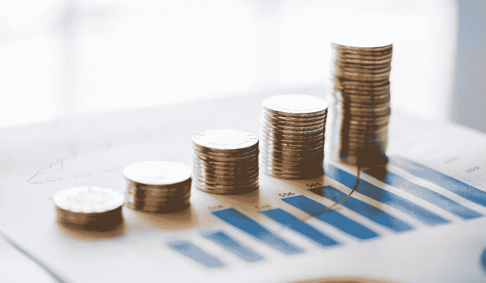

# 如何一边工作一边投资

> 原文：<https://medium.datadriveninvestor.com/how-to-invest-while-working-at-a-day-job-7037bf935a6b?source=collection_archive---------7----------------------->

## 在增加收入的同时增加投资

投资让你的钱为你工作。众所周知，最富有的人通过股票、房地产和其他资产获得了他们的净资产。

然而，投资并不总是容易的，因为我们是情绪化的生物，容易在短期内做出下意识的反应。此外，寻找最佳投资机会并采取相应行动需要时间。

华尔街的人以做这类研究为生，但是从事传统的朝九晚五工作的投资者呢？他们研究投资机会却没有报酬。

对于后一种人来说，每天研究新的投资机会要困难得多，因为工作、养育子女、购物和其他责任会占用我们的时间。

尽管困难重重，但即使你从事朝九晚五的工作，仍然有可能找到巨大的投资机会并进行充分的研究。

# 了解你的标准

对每个投资者来说，了解他们的标准是很重要的。这些指导方针帮助你避开某些股票，主要投资你知道的股票。

股息收入投资者将主要寻找提供高收益的安全股息股票。像 Shopify 这样的股票不符合他们的标准。

如果你打算在工作的同时投资和做研究来寻找机会，了解你的标准是非常重要的。

例如，我会避开书中所有的罪恶股票(即赌场公司的股票)。因此，如果我遇到一只有着难以置信的增长机会的原始股，我总是会根据我的标准换个方向看。

设定标准不仅仅是了解你想要什么。这也是关于理解哪些股票永远不会在你的投资组合中占有一席之地。

完善的标准减少了潜在的投资机会，这是一件好事。越少越好，因为你可以对更少的投资机会做额外的研究，而不是对许多投资机会做平庸的研究。

# 做日常研究

除非你做研究，否则你找不到新的投资机会。虽然你的研究强度可能不如以研究投资为生的人，但每天 15-30 分钟会有很大的不同。

你的部分研究可以来自阅读 Seeking Alpha 文章或观看 YouTube 视频，这些地方已经有人为你做了研究。

那些文章和视频会给你提供别人辛辛苦苦研究的火花笔记。如果你正在阅读 Seeking Alpha 文章，不要忘记阅读评论。有时候评论比文章更有价值。

有时候，你最终会寻找你已经拥有的投资来强化你的立场。对你目前的投资充满信心可以让你更轻松地试水并找到新的投资。

在其他日子里，你的研究不会有什么结果。有些日子比其他日子好。每一天你做额外的研究，你就给自己一个机会去寻找跑赢市场的投资机会。

# 坚持买入并持有的策略

交易股票可能看起来很有吸引力，但也有很多缺点。最广为人知的缺点是大多数交易者亏损或跑输市场。

但是，缺点更多。

交易要求你短期持有投资。这样做的目的是为了实现利润而快速转手，然后转移到下一个机会。

当你如此快速地买卖投资时，你就要按短期资本利得税率缴税。这一税率不仅高于长期资本利得率，而且短期资本利得也被视为收入，因此你可能会被推高到更高的税级。

对于一些人来说，交易根本不可能，因为股票市场在工作日从东部时间上午 9:30 到下午 4:00 是开放的。许多人在这段时间都在工作或通勤。如果你有一份虚拟工作，在这些时间内交易是可能的，但有些人没有能力在这些时间内交易。

买入并持有策略也不会像日内交易那样玩弄你的情绪。股价的短期波动会让日内交易者不稳定，尤其是那些没有限制潜在损失的交易者。

然而，短期价格波动不会影响购买投资并持有投资的人。房地产投资者不关心本周他们的房产价值会发生什么。他们关心他们的房产在几年后的价值，以及房客是否继续支付租金。

购买和持有投资可以让你收获收益，而不会让这些投资占据你的生活。当你交易的时候，你看着图表，祈祷它按照你想要的方式移动。你会花很多时间盯着一堆你无法控制的数字。

投资让你的钱倍增，扩大你的净值。然而，你投资是没有报酬的。你可以做所有的研究，知道各种各样的策略，但是一个能每月投入 500 美元到指数基金的人会比一个每月投入 50 美元到研究好的机会的人走得更远。

买入并持有让你专注于收入增长，而不是停留在不断变化的数字上。认真对待每一项投资，但优先考虑收入增长和与最重要的人共度时光。

[***想学习如何投资股市赚钱？确保你订阅了我的 YouTube 频道***](http://bit.ly/2W4ag01)