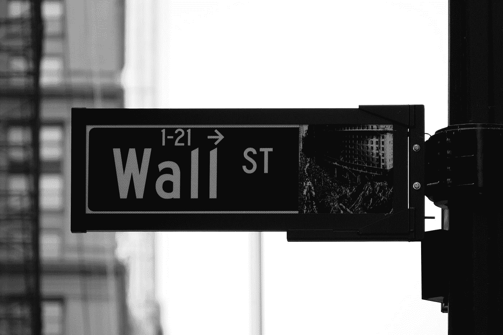

# 如何将你的第一笔 1000 美元投资于股票市场

> 原文：<https://medium.datadriveninvestor.com/how-to-invest-your-first-1000-in-the-stock-market-a7e2db2b0586?source=collection_archive---------9----------------------->

Photo by [Patrick Weissenberger](https://unsplash.com/@ricktap?utm_source=medium&utm_medium=referral) on [Unsplash](https://unsplash.com?utm_source=medium&utm_medium=referral)

## 橡树从橡子中成长。

如今，我们不断听到股票市场上涨 25%，或下跌 40%，或上周是自*大萧条*以来最好的一周，突然你觉得有必要也加入这场疯狂的旅程。但是你只有 1000 美元启动资金，你该怎么办？

首先，祝贺你决定留出一点钱来开始。不管是 1000 美元、200 美元、5000 美元还是其他任何数额。重要的是开始。

> “你不一定要开始变得伟大，但你必须开始变得伟大。”——金克拉

因此，这里有 3 个步骤，你应该遵循，以开始在股市投资你的第一个 1000 美元。

## 1.找一个佣金低的经纪人。

为了让你开始投资股票市场，你需要给自己找一个经纪人。幸运的是，网上有很多经纪人。

但是当你决定使用哪一个的时候，你需要小心。

> "投资时，消耗你利润的两个主要因素是税收和佣金."

你最好找一个具备以下 4 种品质的经纪人:

*   管理费低；
*   股票交易佣金低；
*   高达 100，000.00 美元的货币保证金；
*   友好的用户平台(桌面版和手机版)。

如果你住在美国的**，**我推荐的(排名不分先后)是:

*   先锋；
*   TD Ameritrade
*   保真；
*   Robinhood
*   Webull

如果你生活在欧盟，经纪人的名单会有一点不同。我推荐的是:

*   德吉罗；
*   eToro

如你所见，有很多优秀的经纪人。现在的问题只是你找到最适合你的那一个。

## 2.自己做研究。

在进行任何形式的投资之前，做好自己的研究是非常重要的。

Photo by [Isaac Smith](https://unsplash.com/@isaacmsmith?utm_source=medium&utm_medium=referral) on [Unsplash](https://unsplash.com?utm_source=medium&utm_medium=referral)

> 你需要自己做研究的首要原因是因为**你是那个要把钱投进去的人。你，不是别人。**
> 
> 你需要知道你将会陷入什么样的境地。

首先，你需要拿到公司的官方报告，比如:

*   **表格 10-K** :公司年报，在这里可以找到上一年度的资产负债表、利润表、现金流量表。
*   **表格 10-Q** :公司季度报告，向你展示他们上个季度的收入、费用、利润。

之后，你需要更多地关注一些相关的数字和指标。你可以在雅虎财经或 FinViz 这样的网站上找到总结。

你想专注于公司:

*   **收入:**这对应于公司在相应时间段内能够产生的金额。
*   费用:这告诉你公司花了多少钱。这通常是分开的，如“营业费用”、“收入成本”、“其他收入费用”。
*   **净收入:**这几乎是公司在支付费用、税收和折旧后所能获得的收入。收入是你的工资总额，净收入是你付完税和生活费后剩下的钱。
*   **每股收益(EPS):** 它的计算方法是将公司利润除以其普通股的流通股。这个指标给你一个公司盈利能力的感觉。
*   **市盈率(P/E):** 公司当前股价与其每股收益(EPS)之比。这是确定公司股票相对价值的一个很好的指标。
*   **Beta:** 衡量公司的波动性。如果其**值小于 1.0** ，理论上意味着**公司比市场**波动性小。如果它的**值大于 1.0** ，理论上意味着**公司比市场**更不稳定(科技公司通常有一个 BETA > 1.0)。如果其**值等于 1.0** ，理论上意味着**其价格活动与市场**相关。

为了构建自己的观点，你可以分析更多的指标。请注意，当你想要比较公司的价值观和指标时，你需要确保你是在进行比较。

> 你不能把一家科技公司和一家建筑公司相提并论。

最后，你会想以一种更定性的方式来看待这家公司。

*   看并试着理解**公司商业模式**；
*   深入调查，看看这家公司与竞争对手相比是否有某种优势；
*   看看管理团队，看看他们过去是否成功，他们是如何对待员工和顾客的。

如果你花时间研究和理解公司的数字，你会更愿意购买它的股票，当股价下跌时，这对你来说没多大关系，因为你知道你买了什么。

## 3.谨慎分散投资。

每一个稍微搜索过投资股票市场的人都听说过**多样化**。

Photo by [Annie Spratt](https://unsplash.com/@anniespratt?utm_source=medium&utm_medium=referral) on [Unsplash](https://unsplash.com?utm_source=medium&utm_medium=referral)

> 不要把所有的鸡蛋放在同一个篮子里。

这差不多就是分散投资的意思，但是当你开始你的投资之旅时，尤其是你的第一个 1000 美元，你不想陷入“过度分散”的陷阱。

在当今的经济形势下，保护投资组合免受重大损失的最佳方式是分配:

*   30%投入低成本的标准普尔 500 指数基金；
*   40%进入消费品公司；
*   30%进入高增长技术公司；

## 标准普尔 500 指数基金

你应该将部分资金投入标准普尔 500，因为这是你拥有美国 500 家最大公司的一部分，同时获得长期稳定的良好回报的最佳方式。在过去 60 年里，标准普尔 500 的平均年回报率约为 8%。

"*非专业人士的目标不应该是挑选***，而应该是拥有一个* ***截面*** *的企业，总的来说一定会做得很好。一只低成本的* ***S & P 500 指数基金*** *就能达到这个目的。*”——摘自沃伦·巴菲特写的年度股东信。*

## *消费品公司*

*这些公司通常是最不稳定的，通常支付最好的股息。这是为什么呢？*

*这是因为这些公司中的大多数都已经在各自的行业中站稳了脚跟，并且已经上市很多年了。因此，他们能够降低总体成本。一般来说，他们提供我们大多数人需要或想要的产品或服务。*

**

*Photo by [Mahbod Akhzami](https://unsplash.com/@mahbodakhzami?utm_source=medium&utm_medium=referral) on [Unsplash](https://unsplash.com?utm_source=medium&utm_medium=referral)*

*我所说的公司是:*

*   *可口可乐公司(纽约证券交易所股票代码:KO)；*
*   *宝洁公司(纽约证券交易所|股票代码:PG)；*
*   *美国电话电报公司公司(纽约证券交易所股票代码:T)；*
*   *沃尔玛(纽约证券交易所股票代码:WMT)；*
*   *麦当劳(纽约证券交易所股票代码:MCD)。*

*这些公司只是一些例子，因为还有很多其他的公司，你应该在做任何投资之前做好自己的研究。*

## *高增长技术公司*

*在当今世界，技术发挥着至关重要的作用。*

*我们都使用它，并且需要它来继续我们的生活，正因为如此，科技公司是地球上最大的公司之一。这就是为什么你投资一些钱进去并不是一个坏主意。*

**

*Photo by [Marvin Meyer](https://unsplash.com/@marvelous?utm_source=medium&utm_medium=referral) on [Unsplash](https://unsplash.com?utm_source=medium&utm_medium=referral)*

*当你想投资科技公司时，你需要问自己三个简单的问题:*

1.  *他们在各自的领域/行业中有稳固的地位吗？*
2.  *他们有好的、值得信赖的产品/服务吗？*
3.  *他们是否有创新和进一步发展的潜力？*

*如果这三个问题的答案是**是**，那么你可能找到了一家值得投资的好科技公司。请记住，其中一些公司在短期内非常不稳定，所以如果你看到一天内下跌 10%，不要紧张。该计划是长期投资，因此从现在起 5 年或 10 年后，这种下降将显得微不足道。*

*这里有一些符合标准的公司的例子，或者至少有潜力在不久的将来占据主导地位。*

*   *亚马逊(纳斯达克|股票代码:AMZN)；*
*   *苹果(纳斯达克|股票代码:Apple*
*   *微软(纳斯达克|股票代码:MSFT)；*
*   *特斯拉公司(纳斯达克|股票代码:TSLA)；*
*   *Plug Power Inc .(纳斯达克|股票代码:PLUG)；*
*   *雪花公司(纳斯达克股票代码:SNOW)。*

*其中一些公司的股价可能非常高，如果你刚开始投资 1000 美元，你可能会想怎么才能买到它们。幸运的是，一些经纪人允许你购买一定比例的股票。*

*例如，你可以以其价值(150 美元)的 5%购买亚马逊(Amazon)5%的股份，该股目前的交易价格超过 3000 美元。如果股票价值上涨 10%，你的份额也会上涨 10%。它的工作原理完全一样。*

*给你。遵循这三个步骤，会对你开始投资股票市场有很大帮助，尤其是如果你的账户相对较小的话。*

> *“买入一家公司是因为你想拥有它，而不是因为你想让它上涨”——沃伦·巴菲特。*

*永远记住，**你必须自己做研究，投资你所知道的东西。***