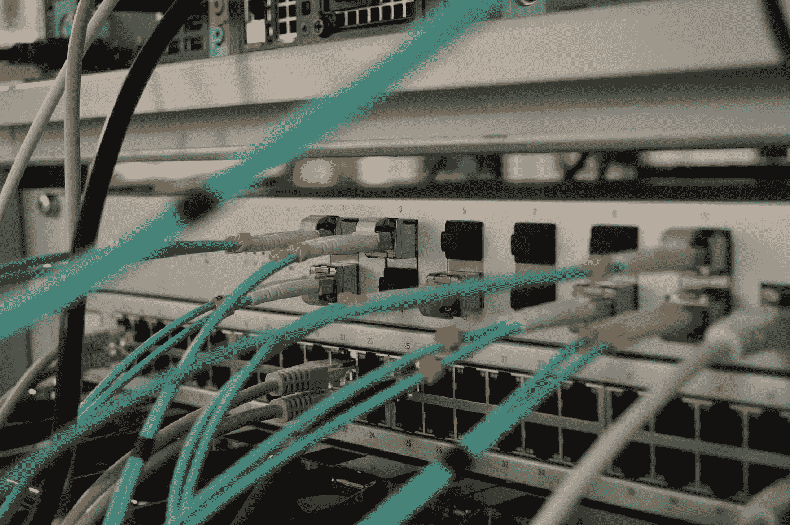

# 如何保持一个安全的家庭网络

> 原文：<https://medium.datadriveninvestor.com/how-to-keep-a-secure-home-network-5800df519bbe?source=collection_archive---------19----------------------->

随着数字时代的发展，随着时间的流逝，我们越来越意识到互联网给我们带来的危险和威胁。我们已经看到最近发生的 Twitter 和 Youtube 黑客事件，没有人是安全的，我们都容易受到这些恶意黑客的攻击。让我们来看看在网上我们能做些什么来尽可能地保护自己。

你可能会惊讶地发现，对一个人来说，侵入计算机网络是多么容易。事实是，许多计算机网络实际上对入侵者毫无防备。这意味着这些入侵者可以很容易地访问您的数据，并利用它们来伤害您。

Photo by [Fotis Fotopoulos](https://unsplash.com/@ffstop?utm_source=medium&utm_medium=referral) on [Unsplash](https://unsplash.com?utm_source=medium&utm_medium=referral)

# 网络安全硬件

我们所认为的家庭网络通常需要至少两台设备相互连接。通常，这些设备也连接到互联网，这就是危险的来源。在这一点上，众所周知，运行 Windows 操作系统的设备比运行 MAC 的设备更容易受到黑客攻击。

可能危及家庭网络的设备包括路由器、防火墙甚至调制解调器。根据您使用的协议，您可能有更多的设备连接到您的网络。例如，当蓝牙设备进入网络范围时，它们可以相互同步。

Photo by [Thomas Jensen](https://unsplash.com/@thomasjsn?utm_source=medium&utm_medium=referral) on [Unsplash](https://unsplash.com?utm_source=medium&utm_medium=referral)

防火墙对于网络来说就像滤水器，它们试图阻止不需要的东西进入。它们帮助您监控网络和互联网之间的数据流量。如果您检测到不寻常的流量，这是有人危害您的家庭网络安全的潜在迹象。

如果您使用无线路由器，请确保您设置了密码并启用了安全加密。大多数路由器都有无线加密(WEP)或保护无线电脑网络安全系统(WPA)加密选项，后者更安全。

 [## 网络安全正在崩溃，这里有一个新的想法|数据驱动的投资者

### 对于许多公司来说，网络安全策略是在安全系统和服务上花费数百万，遵循最佳…

www.datadriveninvestor.com](https://www.datadriveninvestor.com/2020/06/29/cybersecurity-is-in-meltdown-heres-a-new-idea/) 

# 网络安全软件

对于安全问题的软件方面，有几个软件可以帮助解决这个问题。如果您没有硬件防火墙，您可以使用防火墙应用程序来帮助保护您的网络。如果你愿意，你甚至可以同时使用硬件和软件版本。

虽然你可以通过仔细的网上冲浪习惯来避免大多数计算机病毒、特洛伊木马和其他形式的恶意软件，但事实是有时事情会溜走。只要一个错误，你就会得到一台被感染的电脑。强大的防病毒程序有助于保护您的计算机安全。

反病毒软件隔离并中和恶意软件。大多数反病毒软件通过将计算机上的应用程序与庞大的恶意软件数据库进行比较来搜索病毒。如果有匹配的，软件会提醒用户，并试图压制程序。为了使防病毒软件保持有效，保持其最新是很重要的。许多程序都有自动更新功能，可以每周下载新的病毒定义。

**进入专家视角—** [**订阅 DDI 英特尔**](https://datadriveninvestor.com/ddi-intel)