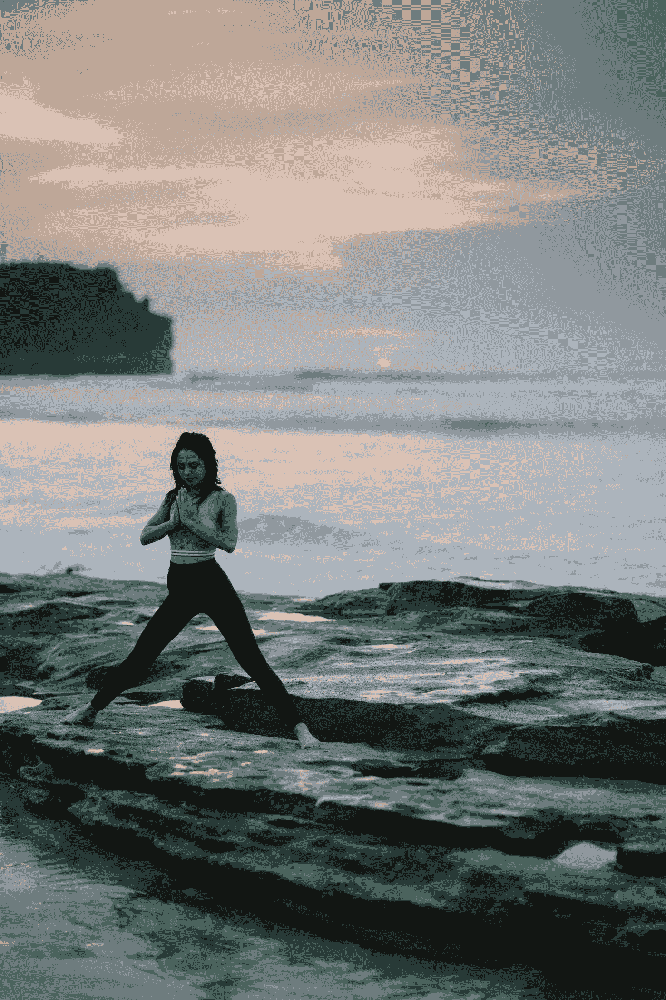

# 如何在压力下保持冷静

> 原文：<https://medium.datadriveninvestor.com/how-to-keep-calm-in-the-times-of-stress-2e68b999e552?source=collection_archive---------27----------------------->

## 压力管理是一门你必须掌握的艺术。

Photo by [bady abbas](https://unsplash.com/@bady?utm_source=medium&utm_medium=referral) on [Unsplash](https://unsplash.com?utm_source=medium&utm_medium=referral)

> 永远不要让生活的艰难烦扰你……没有人能回避问题，即使是圣人或圣人也不行。
> 
> *—日莲大圣人*

T4 困难存在于生活的中心。它伴随着舒适和幸福。如果生活中没有风暴，没有人会快乐或平静。为了达到更高层次的平静，必须有最猛烈的风暴来动摇旧的相对平静的基础，为另一种平静腾出空间。

几乎每个人都被严峻的生活现实所压力。但赢家是那些勇敢面对压力并将这种能量转化为建设性氛围的人。

如果我们想要快乐和健康，我们必须准备好面对生活中令人震惊的情况。或者它吞噬了我们的幸福和内心的平静。

拥有平和的心态不是火箭科学，而是对周围发生的事情的一种态度。如果我们足够强大，不被我们面前展现的事物吓倒，我们就赢了。

这个世界充满了成功者和失败者的例子。

他们之间没有如此明显的区别，只是态度上有一点小小的变化。

那些胜利者拥有不辜负其拥有者的意志力。这告诉他们在失败者屈服于他的忧虑和恐惧的时候再坚持一会儿。

当恐惧压倒你时，它会把你引向绝望的深渊，吞噬你的创造力。

所以，要想成为一名胜利者并领导大家，你必须掌握你的压力管理艺术。没有它，就不会有好事发生在你身上。

> 内心的平静始于你选择不让他人或事件控制你的情绪的那一刻。
> 
> 佩马·乔德龙

# 什么是压力？

> *“压力是一种无知的状态。它认为一切都是紧急情况。”*
> 
> *—娜塔莉·戈德堡*

压力是我们身体的一种反应机制，当我们感觉到威胁时，无论是真实的还是想象的，它都会促使我们采取行动。它是本质上要求很高的工作或关系的产物。

当我们面对压力时，我们经常会感到血压升高、心跳加快、呼吸急促。

然而，压力是一件好事，如果是短时间的。它转得越久，就变得越恐怖。短时间的压力迫使我们去做一些事情，或者至少在截止日期前完成一项任务。但是长期的压力会夺走我们的行动能力。

我们有两种压力。急性压力和慢性压力。

## 急性应激

急性压力持续时间很短。急性压力的压力源可以是任何事情，比如失去完成一项任务的时间，或者面试当天堵车。这可能是由于你从高处摔下来或在泥地中滑倒时自救造成的。

有点压力是好的，也是自然的。它使你保持活跃或通过反应机制触发突然警觉，以保护你免受任何立即造成的伤害。

从医学上来说，良好的压力对我们是有益的。惊险刺激的经历，如第一次开车、滑雪和乘坐收费过山车，常常会导致这种情况。

这样的经历对健康有益，它会释放肾上腺素。它激励我们，让我们精神焕发。

## 慢性应激

慢性压力是长期的。童年时期的严重创伤，如强奸、性骚扰、不良教养或贫困都会导致这种情况。糟糕的婚姻经历或失去爱人是导致慢性压力的潜在压力源。

这种压力，如果不及早控制，会变成终身的焦虑和抑郁。有时，它会产生非常可怕和严重的后果。

我们知道不好的压力是痛苦。长期生活在苦恼中影响我们的心理健康。这对我们在任何领域的表现都有负面影响。

你必须避免或控制它，否则它会严重破坏一段可爱的关系，并把受害者扔进完全不信任他人和孤独的世界。

# 如何管理你的压力

压力管理基本上是一套有意识地采取的技巧，目的是在由强烈压力引起的紧张局势中保持冷静。心理学家建议这些步骤可以治疗压力患者。

## 锻炼是减轻压力的最佳疗法

压力大的人经常发现自己很难坚持锻炼。但是，在没有多少动力的情况下，一个人可以做足够的运动来提神。甚至每周锻炼三到四次也能帮助你成功战胜压力。这就是为什么预防压力最好、最有效、最直接的方法是锻炼和行动。

> 没有什么比行动更能迅速消除焦虑。
> —沃尔特·安德森

为了激励自己，试着听一些激励性的音乐或激励性的演讲者。至少在一段时间内，它们可以克服你的无精打采。

## 创造一种放松的精神状态

如果你是一个容易承受压力的人，试着闭上眼睛保持冷静至少五分钟，甚至躺在你的椅子或床上。试着想象那些让你耳目一新的场景。它可以是过去的成就，也可以是用想象的力量带回来的美好回忆。

或者你可以通过想象创造一个美丽的环境。保持瑜伽姿势五分钟会有帮助。

当你闭上眼睛，你内心的眼睛会睁开，带你进入想象的世界。但是你必须控制和引导你的想象力去看美丽的场景。否则，有时候，我们无法控制我们的想象力，我们的大脑完全控制了它。

任由你的思想摆布常常会让人害怕。如果你压力很大，它会迫使你想象不愉快的事情。

控制你想象力的最好方法是有意识地想象一个美好的场景，避免糟糕的场景。当你练习的时候，就没有什么能给你压力了。这给你力量和精神高度来处理你的问题。

> 你不必控制你的思想。你只需要停止让他们控制你。
> 
> *—丹·米尔曼*

## 阅读自助书籍

读书是一个很好的习惯，对心智成长非常有益。读书多的人，见识多。然而，在这种情况下，阅读自助书籍可以非常方便地摆脱紧张的局面。

这类书通常是自传性的，讲述作者走向成功的艰辛历程。他们详细地告诉我们他们是如何成功的，即使他们在心理上和经济上都受到了打击。

阅读这样的书可以提升我们的士气，因为我们认同作者。大多数时候，我们的问题似乎比他们的少得多，我们感到高兴的是，最终，我们也能走出这种可怕的状况。

## 向聪明博学的人寻求建议

那些在你之前走过这条路的人是聪明而有学问的。如果他们已经处理了相同或几乎相同的情况，并取得了胜利，一定要寻求他们的建议。

不要照他们的建议去做，而是根据你的情况去改变它。

## 遵循健康的生活方式

健康的生活方式包括各种各样的东西。比如穿好漂亮的衣服，吃健康的食物，做运动。但是健康的生活方式并不意味着只关注你的外表。

你的内心世界也需要健康的生活。你可以通过创造性的写作来表达你的情绪和感受。表达你的想法可以减少一半的压力，因为你至少可以释放一些压力，如果不是全部的话。

阅读精彩的书籍也能美化一个人的内在。阅读有影响力的书籍，建立你的内心。

## 有营养的饮食

每个人都想得到有营养的食物。每一种包含所有必需成分如蛋白质、卡路里、维生素和淀粉的食物都是有营养的。

但还是那句话，只关心身体是没有帮助的。我们也必须用有营养的食物来滋养我们的灵魂。听优质的音乐，看伟大的电影和纪录片，对灵魂是最好的。

对一些人来说，祈祷效果最好，而对另一些人来说，与励志演讲者、同事或朋友交谈或倾听会有所帮助。找出适合的方法。

所以，必须有营养的饮食来保持身体和灵魂的平衡。肌肉发达的身体和饥饿的灵魂于事无补。

## 培养积极的态度

看每件事情积极的一面。试着找出一些积极的东西，或者至少保持积极，即使情况很可怕。

保持积极的态度会帮助你养成不向压力低头的态度。但是把压力变成一个机会。

将障碍视为挑战。强调让你紧张的事情。在那之后，它让你兴奋。把它变成一个挑战，调动你所有的能量来应对压力会让你变得自信。只有自信的人才能在任何情况下表现出色。

## 幽默让压力变得有趣

> 好心情是身心的滋补品。是焦虑和抑郁的最佳解药。它是一种商业资产。它吸引并保持朋友。它减轻了人类的负担。这是通往宁静和满足的直接途径。
> 
> *—格伦维尔·克莱瑟*

著名的奥地利神经学家西格蒙德·弗洛伊德认为，幽默可以帮助你从心理上走出紧张的局面。

幽默是在压力下任何有趣的发现、赞美或说出任何荒谬的话。这有助于我们发现手头问题的其他方面。它给了我们多种视角来看问题。

幽默帮助我们获得独特的体验，并积极影响我们对压力的反应。因此，一点幽默总是健康有益的。它改善了我们的反应。

> *生活的百分之十在于你的经历，百分之九十在于你如何应对。*
> 
> *—多萝西·m·内德迈尔*

## 从你的日常生活中休息一下

从枯燥的日常生活中短暂的休闲休息总是有益健康，令人神清气爽。休息一下，去度假，探索未知的地方。

旅行和探索不同的地方打开了视觉化的新前景。它增加了我们的智力和美学知识，有助于治愈我们的精神创伤。去新鲜的地方旅行可能会唤醒你的创新精神。

它帮助我们释放紧张，给我们一种自然的平静。一个人在参观了一个隐蔽的自然场所后会感到轻松愉快很长一段时间。

## 一次专注一件事

不要东拉西扯，集中精力做一件事。我们经常无法同时完成多项具有挑战性的任务。因为它耗尽了我们的精力，从而转化为挫败感。

避免一次承担太多的任务。优先考虑你的工作。从早上最重要或最困难的开始。早上我们的能量水平是最高的，我们可以轻松应对这项艰巨的任务。

当我们一开始完成挑战性的工作时，我们会感到欢欣鼓舞，充满动力。然后我们就可以很轻松地做其他工作了。

## 深吸一口气

当你压力很大、很累的时候，长吸一口气，保持 5 秒钟，慢慢释放出来。做三遍，你会觉得神清气爽。它还能放松我们的肌肉，给我们一种舒适感。

练习更长的呼吸也有助于我们改善呼吸系统。我们感觉氧气充足，然后我们的大脑工作得更好。

> *“微笑，呼吸，慢慢走。”*
> 
> *—一行禅师*

# 最后的话

承受压力是很自然的。如果你能控制它，它就是好东西。它激励我们去做某项工作。但是过度紧张对你的健康来说是一件更糟糕的事情。这对我们的表现有负面影响。

让自己同时承担多项任务会让我们的身体瘫痪。当我们一起做很多事情时，我们会陷入注意力分散的状态。所以，最好的策略是把你的作品按优先顺序排列。

然而，如果你按照上面讨论的步骤去做，你肯定能应对你的压力。有勇气面对你的问题，而不是逃避它。

> 成长并成为真正的自己需要勇气
> ――e . e .卡明斯