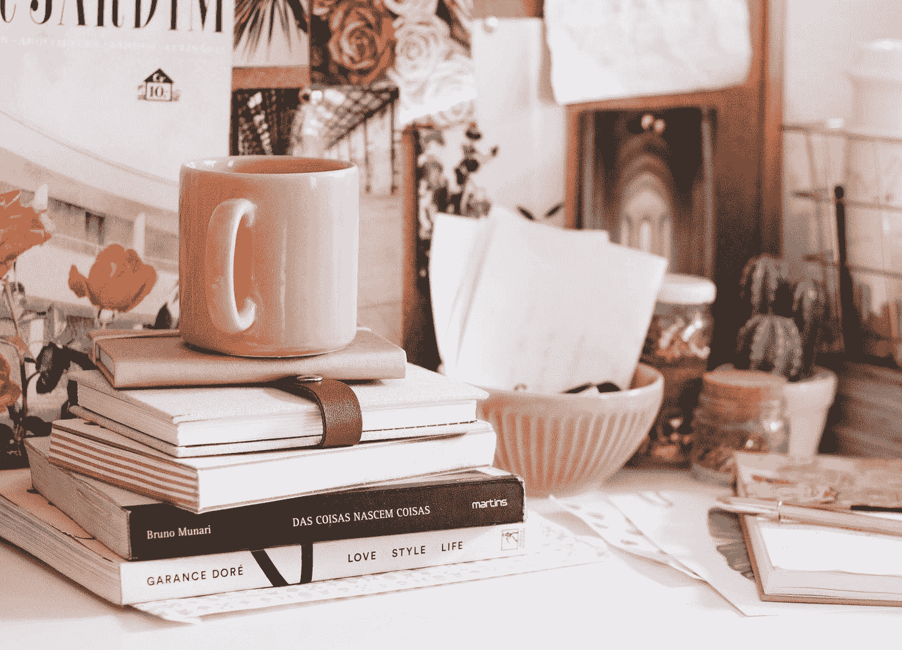

# 如何跟上忙碌的生活方式

> 原文：<https://medium.datadriveninvestor.com/how-to-keep-up-with-a-hectic-lifestyle-29f10acdcf37?source=collection_archive---------37----------------------->

## 自我提升，心理学

## 优先事项和禁忌

Photo by [Ella Jardim](https://unsplash.com/@daniellajardim?utm_source=medium&utm_medium=referral) on [Unsplash](https://unsplash.com?utm_source=medium&utm_medium=referral)

你是否曾经看着某人，想知道他们是如何设法跟上他们生活中的一切？最近，朋友和同事一直在问我这个问题。这让我开始思考。我做的有什么不同？这是我保持忙碌生活方式的方法。

# 更好地做更少的事情

分清主次很难，但却是一项必须掌握的技能。知道什么应该先处理，什么应该先放一放，可以大大改善工作流程。这也意味着你不太可能因为过度工作而筋疲力尽。我发现最好的解决方法是:

1.  列出需要做的事情。
2.  决定什么是最重要的。
3.  对其他一切说不。
4.  当有疑问时，说不，直到手头的任务完成。

> “有那么容易吗？”

理论上，*是的*。在实践中，*没有*。这是你练习得越多越擅长的事情之一。

# 名单

当你写任务清单时，试着坚持实际可行的目标。列出“要成功”这样的东西太宽泛，不可能一蹴而就。尝试合理化，将大目标分解成更小的、可实现的“小目标”。还要记住你一天中可以实际完成的任务数量。不要过度劳累。

# 说“不”

允许自己对那些不在你优先考虑的事情说不。专注于更少的事情会让你做得更好。你每周在每件小事上节省下来的几个小时会累积起来，让你有更多的时间去做真正重要的事情。

> 分清主次就是一切。如果按照正确的顺序，事情就会变得井井有条。

# 对错过的恐惧

这个很难处理。每一个“不”都伴随着对错过某些东西的恐惧。它可以是一个机会，一个新的联系，甚至只是一个小小的快乐。有些人设法对这种恐惧免疫，但重要的是不要完全麻木它。对错过某些东西的一点担心会让你保持警觉，只要确保它不会引导你的判断。一般来说，你最好说几个精心挑选的“不”，而不是试图做太多。

# 经常性承诺

这些有一个习惯，潜入我们的日常事务，并接管。一次四个小时的承诺比每周半小时的会议更容易保持。

在我看来，每次我对一个重复的承诺说“是”，我实际上是在很长一段时间内说了多个“是”。从长远来看，这是非常耗时的。

# 减少你之前的承诺

毫无疑问，你会做出让你后悔的承诺。我知道摆脱它们很不容易(尤其是在很长一段时间之后)，但是经常“修剪”你的承诺是很重要的。我发现最好的方法是在拒绝重复会议时保持开放、诚实和尊重。你可能会发现，有些人可能会因为你的决定而受到伤害，但是遵守纪律和坚持自己的优先事项是很重要的。志同道合、善解人意的人会理解的。

# 判决

做得更少更好会让你更有效率。列出一个目标或任务的清单，并根据需要进行优先排序。允许自己说不，即使是对长期的承诺，这可能很难打破。不要害怕放弃之前的承诺，那可能会拖你的后腿。最后一点建议——在确定优先顺序时，关注*做的事情*比*感觉*好是一个好策略。

> 祝你好运！

*丹尼尔是居住在马尔他的作家、高级教师和地理学家。他的主要热情是让学生实现他们的愿望和达到他们的目标。*

 [## 不要灰心——创业的真相

### 概括地说；这都是努力工作的结果

medium.com](https://medium.com/age-of-awareness/dont-be-disheartened-the-truth-about-startups-d65177351ee1)  [## 日常生活中的确认偏差

### 给出理论背景

medium.com](https://medium.com/age-of-awareness/confirmation-bias-in-everyday-life-3f1745b84653)