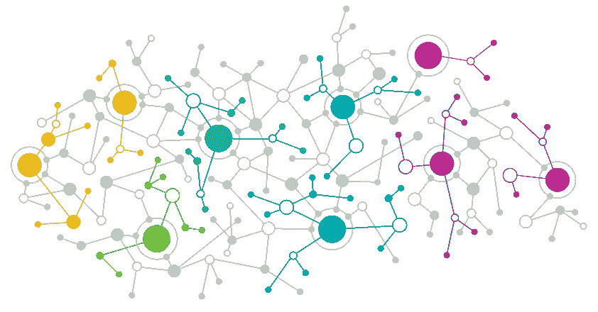

# 如何保持注意力——第二部分

> 原文：<https://medium.datadriveninvestor.com/how-to-keep-your-focus-part-2-ad740ea977c0?source=collection_archive---------12----------------------->

寻找工作时保持专注的更多建议

上周，我发表了一篇[帖子](https://medium.com/datadriveninvestor/newbie-data-scientist-how-to-keep-you-focus-fc6e135caf9e)，分享了一些新手数据科学家在寻找新工作或建立业务时可以使用的技巧:定期练习、写作、教学或谈论数据科学。我认为今天分享更多会令人振奋。我知道要做到所有这些有多困难；然而，你可以从选择其中一个开始，并将其添加到你的日常工作中。

## 回顾过去的项目

我们从事的大多数项目都与对我们很重要的主题或我们感兴趣的事情有关。这简化了编码、收集数据或运行模型的过程。我们很高兴看到结果。回到以前的一些项目可能是一项值得尝试的任务，因为我们找回了激情。我们可能会发现一些我们没有开发的方面，并且可能想要尝试一下。我们终于可以在项目中添加“下一步”了。审查项目的一种方法是注释代码。通过这样做，我们将经历项目的整个过程，并可能捕捉到我们忘记的任何概念。然后，我们只需要回到理论上来找出我们错过了什么。本周，我花了一整天的时间来评论我的一些项目。这些发现让我震惊。

## **播客**

一个**播客**是一系列数字音频文件或剧集，用户可以下载收听或播放。现在，人们听播客而不是传统的广播。此外，因为每集处理的主题都是相关的，所以它让观众参与进来。如今，数据科学(机器学习和人工智能)是数据科学家新手可以在播客中利用的热门话题。当然，这需要一些计划和准备。然而，谈论和解释机器学习或数据科学概念可能是一个很好的复习。一些优势:

你得到了可以提供反馈的观众。

通过谈论和解释你所知道的事情，你会感觉更舒服。想象一下这种做法能给面试带来的好处。

你仍然和你的研究领域保持联系。

## **联网**

最后但并非最不重要的一点是，结识同一领域的其他人是很好的锻炼。网络的优势是巨大的。你增加了你的接触，结交了新朋友，因此，你可以创建一个新的社区来谈论你的兴趣。新朋友可以鼓励写作和项目工作。你甚至可以有小组项目。

Networking is an investment! It can be a good use of your time and resources.

你的下一份工作或下一个商业伙伴都可能是人际网络的产物。我不鼓励人们主要为了找工作而建立关系网，但是工作可能会通过关系网找到你。你可能会找到一些能力出众的人，或者有关系的人可以把你介绍给他们的同事，或者愿意投资你的想法。

人脉就像是对自己的投资。会见其他数据科学家将有助于您扩展知识，讨论模型和该领域的新发现。由于背景可能不同，与人群混在一起可能是一种赌注。你会惊讶地发现，在与另一位数据科学家(来自与你不同的训练营或与一位大师)的快速聊天中，你可以学到什么。

求职期间会非常紧张，令人担忧。重点可能是发送申请，跟进一些联系。那很好。然而，这不应该分散对学习过程的关注。回顾过去的项目，运行播客和参加 meetup 可以提供一些技巧，让你能够在快速的机器学习世界中保持领先。