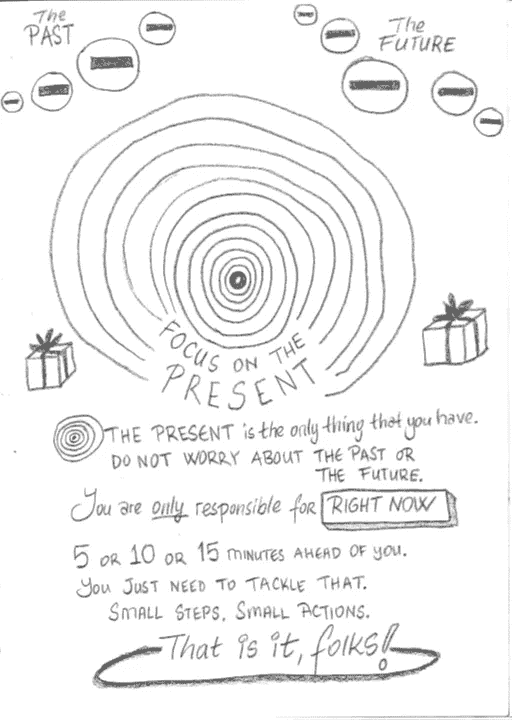

# 如何在创造新东西后杀死你的自我

> 原文：<https://medium.datadriveninvestor.com/how-to-kill-your-ego-after-creating-new-stuff-a90179817fbe?source=collection_archive---------21----------------------->

## 不要浪费时间检查你的统计数据——开始创造你的下一个作品

Photo by [Alice Dietrich](https://unsplash.com/@alicegrace?utm_source=medium&utm_medium=referral) on [Unsplash](https://unsplash.com?utm_source=medium&utm_medium=referral)

每当我在 Medium 上撰写并发表一篇新文章时，我都会情不自禁地查看文章的统计数据。读了多少？有人鼓掌吗？有人在社交媒体上分享过吗？我发布到网上后得到了多少赞？

承认吧——你也有这些习惯。这些习惯实际上是功能失调和适得其反的。为什么？

*   它们提高了你的期望，当你的文章没有产生你所希望的影响时，你会感到失望。
*   它们是浪费时间的习惯。你应该每天检查一次你的统计数据，而不是每小时。否则，你可能会过度沉溺于自我陶醉或让自己沮丧。
*   这些习惯阻止你拥抱未来。当你的文章发表后，就不再是你的责任了。它掌握在互联网和读者手中。让他们去做吧——不要担心。
*   这些习惯阻止你专注于你的新创作。你应该专注于你的新项目、文章、艺术品和创作。你 100%的注意力应该放在你现在要做的事情上(而不是你之前的工作是如何被接受的)。

那么，我们如何改正这些错误的习惯呢？我们怎样才能在利用时间时更有创造性和生产力？以下是我的原则建议，基于我在自己生活中的实践。

# 消除自我和创造新事物的 11 条原则

Photo by [Markus Spiske](https://unsplash.com/@markusspiske?utm_source=medium&utm_medium=referral) on [Unsplash](https://unsplash.com?utm_source=medium&utm_medium=referral)

1。每当你发现自己在检查自己的评论、统计数据或反应时，做五个俯卧撑。做俯卧撑的时候，想想你的下一个想法或者下一步行动。这将训练你的思维走出虚荣的度量标准(车辙)，进入一个积极和创造性的区域(势头)。

2。为了消除你的自负，不要把自己看得太重。对于你与世界分享的工作，会有不同的反应——不要太在意这些。你与这个世界分享的任何东西都不再是你的——它属于这个世界。你不能让从现在开始发生的事情——别管它。如果你专注于下一次创业，你的时间会更有价值:下一步是什么？

> “你的自我是一个极好的仆人，但也是一个可怕的主人——因为你的自我唯一想要的就是回报、回报，以及更多的回报。因为永远没有足够的奖励来满足你，你的自我会一直失望。”—伊丽莎白·吉尔伯特

3。转变为一个创造者的心态。从一小步开始激发你的创造力——创造你自己的惯例，让自己进入一种创造的心情。拥抱做困难工作的不确定性。把这个过程当作学习和实验的机会。

> “创造性的生活是一种放大的生活。这是一种更大的生活，更快乐的生活，更丰富的生活，更有趣的生活。”—伊丽莎白·吉尔伯特

4。专注当下。这包括结束对过去的沉思或对未来的担忧。你现在能做的一件事是什么来变得有创造力和富有成效？选择你的优先事项并付诸行动。从小处着手，慢慢来是可以的。全身心地投入到写作或创造新事物的体验中。即使不流畅也要坚持练习。

Doodle Poster Created by Author

5。放下自我，承认你才刚刚开始你的学习之旅。有一个海洋可以探索，而你所知道的只是这个无边无际的海洋中间的一个小岛。拿起你知之甚少的领域或主题的书。阅读和学习你学科之外的东西，让自己大吃一惊。

> “如果没有沃伦·巴菲特这个学习机器，伯克希尔·哈撒韦公司的投资记录是绝对不可能的。下层社会也是如此。我经常看到一些人在生活中崛起，他们不是最聪明的，有时甚至不是最勤奋的，但他们是学习机器。他们每天晚上睡觉时都比起床时聪明一点。”—查理·芒格

6。你必须学会摆脱你对新工作的恐惧(和拖延倾向):不要稳扎稳打，不要对失败感到舒服——经常失败，越早越好。把失败当作实验和学习的机会——站起来再试一次。停止让恐惧驱使你——立即采取行动进入动力区。

7。就对你来说重要的事情与自己进行一次坦诚的对话。你现在要创造什么？你更大的目的和使命是什么？为什么？优先考虑这件事，对所有其他事情说不。最大化你的“活着的时间”,借此你可以学习，创造，写作，运用你的想象力，并采取行动。尽量减少你被动、愤怒、激动、自私或心碎的“死亡时间”。

> 当你在等待合适的时机时，有两种时间:停滞时间——在这种时间里，你是被动的、等待的；活着的时间——在这种时间里，你在学习、行动，利用每一秒钟来实现你的未来。哪个是给你的？罗伯特·格林

8。不要期待任何回报、奖励或外部认可，因为这会让你变得软弱。当你拿出你能完成的最好的作品时，重要的是你内心的平静。忘掉荣誉、认可或名声——专注于创造你最好的作品。

9。如果你没有学到新东西，请关闭你正在向下滚动的那一页。不要被埋在社交媒体算法、无休止的电子邮件或持续更新中。闭上眼睛，问自己:什么会让你兴奋？你真正好奇的是什么？你真正想学的是什么？你真正想创造的是什么？你如何通过采取一个小小的行动来实现这个令人兴奋的愿景，从而马上开始呢？

10。提醒自己还有多少工作要做，而不是你已经做了多少。当你成功时，培养你的谦逊。如果你对自己所处的位置过于骄傲，你就会停滞不前，没有进一步学习、成长和发展的空间。日语单词“ *tsundoku* ”指的是购买并堆积你永远不会阅读的书籍。《纲目》很棒，因为它提醒你知道的还不够多。纳西姆·尼古拉斯·塔勒布称这些未读的书为“反图书馆”，并建议我们拥有一个非常庞大的反图书馆，以保持好奇、谦逊和开放。

11。不觉得自己有权获得成功。诚实面对你的失败、弱点和错误。当你失败时，从你的经历中学习。试着每天都变得更好，记住你总是能学到更多，也应该学到更多。记住你只是在和自己竞争，这是你一个人的旅程——不要把你的旅程和别人的旅程相比较。

## 法赫里·卡拉卡斯是[自制工作室](https://www.amazon.co.uk/Self-Making-Studio-Inspirational-Self-Discovery-Employability/dp/173077282X/)的作者。你可以在这里探索更多[。](https://selfmakingstudio.com/)