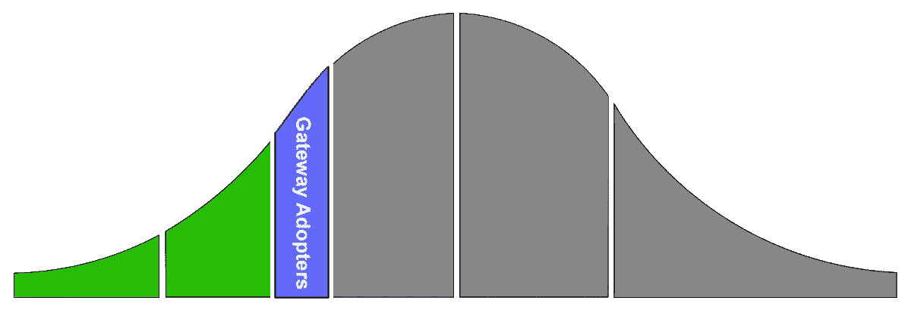

# 如何将您的突破性想法以 75%的速度推向市场

> 原文：<https://medium.datadriveninvestor.com/how-to-land-your-breakthrough-idea-in-market-75-faster-13d77824176?source=collection_archive---------19----------------------->

## 发现赢得产品创新的新方法

创新本身就有风险。项目往往在起飞前就注定要失败。绝大多数高度创新的项目因为一个主要缺陷而失败或成为僵尸:对目标客户的模糊理解。

主要症状是项目进展缓慢。如果你去过那里，你就会知道当隧道尽头的光明不再靠近时是什么感觉。一个模糊的愿景会导致团队浪费时间去膨胀一个 MVP，而这些 MVP 的功能并不能创造一个很好的市场。那么，为什么创建一个最低限度的令人信服的产品的精确愿景如此困难呢？

大多数创新者和创始人都有一个关键的误解:他们认为了解并吸引他们的目标人群就足够了。但事实并非如此。在同一人群中，人们的思维和行为会有很大的不同。为了快速接触大众，市场创新者需要瞄准正确的[心理细分市场](https://en.wikipedia.org/wiki/Psychographics)。这些人提供可操作的反馈，让你更快进入主流市场。

 [## 在创业之旅中，拥抱学习|数据驱动的投资者

### 好像建立一个数百万美元的公司还不够困难，企业家必须额外照顾他们的…

www.datadriveninvestor.com](https://www.datadriveninvestor.com/2018/10/16/on-the-entrepreneurial-trek-embrace-the-learning/) 

一个突破性项目的最大机会，也是你成功的基础，是尽早从正确的人、正确的市场心理图中获取方向。过滤掉其他 90%毒害你的产品的人群。只与提供正确方向的人合作。

问题就变成了如何识别这个关键群体，我称之为网关采纳者。

## 洞察揭示

确定正确的目标客户取决于风险的概念。在每一个市场中，都有一个心理细分市场，它有一种独特的感知和关联风险的方式。

考虑技术采用曲线，一个连续的市场心理图。例如，早期采用者比市场落后者更早处于曲线上。这是因为这两个群体有不同的风险特征。

通过严格的大数据分析，我发现了隐藏在[采用曲线](https://en.wikipedia.org/wiki/Technology_adoption_life_cycle)[【1】](#_ftn1)的“习惯”部分之间的心理利基。尽管目前还不为人所知，但这一目标细分市场在每个市场中都是创新成功的关键因素。

这些是网关采纳者，他们是您在项目形成阶段接触的最佳人选。该小组将为您提供可操作的反馈，帮助您降低最大的风险，并加速您走向适合大众的市场之旅。

将网关采用者的客户开发定位于:

1.  提供突破性的产品，具有极具吸引力的市场适应性，速度提高 4 倍
2.  卖给最有可能购买的人，证明你的概念
3.  更快创收

[**查看关于网关采用者**](https://www.gatewayadopters.com/post/get-your-breakthrough-idea-to-market-75-faster) 的整篇文章——是什么让他们与众不同，如何发现他们，以及如何在产品开发、营销、销售和投资治理中最好地利用这些见解。

[**帕特里克·霍根**](https://www.linkedin.com/in/patrickfhogan/) 是创新专家、资深产品经理、机器人工程师，毕业于达特茅斯大学塔克商学院。他在向新兴市场推出新软件、硬件和专业服务的创业公司和企业方面拥有超过 25 年的经验。

[**伯顿·米勒**](https://www.linkedin.com/in/burton-miller/) 是一位连续创业者、产品负责人、工程经理、Y Combinator 明矾，他职业生涯的大部分时间都在创新 V1 产品。

[【1】](#_ftnref1)波伦，乔 m；乔治·比尔(1957 年 5 月)。[【扩散过程】](http://www.soc.iastate.edu/extension/pub/comm/SP18.pdf) *(PDF)* 。特别报道№18。**1**:56–77。