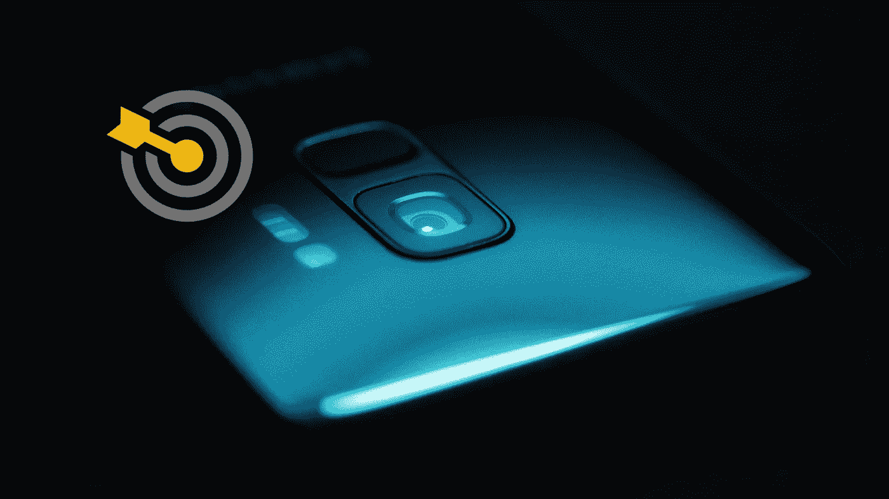
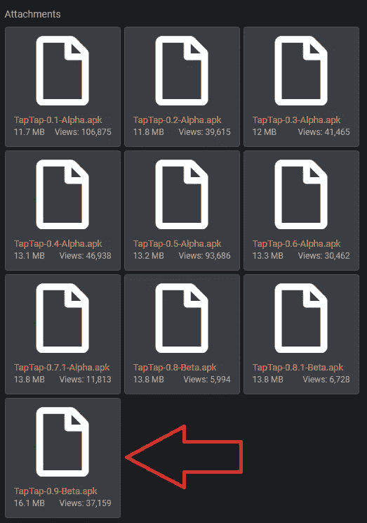
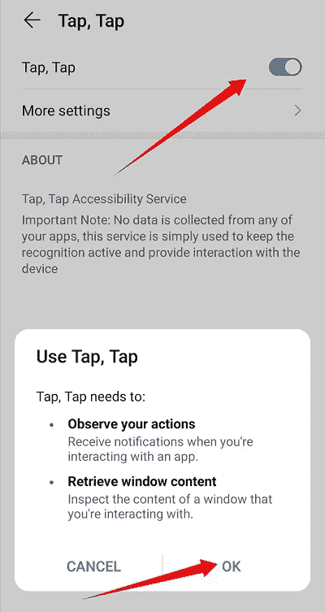
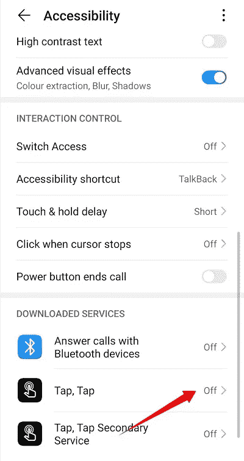
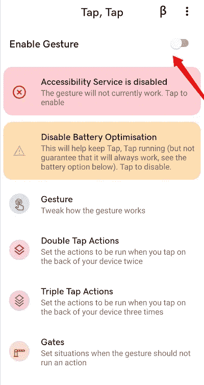
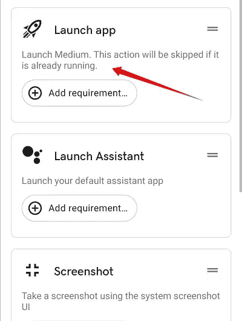

# 如何通过点击你的 Android 手机来启动应用程序

> 原文：<https://medium.datadriveninvestor.com/how-to-launch-apps-by-back-tapping-your-android-phone-3551346eb550?source=collection_archive---------10----------------------->

## 安卓应用

“轻点，轻点”让你只需轻点任何 Android 7.0 以上设备的背面就能执行操作

Photo by [Jonah Pettrich](https://unsplash.com/@jonah_jpg?utm_source=unsplash&utm_medium=referral&utm_content=creditCopyText) on [Unsplash](https://unsplash.com/@jonah_jpg?utm_source=unsplash&utm_medium=referral&utm_content=creditCopyText) (adapted)

几个小时前我发现了 ***Tap，Tap*** 应用程序，我已经对它的新轻拍功能上瘾了。现在，我只需点击智能手机的背面就可以打开应用程序。

我不再需要走捷径；我双击手机背面，然后*瞧，*它立刻启动了我最喜欢的应用程序。

首先，请允许我强调，我与应用程序开发人员没有联系。因此，我将分享我的经验和个人意见，我没有分享任何附属链接。

# 什么是踢踏舞，踢踏舞？

***轻点，轻点*** APK 授权你在任何运行 Android 7.0 或以上版本的设备背面使用 [*Android 11s 双击手势*](https://forum.xda-developers.com/t/app-beta-0-9-tap-tap-double-tap-on-back-of-device-gesture-from-android-11-port.4140573/) 。

> Tap，Tap 是从 Android 11 到任何 Android 7.0+设备的[双击设备背面手势的一个端口。它允许你使用手势启动应用程序，控制设备(包括按下 home，back 和 recents 按钮)，截图，切换手电筒，打开你的助手等等。](https://www.xda-developers.com/google-pixel-android-11-double-tap-rear-gestures/?_ga=2.29753087.1790679648.1608632184-1299671737.1608632184)
> 
> Tap，Tap 使用了与 Android 11 相同的机器学习代码和 TensorFlow 模型，在需要的地方直接从 SystemUIGoogle 中提取代码。

***Tap，Tap*** 目前正在 *beta* 中，由于公众对该功能的兴趣，开发者已经发布了该功能。因此，现在，你不能从谷歌 Play 商店下载它。但是，您可以下载该应用程序并将其安装在您的设备上。

# 如何侧装水龙头，水龙头

在您的 Android 设备上，请点击此链接进入 [XDA 论坛主题](https://forum.xda-developers.com/android/apps-games/app-tap-tap-double-tap-device-gesture-t4140573?_gl=1*1m9akm6*_ga*MTY4OTEyNjMyNS4xNTg1MDYyMDAw)。

之后，下载最新的 APK 文件。如果你不允许从未知来源安装，你会得到一个弹出窗口，带你到浏览器设置:滑动到*允许从这个来源*。然后，您可以返回并继续安装。

[Image by XDA Forum](https://forum.xda-developers.com/t/app-beta-0-9-tap-tap-double-tap-on-back-of-device-gesture-from-android-11-port.4140573/)

# 如何通过点击、点击来启动任何应用程序

既然你安装了 ***水龙头，水龙头，*** 真正的乐趣开始了。

首先，启用*辅助功能服务*。这允许应用程序根据您的点击执行操作。

Screenshot by the author

然后在*辅助功能下，启用* ***轻击，轻击*** 。

Screenshot by the author

之后，让我们启用并配置 G *esture* 设置。你要先启用*手势*；然后，您可以选择*双击动作*或*三击动作*。目前为止我只用过*双击*。

Screenshot by the author

点击***双击****；*然后***添加动作****；* ***发射****；* ***启动 App****；按下* ***+符号****；*点击后退，选择您想要启动的应用程序。

Screenshot by the author

最新版本的 ***Tap，Tap*** 还可以让你启动**谷歌助手**，拍摄**截图**，或者使用类似**手电筒**这样的实用工具，只需轻敲手机背面即可。

还有很多，但是我将让您进一步探索所有可用的酷动作。

然而，在这种情况下，我们希望快速启动自己喜欢的应用程序。因此，您必须将启动应用程序功能拖到菜单的顶部(单击并按住以拖动)。

瞧，你已经准备好开始敲击了！希望你喜欢 ***Tap，Tap，*** 以及这种友好的与 app 互动的方式，获得宝贵的时间。

请随意使用回复框来分享您的进一步见解。非常感谢您的反馈。

 [## 我的第一个故事如何在媒体上发布 4 天后达到 2K 浏览量

### 以及它迄今为止赚到的惊人的钱数。

byrslf.co](https://byrslf.co/how-my-first-story-reached-2k-views-after-4-days-on-medium-9aee6f250c16)  [## 这就是 Twitter 舰队如何帮助你的故事传播开来

### 满足 Twitter 的短暂功能，实现更轻松的对话

rui-carneiro.medium.com](https://rui-carneiro.medium.com/this-is-how-twitter-fleets-helps-your-stories-go-viral-65def5767331)  [## 走进兔子洞:2020 年芮迷宫指南

### 我是如何决定做一朵野花而不是壁花，跟随白兔进入仙境的

rui-carneiro.medium.com](https://rui-carneiro.medium.com/down-the-rabbit-hole-the-2020-guide-to-ruis-labyrinth-of-contents-caec452b0922) 

鲁伊·卡内罗毕业于波尔图大学艺术与人文学院。专门从事战略沟通和自我发展的教师和生活教练。

> *我们可以通过*[*LinkedIn*](https://www.linkedin.com/in/rui-carneiro-52537b173/)*或者*[*Twitter*](https://twitter.com/Editor_RnH)*来分享进一步的见解。感谢你穿越迷宫。感谢您的反馈。*