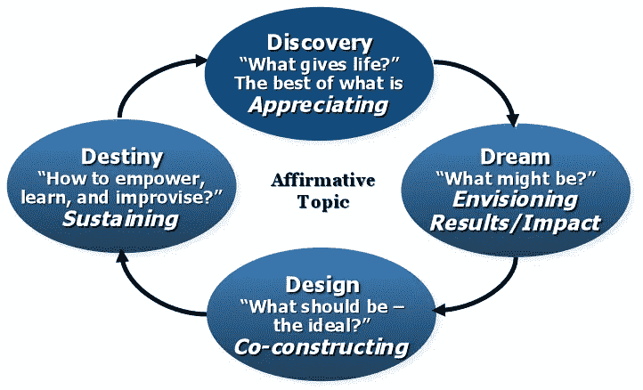

# 如何在组织中领导可持续的积极变革

> 原文：<https://medium.datadriveninvestor.com/how-to-lead-sustainable-and-positive-change-in-organizations-3b9a7f78e59d?source=collection_archive---------6----------------------->

## 欣赏性探究的循序渐进指南

Photo by [Ambitious Creative Co. - Rick Barrett](https://unsplash.com/@weareambitious?utm_source=medium&utm_medium=referral) on [Unsplash](https://unsplash.com?utm_source=medium&utm_medium=referral)

当我在加拿大麦吉尔大学攻读组织行为学博士学位时，我第一次了解到了欣赏性询问。我记得我对[积极组织奖学金](https://positiveorgs.bus.umich.edu/an-introduction/)和[积极心理学](https://positivepsychology.com/what-is-positive-psychology-definition/)运动感到非常兴奋，因为它们似乎抓住了释放组织中最优秀的人的精神。同样，当我了解到欣赏性探究的概念和方法时，我爱上了它。

# 什么是欣赏性探究？

赏识调查是管理组织变革和发展的积极方法。这也是一种了解的方式，侧重于欣赏和释放组织中行动者的最佳能力。欣赏性探究被定义为“一种合作的方法，用以发现当任何人类系统最活跃、最有效和最有能力时，是什么赋予了它生命”。它专注于什么是积极的和赋予生命的，并使用这些信息作为基础来设计和共同建设一个理想的未来。

让我们看看组成这个术语的两个词:

***欣赏*** *，动词，重视；认可我们周围的人或世界的优点的行为；肯定过去和现在的优势、成功和潜力；感知那些赋予生命系统生命(健康、活力、卓越)的事物。*

***询问，*** *动词，1。探索和发现的行为。2.提出问题；乐于看到新的潜力和可能性。同义词:发现、搜索、探索和研究。*

赏识调查是组织研究的一种形式，旨在识别和释放被研究的人类系统(可以是企业、家庭、组织、非政府组织等)中积极的、赋予生命的力量。)它专注于创造和应用知识，这些知识来自对卓越时刻和非凡能力的探究。实践者询问组织行为者他们什么时候感觉最有活力和能量。他们利用这种积极的核心来创造富有同情心和支持性的参与过程、共同的积极愿景和充满希望的环境。

# 谁创造了欣赏性探究法？

大卫·库珀莱德。1980 年，大卫是凯斯西储大学的博士生，他创造了这种方法。当他在克利夫兰诊所进行组织行为研究时，他观察到他的受试者在关注组织中的问题时精力下降，感到意志消沉。当他们专注于什么是最有效的，房间里的能量增加了，这创造了一个积极的势头。从那以后，库珀莱德写了许多关于欣赏性探究的文章和书籍。你可以在下面的视频中看到他的激情和能量:

Dr David Cooperrider on Appreciative Inquiry

在名为[欣赏性探究:变革中的积极革命](https://www.amazon.co.uk/Appreciative-Inquiry-Positive-Revolution-Change/dp/1576753565/ref=rtpb_1/253-5100932-2277631?_encoding=UTF8&pd_rd_i=1576753565&pd_rd_r=6a567a1e-63de-461d-bfaa-faf87cc7af04&pd_rd_w=uSjnd&pd_rd_wg=XucPH&pf_rd_p=f3b429bf-04f9-44c1-845e-fa18956e9ff0&pf_rd_r=BASQ81DAX551ZK46JA63&psc=1&refRID=BASQ81DAX551ZK46JA63)的书中，大卫·库珀莱德和戴安娜·惠特尼写道:

> *“欣赏性探究主要涉及提问的艺术和实践，这些提问加强了系统理解、预测和提高积极潜力的能力。它主要涉及通过精心设计“无条件正面问题”来动员调查，通常涉及数百人，有时甚至数千人。*
> 
> *“在欣赏性探究中，干预的艰巨任务让位于想象和创新的速度；代替否定、批评和螺旋诊断的是发现、梦想和设计。从根本上说，欣赏性探究寻求在全体人民和人们谈论的过去和现在的能力之间建立一个建设性的联盟:成就、资产、未开发的潜力、创新、优势、高尚的思想、机会、基准、高潮时刻、活着的价值观、传统、战略能力、故事、智慧的表达、对更深层次的企业精神或灵魂的洞察，以及对有价值和可能的未来的愿景。”*
> 
> *“把所有这些放在一起作为一个格式塔，在它所做的一切中，有意识地进行欣赏性调查，寻求从这个“积极变化核心”的账户中工作——它假设每个生命系统都有许多未开发的、丰富的和鼓舞人心的积极账户。”*

# 欣赏性探究的基础/支柱是什么？

在这一节中，我将试图回顾作为一种组织发展方法和变革哲学的欣赏性探究的假设和理论基础。

欣赏性探究有三大支柱。让我们一个一个来复习。

1.  社会建构论:这一观点可以概括为以下陈述:

*   社会秩序是广泛社会共识的产物。
*   所有的社会行为都可以有多种解释。
*   我们使用的想法和类别是历史和文化特有的。
*   所有的观察都是通过故事和信仰体系过滤的。
*   变革最有力的工具是通过语言使对话成为可能。
*   没有超脱的、科学的模式来判断价值主张。
*   有效的知识或社会理论是一种叙事创作。

2)新科学:这些是量子物理学、混沌理论、复杂性理论和自组织系统的新学科。它们包括:

*   黑曾伯格的测不准原理
*   世界的复杂性和主观性
*   整体性和相互关联性，而不是简化论
*   和谐与对话，而不是二分法思维
*   合作而不是竞争
*   循环关系，而不是线性和层次关系
*   “*信了就看*”而不是“看到了就信了。”

3)对想象力和想象力的研究:这包括深入研究精神和身体之间联系的理论和研究。其中一些是:

*   自我实现的预言，
*   安慰剂效应:患者康复和改善仅仅是因为信念，
*   皮格马利翁研究:学生“假定”的聪明结果是聪明的。预期塑造现实。
*   积极思考帮助各种病人康复。

 [## 创新农场和先锋精神:所有组织(和你)都需要在…

### “首席数字官”和“首席转型官”是组织目前的新管理角色…

www.datadriveninvestor.com](https://www.datadriveninvestor.com/2020/08/13/innovation-farm-and-a-pioneers-spirit-all-organization-and-you-need-to-still-have-a-say-in-the-future/) 

# 你如何运用欣赏性探究？

What is Appreciative Inquiry?

首先，你发现赋予组织生命的因素；例如，对于你自己、你的部门、你的同事和你的大公司，你最看重什么？什么对这个组织的生活质量有积极的影响？你做出了什么让你特别自豪的贡献？有哪些给组织或团队带来能量的特殊时刻？

第二，你设想一个理想的未来。你开始为自己和你的组织设想新的可能性。想象包括“激情思考”，让你自己被你所看到的激发灵感。这意味着创造一个美好未来的积极形象。什么样的项目会有很大的不同？

第三，你参与对话，讨论和分享发现和出现的可能性。通过对话，个人的观点融合成一个共同的观点。你的讨论应该带来适用的、有启发性的和合作性的知识。

第四，你通过行动和创新来设计和创造你想要的未来。你参与实验，让事情发生。

# **欣赏性探究的原则是什么？**

欣赏性探究基于以下原则。当你运用欣赏性探究时，请记住这些原则。

*   建构主义原则:文字创造世界。我们的想象力允许组织被改变或重建。
*   预期原则:形象激励行动。未来的景象先于实际的变化。
*   同时性原则:探究创造变化。当你问第一个问题时，改变的种子就种下了。询问和干预同时进行。
*   积极原则:积极的问题导致积极的改变。调查越积极，变化就越大。系统朝着所提问题的方向运动。
*   开卷原则:我们可以选择学什么。组织就像一本打开的书。这本书可以有多种解释和结论。
*   整体原则:整体带来最好的。将所有利益相关者聚集在一起可以激发创造力，并在组织中建立集体能力。
*   制定原则:行事仿佛是自我实现的。要做出改变，我们必须成为我们想看到的改变。
*   自由选择原则:自由选择解放权力。当人们可以自由选择贡献的方式和内容时，他们会更加投入。

# **欣赏性探究的过程实际上是如何运作的？**

如果你想在你的组织中应用欣赏性询问，你可以首先选择积极的核心，并使它成为你询问的焦点。然后，你可以探究组织中赋予生命力量的故事，并定位这些故事中出现的主题。然后，您可以使用这些主题为期望的未来创建一个共享的叙述，并集体讨论设计和创建这一未来的方法。

为了使这个过程更加系统和透明，你可以遵循欣赏性探究的四维过程:发现、梦想、设计和命运。

**4D Cycle of Appreciative Inquiry; Courtesy of David Cooperrider; Image** [**Source**](https://www.researchgate.net/figure/D-Model-of-Appreciative-Inquiry_fig1_265150118)

让我们深入研究每一个 D，描述欣赏性探究的过程是如何运作的。

## 发现

这是调查的第一阶段。你的目标是发现组织中已经存在的最好的东西。你将询问参与者什么在他们的组织中最有效，他们如何努力创造他们的最佳作品，以及他们分享的最佳经验是什么。你实际上是在试图收集关于组织中赋予生命的东西的故事:

*   是什么赋予了这个组织生命？
*   有哪些巅峰的经历和优秀的瞬间？
*   当我们发挥出最佳水平时，会发生什么？可以举个例子或者故事吗？
*   我们有哪些最佳实践？我们如何定义和保存我们的秘制酱？
*   作为一个团队，我们最大的优势是什么？我们怎样才能培养更多的这些优势呢？

你的总体目标是动员整个系统调查组织中的积极变革核心。

## 梦

在第二阶段，你会为你正在工作的组织设想新的、新鲜的、令人兴奋的可能性。你的目标是为所有利益相关者设想一个共同的和期望的未来。你试图描绘一幅理想的未来。如果卓越故事中赋予生命的特性成为标准，你可以通过创建组织的外观、存在、感觉和功能的共享图像来做到这一点。以下是你可能会问的一些问题:

*   你对团队或组织的理想未来是什么样的？
*   你对我们公司未来 5 年或 10 年的最大期望是什么？
*   我们共同梦想的结果会是什么？
*   如果我们让我们的共同愿景/共同梦想成为现实，我们会在哪里？
*   如果我们尽最大努力，发挥我们的全部潜力，会怎么样？

## 设计

在这一阶段，你会更深入地探究在上一个(梦想)阶段出现的期望的未来和共同的愿景。现在，您将尝试构建并实现这个理想的场景。为此，你将询问参与者他们将如何共同构建具有最大潜力的愿景和想法。在这个阶段，你开始实施理想的愿景，并把它变成一个工作设计，这将是完全功能和可实现的。您处理的问题变得更加具体，并以阐明战略重点为中心。你要求参与者提出有启发性的问题和主张，以创建新组织引人注目的清晰形象。这意味着你正在努力创造一个能让梦想成真的社会架构。在这个阶段，你将努力创造一个鼓励和邀请开放的支持性环境。请记住，您正在尝试帮助团队设计一个健康的、协作的社会架构，这将帮助他们实现共同的目标。您可能会问的一些问题如下:

*   我们如何才能最好地培养积极的团队关系和健康的协作动力，以获得尽可能好的结果？
*   我们应该如何最好地组织自己以最大限度地发挥我们的潜力？我们如何建立一个可持续的创造力、生产力、成功、关怀和同情的系统？
*   什么样的指导原则能让我们创造出想要的改变来设计理想的组织？
*   我们在设计什么？我们将如何识别组织的社会架构？我们如何描述我们的理想组织？

## 命运

在这最后一个阶段，你将通过整个系统进行创新，以实现积极的变化，并使一切都变得生动。你的目标是加强整个组织的积极能力。你想让组织围绕一个深刻的目标建立希望和动力。你想要创造实际的过程来给生活带来积极的变化。您希望实现更好的学习、绩效和创新成果。你将随机应变，并在过程中不断调整，你将遵循一种灵活而富有弹性的方法来使实施取得成功。为了使变革成功，组织成员需要致力于共同的愿景。您可能会问以下问题来加速和实施积极的变革:

*   你如何授权给彼此去实现积极的改变？
*   你如何学习和随机应变以达到共同的目标？
*   你如何在组织的每个层面培养集体意义和目标？
*   你将如何收集关于你所取得成就的故事？你将如何庆祝？
*   自组织行动的参数是什么？你将如何自我组织和创新？你将如何支持持续的成功？
*   你将如何将这些积极的变化制度化？

# 为什么赏识教育如此成功？它是如何独特而有冲击力的？

欣赏性探究与其他方法的特别区别在于，一个组织被认为是一个有待理解的神秘事物，而不是一个有待解决的问题。赏识调查比传统的组织变革和干预方法更有效的原因如下:

*   它侧重于该组织过去做得好和现在做得好的方面。
*   它在过去和未来之间架起了一座桥梁。
*   它建立关系，使人们在关系中而不是在正式的角色中为人所知。
*   它为每个人创造了被倾听的机会。
*   它为人们创造了分享梦想的机会。
*   它创造了一个人们可以选择贡献方式和贡献内容的环境。
*   它鼓励并使人们变得积极。
*   这是肯定的，并侧重于最佳的组织。
*   作为一种变革方法，它是即兴的和灵活的。

相应地，赏识调查在各种各样的计划中都非常有效，包括组织变革、文化转型、客户满意度、战略规划、员工承诺、组织设计、领导力发展、合并和联盟、社区发展、全球组织、团队发展、冲突解决、职业规划和流程改进。

赏识调查可以通过多种方式实施，包括峰会、小组调查、学习小组、焦点小组、积极变化网络、联盟和一系列会议。

赏识调查已在全球许多组织中实施，包括:

*   西格玛(全球管理中的社会创新)全球变化中心
*   Taos 研究所(社会建构主义思想和实践进步)
*   美国国际开发署的 GEM(全球卓越管理倡议)计划
*   想象一下芝加哥——一个社区发展项目
*   联合宗教倡议(联合世界各宗教支持和平)
*   与达赖喇嘛合作——友谊的惊喜

# 在赞赏式询问中要问的问题示例

当你实施欣赏式询问时，试着做一个慷慨的倾听者。全神贯注于你的受访者，而不是你的故事。以下是一些你可以使用的问题:

*   告诉我你在公司度过的最美好的时光。回顾你的整个经历，回忆一下你感觉最有活力或者对你的参与最兴奋的时候。是什么让它成为一次激动人心的经历？谁参与了？详细描述一下。
*   你最看重的东西是什么？关于你自己、你的工作和你的组织，你看重的是什么？
*   不卑不亢地说，你最看重自己的什么——例如，作为一个人，还是作为朋友、父母、公民等等？
*   当你对你所在单位的工作感觉最好时，你最看重的是什么？
*   你重视你的组织的什么？你的组织对你的生活最重要的贡献是什么？
*   你认为你的组织的核心价值是什么？如果它不存在，是什么会使你的组织完全不同？
*   如果你对你的组织有三个愿望，它们会是什么？
*   你认为你的组织的核心价值是什么？

# 那又怎样？外卖是什么？

大卫·库珀莱德说得很好:

> 例如，作为一种能够激发、动员和维持重大人类系统变革的探究模式，我们作为一个领域是否已经达到了“解决问题的终点”？如果我们以积极的假设开始我们所有的工作——组织，作为人类关系的中心，是“活着的”,具有无限的建设性能力，我们的变革实践会发生什么？如果是的话，我们怎么知道？我们所说的无限容量是什么意思？假设我们是变革的领导者或催化剂，如果我们在通过系统地研究人们和组织已经“完美”的形式与他们建立联系之后很久才探讨变革的问题，会发生什么？我们如何谈论“它”——对现实中的理想的描述？一旦我们和其他人与这个积极的核心联系在一起，我们的工作还需要更进一步吗？我们怎样才能更好地以经济、人文和生态意义上的方式探究组织的存在，也就是说，以越来越多地帮助人们发现、梦想、设计和向最大利益转变的方式？”

# 我们关注的东西被放大了

当我们关注积极的一面时，我们在生活和组织中增强了积极的一面。进步是会上瘾的——它比关注问题更吸引人，更有趣，也更有效。因此，我们需要把重点放在已经在起作用的东西上，而不是已经坏了的东西上。这使我们能够建立在最佳人际关系中固有的积极核心之上。

为什么关注积极的一面如此强大？我们都经历过生活中感激时刻的力量。还记得在你学校的时候，老师真的相信你，认识到你独特的天赋，并看到你最大的优点。这是一个如此强大的经验，我们都可以涉及，因为它建立在我们积极的核心。由于那位老师的积极期望，我们都尽了最大努力。我们实际上已经使用了欣赏性探究原则来利用和发展我们最大的优势。我们受到基于信任的积极关系的鼓舞。

通过认识和放大我们已经拥有的成功和优势，我们能够在我们的生活和我们的组织中创造一些令人惊叹的东西。然后，我们就能创造出一幅令人信服的未来图景。我们可以努力工作，采取行动走向它；为了让这成为现实。这就是欣赏性探究的力量——它给了我们无限的乐观和动力。

# 至理名言

“想象力比知识更重要。”——阿尔伯特·爱因斯坦

"惊奇感，那是我们的第六感."劳伦斯

“为什么我们通常只对孩子说‘无拘无束的好奇’？如果做好调查是组织发展的核心，那么为什么很少谈论敬畏、好奇、崇敬、惊讶、喜悦、惊奇和惊奇——简而言之，一切有助于注入组织发展传统上称之为“调查精神”的东西。”—大卫·库珀勒德

“我们经常花太多时间来应对前进道路上的问题，以至于我们对真正重要的东西只有模糊甚至不准确的认识。”—彼得·圣吉

“我们拥有的在非洲产生建设性变化的最重要的资源是我们合作的想象力和头脑，以及我们释放社区、教会、政府和个人的想象力和头脑的能力。”萨龙·奥莱·塞纳

"没有一个问题可以从创造它的同一意识层次上解决."——阿尔伯特·爱因斯坦

“我们的一切都可以被夺走，只有一样东西除外——人类最后的自由——那就是在任何特定环境下选择自己的态度。”维克多·弗兰克尔

“注意你的思想；它们变成了文字。注意你的言辞；它们变成了行动。注意你的行动；它们变成了习惯。注意你的习惯；他们变成了角色。注意你的性格；它成为你的命运。”—弗兰克·奥特洛

“永远不要怀疑一小群有思想、有奉献精神的公民能够改变世界。事实上，这是唯一的事情。”—玛格丽特·米德

“如果你想造一艘船，那就不要鼓捣男人去拾柴，发号施令，分工合作。而是教他们向往那遥远无边的大海。”安托万·德圣埃克苏佩里

马丁·路德·金没有说，“我有一个战略计划。”相反，他喊道，“我有一个梦想！，“而且，他创建了十字军东征。”—凯西·威尔斯

“必须记住，生活的悲剧不在于没有达到你的目标。它在于没有要达到的目标。梦想未能实现而死去并不是灾难，但没有梦想才是灾难。没有到达星星并不可耻，但是没有任何星星可以到达才可耻。真正的罪过不是失败，而是目标低。”—本杰明·梅斯，途经巴勃罗·艾森伯格

"如果一个人没有发现他愿意为之献身的东西，他就不适合活着。"—马丁·路德·金

“我们必须成为我们希望在世界上看到的变化。”圣雄甘地

# 下一步是什么？

如果你想探索和学习更多关于欣赏性探究的知识，这里有一个丰富的网站供你进一步阅读、研究和应用:

[http://appreciativeinquiry.cwru.edu](http://appreciativeinquiry.cwru.edu)

凯斯西储大学韦瑟黑德管理学院的“赏识调查共享”，致力于工具、概念和研究的赏识调查共享

## 法赫里·卡拉卡斯是[自制工作室](https://www.amazon.co.uk/Self-Making-Studio-Inspirational-Self-Discovery-Employability/dp/173077282X/)的作者。你可以在这里探索更多[。](https://selfmakingstudio.com/)

**访问专家视图—** [**订阅 DDI 英特尔**](https://datadriveninvestor.com/ddi-intel)