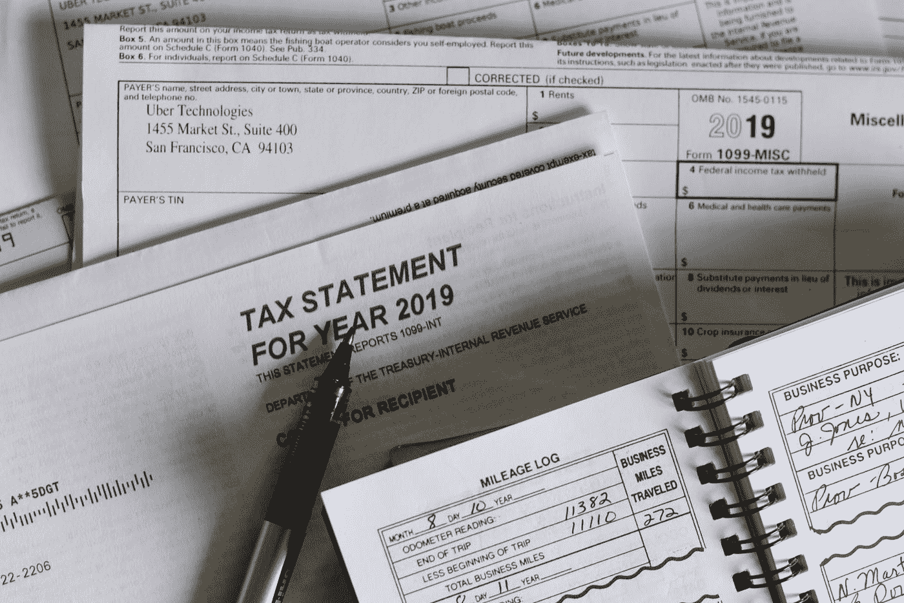

# 如何在美国合法免税

> 原文：<https://medium.datadriveninvestor.com/how-to-legally-pay-no-tax-in-the-united-states-f76c6ef7ee52?source=collection_archive---------2----------------------->

## 美国一些最大的公司是如何在税收上几乎不花一分钱的？

Photo by [Olga DeLawrence](https://unsplash.com/@walkingondream?utm_source=medium&utm_medium=referral) on [Unsplash](https://unsplash.com?utm_source=medium&utm_medium=referral)

想象一下，你刚刚被聘为英特尔公司总裁，你的起薪是每年 100 万美元，你拿起电话给你的家人，告诉他们你终于成为百万富翁的好消息，好吧，不要这么快兴奋，你忘了考虑在当今的社会经济世界中赚钱的艰难现实。

税收 100 万美元的收入，你将不得不支付超过 30 万美元的联邦税，29，000 美元的社会保障税，超过 10 万美元的州税假设你住在公司总部所在的加利福尼亚州，这意味着你的 100 万美元工资中，你将不得不支付 468，590 美元的税收，这超过了你总收入的 46%。

你很难改变这一点，如果你试图逃税，你最终可能会被罚款高达 25 万美元，这还不算你作为百万富翁已经欠下的债务，但等一下，如果国税局没有拿他们的税开玩笑的话。

# 为什么我们不断听到富人和公司不纳税？

据报道，美国一些最大的公司没有缴纳联邦所得税。亿万富翁唐纳德·特朗普不缴纳联邦所得税，那些大公司也不缴纳联邦所得税。这让我很好奇，如果这些家伙用不同的方式避税而没有国税局的任何后果呢？事实证明，税法可能有点复杂，一些世界上最富有的人找到了一些漏洞，让他们的钱远离山姆大叔的口袋。

# 把你的生意变成一个公司

如果你已经有一个很好的企业，最简单也是最快速的开始省钱的方法之一就是把你的独资企业变成一个公司，因为这两者的税收非常不同。当一个人作为独资经营者做生意时，他们将他们的财务与他们的企业财务相结合，他们的企业收入将像劳动所得一样纳税。

仅联邦税一项就高达 37%，因此，如果你以前是单身，每年赚 100 万美元，你将不得不支付高达 37 万美元的联邦税，但如果你是公司，你只需支付 21 万美元的联邦税，因为美国的公司税率是 21%，成为公司将自动为你节省 16 万美元的联邦税。

在特朗普担任总统期间，这个数字曾经更高。随着 2017 年的减税和就业法案，公司税从 35%下降到 21%。唯一的缺点是，由于公司是一个不同于所有者的实体，从技术上讲，你不拥有这笔钱，公司拥有这笔钱，你拥有公司。

如果你想通过支付自己的股息将资金从公司的银行账户转移到你的银行账户，你将不得不额外支付 15%至 20%的股息分配税。在某些情况下，这种双重征税最终仍会比你支付所得所得税少。许多人甚至名人开始利用公司来经营他们的生意。

这不仅允许所有者利用公司税率，而且还可以将与业务相关的任何费用作为公司损失索赔。许多成功的公司所有者通过他们的奢侈品，如一辆好车或至少一栋漂亮的房子，只要与业务相关。这使得他们可以将这些采购作为业务费用进行申报。

它降低了公司的应税收入，从某种意义上说，降低了他们的税单，允许他们花与他们的业务相关的钱。在国税局来要求他们的份额之前，现在这是任何一个生意好的人减少他们的税收而不是消除他们的一个简单的方法。还有一些富人使用的其他漏洞，允许他们不支付任何税收。

 [## 减税和税收收入有关联吗？数据驱动的投资者

### 前几天在脸书的一个帖子里，我徒劳地试图向一群最近退休的飞行员说明…

www.datadriveninvestor.com](https://www.datadriveninvestor.com/2020/10/20/is-there-a-correlation-between-tax-cuts-and-tax-revenues/) 

# 税收天堂

如果他们不想的话，数十亿美元公司的一个非常普遍的做法是利用水来避税。这些方便的小漏洞是位于离岸国家的公司，为这些公司提供很少或没有纳税义务的个人，从法律上讲，他们不能向美国等外国税务当局分享公司的财务信息。

一些避税天堂是巴哈马群岛、百慕大群岛、泽西岛和开曼群岛，这只是举几个例子。现在，公司不能把钱存入巴哈马群岛的银行账户来避税。必须有一个合法的结构，利用当前的税法假装他们赚的钱比实际少。

例如，假设你建立了一家公司，今年获得了 1 亿美元的利润，这意味着在美国，根据 21%的税率，你必须支付 2100 万美元的公司税，但如果你告诉政府，你只赚了 2000 万美元，而不是 1 亿美元，这意味着你只需支付 420 万美元的公司税，而不是正常的 2100 万美元。

## 你是怎么做到的？

许多公司可以合法地做到这一点的方法是通过创建一个像在巴哈马的离岸公司，并将他们的专利商标和知识产权的所有权从美国的真实公司转移到他们在巴哈马的另一家公司，当山姆大叔来收取 2100 万美元时，他们可以说抱歉，我们必须向巴哈马的另一家公司支付 8000 万美元来许可他们的专利。

现在，他们已经成功地在海外保护了 8000 万美元，并为他们支付了零美元的税收，因为巴哈马群岛碰巧有零%的公司税率，而不是支付 2100 万美元，他们只支付了 420 万美元，节省了大约 1680 万美元的税收。这意味着他们只支付了总利润的 4.2%，而不是支付 21%的税收。这种策略可能会节省大量的税收。

它也有缺陷，虽然这笔钱藏在海外，但不能使用，如果该公司试图把钱带回美国，它会被征税这是造成苹果现金问题的原因他们在银行有很多钱，但它遥不可及，因为把钱带回来意味着要交税。

他们一开始就在回避，那么如果能很好地利用资金，那么把钱藏在海外的目的是什么呢？公司把钱藏在海外，以便在发现避税机会时把钱拿回来。这发生在 2018 年 1 月，当时公司税率从 35%变为 21%，为公司提供了收回资金和缴纳更少税款的绝佳机会。

如果你留意了去年的新闻，你会发现苹果一直在积极地收回他们的资金，回购他们的股票，这反过来通过提高股票价格让他们赚更多的钱，这可以让他们以不同的方式节省税款。

随着公司估值的上升，许多公司高管更愿意以股票期权的形式获得部分薪酬。他们可以发行新股来支付高管薪酬，这带来了一些好处。第一，高管在出售股票之前不会对薪酬支付任何税，这使他们能够控制何时纳税。其次，公司可以报告损失和工资形式，而不会实际损失现金。

由于他们可以创造新的股份，他们可以合法地报告损失，但不会失去现金，本质上，他们是在以股票的形式印刷自己的钱来支付高管。

如今，以股票形式获得报酬也为公司高管创造了另一个避税漏洞。由于他们以股票的形式获得报酬，高管们可以用这些股票购买股票期权，这些股票期权可以用来从投资银行借钱。虽然用他们的股票作为抵押品，但这让他们可以绕过资本利得税，获得自由资金。

他们既不能从使用这些钱的利润中偿还，也不能自己交出给他们免税资金的股份。这方面的一个很好的例子是埃隆·马斯克(Elon Musk)，他在 2017 年用他在特斯拉约 40%的股份作为贷款抵押。这在当时达到了 40 多亿美元。据报道，在 2019 年用作抵押品的特斯拉股票中，他欠下了超过 5 亿美元的特斯拉所有权。不清楚他为什么用这笔钱，但许多人说他用这笔钱投资他的其他公司。

# 空壳公司

许多富有的公司使用的一个非常有趣的伎俩是空壳公司。这些公司没有物理位置，没有任何产品或员工，但用于持有银行账户。钱可以通过它来避免被征税。苹果公司就是一个很好的例子。

据报道，苹果作为一家在国际上开展业务的美国公司，在海外隐藏了大约 2850 亿美元。苹果将不得不用在其他国家生产的钱向美国纳税，因为美国是唯一一个根据公民身份征税的国家。该公司将不得不支付其经营所在国的税款，其余部分将支付给美国，以完成这 21%。

当遗嘱和数十亿美元危在旦夕时，苹果决定在爱尔兰创建一家公司，那里的公司税为 12.5%。然后，他们在荷兰创建了另一家公司，最后，他们在爱尔兰有另一家公司，该公司在法国海岸附近的泽西岛有合法居留权。

你猜它没有公司税，所以拥有所有专利和知识产权的新泽西公司将产权许可给荷兰公司。与其说是一家公司，不如说是一个银行账户。这家位于荷兰的公司将房产转租给了位于爱尔兰的公司，后者负责他们的国际业务。

这意味着，当有人在欧洲购买 iPhone 时，这笔钱会进入爱尔兰公司，该公司负责运营这笔钱在返回爱尔兰之前会在荷兰银行账户中短暂闪现，因为该公司在泽西岛合法注册。它不能被征税，这就是如何避免数十亿美元被征税。

## 访问专家视图— [订阅 DDI 英特尔](https://datadriveninvestor.com/ddi-intel)