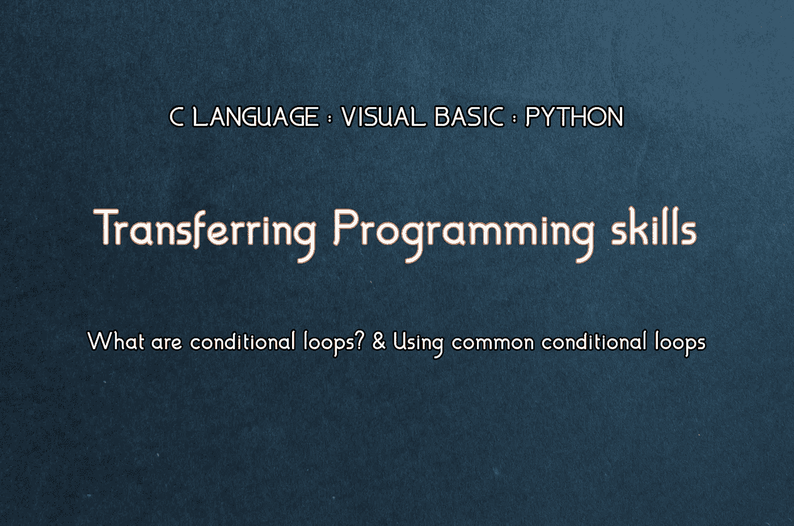
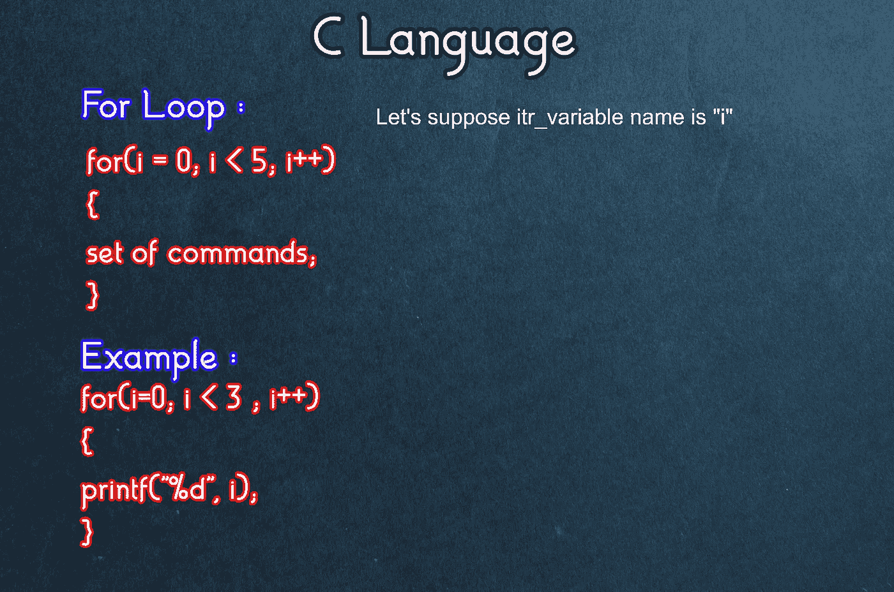
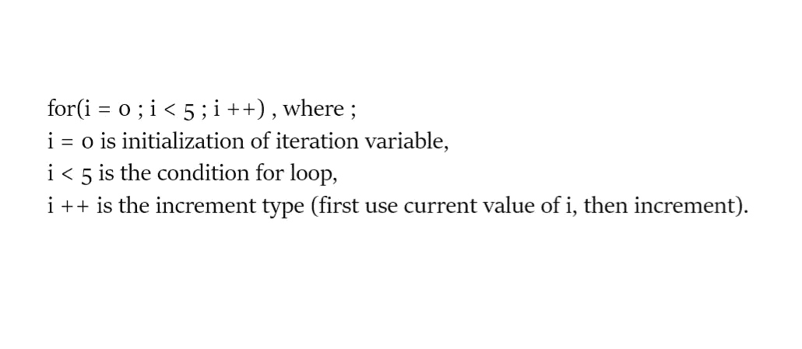
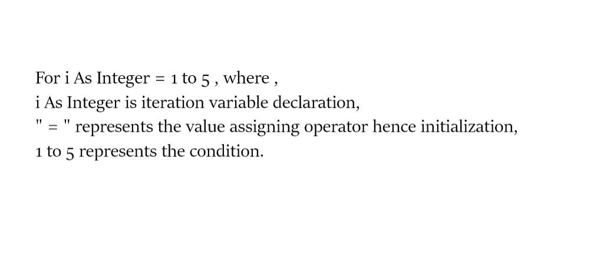
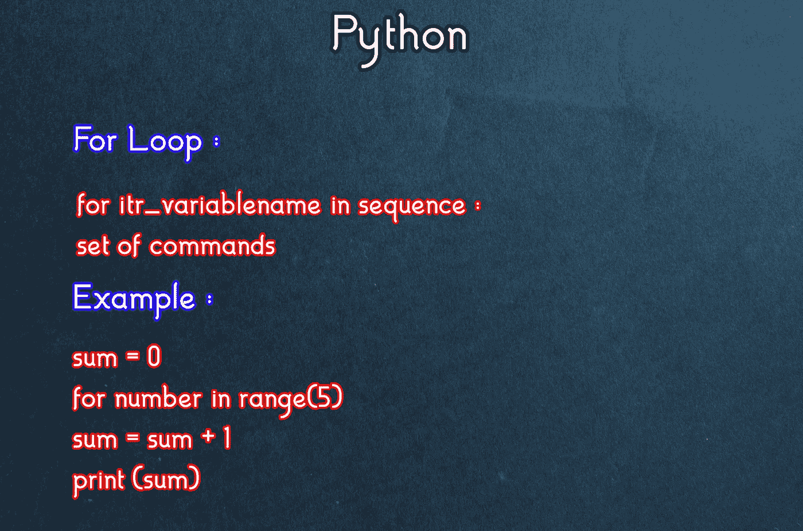
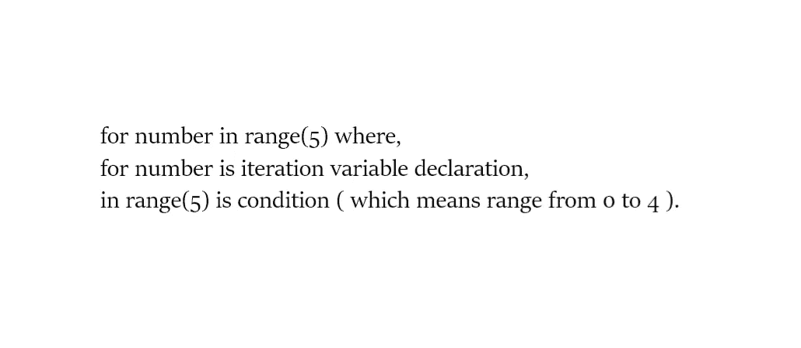
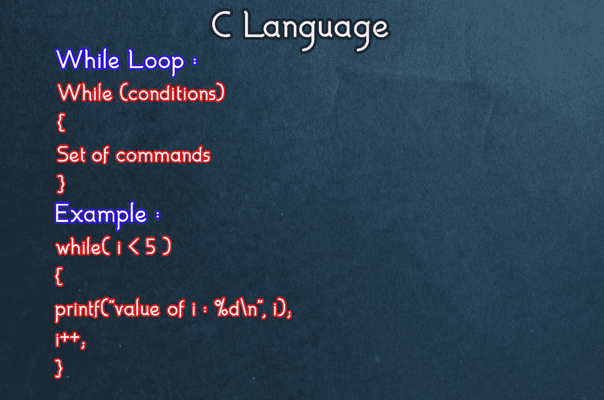
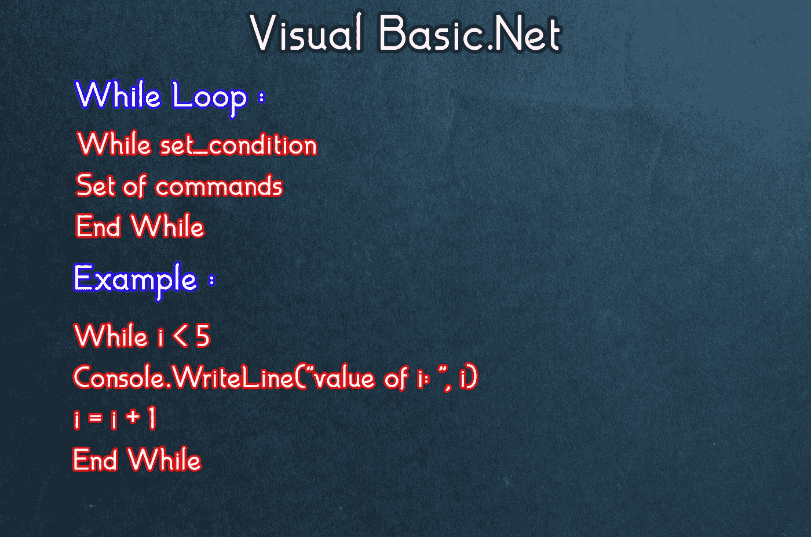
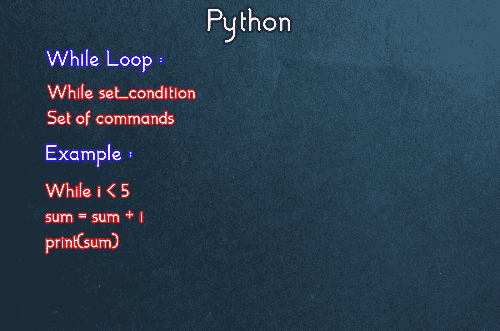

# 如何用 3 种语言循环

> 原文：<https://medium.datadriveninvestor.com/how-to-loop-in-3-languages-b6b8b1614829?source=collection_archive---------4----------------------->

## 你想学编程吗？下面是三种编程语言中条件循环的比较。

今天我们将学习循环，循环的类型，以及如何使用最常见的条件循环。

在我们深入研究之前，初学者应该先了解一下[基础知识。](https://medium.com/swlh/transferring-programming-skills-basics-92c3d7e17c3b)

**循环:** [重复一系列指令直到满足特定条件的程序结构](https://techterms.com/definition/loop#:~:text=In%20computer%20science%2C%20a%20loop,functions%2C%20and%20many%20other%20things.&text=Two%20of%20the%20most%20common,loop%20and%20the%20for%20loop.)

用更简单的话来说，我们可以说 loop 是代码的一部分，它可以重复任何一组命令，直到程序员需要或者用户需要(只有当程序询问用户重复的次数时)。

# 循环类型:

有两种类型的循环:条件循环和无条件循环。

让我们理解这些循环，并尝试在我们的程序中实现它们。

1.  ***条件循环:*** 根据程序员或程序设定条件重复一组命令的循环称为条件循环。基本上，条件循环对条件的布尔(真/假)结果起作用。如果条件满足(真)，循环将工作，而如果条件不满足(假)，循环将不工作。如果条件总是为真，则循环是无限的，而如果条件总是为假，则循环中的代码将永远不会运行。
2.  ***无条件循环* :** 无条件循环重复命令集，因此循环执行是强制性的。我们也知道无条件循环是无限循环，因为它的条件总是真的。在一些程序中，使用无条件循环，所以每当用户结束程序时，循环也停止。

> 布尔运算最好的一点是，即使你错了，你也只会错一点点。—匿名

# 使用条件循环:

大多数编程语言中最常用的条件循环有:

1.  **为**循环。
2.  **而**则循环往复。

# For 循环:

***对于 C 语言:***

首先，我们假设迭代变量名为“I”。如果我们愿意，我们可以取任何变量名。

在 C 语言中，“for”循环在“For”语句中具有初始化、条件和增量。让我来分解一下。

编写 for 语句后，程序员可以编写任何一组命令。“for”循环将重复这组命令，直到条件为假。

**为 Visual Basic。Net :**

同样，在 Visual Basic 中。Net，我们假设迭代变量名为“I”。程序员可以使用任何对他们方便的东西。

在 VB 中，语句的**由声明、初始化和条件组成。这里“For”循环以 **Next** 结束，Next 递增迭代变量的值。**

 [## 用 Python |数据驱动投资者进行股票价格时间序列预测简介

### 在这个简单的教程中，我们将看看如何将时间序列模型应用于股票价格。更具体地说，一个…

www.datadriveninvestor.com](https://www.datadriveninvestor.com/2020/07/07/introduction-to-time-series-forecasting-of-stock-prices-with-python/) 

下面我们来分解一下“For”的下一个循环，这样更容易理解。

在“For”语句之后，程序员可以在循环中编写任何他想要的命令集。但是最后，他必须写 next 来完成“For Next”循环，否则程序就不能运行。

**对于 Python :**

“For”循环格式在大多数编程语言中是相同的，但是有一些细微的差别。在 python 中，如你所见，我们必须提到重复的顺序。我们可以使用任何迭代变量名。

为了更好的理解，让我们进一步分解程序。

> 控制复杂性是计算机编程的本质—布莱恩·克尼根

这就是我们如何在上面的每种编程语言中有效地使用“for”循环。

# While 循环:

***为 C 语言:***

对于那些不懂语句语法的人来说，他们很难实现这些循环。

正如你所看到的，在“while”循环中，你只需要写“while ”,并在括号中写下你想要的条件，当它为真时，循环将不断重复这组命令。

如果 while 循环下有一个以上的命令，记得使用花括号。如果不是，那么“while”循环后的语句只会重复。

**对于 Visual Basic。Net :**

正如“For-Next”循环一样，visual basic 中也有“While-End While”循环。

就像在 C 语言中，除了在括号中写条件，我们先写“while ”,然后输入“while”循环的条件。程序员输入他选择的命令集后，使用 End While 结束循环。

**对于 Python :**

While 循环在这三种编程语言中几乎相同。唯一的区别是 C 语言中的括号和 Visual Basic 中的 End。网。

类似地，在 python 中，我们只需编写 python，然后设置我们想要的任何条件。之后程序员可以输入循环中的任何一组命令。

这些是最常见的条件循环，并没有你想象的那么难。它们很容易在你写的任何程序中应用。

> “程序员的问题在于，你永远无法知道一个程序员在做什么，直到为时已晚。”—西摩·克雷

## 访问专家视图— [订阅 DDI 英特尔](https://datadriveninvestor.com/ddi-intel)