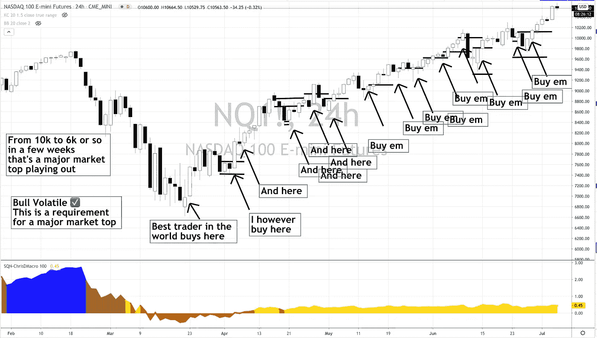
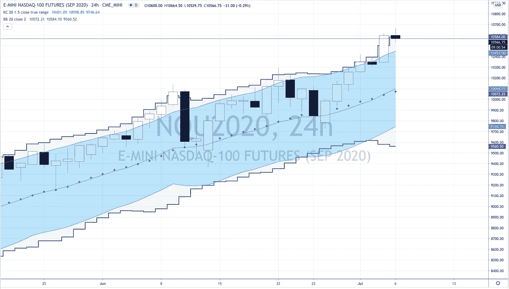
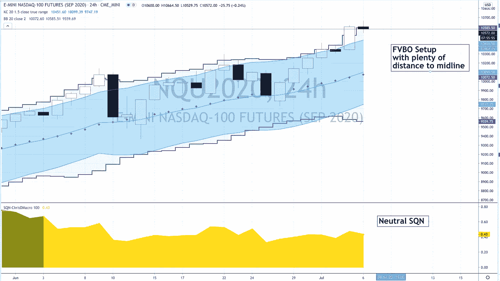

# 如何靠运气进入成功的交易

> 原文：<https://medium.datadriveninvestor.com/how-to-luck-your-way-into-successful-trades-8594ccd85d38?source=collection_archive---------7----------------------->

如果你不是授粉交易实验室的一员，你就错过了！我们现在有一大群交易者在那里分享回溯测试、设置、知识、代码(对于那些对使用人工智能和算法感兴趣的人来说)，我们甚至有一个共享的 Google Drive，为会员提供我们所有的资源。

这不是一个信号服务，不要加入，如果你想有人告诉你以 X 价格购买$F 股票或做空$FB 或什么的。

相反，如果你想接触一群真正的交易者，他们正在谈论他们看到的各种设置，以及他们当天在市场上看着做什么，这是应该去的地方。我们有对冲基金的交易员、自营交易员、家族办公室交易员和已经交易多年(几十年)的专业交易员。

如果你发现交易是孤立的，有问题，但不知道该问谁，怎么问，或者只是想找个地方和其他志同道合的交易者交流想法，现在就加入我们吧！！

好了，接下来谈正事…

让我们继续讨论纳斯达克$NQ 或$QQQ 交易。正如我们一直在谈论的，我已经写了很长时间了，自从我 4 月 5 日第一次写博客以来，我一直在添加。

回到 4 月 5 日，当我第一次进场时，我绝对没有想到我已经 13 次加仓了(13 次！！！)初始进入后。

 [## 开始投资股票的 12 条简单规则|数据驱动型投资者

### 如何投资而不亏本呢？问题是从未投资的人害怕投资。它可能…

www.datadriveninvestor.com](https://www.datadriveninvestor.com/2019/10/17/12-simple-rules-to-start-investing-in-stocks/) 

我不是那个美国消费者新闻与商业频道在 4 月 5 日采访时说“是的，我们今天在纳斯达克大踏步前进，随着废话连篇的发生，我们知道这是一个我们一生中可能再也不会看到的重大机会，所以我们在这里大举买入。”

看起来会很酷，我会“穿上”8k 美元的套房，甚至理发，去他妈的隔离！

但现实是在 4 月 5 日，当我做多美元 NQ 期货时，这只是一个简单的交易。

世界上有史以来最畅销的设置正在失败，风险/回报倾向于小幅上涨。在这一点上，每个人都在期待我买入的这个小小的上涨是熊市反弹，或者是大熊市中的牛市。这正是你想要帮助推动一轮真正强劲的上涨。

再说一次，当时我只是简单地进入一个行业，而不是试图赢得互联网！

因此，我并不因为抓住了底部或买入了低点而居功。

事实上，事后来看，双底突破失败是我应该买入的地方，但是只有世界上最好的交易者才能做这样的交易！

我等待市场给我一个真正的买入理由，从绝对最大的底部买入留下了大约 700 NQ 点。我之所以等待，是因为交易熊市波动(至少在股票上)不是我交易计划的一部分，它们是最糟糕的！

然后，我们回到了中立政权。所以现在我至少有了一点线索。

在这一点上，每个人都认为这只是一次反弹，一次熊市反弹，下一轮下跌即将到来，就像 2008 年一样，就像 2001 年一样，就像就像就像一样。

就好像突然之间，所有人都变得超级聪明，市场会按照所有人的预期去做……你可以猜到通常会是怎样的结果。

因此，现在我们有一个中性的市场机制，我们有价格上涨，和世界上最好看的销售设置，每个市场参与者都在关注和建立。

任何害怕 1929 年崩盘的人都在利用这个机会逃离他们的多头。

如果你跟踪我，你知道我喜欢交易失败的交易。也就是说，如果其他交易者错了，我的交易就在他们最有可能止损的地方。

我交易的一个主题是把我的交易放在别人呕吐的地方。这给了交易一些有趣的优势，就像你在别人离场时进场，这意味着当交易变得更明显时，他们最终会回来给我带来更积极的(交易方向)价格变动。

在这种情况下，每个人都在做空，而我在买入。当他们的空头开始失败时，他们不得不买入回补，推高了价格。这种情况一直持续到现在，空头在每次漂亮的卖出时都变得更有勇气……这种情况无法弥补他们的空头，从而使价格更高。

然后，我们有一群担心错过上涨机会的交易者，他们追逐更高的价格，从而把价格推得更高。

你会注意到，在整个上升过程中，有一些出色的空头设置。所以这些交易者追逐做多，买入，然后卖出，价格开始下跌。

这就是奇迹发生的地方，追逐者停止了追逐，因为他们仍然害怕世界末日的到来，他们害怕他们买了绝对的市场顶部。最重要的是，永久空头再次涌入，市场回报他们一些负面的头条新闻和一点抛售。几天后，我们又一次达到新高。

从那以后，这种模式一遍又一遍地重复着，对许多人来说是痛苦的。

再说一次，这不是成为市场天才，在底部抓住市场，恰恰相反。我使用了一个非常简单的技术，知道市场有动力走高，中央银行，政府，银行，每个婴儿潮一代 401k 都阴谋确保这种情况发生，喝那些整天刷新零对冲的永久熊的血和泪。

这就把我们带到了今天。

许多人错过了这次上涨，正在寻找进场交易的方法。所以我们来看看。

你可以看到一个不错的上升趋势

或者你可以看到一个 FVBO 在一个中性的市场制度

如果你很幸运(像我一样)，你看到这一点，它不会影响你，你只是坐了很久，意识到这里形成的潜在卖出格局不会那么痛苦(很可能)，所以只要熬过来就好了。

如果你是好的，那么你会看到一个 FVBO 设置，可能在今天的交易之后，并有机会在一个非常高的胜率设置中收获 1.2R。

你可以看到为什么这是一个照我说的做而不是照我做的场景(我很久以前就说过了)FVBO 设置确实存在，并且在中立的 SQN 市场体制中是一个相当高的胜率设置。

## 这是我们正在[授粉交易实验室研究的东西，](https://www.pollinatetrading.com/offers/Pi5sdoDs)加入我们吧！

**访问专家视图—** [**订阅 DDI 英特尔**](https://datadriveninvestor.com/ddi-intel)