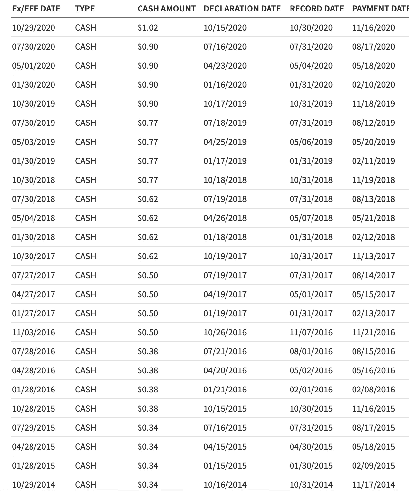
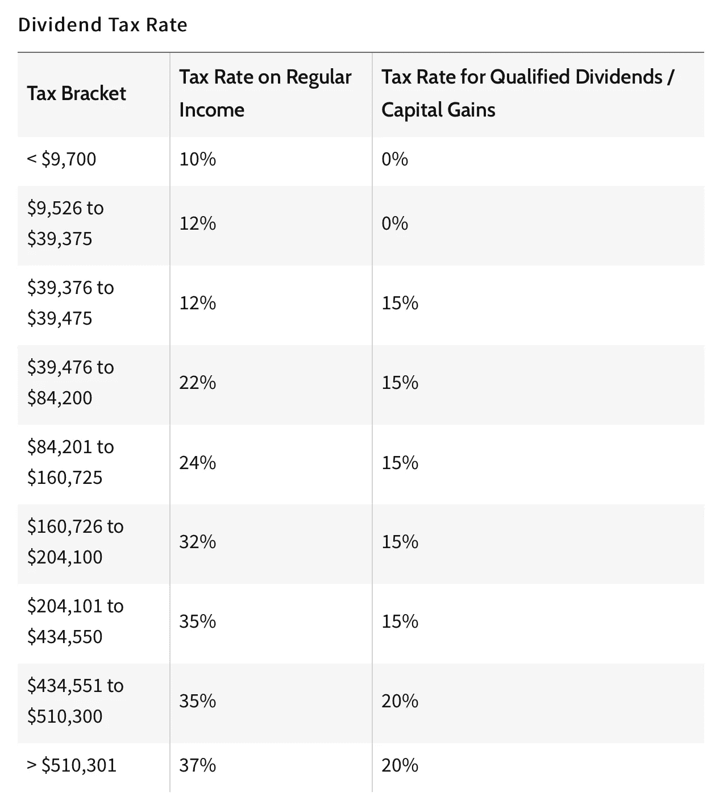
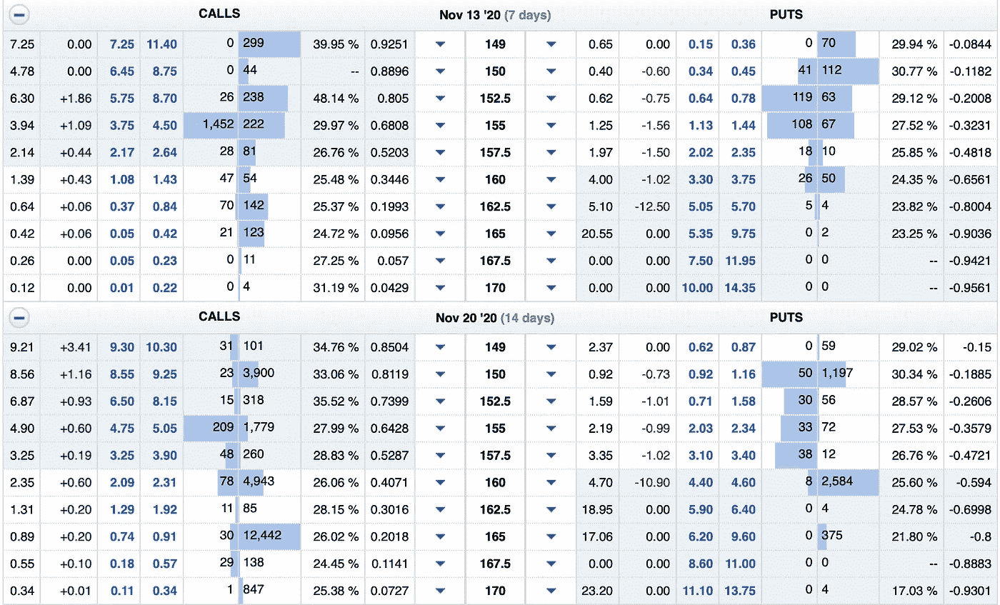

# 如何从股票市场每月赚 1000 美元

> 原文：<https://medium.datadriveninvestor.com/how-to-make-1-000-every-month-from-the-stock-market-11f10a9d33ef?source=collection_archive---------0----------------------->

## 把股票市场变成你赚钱的副业

股票市场对每个投资者都有好处。无论你想要高增长、高杠杆、稳定的收入，还是介于两者之间，股市都能满足你。

如果你投入足够的资金，并且知道如何配置你的现金，那么每个月从股票市场持续赚取 1000 美元是可能的。

一些人从股市中获得足够的现金流，可以在年轻时退休，尽管这需要几年甚至几十年才能达到那个水平。

如果你从零开始，每月从股市赚 1000 美元并不容易，但这比用这种策略获得全职收入要容易得多。

对于追求 1000 美元/月的目标，我的建议是从税前目标开始。当你从股票市场额外赚了 1000 美元时，它会被征税，但你可以将额外的钱用于你的收益。

我们将讨论税收问题，因为我们将介绍你每月从股市中额外赚取 1000 美元的不同策略。

# 股息投资

在所有的选择中，股息投资是最容易的。许多公司向股东支付股息，因为他们不知道如何处理多余的钱。

这些股息也可以随着时间的推移而增长，因为你将股息再投资于额外的股票，以及公司决定每年提高股息。

例如，看看过去几年德州仪器(Texas Instrument)的股息情况。

如果你在 2014 年购买了德州仪器的股票，当时他们提供了每股 0.34 美元的季度股息，即使你没有将股息再投资到公司，你也可以将股息支付增加两倍(目前是每股 1.02 美元)。

在此期间，德州仪器的股价上涨了两倍多。股息投资是一种等待游戏，如果你坚持下去，它会带来巨大的回报。

按每股 4.08 美元的年化股息计算，你需要 2，942 股股票才能开始每月从这只股票赚 1，000 美元。其他收益率较高的股息股票更容易从股市获得每月 1000 美元，但不要陷入高收益率陷阱。

德州仪器令人印象深刻的部分原因是其股价已经翻了三倍。美国电话电报公司有令人难以置信的 7.5%的股息率，但你不会从股价中获得巨大回报。

美国电话电报公司股票吸引收入投资者。这些投资者更关注股息支付，不太关心股价是否持平。

股息增长投资者寻找像德州仪器(Texas Instruments)这样的股票，这些股票有更多的增长催化剂和每年至少提高股息 10-15%的空间，而不是美国电话电报公司每年增加 1-2%的股息，这种增加更多的是象征性的(如果股票不提高股息，投资者会对股息股票的未来感到紧张。这通常表明该公司正在以某种方式挣扎)。

根据你所处的税收等级，你将不得不为你的股息支付一些税。这些税率([来自 Investopedia](https://www.investopedia.com/ask/answers/090415/dividend-income-taxable.asp) )适用于合格股息，适用于除房地产投资信托基金之外的大多数股息股票。从房地产投资信托基金获得的股息按短期资本利得税率征税。

大多数股息投资者将被征收 15%的税率。如果你想在纳税后每月从股票市场赚 1000 美元，你必须每月从分红股票中赚 1176.47 美元。

如果你每个月已经从分红股票中赚了 1000 美元，那么通过再投资和提高股息，你可能在 1-2 年内达到每月 1176.47 美元。

# 销售选项

期权交易是增加收入和补充现有红利投资策略的好方法。

如果你卖出备兑看涨期权和现金担保看跌期权，你就大大降低了风险。买入期权和卖出无担保看涨期权是风险最大的两种策略，我们不会在本文中讨论。

当你卖出备兑买入期权时，你就拥有了 100 股股票。在备兑买入期权中，你给予其他人以设定的执行价格购买你的 100 股股票的权利，而不是义务。

这是德州仪器目前的期权链。在撰写本文时，德州仪器的定价为 157.74 美元。

看涨期权在左边，看跌期权在右边。您可以看到呼叫端有两列显示蓝色号码。

11 月 13 日，看 162.5 执行价。你可以卖出一个备兑买入期权，并马上赚到大约 60 美元(在中点卖出一个备兑买入期权。要找到中点，将 37 和 84 相加。然后除以 2。保真度告诉你中点是什么，这样你就不用去计算了。从技术上讲，它的平均值为 60.5，但在这种情况下，您必须向下取整)。

如果德州仪器超过 162.50 美元/股，你就被迫以 162.50 美元/股的价格卖出你的股票。否则，期权失效，你可以保留这 60 美元。

你可以每周都这样做。

你可以通过以 170 美元的执行价卖出备兑看涨期权来显著降低风险，但你获得的溢价会减少。对一些人来说，降低风险是值得的。同样，你可以以 170 美元的执行价卖出将于 11 月 20 日到期的备兑买入期权，以获得更高的溢价。

波动性越大的股票溢价越高。对于像德州仪器这样的股票，保守估计你可以赚 50 美元/月。100 股股票每年 600 美元，超过了股息每年 408 美元。把这两者加起来，我们从 100 股 TXN 股票中得到 1008 美元/年。

你也可以卖出到期日很远的期权，以获得更高的溢价。我最近卖出了一份现金担保的 Roku 看跌期权，执行价为 210，将于 2022 年 1 月 21 日到期。我投入 21000 美元作为现金担保看跌期权的一部分，溢价 4229.21 美元，涨幅为 20.14%。这是股市平均回报率的两倍多。

15 个月的 4，229.21 美元(我在 2020 年 11 月卖出了这份看跌期权)加起来大约是 281.95 美元/月，这比我从 21，000 美元的投资中获得的每月股息还要多。

我预计 Roku 的股票将继续上涨，这份合同最终将毫无价值地到期，我将保留 4，229.21 美元，而不必以每股 210 美元的价格购买 100 股 Roku 股票。

另一种情况是，Roku 的股票跌至 210 美元以下，并在 2022 年 1 月 21 日停留在该水平。在这种情况下，到时候我被迫以 210 美元/股的价格买入 100 股 Roku。

然而，我的成本基础不会是 210 美元/股。4，229.21 美元将会产生影响，使我的成本基础约为 167.71 美元/股，低于我目前的股票成本基础。这意味着我对两种结果都很满意。

与股息不同，出售期权将根据你持有期权合同的时间长短，按照你的短期和长期资本利得税率征税。 [Investopedia 拥有丰富的资源](https://www.investopedia.com/articles/personal-finance/101515/comparing-longterm-vs-shortterm-capital-gain-tax-rates.asp),可以向你展示你将支付多少短期和长期资本利得税。

我卖出的 2022 Roku 看跌期权的一大好处是，当合约到期时，它将被视为一项长期资本收益。如果我希望长期资本收益在 2021 年而不是 2022 年出现，我甚至可以在 2021 年 12 月购买看跌期权平仓。如果我 2021 年的回报是红色的，或者如果新的税法可能在 2022 年实施，我可能只会购买看跌期权来平仓。

购买看跌期权提前平仓会让你把钱留在桌面上。我得到了额外的 4，229.21 美元来投资股票，但是如果我现在买入一个看跌期权来平仓，我将花费大约 4，100 美元来平仓。随着我们越来越接近到期日，该看跌期权的价值最终将会缩水，除非 Roku 的股价出现暴跌。

即使由于当前的经济前景，该股面临下行压力，看跌期权合同将于 2022 年到期，这将使该股在经济低迷时有足够的时间恢复。

我提 Roku 和德州仪器分享不同的期权交易策略。你可以采取一个长期的方法，有一个很远的到期日，或者每周/每两周交易一次备兑买入期权和/或现金担保卖出期权。这种获得收入的途径比股息投资更快，但你必须额外关注股价。如果你不想在备兑看涨期权的情况下卖出你的股票，你可以买入相同的看涨期权来平仓，但你最终可能会亏损，这取决于股价上涨了多少。

股息投资和期权是我在股市中最喜欢的两种赚钱方式。你也可以低买高卖或者高做空低平仓来赚钱。

然而，把握市场时机极其困难，做空股票无疑是风险最高的投资方式(无限下跌)。

如果你想在股市赚钱的同时降低风险，这两个策略是可行的。

## 想学习如何投资股市赚钱？确保你订阅了我的 YouTube 频道