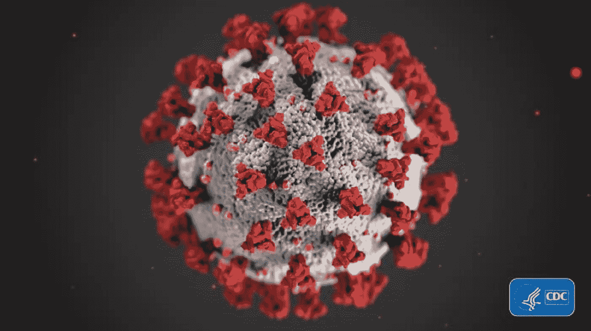
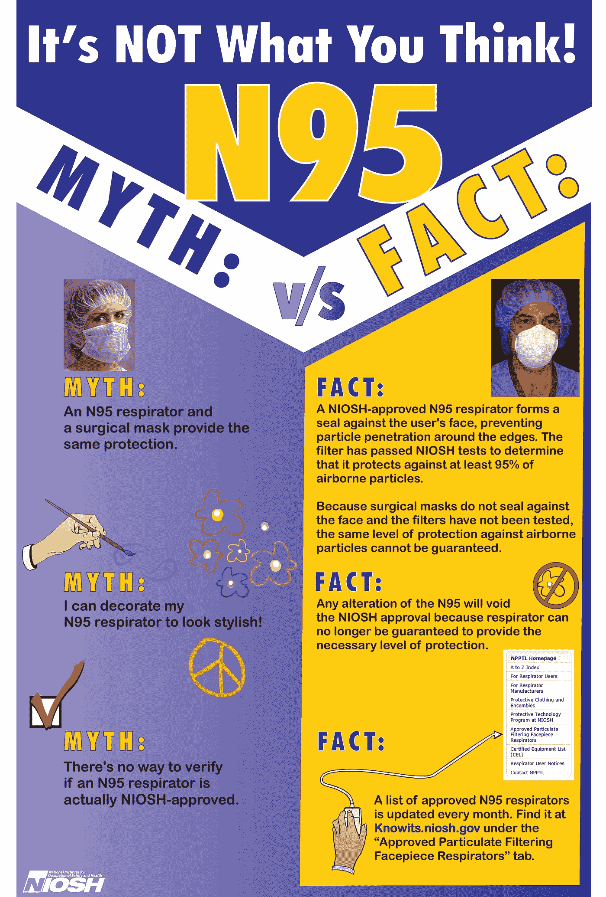

# 如何制定商业疫情计划

> 原文：<https://medium.datadriveninvestor.com/how-to-make-a-business-pandemic-plan-270f521ad7a0?source=collection_archive---------6----------------------->

Coronavirus: [Image](https://phil.cdc.gov/Details.aspx?pid=2871) by CDC/ Alissa Eckert, MS

## 新冠肺炎:冠状病毒 2019

## 你的公司准备好了吗？

如果你的企业突然裁员 40%到 70 %,该怎么办？此外，严重的物流中断和关键供应减少。然后，假设这些情况持续了几周甚至几个月。你的公司还能运营吗？

上述情景非常类似于对中度至重度传染病流行或疫情如何影响劳动力和受影响社区的预测。尽管新型冠状病毒疾病 2019(或[新冠肺炎](https://www.cdc.gov/coronavirus/2019-ncov/about/share-facts-stop-fear.html))还没有戏剧性地渗透到美国，[公共卫生官员](https://www.washingtonpost.com/us-policy/2020/02/25/cdc-coronavirus-inevitable/)告诉我们，它的传播是“不可避免的”

## 大多数企业对持续的危机毫无准备

如果你的企业与大多数美国雇主相似，它很可能对这种灾难，尤其是持续的危机，毫无准备。这并不奇怪。据统计，美国企业还没有准备好应对更常见的中断，如火灾、恶劣天气和长时间的 IT 故障。

Travelers Insurance 在 2012 年进行的一项研究[发现，令人震惊的是，48%的受访企业主缺乏正式的连续性规划，这对于防止威胁以及确保灾难恢复前和灾难恢复期间的持续运营至关重要。](https://www.travelers.com/resources/business-continuity/why-is-business-continuity-important)

然而，卫生当局表示，我们必须保持警惕，做好准备。随着新冠肺炎病毒在全球的持续传播，雇主必须考虑这些和其他组织影响，并制定计划，以在严重的疫情病毒或区域性流行病的情况下继续基本运营。

 [## 大笔资金和尖端技术:人工智能/人工智能投资将如何革新医疗保健…

### 在过去几年人工智能(AI)和机器学习(ML)的显著发展中…

www.datadriveninvestor.com](https://www.datadriveninvestor.com/2018/03/22/big-money-and-cutting-edge-technology-how-investment-in-ai-ml-will-revolutionize-the-healthcare-industry/) 

准备，绝对不是危言耸听。雇主在社区中发挥着重要的领导作用，帮助劳动力做好准备，保护员工免受其他类型的灾难。疫情也不例外。但是根据你的组织结构的复杂性，计划可能不是一项简单的任务，这意味着时间是至关重要的。

延迟可能会对你的企业寿命产生毁灭性的影响，并对员工、当地社区和你的客户产生负面影响。

准备是一种良好的商业实践。

## **疫情、流行病的影响&大流行**

为了理解潜在的商业影响，雇主应该熟悉与传染病传播相关的常见定义。[疾病控制中心](https://www.cdc.gov/csels/dsepd/ss1978/lesson1/section11.html) (CDC)将流行病定义为“该地区人口中疾病病例数量的增加，通常是突然的。”疫情具有可比性，但在地理上更为有限。

大流行类似于流行病，但已经蔓延到几个国家或几个大陆，通常会感染大量的人。大流行往往比季节性流感事件持续更长时间。这种持续时间使得疫情与其他灾难有很大的不同。

> **OSHA** [**州**](https://www.osha.gov/Publications/influenza_pandemic.html) **“一个疫情也会是一个扩展事件，在同一个地理区域有多波疫情；每次爆发可能持续 6 到 8 周。一波又一波的疫情可能会在一年或更长时间内爆发。”**

尽管传播范围较小，但您所在地区的流行病和疫情仍可能导致严重的人员和供应短缺，以及运输延误。中国武汉是新冠肺炎的发源地，它证明了一场严重的疫情会如何瘫痪一个大都市地区、医疗系统及其业务。

## 你的企业需要什么书面计划？

通过咨询，我每年接触到 100 多家不同的私营企业。通常，我会遇到这样的客户，他们没有足够的书面应急程序，缺少重要的元素，或者未经测试，员工意识不足，或者策略不正确。

即使可行的书面应急计划确实存在，许多雇主认为，如果灾难发生，一个应急行动计划(EAP)就足够了。但是，紧急援助计划只涵盖紧急周期的各个方面。

在应急管理中，有五个阶段的策略可以帮助组织经历灾难并从灾难中恢复。这些阶段是准备、预防、响应、恢复和缓解。疫情或流行病可能需要您所在社区的持续响应，这可能会在应急管理周期的所有五个阶段影响您的业务。

根据职业安全与健康管理局(OSHA)制定的法规，大多数企业都要求 [EAP](https://www.osha.gov/SLTC/etools/evacuation/eap.html) 专注于在期间和紧急情况发生后立即做出响应*，包括维护工人安全的方法，以及关键设备关闭、疏散和庇护行动。这确实是保护你的员工的一个重要部分。*

如果您不受 OSHA EAP 法规的约束，我们仍然建议您制定紧急行动计划，以帮助您的公司在活动的各个阶段做出响应。如果公共急救人员在社区接到大量与新冠肺炎相关的电话，而您的公司发生火灾或化学品泄漏，该怎么办？你的员工会如何回应？您的员工是否接受过应对工作中医疗紧急情况的培训？EAP 和随后的培训可以帮助你的公司在突发事件中运作良好。

然而，EAP 没有详细说明如果停止或中止运营，如何重新建立运营。也没有描述如何从远程位置继续基本的业务系统。它没有列出在灾难或持续危机后维持或恢复业务所需的供应商、供应链、物流或关键人员。

灾难应对的每一个阶段都可能需要解决。

这就是为什么每个公司(无论大小)都需要一个业务连续性计划(BCP)，该计划可以解决其中的每一个方面，特别是恢复和缓解。将它与配套文件《紧急行动计划》一起应用，你就能在灾难响应、缓解和恢复的所有阶段都处于最佳状态。

## **将疫情程序纳入您的 BCP**

2009 年，我写了一系列关于 H1N1 流感的文章，这是那年春天出现的一种新病毒。这些文章以及随后对流行病学家的采访增强了我的意识。

作为一名安全和健康管理顾问，很容易想象严重的疫情对我经常去的工作场所造成的破坏。大多数人对这样的事件准备不足。这不足为奇，因为大流行确实会发生，但历史上一个世纪只有几次。我们没有准备好，因为我们不熟悉这个过程。

在为出版商撰写这些文章的同时，我还在帮助我的几个企业客户创建或扩充业务连续性计划(bcp)。两年前经济衰退才开始。幸存下来的公司尤其热衷于连续性程序，以防止或尽量减少进一步的经济损失。

当我建议将传染病应对程序纳入这些 bcp 时，最初的反应往往是惊讶。“我们真的需要那个吗？”在我解释了疫情可能造成的影响后，每个利益相关者都同意了。传染病预防是值得的。我为我所有的客户实施了这些程序，我们还培训了他们的员工。

几年后，这些客户中的一些人应用这些程序来最大限度地减少季节性流感爆发期间的传播，并应对与流感相关的高缺勤率。从专业角度来说，我可以告诉你，这些程序确实有助于企业运作，同时保护员工和社区。

工作场所传染病准备涉及解决或实施几个方面，包括物理控制、疫苗接种、政策制定和程序、沟通、财务、员工教育和培训。

## 物理控制和修改环境

*   评估并尽量减少员工对公众的暴露。例如，销售、会计、工程、IT 或客户服务是否可以远程执行，而不是亲自执行？
*   大楼的哪些区域允许公众进入？可以改变这些来阻止访问吗？
*   张贴标牌，防止无关人员参观公司。
*   提供防止传染病传播的物资。积累感染控制用品，如洗手液、漂白剂、肥皂、纸巾、手套、免接触垃圾桶、口罩和清洁用品。
*   改善工作环境，为工人和客户提供额外保护。物理屏障(如透明塑料喷嚏防护装置)或免下车服务窗口可能适用。在您的 HVAC 系统中使用高效空气过滤器或增加通风率。
*   在整个设施中放置洗手液站。
*   向必须与公众密切接触(6 英尺以内)或可能接触生病员工(如为同事提供急救)的员工提供 NIOSH 批准的 N-95 口罩，尤其是当社区中存在大量传染病时。(注:N-95 呼吸器目前供应不足，必须首先提供给医疗服务提供者。来自[疾病预防控制中心](https://www.cdc.gov/coronavirus/2019-ncov/hcp/guidance-prevent-spread.html?fbclid=IwAR2CA7I9Rz2cSLKNb3IesowIy7Kge1MXNxGLqNXY3rE4FuAV-xIXUfjDOLs)的信息可能有助于理解这些问题。)但当然，如果可能的话，允许带口罩或医用口罩的工人在工作时佩戴口罩。一些员工可能免疫受损，需要额外的保护。

[Photo Credit: CDC/NIOSH](https://www.cdc.gov/niosh/npptl/pdfs/infographic-n-95-508.pdf)

*   检查可能要求客户将信用卡或现金交给员工的业务交易。这可以消除或减少吗，比如通过现金 app 或在线支付？
*   限制社交。一旦传染病在社区传播，就不是为你的员工举行退休聚会或公司野餐的时候。暂时搁置，直到传染病过去。
*   增加高接触区域的消毒，如台面、门把手、电脑、刷卡机、员工休息室、洗手间等。

## 医疗产品

目前，针对新冠肺炎的疫苗试验正处于早期阶段，然而，在向公众提供之前，这可能是一个漫长的过程。专家预测可能会有一个典型的流感季节和一个新冠肺炎季节。因此，员工完全有可能同时接触到两种传染病。

雇主可能无法接种新冠肺炎疫苗，但他们可能有助于抵消季节性流感及其并发症。向员工提供季节性流感疫苗，并解释其好处。

向医学专家咨询提供给工人的肺炎疫苗。这些可能对预防与新冠肺炎和季节性流感相关的呼吸道感染并发症有一些好处。

## 政策和程序

*   制定休假政策，不惩罚有流感症状的员工。该政策还应涵盖那些需要请假照顾生病的家人或在学校关闭时照顾孩子的工人的休假时间。
*   一些人群特别容易出现新冠肺炎的严重并发症，包括老年人(60 岁以上)和免疫受损者，如正在接受化疗(或刚刚完成治疗)的工人和患有克罗恩病等慢性疾病的人。让这些员工也能享受必要的休假，而不会受到惩罚，并让你的政策反映出这一点。
*   要求生病的工人定期通知公司他们的状况和返回工作岗位的能力。但是，请检查这些通知的发出方式。如果 40%的员工请病假，员工会打来大量的电话。考虑接受电子邮件通知，或者为生病的员工开通专门的语音信箱。
*   确定企业维持基本运营所需的核心功能。检查您企业的财务、生产、办公、IT、营销、运营和法律领域，并列出在疾病爆发导致停产的情况下为继续或恢复运营而必须履行的各项职责。
*   制定一项计划，对可能留下来从事基本职能的员工进行分流。
*   应用远程办公政策，让尽可能多的员工在家工作。
*   交叉培训维持基本操作的员工，以确保关键员工生病时的连续性。OSHA 建议培训三名或三名以上的员工来完成重要任务。
*   为员工制定和维护关于公司程序、供应商和客户信息以及紧急号码的书面说明。
*   与供应商合作，确保在常规供应商不能满足需求时，供应链有备用供应。
*   不鼓励共享电脑、工作台面、办公桌和电话。

> 解决与最坏情况缺勤相关的问题。你是否会选择暂时关闭公司？例如，如果 40%到 60%的员工受到感染或正在休假，您是否能够暂时停止运营，远程或用最少的员工运行基本的业务功能？
> 
> 允许所有(或大多数)员工短期呆在家里可能会减少工作时的疾病传播。当季节性流感在社区传播时，学校通常会这样做。应用这种策略可能对您的组织也有好处。确定并写一份“最坏情况”旷工协议。

## 教育和培训

*   就当前在人群中传播的传染病对工人进行教育。通过提供关于疾病的事实和防止传染给员工的方法来消除恐惧和不正确的信息。
*   教导工人手部卫生(洗手),并要求工人经常洗手。这是阻止传染病传播的最有效的方法之一。研究表明，如果手部卫生做得好，呼吸系统疾病可以减少至少 16%。
*   张贴要求员工在洗手间和水槽附近洗手的标志。
*   对员工进行感染控制方法的培训，如血源性病原体、通用预防措施和咳嗽礼仪(在臂弯处咳嗽)。
*   向员工解释社交距离(与他人保持 6 英尺的距离)，因为这也有助于最大限度地减少传染病的传播。
*   鼓励员工通过合理饮食、充分休息和减少压力来保持健康。
*   与员工讨论流感或新冠肺炎的症状，如充血、发烧、头痛、喉咙痛、肌肉疼痛、腹泻或胃部不适。帮助员工认识到这些问题，并要求他们在出现症状时停止工作。
*   考虑一项要求医生证明才能让新冠肺炎康复员工重返工作岗位的政策。

## 财务考虑

*   充分利用资金，允许健康员工加班、顶替生病员工、特殊供应品，以及支付由于正常商业中断而导致的必需商品的更高成本。由于新冠肺炎病毒，旧金山市领导宣布进入紧急状态，开始分配资金和资源应对病毒。向他们学习，准备好应急现金基金，用于应对和行动。
*   审查被批准发放日常运营和应急资金的人员。如有必要，添加其他个人。

## 通信

*   想办法提醒工人，如果公司关闭或他们必须返回工作岗位，并在灾难发生前向他们传达这一信息。考虑短信、使用特定的当地电视台或广播电台，或者公司社交媒体页面等。
*   确保所有员工都知道工作场所将如何通知他们关闭或分流员工/部门。

## **疫情的应对计划只是良好的商业意识**

虽然新冠肺炎是当前的焦点，但其他疾病的爆发、流行和大流行在历史上也经常发生。他们也会在我们的未来。

在过去的三百年中，疫情大约每个世纪发生三到四次，席卷全球，使医院不堪重负，导致基本商品或服务短缺和企业倒闭。历史上最致命的疫情发生在 1818-1819 年，当时美国死亡人数估计超过 50 万。那个世纪的其他大流行发生在 1957-1958 年(导致 70，000 名美国人死亡)和 1968-1969 年，当时有 30，000 名美国人死于一种新型流感。

除了新冠肺炎，新的疾病爆发的可能性总是存在的。企业主应该时刻为传染病的爆发做好准备。

流行病学家同意这一观点。这不是“如果”疫情发生的问题，而是“什么时候”的问题其他的会在未来发生。

今天就做好准备。