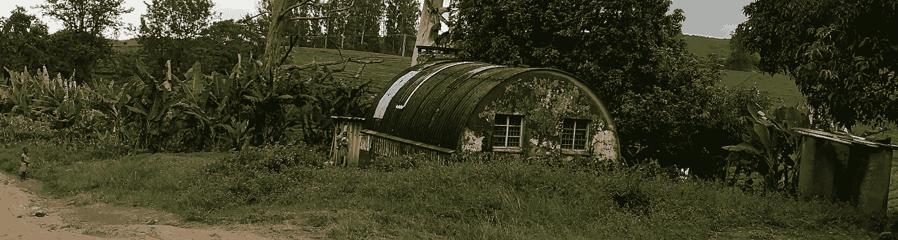

# 如何让买入并持有策略为你所用

> 原文：<https://medium.datadriveninvestor.com/how-to-make-a-buy-and-hold-strategy-work-for-you-e765b337cc84?source=collection_archive---------13----------------------->

## **记录一个目的句，首先说明你为什么投资**

Photo by [Rohan Pandavadra](https://unsplash.com/@rohan_pndvdr?utm_source=medium&utm_medium=referral) on [Unsplash](https://unsplash.com?utm_source=medium&utm_medium=referral)

**“记住，记住你为什么辞职”**这是我在一个寒冷的周六早晨洗车时记录的简单信息。经过 5 年的大学学习，我发现自己不得不洗车。体面的大学薪水无法阻止我**讨厌我的工作，所以我辞职了。**

接下来的几个月是人间地狱。我不得不与失业、工作被拒、那些视我为懦夫的人的批评作斗争。让我坚持下来的是那个简单的视频记录，提醒我当初为什么要退出。

我想鼓励你录制一段自拍视频，用简单的语言陈述你当初投资的原因。

如果你不能做到这一点，你需要花一些时间来考虑你投资的目的和动机。在投入更多资金进行投资之前，请完成本练习。

这个自拍视频将带你经历市场抛售、经济和政治剧变、你自己的错误、恐惧、贪婪等。

## **买入&持有说起来容易做起来难**

大多数人都会同意，保持身体健康的最好方法是健康饮食和定期锻炼。然而，大多数人发现这几乎是不可能的。这和长期投资是一样的。大多数人都知道**‘在市场中选择时机，胜过选择市场时机’**。历史数据显示，从 1999 年 1 月 1 日到 2018 年 12 月 31 日的 20 年里，错过 [10 个最好的日子](https://www.fool.com/investing/2019/04/11/what-happens-when-you-miss-the-best-days-in-the-st.aspx)，会让**你的回报减半。**

然而，对大多数人来说，这仍然是一场向上的斗争，他们最终交易资产，导致低卖高买。

## **你当初为什么要投资？**

任何人投资的明显原因是为了赚更多的钱。没有人应该为此感到羞耻。你在投资游戏中是为了赚更多的钱。这是衡量你进步的标准。你赚了多少钱或赔了多少钱才是最重要的。

然而，赚更多的钱是一个抽象的目的。不够具体。它不会支撑你度过市场抛售。通常它会让你做出鲁莽的决定。

> 一个更好的理由是关注你打算用这笔钱做什么。

这些可能包括:买房、退休、孩子的大学学费、经济独立、家庭度假、慈善等等。

下面我详细说明了我投资的三个主要原因。这对你来说无疑是不同的，没关系。最主要的是你心里清楚自己投资的理由。

## **财务独立**

> “睡觉的时候不找到赚钱的方法，就一直工作到死。”— [沃伦·巴菲特](https://quotefancy.com/quote/930999/Warren-Buffett-If-you-don-t-find-a-way-to-make-money-while-you-sleep-you-will-work-until#:~:text=Warren%20Buffett%20Quote%3A%20%E2%80%9CIf%20you,%E2%80%9D%20(17%20wallpapers)%20%2D%20Quotefancy)

生命如此短暂，不能让别人来决定我如何度过醒着的 50%的时间。我想摆脱用时间来换取金钱的做法。我想要财务自由，可以和家人一起环游世界，并沿途帮助他人。

## **远行**

> "世界是一本书，不旅行的人只读了一页."— [圣奥古斯丁](https://www.atlasandboots.com/travel-blog/inspirational-travel-quotes/#:~:text=%E2%80%9CAll%20travel%20has%20its%20advantages,may%20learn%20to%20enjoy%20it.%E2%80%9D)

在我的孩子成年离家之前。我想享受他们的陪伴，让他们为成年做好准备。我希望他们掌握的部分课程是对他人的同情。这就是旅行的用武之地，我想让他们观察和体验其他人的生活。我想带他们走出他们的舒适区。变化真的是生活的调味品。

## **助人为乐**

在最近对我的出生地津巴布韦的一次访问中，我看到了那里的贫困。我给人们的几美元几乎没有什么作用。我一直对自己说，我想开始一些项目，让人们受益，而不仅仅是一顿饭。

> 给一个人一条鱼，你可以喂他一天。教一个人钓鱼，你会喂他一辈子— [未知](https://quoteinvestigator.com/2015/08/28/fish/)

Image by Author — Rural Zimbabwe

事实是，我没有足够的财力来做出持久的改变。我希望我的投资之旅能改变这种状况。

## **结论**

我投资是为了实现财务自由，这样我就可以享受和家人一起环游世界的乐趣，并帮助那些不幸的人。

这是我的投资目标句，你的呢？