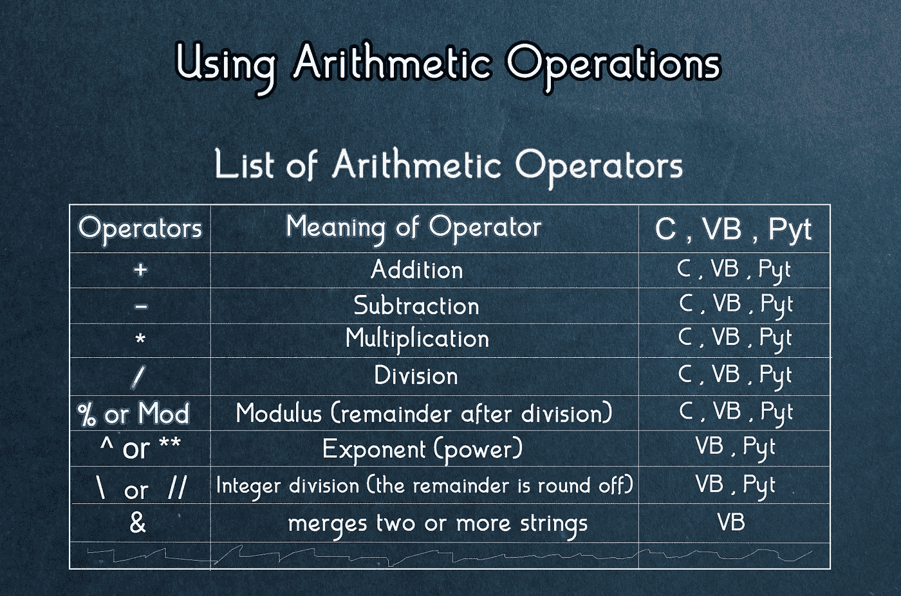
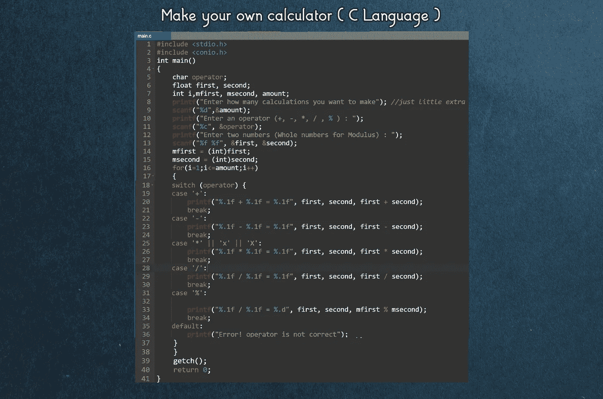
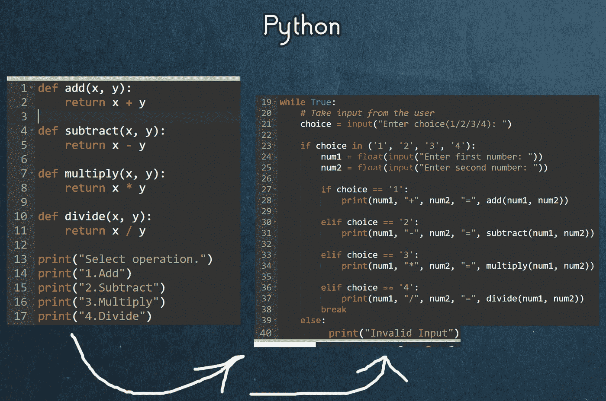
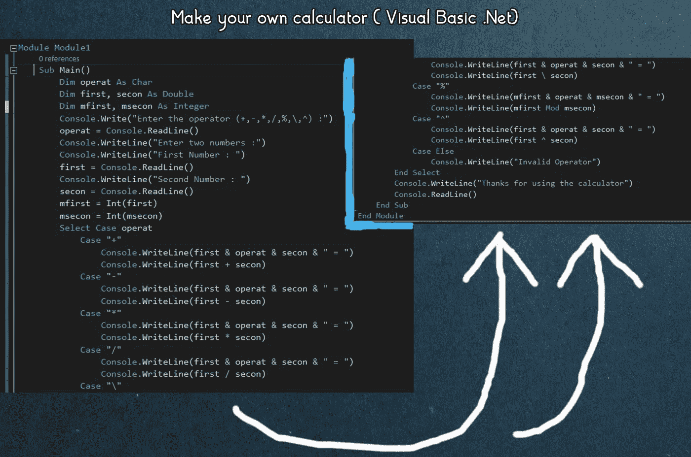

# 如何通过编程制作计算器？

> 原文：<https://medium.datadriveninvestor.com/how-to-make-a-calculator-by-programming-902b490a30c9?source=collection_archive---------1----------------------->

## 在 C 语言中，VB.Net 和 Python

## 学习任何初学者如何使用算术运算，并制作自己的计算器。

Photo by [KOBU Agency](https://unsplash.com/@kobuagency?utm_source=medium&utm_medium=referral) on [Unsplash](https://unsplash.com?utm_source=medium&utm_medium=referral)

编程可以以它自己的方式令人愉快。有些程序员试图让他们的程序变得复杂，而其他人则追求简单和高效。这完全取决于程序员的喜好；视觉上更吸引人的程序输出和更长的代码，或者不太吸引人的程序输出和更短的代码。

就我个人而言，我喜欢确保输出更具视觉吸引力。短程序更无聊，输出也很简单，大多数只是我们期望程序显示的结果。

在您学习如何使用算术运算以及如何用这三种语言制作自己的计算器之前，请查看我的与基础知识相关的文章。

 [## 转移编程技能:基础

### 了解任何初学者如何通过比较将其编程技能从一种编程语言转移到另一种编程语言。

medium.com](https://medium.com/swlh/transferring-programming-skills-basics-92c3d7e17c3b) 

如果你已经知道了基础知识，那么你应该继续阅读。

制作自己的计算器并不像听起来那么难。你必须明白如何使用算术运算，这就像你在数学中做的一样。另外，你必须明白如何使用“Switch-Case”语句，仅此而已。之前，您学习了如何接受用户输入和变量声明。所以你知道如何声明变量和从用户那里获取输入，现在你只需要使用算术运算和 switch-case 语句。

> *“我不是伟大的程序员；我只是一个习惯很棒的好程序员。”―肯特·贝克*

# 使用算术运算:

我们以同样的方式使用算术运算，就像在数学中使用一样。在不同的编程语言中使用它们没有太大的区别。唯一存在的区别是变量的声明和接受用户输入。

这里有几件小事要先搞清楚。

对于模数(除法后的余数是结果)，在 C 语言和 Python 中使用符号`%`,而在 Visual Basic 中使用符号。Net 使用模数，使用单词`Mod`代替`%`符号。让我举个例子来说明模数的作用。

13 `Mod` 3，13 `%` 3 产生 1。

对于指数(幂)，在 Visual Basic 中为。Net `^`我们使用符号，而在 Python `**`中我们使用符号来表示幂(指数)。在 C 语言中，您可以使用乘法符号或设置自己的函数来使用指数。您已经知道了 exponent 会产生什么结果，但是让我也举一个例子。

4 `^` 2，4 `**` 2 产生 16。

我们需要了解什么是整数除法。这是一个简单的除法，但不是十进制值，而是将结果四舍五入到有小数的数字。例如，如果我们对 5 除以 2 进行整数除法，在标准除法中结果应该是 2.5，但在整数除法中，结果是 2。对于整数除法，在 Visual Basic 中为。Net 中使用了符号`\`，Python 中使用了符号`//`。

 [## 战略或战术规划？软件工程师的未来之路|数据驱动的投资者

### outer hout(2018)在他的书《软件设计哲学》中提到了一些原则，以便更深入地挖掘…

www.datadriveninvestor.com](https://www.datadriveninvestor.com/2019/04/22/strategic-or-tactical-programming-the-road-ahead-for-software-engineers/) 

这些都是编程语言中的基本算术运算符。如果没有几个操作符，那么程序员可以用一堆不同的命令创建一个函数，产生算术运算。例如，指数在 C 语言中不是程序员能做的，创建一个函数，有两个不同的变量和一个循环。无论指数的数量是多少，循环可以运行多少次，并乘以相同的数字。

> *“四十岁的时候，我太老了，不能再自己做程序员了；写代码是年轻人的工作。”
> ――迈克尔·克莱顿*

# 制作自己的计算器:

在你制作自己的计算器之前，先了解“switch-case”(在 C 语言中)或“select-case”(在 Visual Basic 中)语句。如果您足够优秀，您还可以创建一个函数，其中的命令充当“select-case”语句。

## c 语言:

让我们把代码分解一下，这样你更容易理解和发展制作计算器所需的所有概念。没有我之前提到的那么难。你只需要理解如何使用不同的算术运算符，如何在变量中声明和存储，以及如何接受用户输入。在 C 语言中，你需要知道什么是格式说明符和关于它们的格式说明符的数据类型。

对于 C 语言来说，头文件(`Include`语句)是必须的。我们将期望从我声明的运算符 `main ().`输出的整数作为字符数据类型(它只能存储一个字符)，`first` & `second`作为浮点数据类型(十进制数)，以及`i`、`mfirst`、`msecond` & `amount`作为整数数据类型。我做了一些额外的工作，添加了 loop，但是对于一个简单的代码，你不需要在屏幕输出上添加额外的内容，比如 loop 和额外的消息。然后，代码打印出用户想要使用的操作符，并要求用户输入存储在操作符变量中的内容。之后，我们将它打印在屏幕上，输入两个数字，并接受用户输入的两个数字。之后，它会在屏幕上显示计算结果，如果用户输入了错误的运算符，屏幕上会出现“`Error! Operator is not correct.`”。

## ***对于 Python:***

在这里，我使用函数使它尽可能简单。但是为了更好的理解，让我们分解代码。首先，我们声明了函数，并添加了包含函数将返回的内容的语句。其次，代码在屏幕上打印 4 个操作的选择。您可以添加任意多的操作，请记住 visual basic calculator，因为我让程序变得更长，有了更多的选择。用户通过输入相应的数字选择一个操作，然后程序要求输入两个数字。之后，在后端，编译器检查所有情况下的条件，并将其与用户输入进行比较。如果选择是正确的，那么操作将完成，代码将返回其结果。

## ***为 Visual Basic。Net:***

正如 C 语言中的 switch-case 一样，我们在 Visual Basic 中也有 select-case。你们都可以看到这些代码是如何工作的。但是为了方便起见，我们将把它分成几个步骤。

我们把 visual basic 中所有的算术运算符都放在这段代码中。众所周知，声明变量是必须的，这样它才能存储值。我们将运算符作为字符，将数字作为双精度数(如果用户输入十进制数，这就是原因)。用户输入是清楚的，如果用户输入了错误的操作符，那么最后程序会输出无效的操作符。**记住，如果你愿意，你可以为结果使用一个单独的变量，并将结果值存储在那个特定的变量中。**

> 真理只能在一个地方找到:代码罗伯特·马丁

在本文中，我们学习了这三种语言中不同的算术运算符。此外，我们通过制作每种语言的计算器来学习如何使用它们。您可以通过在家练习并将代码分解成更小的部分来进一步明确您的概念，这样更容易开发出精彩的概念。

## 我策划的编程文章:

 [## 声明并调用 F()

### 通过对比了解任何初学者如何用这三种语言声明函数并调用它们。

levelup.gitconnected.com](https://levelup.gitconnected.com/declaring-calling-f-333592b8b8e4)  [## 转移编程技能:基础

### 了解任何初学者如何通过比较将其编程技能从一种编程语言转移到另一种编程语言。

medium.com](https://medium.com/swlh/transferring-programming-skills-basics-92c3d7e17c3b) 

**进入专家视角—** [**订阅 DDI 英特尔**](https://datadriveninvestor.com/ddi-intel)