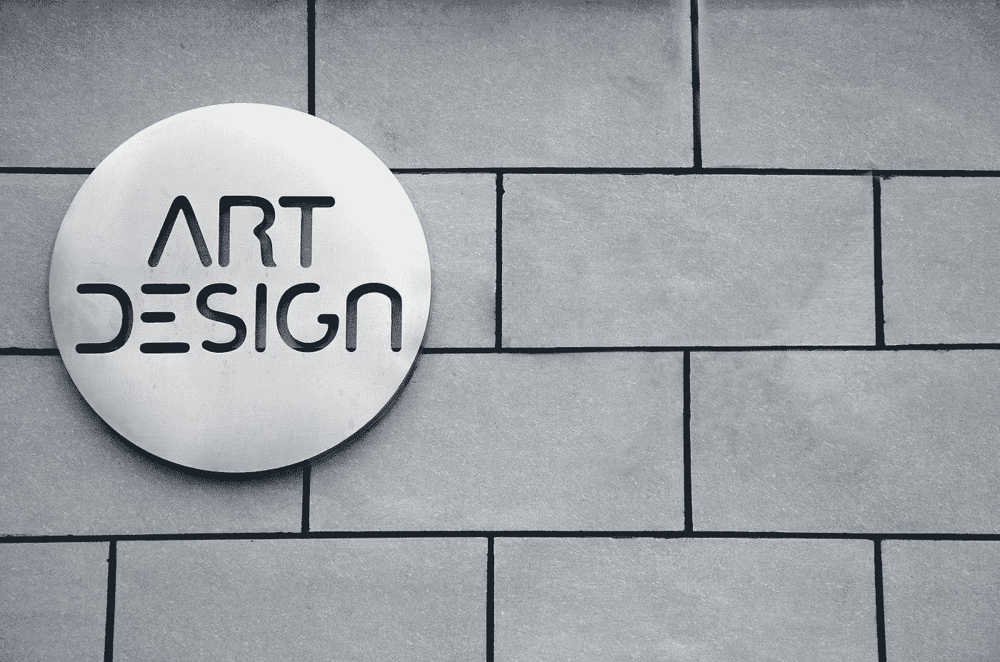
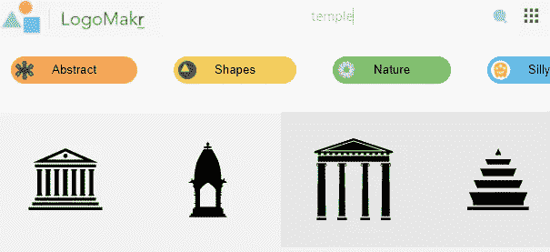
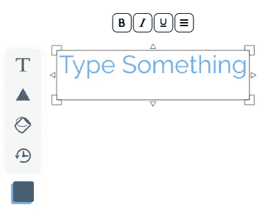
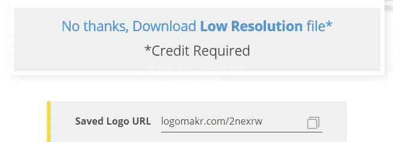

# 如何免费制作 Logo

> 原文：<https://medium.datadriveninvestor.com/how-to-make-a-logo-for-free-3e204689773b?source=collection_archive---------21----------------------->

制作一个标志是你品牌的一个重要方面。任何人看到你的第一眼都是它的标志。但有时标识很难得到，有时雇佣艺术家为你制作一个要花很多钱。今天我们将学习如何免费制作一个标志。

Photo by [Yizheng Duanmu](https://unsplash.com/@dmyzss?utm_source=medium&utm_medium=referral) on [Unsplash](https://unsplash.com?utm_source=medium&utm_medium=referral)

## 第一步

你需要做的第一件事就是去这个网站:[https://logomakr.com/](https://logomakr.com/)网站打开后，你可以按照他们的教程或者按视频上的 X 键，或者回到这里，这样我们就可以一起做了。关闭他们的教程视频后，浏览一下网站，这样你就可以熟悉了。

 [## 设计隐私|数据驱动的投资者

### 我们生活在一个由技术进步和数字创新主导的时代。关于数据，这些…

www.datadriveninvestor.com](https://www.datadriveninvestor.com/2020/05/18/on-privacy-by-design/) 

## 第二步

现在我们进入第二步。这个是我们开始做 logo 的时候。为了创建你的标志，你可以通过搜索栏寻找图标。你可以用一个特定的词来搜索你所在的行业类型，或者如果你还不知道该用什么来组成一个标志，你可以使用他们的分类。在你找到完美的标志后，你可以点击它，它会自动出现在你的项目中。您可以调整徽标的大小，并将其移动到您喜欢的任何位置。你可以把几个图标放在一起；没有限制。

## 第三步

另一个重要的部分是把你的品牌名称放在你的商标上。你可能不想这样做，因为这就是你对你的标志的设想，这没关系。要将您品牌的名称放入徽标中，您只需按左边的文本按钮，剩下的工作就是输入名称。你也可以调整它的大小，改变字体，颜色，这样你就可以把它变成你自己的了。

## 第四步

现在你差不多完成了，我建议给你的 logo 做最后的润色，如果你还没有选择颜色图案，把它展示给别人看，这样你就可以对它有不同的看法。在你即将完成所有的工作之后，剩下的就是让你下载了。

## 第五步

对于 logomakr 的免费选项，你只能下载你的 logo 的低分辨率版本，你必须感谢它的制作者。你得到一个 png 文件，这样它将有一个透明的背景。另一件要记住的事情是保存徽标 URL，这样如果将来您计划对它进行更改，您可以随时回到您离开的地方。

现在你已经有了你的徽标，你可以把它上传到你使用的任何平台上。有时这些方法用于临时标志，但谁知道你能第一次尝试就做出完美的标志，而且再也不用改了。

## 获得专家视图— [订阅 DDI 英特尔](https://datadriveninvestor.com/ddi-intel)