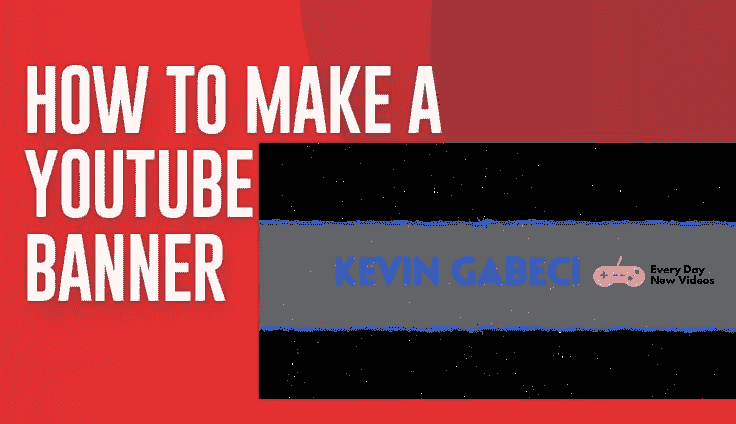
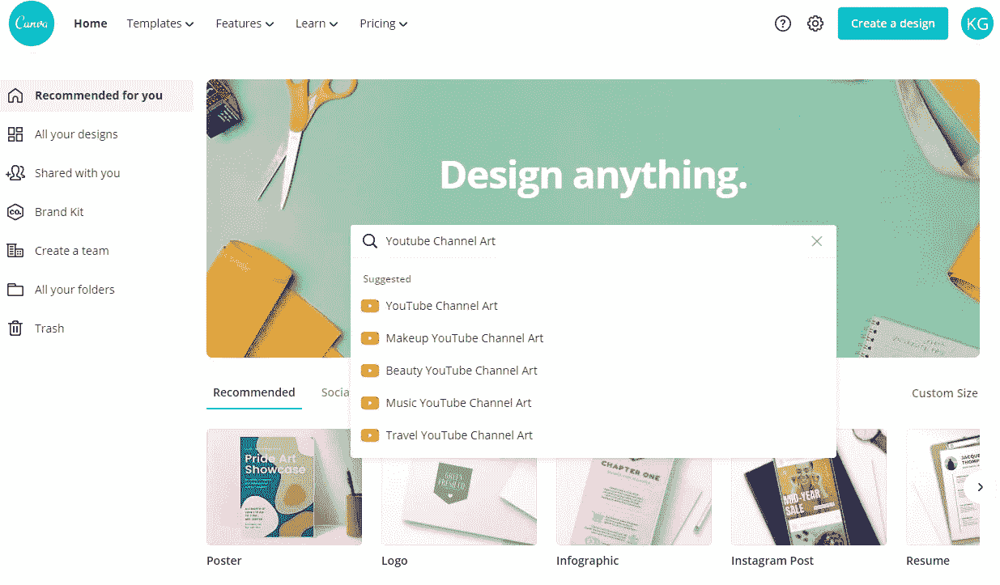
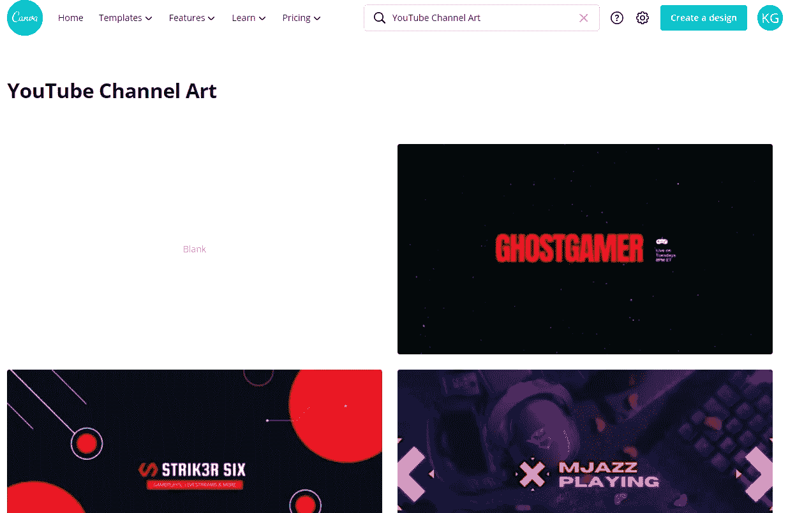
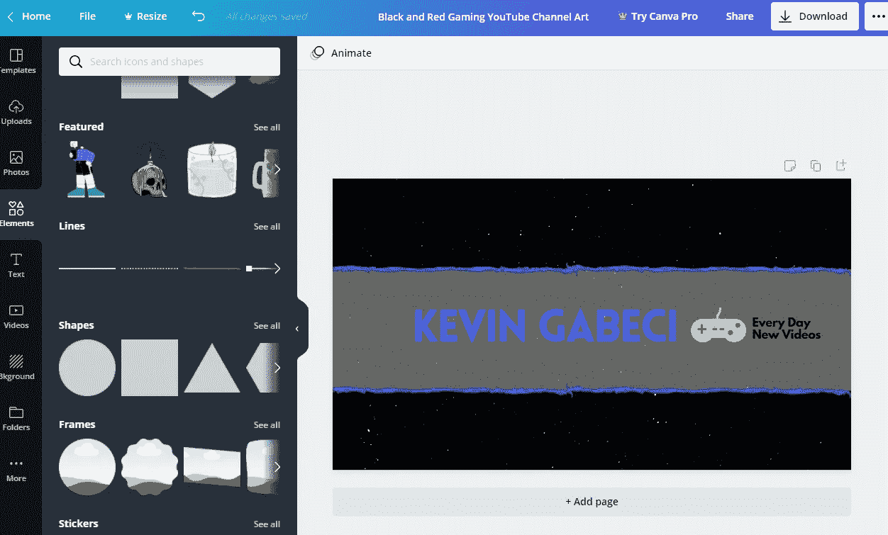
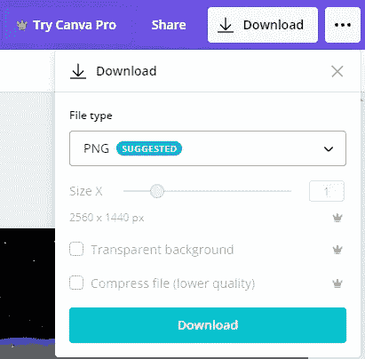

# 如何制作 YouTube 横幅

> 原文：<https://medium.datadriveninvestor.com/how-to-make-a-youtube-banner-db2a357125ed?source=collection_archive---------17----------------------->

如果你正在考虑开始一个新的 YouTube 频道，并想开始编辑频道的外观，横幅是最重要的部分。在这篇文章中，我将向你展示如何用一个免费的在线工具为你的 YouTube 频道创建一个横幅，我已经用了很多次了。

仅仅通过频道艺术，你就可以获得新的订户，因为这是他们访问你的频道时看到的第一样东西。是的，没错，你可能想都没想过，但是 YouTube 本身的研究表明，在他们的频道中有自定义横幅的人比没有的人获得了更多的订户。这就是为什么我强烈建议你创建一个以防万一。

# 什么是 YouTube 横幅？

YouTube 横幅也称为“**YouTube Channel Art”**或“**YouTube Header Image”**，是您在频道页面顶部看到的第一个大型横幅图像。它通常用于使频道在视觉上看起来更专业或频道品牌化。

# YouTube 横幅尺寸

关于 YouTube 频道艺术，你需要知道的第一件事是横幅尺寸，因为你知道人们正在使用所有重要的设备，例如，台式机、MacBook、智能手机、平板电脑和电视。因此，在创建 YouTube 横幅之前，有必要了解它的大小，并检查它在不同类型的设备上的外观。

**YouTube 横幅图像大小和文件指南:**

*   推荐的 YouTube 横幅尺寸:2560 x 1440 像素
*   上传的最小尺寸:2048 x 1152 像素
*   徽标和文本的安全区域:1546 x 423 像素
*   最小宽度:2560 x 423 像素
*   最大文件大小:6MB

# 用 Canva 开始设计

Canva 是一个免费的图形设计工具包，可以帮助你在几分钟内设计一个 YouTube 频道艺术。Canva 提供了数百个设计师制作的 YouTube 横幅模板，可以访问颜色、字体、高质量图像、插图和设计资产。

首先，您需要为 Canva 创建一个帐户并登录。一旦你在屏幕中间搜索部分完成了对 YouTube 频道艺术的搜索。

选择第一个建议，从那里你会发现一个模板列表。点击其中一个你喜欢的开始编辑它。

选择模板后，您将找到编辑横幅所需的所有工具。当你完成你喜欢的样式后，你需要下载它。只要你没有使用过高级元素，你就可以免费下载横幅。

下载部分很简单，你只需要按下页面右上角的大“下载”按钮，然后在选择文件类型后再次按下“下载”。

就这样，你为你的 YouTube 频道创建了一个新的横幅，最棒的是它是完全免费的。