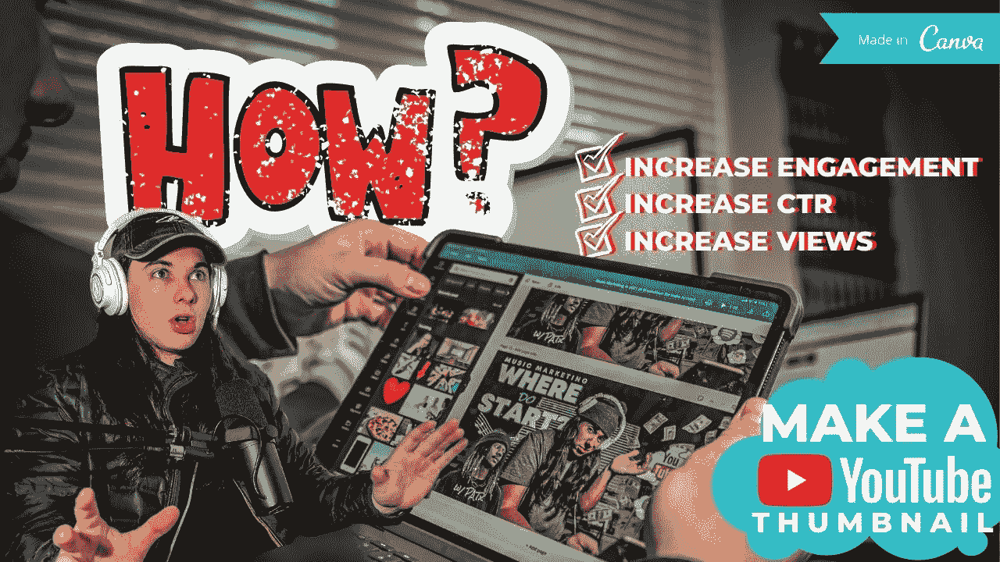
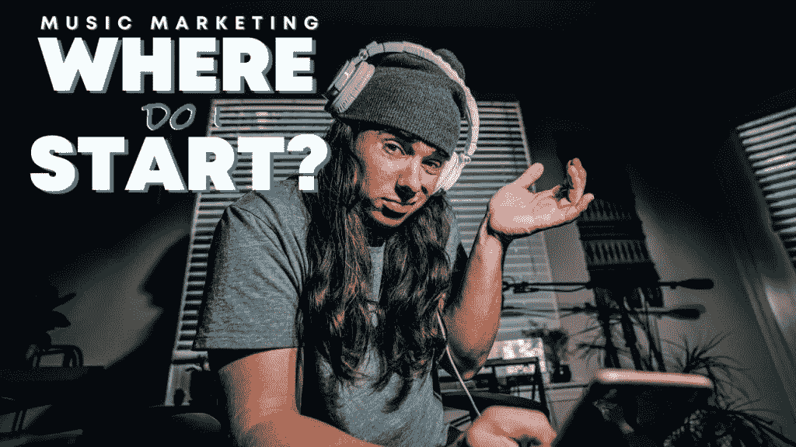
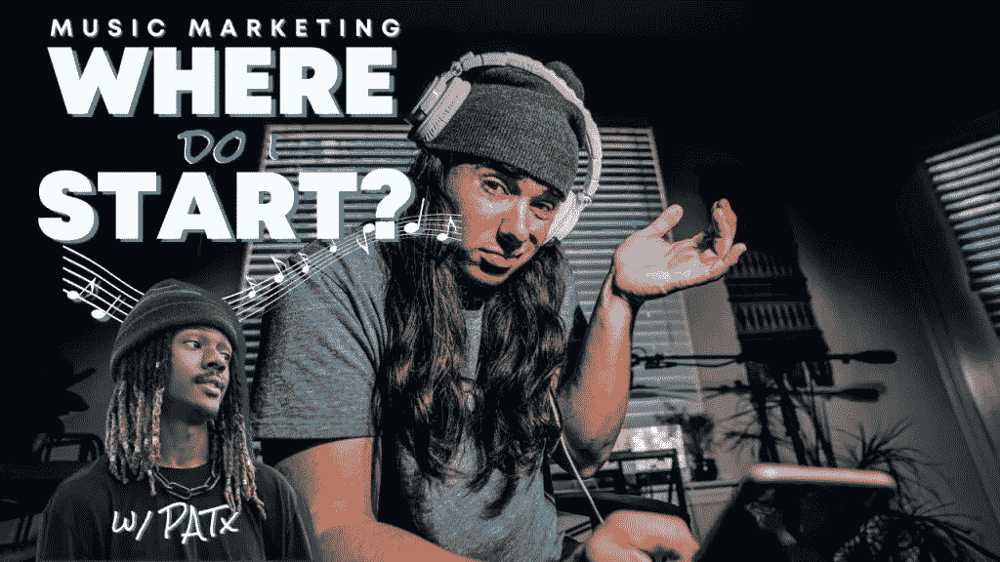
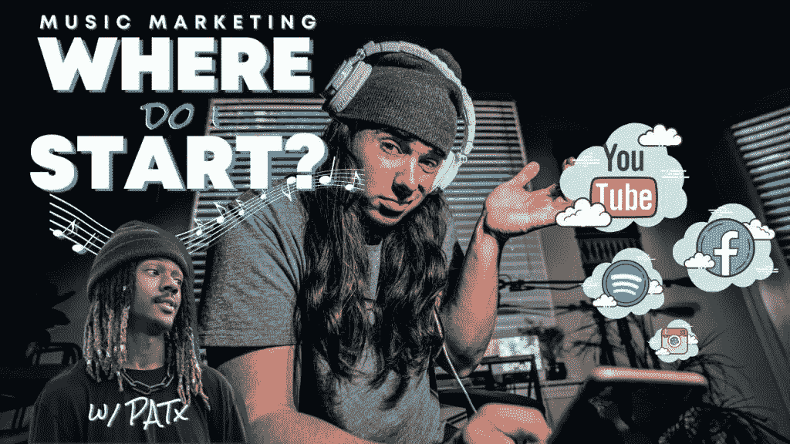
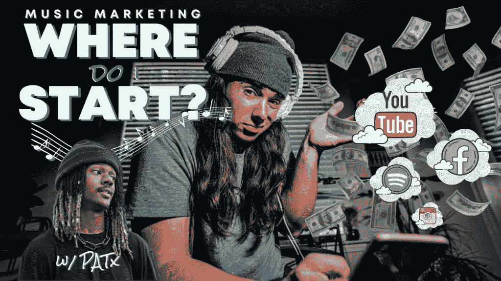
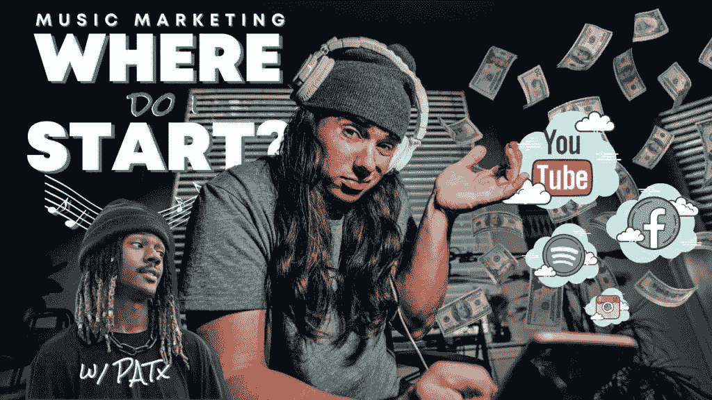

# 如何在 2021 年制作一个 YOUTUBE 视频缩略图(用 can va)——和我一起设计

> 原文：<https://medium.datadriveninvestor.com/how-to-make-a-youtube-video-thumbnail-in-2021-with-canva-design-with-me-6aa3c4d38137?source=collection_archive---------20----------------------->

在这个视频和博客中，我分解了如何用 CANVA 在 2021 年免费设计一个 YouTube 视频缩略图。我用 Canva 做我所有的 YouTube 缩略图设计。这太简单了，你可以从他们的模板中获得灵感

**在我的链接** [**这里**](https://partner.canva.com/c/2662391/647168/10068) **免费试用 Canva Pro。**

一开始，为 YouTube 设计一个伟大的缩略图可能会让人不知所措。我的意思是，你可以看看我两年前[在](https://www.youtube.com/channel/UCmqe0lYOIUKfOkV-xXCxmYA)频道的一些缩略图，看看缩略图有多重要。

首先，让我们分解一下尺寸等。YouTube 的缩略图。*如果你在 Canva，你所要做的就是选择“创建设计”，然后选择 Youtube 缩略图。*

*   **完美的 YouTube 缩略图尺寸是 1280 像素×720 像素。**
*   **这些 YouTube 缩略图尺寸使用 16:9 的纵横比。**
*   **确保你的缩略图最小宽度为 640 像素。**
*   **缩略图应小于 2MB。**
*   **图像格式为 JPG、GIF 或 PNG**

在进入设计之前，先简单回答一下这个问题。

# 为什么缩略图很重要？

# 快速统计:

## 简单漂亮的缩略图可以让你的参与度在女性中提高 154%，在男性中提高 64%。

## YouTube 上 90%表现最好的视频作品都有自定义缩略图。

除了这些统计数据，缩略图是让从未点击过你的视频的人第一次点击并发现你的方式。想想吧。有这么多内容。一半的时候，并不是你的内容不好。只是大家不了解你而已。当有这么多选择的时候，你不想让他们有任何理由不点击你的内容。

根据我的研究，让新的人点击是最重要的。所以我们在这里。

# 我们开始设计吧。

如果你不知道，我也是一名摄影师。所以对我来说(如果可能的话)拥有美观的缩略图照片是很重要的。当你把这些照片和好的设计混在一起，就不可能忽视了。

这是我们正在设计的视频的链接:[2021 年的音乐营销策略(独立艺术家的细分)w/ PATx](https://www.youtube.com/watch?v=WjYpdpaczcU)

我知道我必须在缩略图上多下功夫，因为老实说，我对视频的视觉质量不是很满意。内容很棒。音频很棒。但是视频很仓促。太阳下山了，我们都很累

我从一张照片开始这个缩略图。我用我的 [A7III](https://www.amazon.com/gp/product/B07B43WPVK?ie=UTF8&tag=thecoleconnor-20&camp=1789&linkCode=xm2&creativeASIN=B07B43WPVK) 拍了这张照片，然后把它放到了 Lightroom 上。无论是视频中的静止图像还是单独的照片，始终编辑主缩略图图像是非常重要的。

我使用 Lightroom 预设，但我真的认为它只是很好的修补了细节，亮度和饱和度一点点，使它成为一个小的 Youtube 缩略图。

# 说到短信，我最大的建议之一是…

就是左右对齐(如果有意义的话)。我在页面顶部的视频中对此做了更多解释，但基本上我的意思是让“音乐营销”与“在哪里”保持一致。我不知道它的专业术语，但它很有美感。

# 移除背景

当你导入图像时，*较新的* Canva 特性之一是效果选项下的“背景去除器”。它使得移除背景变得如此容易。在此之前，你必须进入 photoshop，从背景中“剪切”出一些东西。现在，只需点击一下按钮。

由于 PATx 是我们营销会议的一部分，我想把他包括在内。所以我简单地截屏了他的 IG 图像，导入并移除了背景。太棒了。

为了突出这个剪切块，我只是**复制了**它，添加了一个**双色调**并把它放在原来剪切块的后面。这使得 PATx 看起来像他身后有一个蓝色的影子。超级酷。

我认为右边看起来有点空，所以我添加了一些额外的元素来真正代表我们讨论的营销渠道。这是视频中的一瞥，也看起来像这些云是从手机中飘出来的。

您不必总是填写缩略图中的所有空间，但对于这一个，我做到了。

# 与 photoshop 非常相似，您也可以将图像导入到 Canva 中。

我希望在缩略图中有某种形式的钱，因为最终目标是通过音乐赚钱。在这种情况下，元素达不到我的要求。所有的金钱元素都是动画，但我想让它看起来像合法的钱。

于是我去 google 找了一个**透明钱 PNG** 。我把那张图片上传到 Canva，放在云层后面的右边。啊，太好了。钱。

# 巨额小费

这可能是我能给的最大的小费了。**通过复制焦点图像为您的缩略图添加维度。我在视频中做了充分的解释，但最终，我复制了我的图像，移除了背景，并移动了第二层后面的一些文本和元素。**

这就造成了这些元素在我和墙之间的错觉。这是一个非常简洁简单的小技巧。

# 这是最后的缩略图，我在这一点上没有任何提示。

我再次强烈推荐使用 Canva，如果你感兴趣，请点击我的链接 [**这里**](https://partner.canva.com/c/2662391/647168/10068)****免费试用 Canva Pro。****