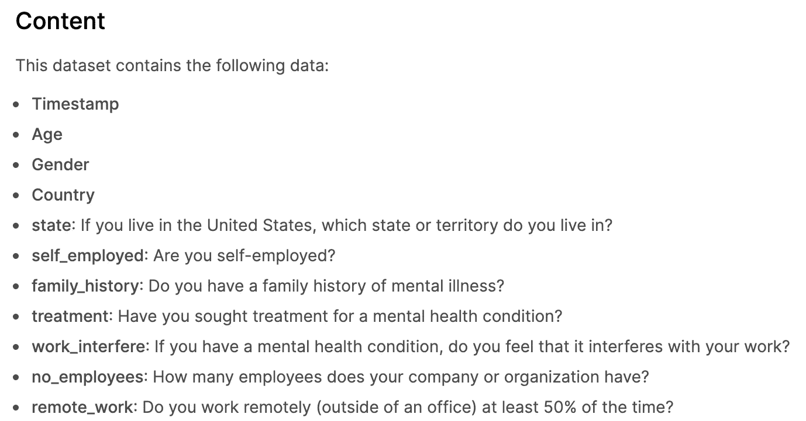

# 如何从你的表格中做出数据预测

> 原文：<https://medium.datadriveninvestor.com/how-to-make-data-predictions-from-your-typeform-responses-a12d27019a27?source=collection_archive---------28----------------------->

## 完整指南

## 从你的数据中采取行动，并用它来进行机器学习预测。

由于我们简化了 ML 流程，企业面临的主要挑战之一是数据收集和根据数据采取行动。

随着数据收集工具变得越来越容易获得，企业也越来越了解数据的价值，但很少有人知道如何处理他们的数据。

收集数据的最简单和有趣的方法之一是这个叫做 [Typeform](https://www.typeform.com/) 的漂亮工具。你可能听说过。他们来自西班牙的巴塞罗那，完全打破了以往的模式。现在你可以以互动的方式从你的观众那里收集数据。因为他们有大量的集成，在数据库或 Google Sheet 中存储类型表单响应非常容易。

让我们告诉你怎么做！如果你还没有创建一个类型表单，我们建议你这样做，这篇文章会更有意义。

# 如何格式化数据集

希望你已经收集了一些回复。

在您的 Typeform 帐户中，您可以快速将您的回答转换为 CSV(逗号分隔值)文件。这种类型的文件在数据科学中非常常见，您将使用它来进行预测。

在“*集成*下的“*连接*选项卡中，您会看到一个按钮，将您连接到您的 Google Sheets 帐户。继续点击它开始。它应该提示您将已经收集的响应输入到电子表格中。

一旦你的数据在工作表中，你只需要做一些轻微的清理。

以下是我们从一份填写了客户 id 的表格调查中获得的一些示例结果。需要注意的是，数据越多越好。您希望拥有超过 1，000 行和 5 列来进行合理的预测。因为 ML 标识了列之间的关系，所以您需要尽可能多的列。当然，如果您想要一个简短的调查，这有时会很棘手，因为一个列相当于一个问题。然而，如果你能让你的听众参与进来并完成你的表格，你就能更好地预测。

以下是收集用于预测的类型数据的一些最佳实践:

**有一个标识符列**

有一个标识符列，这样你就可以对每个回答者做出预测。Typeform 允许你要求一个电子邮件或姓名。这可用于标识符列。将您的回答转换为数据集时，如果您要共享此数据集或预测结果以保护个人信息，可以将名称更改为数字。

 [## 什么是数据目录，它如何使机器学习取得成功？数据驱动的投资者

### 数据目录是机器学习和数据分析的燃料。没有它，你将不得不花费很多…

www.datadriveninvestor.com](https://www.datadriveninvestor.com/2020/08/27/what-is-a-data-catalog-and-how-does-it-enable-machine-learning-success/) 

**使您的列名更简单**

当你把你的数据转换成谷歌表单时，你输入表单中的每个问题都会作为它自己的一列出现。在将您的电子表格上传到 appeally AI 之前，我们建议将问题缩短到 1-3 个词，以简化流程。

这里有一个科技领域公共心理健康调查的例子。创建这样的列表对于理解数据集、与您的团队共享数据集非常重要，并且可以更容易地理解结果。

**避免开放式回答问题**

创建类型表单时，您可以创建开放式响应问题，参与者可以在其中键入长答案。虽然这对于从你的观众那里获得定性数据来说很好，但是这种类型的回答对于数据预测来说并不好。我们建议您坚持上传定量数据。

当你收到你的预测报告时，显然 AI 会将数据放入一个 X 和 Y 轴，以帮助你更好地理解两个变量之间的关系。在这种情况下，使用一段文字是行不通的，因为你无法确定大量文字之间的关系。

如果你收集了公开的回答，那也没关系！把它们藏到你的硬盘里，但是从你用来做预测的数据集中把它们排除掉。

# 将字体数据转换为 CSV 文件

一旦数据集放置妥当，您就可以将数据集下载到 CSV(逗号分隔值)文件中。你将使用这个文件上传到明显的人工智能。

**提醒:**如果您创建了大量数据，您可以将 CSV 文件保存到 Dropbox 文件夹中，并将大于 25MB 的文件上传到 appearly。

为此，点击左上角的“*文件*”按钮，“*下载*”，然后“ *CSV”。*

现在您已经准备好进行数据预测了！

登录到显然人工智能并点击*添加数据集。*“您的数据对话框将出现。这里我们预测了满意度。还记得我们讨论标识符列的时候吗？这就是你需要的地方。应该在标识符列中使用客户名称或 ID 号。您可以在这里随意添加任何过滤器或预测某个属性。

# 不要只是收集数据，要从中采取行动

您应该已经准备好从类型数据进行数据预测了。

您已经学会了如何:

*   将您的表格回复转换成电子表格
*   格式化您的数据
*   将您的电子表格转换成 CSV 文件
*   根据您的字体数据进行预测

为了使它更容易，我们在工作中有一个字体集成！😉同时，在这里查看我们的其他[集成](https://www.obviously.ai/post/our-running-list-of-integrations-to-fit-ml-into-your-tech-stack)。

‍

*原发布于*[*https://www . appearly . ai*](https://www.obviously.ai/post/how-to-make-data-predictions-from-your-typeform-responses)*。*

**进入专家视角—** [**订阅 DDI 英特尔**](https://datadriveninvestor.com/ddi-intel)