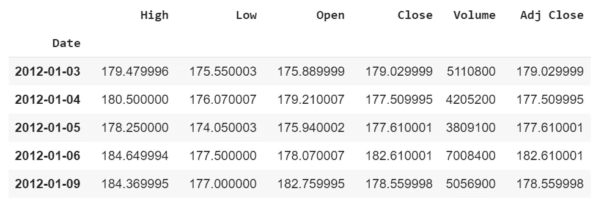

# 如何使用 Plotly 和 Python 制作交互式蜡烛图

> 原文：<https://medium.datadriveninvestor.com/how-to-make-interactive-candlestick-charts-using-plotly-python-9aa4a9c9f82a?source=collection_archive---------1----------------------->

制作交互式烛台图表


# 什么是蜡烛图？

蜡烛图是一种金融图表，用于描述证券、衍生品或货币的价格变动。— [维基百科](https://en.wikipedia.org/wiki/Candlestick_chart)

# 了解烛台

一个烛台有四个主要组成部分(**开**、**关**、**高** & **低**价)给定的时间段，通常是一天之内。颜色(通常为绿色)表示证券收盘价高于其开盘价，而另一种颜色(通常为红色)表示证券收盘价低于其开盘价。


如果你不想读这篇文章，想要一个视频演示，你可以看看下面的 [**YouTube 视频**](https://youtu.be/4fhBXFSS1lc) 。它详细介绍了本文中的所有内容，即使您的计算机上没有安装编程语言 Python，也能帮助您轻松开始编程。或者两者都可以作为学习的辅助材料！

# 开始编程

导入程序运行所需的库。

```
import plotly.graph_objects as go
import pandas_datareader as web
```

获取股票数据。

```
**#Get the Stock Quote: The price of a stock as quoted on an exchange**
df = web.DataReader('AMZN', data_source='yahoo', start='2012-01-01', end='2019-12-17') #end = '2017-12-31', format = 'YYYY-MM-DD'**#Show the data**
df
```



创建蜡烛交互式股票图表！

```
fig = go.Figure(data=[go.Candlestick(x=df.index,open=df['Open'],high=df['High'],low=df['Low'],close=df['Close'],increasing_line_color='orange',decreasing_line_color = 'black')])fig.show()
```


现在您已经使用 Python 创建了一个交互式烛台图表！

感谢阅读这篇文章，我希望它对你们所有人都是有趣的！如果你喜欢这篇文章，并发现它很有帮助，请留下一些掌声，以示感谢。如果你还不是 Medium 的 [**会员，那就考虑成为会员吧，如果不是为了我的文章，也是为了这个网站上所有其他了不起的文章&作者。你可以通过链接**](https://randerson112358.medium.com/membership)**[这里的](https://randerson112358.medium.com/membership)轻松成为灵媒的一员。继续学习，如果你喜欢金融、计算机科学或编程，请访问并订阅我的 [YouTube](https://www.youtube.com/channel/UCaV_0qp2NZd319K4_K8Z5SQ) 频道([randerson 112358](https://www.youtube.com/channel/UCaV_0qp2NZd319K4_K8Z5SQ)&[计算机科学](https://www.youtube.com/channel/UCbmb5IoBtHZTpYZCDBOC1CA))。**

如果你对阅读更多关于机器学习和算法交易的内容感兴趣，那么你可能想阅读[算法交易的机器实践学习:基于使用 Python](https://amzn.to/3eGIyMA) 从数据中学习的智能算法设计和实施投资策略。这本书将向您展示如何实现机器学习算法来构建、训练和验证算法模型。它还将向您展示如何创建自己的算法设计过程，以将概率机器学习方法应用于交易决策，并且这本书将向您展示如何为算法交易开发神经网络，以执行时间序列预测和智能分析。


[算法交易的动手机器学习:基于使用 Python 从数据中学习的智能算法来设计和实施投资策略](https://amzn.to/3eGIyMA)