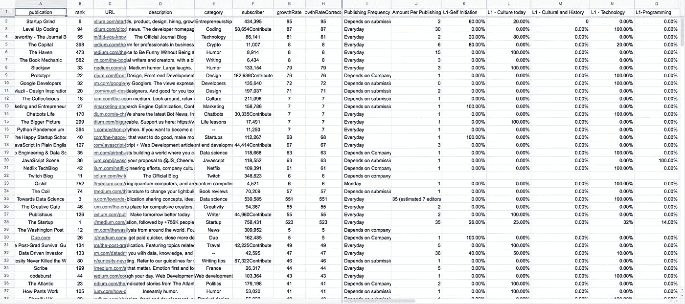
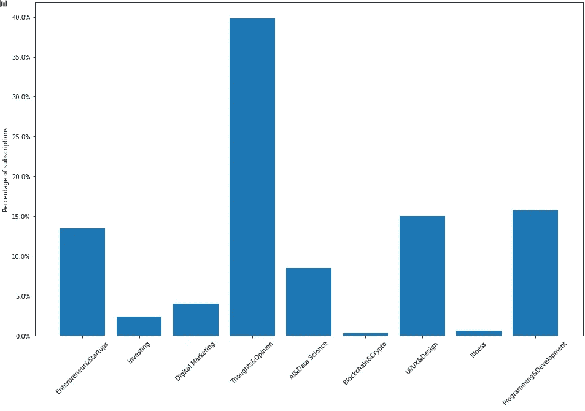
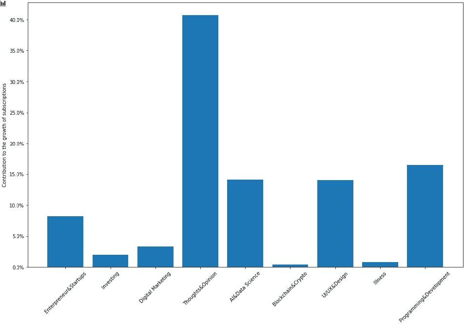
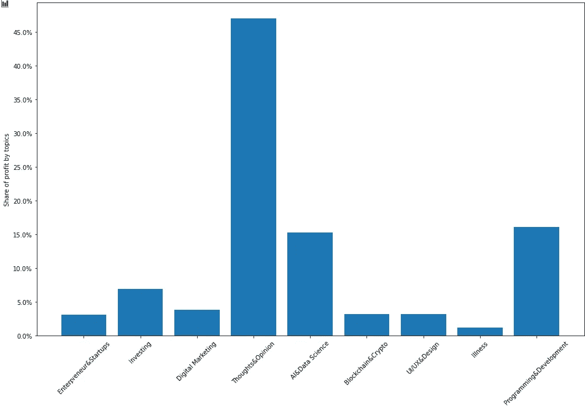
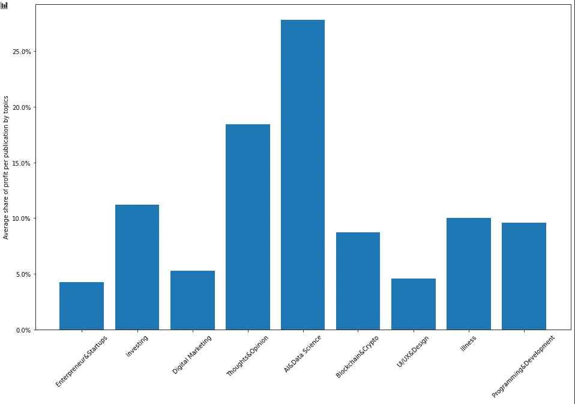
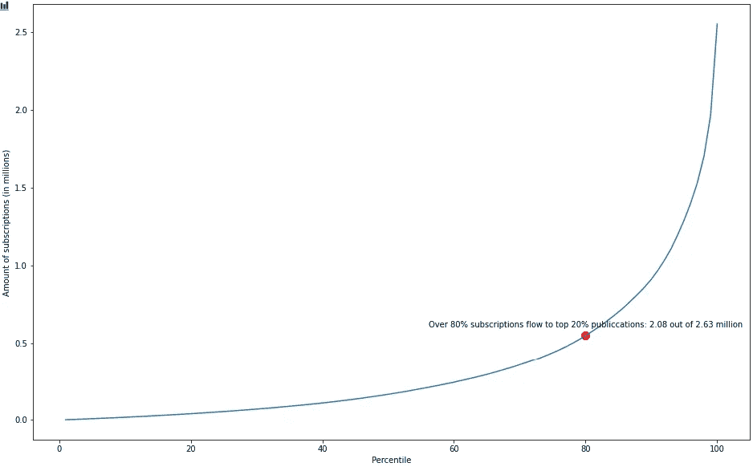

# 如何在介质上写作赚更多的钱？

> 原文：<https://medium.datadriveninvestor.com/how-to-make-money-on-medium-in-2021-37fbffbd48f1?source=collection_archive---------10----------------------->

Photo by [Austin Distel](https://unsplash.com/@austindistel?utm_source=medium&utm_medium=referral) on [Unsplash](https://unsplash.com?utm_source=medium&utm_medium=referral)

> "金钱是可怕的主人，但却是极好的仆人."巴纳姆

这句话充分说明了赚更多钱的动机和本质:做金钱的主人。说到底是关于自由，这是我此生的终极目标之一(另一个是最大化我的人生体验)。

“如何在媒体上赚钱”是我问自己的问题。你们中的许多人可能也有同样的问题。我在这里从一个角度分享我的回答。分享是关怀；我们可以互相帮助。

接下来，您将看到有关以下内容的主要部分:

1.  这篇文章最适合谁
2.  除了赚钱为什么写这篇文章
3.  我如何回答“如何在媒体上赚钱”这个问题
4.  如何将答案转化为行动

# 观众

这篇文章不会告诉你要遵守的规则，但它会与你分享信息，让你一起思考。

这篇文章是写给谁的？

*   那些对成功作家如何在媒体上比一般人赚更多钱感到好奇的人
*   打算加入作家部落并开始在媒体上赚钱的人
*   渴望成功和更多收入的现有媒体作家
*   任何纯粹出于好奇而阅读的人

> "我们必须以理服人，而不是由传统来规定."—塞浦路斯谚语

# 目的

许多媒体作家分享了他们的成功经验或观点。他们慷慨大方，鼓舞人心。但事实是，这些成功的故事大多是不可重复的，因为有被忽视的潜规则。在我们的情况下，这些条件可能包括写作技巧、目标主题等等。

因此，与其说是人生的一课，不如说是数据中的一些发现。他们可以给出一个方向来回答以下问题，你可以采取行动。

*   有哪些热门话题？
*   有哪些赚钱的话题？
*   你应该通过出版物发表你的作品吗？
*   多写有帮助吗？

我们开始吧！

# 少量的证据

这些发现是从顶级媒体出版物数据中发现的([网站链接](https://toppubs.smedian.com/))。在文章 [*抽象业务模式和行动要点，帮助理解 Medium.com*](https://medium.com/datadriveninvestor/data-science-project-get-rewarded-by-knowing-medium-com-user-pool-modeling-business-problem-part-b93b8088c644)*的用户中，提出了该数据集有用性的理由。*这里介绍了一种提取该数据的简单方法[。](https://medium.com/datadriveninvestor/scraping-top-publications-data-with-python-using-selenium-imaplib-and-beautifulsoup4-18fcf9b95c47)

 [## 使用 Python 抓取顶级出版物的数据(使用 Selenium、Imaplib 和 BeautifulSoup4)

### 数据分析项目的一部分，以获得更多的意见和金钱对 Medium.com。这篇文章的重点是收集数据…

medium.com](https://medium.com/datadriveninvestor/scraping-top-publications-data-with-python-using-selenium-imaplib-and-beautifulsoup4-18fcf9b95c47) 

在浏览了几天出版物主页之后(这是一项令人疲劳且耗时的任务，但在此过程中会有许多有趣的发现)，提炼后的样本数据如下所示。别担心，我会跳过无聊的东西，直接跳到有证据的可操作的见解。

A screenshot of the final dataset

## 最受欢迎的话题是什么？

*   大多数订阅流入**主题的思想、想法和观点等。**以 **39%** 的总订阅量份额，超过**编程与开发**话题的两倍，以 **16%** 的份额位居第二。**“UX、UI &设计”和“创业者&创业公司”**也处于第二梯队，分别拥有 **15%** 和 **14%** 的份额。另一方面，有两个独角兽话题，**“健康&疾病”和“区块链&密码”****共 2%** 订阅。参见图 1。

Figure 1\. Share of subscriptions by topic

*   下面是一个快照，显示了每个主题对订阅增长的贡献。越来越多的人订阅关注有思想的、鼓舞人心的、激励人心的故事，贡献了总订阅量增长的 40% 。而 **IT 和 UX** 将继续引领第二轮热门话题，分别分享**约 17%和 15%** 的新订阅量。值得注意的是，**AI**(**15%**左右)的增长率高于**创业者&创业公司** ( **9%** )。参见图 2。

Figure 2\. Contribution to the growth of subscriptions by topic

## 最赚钱的话题有哪些？

如果你读过这篇文章，你可能会相信，根据 Medium.com 抽象的商业模式，出版物发表的文章数量与盈利能力成正比。

*   与上面的结果一致，关于**想法和观点**的故事占总利润的 **47%** ，其次是关于**编程和开发的文章**占 18% 。令人惊讶的是，**《AI&数据科学》和《投资学》**相关故事考虑到其相对较低的认购份额金额，收益非常可观(**分别为 15%和 8%**)。参见图 3。

Figure 3\. Share of profits by topic

*   下图描述了平均盈利能力。它传递了最直接的信息，即写**数据科学和人工智能相关的故事**可以帮助你比写其他主题的故事更有利可图。有趣的是，我们可以看到人们是如何愿意为关于 T2 健康、疾病、投资灵感和秘密的故事付费的。参见图 4。

Figure 4\. The average share of profit per publication by topic

## 你应该通过出版物发表你的作品吗？

是的，但是你应该尝试通过涵盖你的故事主题的顶级出版物来完成。事实证明，[80-20 法则](https://www.investopedia.com/terms/1/80-20-rule.asp)在这里发挥得相当好。总订阅量的 80% 流入前 20%**的发布。**注意，这在这里是作为事实被发现的，而不是被制造出来的。**这意味着目标读者是集中的，如果你在顶级出版物上发表文章，你的文章将获得更多曝光，而你获得的额外曝光通常比你自己发表的多得多。见图 5(实际上是说自下而上 80%的发布共享了 20%的订阅)。**

Figure 5\. The accumulated amount of subscriptions over the ranked publication in sample data

 [## 如何应用 80-20 法则

### 80-20 法则，也称为帕累托原则，是一句格言，声称 80%的结果(或产出)…

www.investopedia.com](https://www.investopedia.com/terms/1/80-20-rule.asp) 

## 多写有帮助吗？

要回答这个问题，让我们再看一下上面的图 1 到图 4。更多的订阅意味着更多的受众和利润。但它们还不属于你。当你写得更多的时候，至少会发生两件事。

*   你展示的作品越多，你从观众群和钱袋中分享的就越多。
*   你将从累积效应中获益。在你发表的文章达到浏览和阅读的高峰后，它们仍然会在那里。不是推送给相关读者，而是需要被找到；主动搜索某些话题的读者还是可以找到你的，开始阅读。对你来说，这是一个很好的被动收入来源，在你努力工作之后。

# **要点和行动**

1.  你可以做的第一件事是考虑你想写的故事的主题。老实说，写热门和有利可图的话题是一个好的开始。至少他们应该让你们大多数人的平均收入适中。此时，这些通用主题是:

*   **想法和意见**。例如，你对一个特定的或趋势性的物体或事件的看法，一个生活教训，一个虚构的故事，等等。
*   **AI 与数据科学。**例如，基础知识和概念的传播，解决具体现实问题的教程或新的帮助工具/包等。
*   **编程与开发。**比如编程语言技巧/最佳实践、应用开发、云计算等等。

同样值得注意的是:虽然“**投资**喜欢技术交易，“**区块链&密码**”、“**健康&疾病**”是不太常见但非常赚钱的领域。这意味着，如果你的作品能有效地接触到目标读者，你将面临更少的来自同行的竞争。

2.通过订阅最多的顶级出版物发布。你将面临来自同行的竞争，特别是当你写最受欢迎和最赚钱的话题时，但一旦你通过选择，你将有一些相对可观的收入。还记得 80-20 法则是如何推动 80%订阅 20%的顶级出版物的吗？

3.能多写就多写。为什么？

*   **熟能生巧**。你文章内容的质量很重要，而且是最重要的。多写也能让你写得更好。
*   **写的越多，拿的蛋糕就越多。**质量不能马上提高，但数量可以。那么为什么要等呢？
*   **累积效应让你被动赚更多。**

# 其他标志

上述行动源自围绕**“如何在媒体上赚钱”**的问题的答案，采用数据驱动的方法。要做的事情肯定不止这些，比如，恰当地使用伟大的图像和样张，就是低挂的果实。

此外，根据本文中分享的信息，我相信页面搜索引擎优化(页面/内容 SEO)将帮助您获得更多读者，这将在我的下一篇文章中使用一个实际示例进行介绍。

 [## 博客的终极搜索引擎优化指南，附示例

### 优化你的故事和博客，提高知名度。最佳实践的搜索引擎优化解释了一个…

medium.com](https://medium.com/datadriveninvestor/an-ultimate-search-engine-optimisation-guide-for-bloggers-with-examples-c46f11ffea39) 

如果您对我的下一篇关于内容 SEO 的文章感兴趣(这将结束当前的文章系列)，请随时关注并保持关注。

本系列前两篇文章在此为你分享。其他关于如何在媒体上赚钱的参考资料也列在底部。

 [## 抽象的商业模式和行动指向理解 Medium.com 的用户

### 一个端到端的数据科学项目，从模拟现实世界的业务问题开始，到…

medium.com](https://medium.com/datadriveninvestor/data-science-project-get-rewarded-by-knowing-medium-com-user-pool-modeling-business-problem-part-b93b8088c644)  [## 使用 Python 抓取顶级出版物的数据(使用 Selenium、Imaplib 和 BeautifulSoup4)

### 数据科学项目的一部分，以获得更多的意见和金钱对 Medium.com。这篇文章的重点是收集数据…

medium.com](https://medium.com/datadriveninvestor/scraping-top-publications-data-with-python-using-selenium-imaplib-and-beautifulsoup4-18fcf9b95c47) 

# 写在最后

永远不要忘记赚更多钱的真正原因；不要做奴隶。我将引用詹姆斯·克利尔的话来结束这篇文章。祝你在通往财富的路上幸福快乐。

> “真正的财富与金钱无关。真正的财富是:不必去参加会议，不必花时间和混蛋在一起，不必陷入地位游戏，不必觉得自己必须说“是”，不必担心别人占用你的时间和精力。真正的财富关乎自由。”詹姆斯·克利尔

# 作者的其他帖子

 [## 通过模式识别实现自动化股票交易——一种递归编程方法

### 股票模式识别的一种高度概括的全局递归程序设计方法及其实现

medium.datadriveninvestor.com](/empower-automated-stock-trading-with-pattern-recognition-a-recursive-programmatic-approach-5930da422555)  [## 使用 Python 抓取顶级出版物的数据(使用 Selenium、Imaplib 和 BeautifulSoup4)

### 数据科学项目的一部分，以获得更多的意见和金钱对 Medium.com。这篇文章的重点是收集数据…

medium.datadriveninvestor.com](/scraping-top-publications-data-with-python-using-selenium-imaplib-and-beautifulsoup4-18fcf9b95c47)  [## 博客的终极搜索引擎优化指南，附示例

### 优化你的故事和博客，提高知名度。最佳实践的搜索引擎优化解释了一个…

medium.datadriveninvestor.com](/an-ultimate-search-engine-optimisation-guide-for-bloggers-with-examples-c46f11ffea39)  [## 抽象的商业模式和行动指向理解 Medium.com 的用户

### 一个端到端的数据科学项目，从模拟现实世界的业务问题开始，到…

medium.datadriveninvestor.com](/data-science-project-get-rewarded-by-knowing-medium-com-user-pool-modeling-business-problem-part-b93b8088c644) 

# 更多关于在媒体上赚钱的参考

 [## 在介质上写作可以赚钱吗？

### 对那些刚接触 Medium.com 在线写作赚钱的人来说，这是一本终极指南

medium.com](https://medium.com/feedium/can-i-make-money-on-medium-1c7a9fcf72e9)  [## 为 Medium 写作能赚多少钱？

### 中型合作伙伴计划收入常见问题

medium.com](https://medium.com/blogging-guide/how-much-money-can-you-make-writing-for-medium-a3cf0c9c7533)  [## 如何在媒体上赚钱——我如何在媒体上写作赚了 1000 多美元

### 2018 年 3 月 25 日，在有人推荐我尝试在媒体上发布以推动流量后，我开始在媒体上写作…

thisonlineworld.com](https://thisonlineworld.com/medium-writing/)  [## 2021 年如何在媒体上赚钱:初学者深度指南

### 作为一名自由撰稿人，学习如何在媒体上赚钱实际上比你想象的要容易。对…的障碍

www.nichepursuits.com](https://www.nichepursuits.com/how-to-make-money-on-medium/)  [## 在媒体上赚钱的白痴指南

### 如果我能做到，你也能。

writingcooperative.com](https://writingcooperative.com/an-idiots-guide-to-making-money-on-medium-9ba1b150a386)