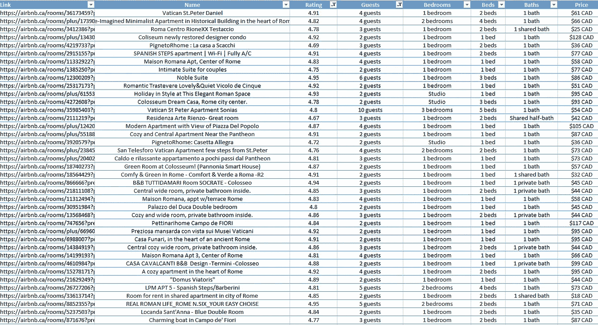
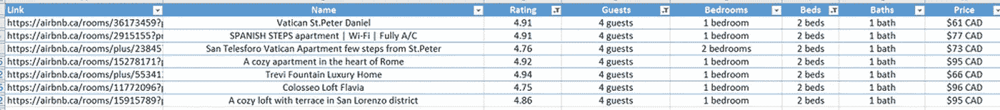
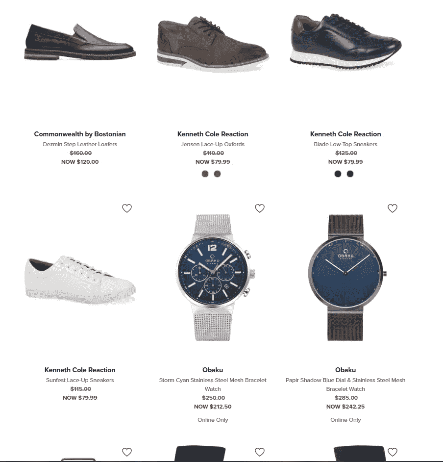
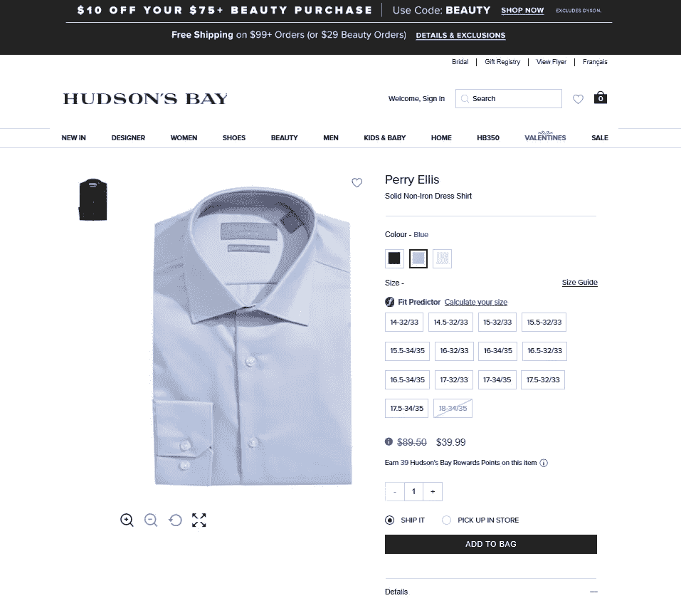
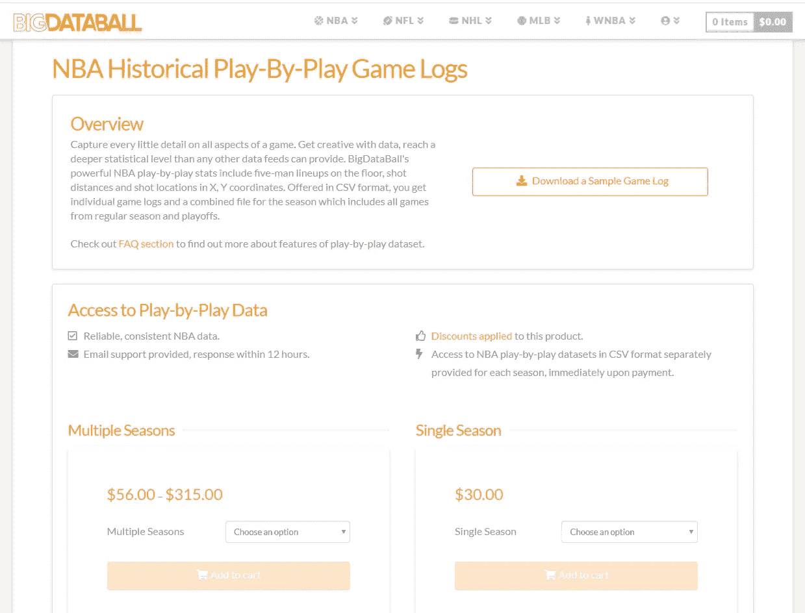
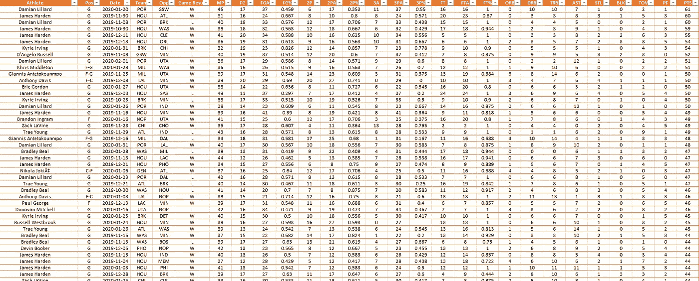

# 如何赚钱，使用网页抓取

> 原文：<https://medium.datadriveninvestor.com/how-to-make-money-using-web-scraping-662f1c3da050?source=collection_archive---------0----------------------->

## 我将向你展示 3 种独特的赚钱方法，使用网络抓取

Photo by Alicia Newman of [LearnWorthy](https://learnworthy.net/why-programming-is-the-skill-you-have-to-learn/)

你知道你现在读的是什么数据吗？

对你来说，这可能只是几个词，但在后端，你在网上阅读的所有内容都是可以被提取、分离和操作的数据。

简而言之，这就是**刮网器**的功能。

他们浏览为创建网站(HTML 代码)或数据库而创建的代码，并获取他们想要的数据。几乎任何网站都可以被抓取。一些网站确实采取措施阻止这些抓取工具抓取他们的数据，但是如果你足够好，你基本上可以抓取 99%的在线网站。

如果你不知道什么是 Web Scraper，那么现在你有了一个想法，我们可以进入你为什么阅读这篇文章的要点…

**金钱。**

网络抓取是一种独特的赚钱方式，并不像听起来那么难。事实上，我将要展示的所有方法和例子只需要不到 50 行代码就可以完成，而且只需要几个小时就可以学会。

说了这么多，让我展示给你看...

# 使用网络抓取赚钱的 3 种方法

## 1.创建机器人

机器人只是一个技术术语，指执行特定操作的程序。根据你做的这个动作是什么，你可以把它卖给那些没有技术能力自己做的人。

为了展示如何创建一个机器人并出售它，我创建了一个 Airbnb 机器人。这个机器人允许用户输入一个位置，它将返回 [Airbnb](https://www.airbnb.ca/) 在该位置提供的所有房屋，包括价格、评级、允许的客人数量、卧室、床和浴室。所有这些都是通过在 Airbnb 网站上抓取每个帖子的数据来完成的。

为了演示机器人的运行，我将输入一个位置。假设我想搜索意大利罗马的 Airbnb。我只需将罗马输入到机器人中，它就会在几秒钟内以有序的 excel 电子表格形式返回 272 个独特的 Airbnb。

现在更容易看到所有的房子/特征以及它们与其他帖子的比较。过滤起来也容易多了。我住在一个四口之家，如果我们要去罗马，我们会寻找一个价格合理的至少有两张床的 Airbnb。现在有了这个整洁有序的电子表格，excel 可以非常容易地根据我的需要进行筛选。在 272 个结果中，有 7 个符合我的需求。

在这 7 家酒店中，我会选择梵蒂冈圣彼得丹尼尔酒店，它的评级非常好，也是 7 家酒店中最便宜的，每晚 61 美元。所以在我选择了我想要的之后，我会简单地将帖子的链接复制到浏览器中，然后预订它。

去度假时，寻找住宿的地方可能是一件非常令人生畏的事情，我相信我们大多数人都曾有过这种感觉。正因为如此，有些人愿意付费，只是为了让这个过程更容易。有了这个机器人，我让这个过程变得更容易。你刚刚看到我在 5 分钟内以一个很好的价格预订了一个房间，里面有我所有的匹配需求。

相信我，人们愿意花钱让他们的生活变得轻松一点。

## 2.转售

网络抓取最常见的用途之一是从网站上获取价格。有些人创建 web 抓取程序，每天运行并返回特定产品的价格，当价格下降到一定数量时，程序会在产品售罄前自动购买该产品。

然后，由于对产品的需求将高于供应，他们以更高的价格转售产品，以赚取利润。这只是网络爬虫使用的许多转售策略的一个例子。

另一个我将向你展示的例子可以为你节省很多钱，也为你赚很多钱。

每个零售网站都有有限的交易和销售，他们会显示原价和售价。但是他们没有显示实际上从原价上打了多少折。

例如，如果一只手表原价为 350 美元，售价为 300 美元，你可能会认为降价 50 美元是一大笔钱，但实际上只有 14.2%的折扣。现在，如果一件 t 恤的原价是 50 美元，售价是 40 美元，你可能会看到 10 美元并没有比原价低多少，但事实上折扣比手表大 20%。

因此，你可以通过购买折扣最高的产品来省钱/赚钱。

使用[Hudson ' Bay](https://www.thebay.com/?site_refer=SEM+B+TR&kw_refer=$BSE+-+Brand$BSE+-+The+Bay+-+Brand+-+hbc$bay+hudson&msclkid=fd69a452755b1a027510fac2a156ceee&utm_source=bing&utm_medium=cpc&utm_campaign=BSE%20-%20Brand&utm_term=bay%20hudson&utm_content=BSE%20-%20The%20Bay%20-%20Brand%20-%20hbc&gclid=CI-v8r7W3ugCFTuJxQIdCGUG_A&gclsrc=ds)，一家出售各种品牌商品的百货商店，我们将使用网络抓取来获取所有商品的原价和售价，并找到折扣最高的商品。

抓取网站后，它返回了 900 多个产品，正如你所见，900 个产品中只有一个产品的折扣超过 50%。那就是佩里·埃利斯纯色免烫礼服衬衫。

这个销售价格只是一个限时优惠，所以这件衬衫的价格最终会回到 90 美元左右。因此，如果我现在以 40 美元买入，而在限量发售结束时以低于原价 60 美元的价格卖出 30 美元，我仍能获利 20 美元。

这是一种方法，如果你找到合适的利基这样做是，有可能赚一大笔钱。

## 3.销售数据

网上有数百万的数据集，每个人都可以免费获取。这些数据通常很容易收集，从而提供给任何想要使用它们的人。另一方面，有些数据不容易获得，需要花费时间或大量的工作才能放入一个干净的数据集。

这就变成了卖数据的进化。有些公司专注于获取可能很难获得的数据，并将这些数据组织成一个漂亮干净的电子表格或仪表板，其他人可以以一定的成本使用。

BigDataBall 是一个体育数据网站，出售球员日志、比赛数据和其他统计数据，一个赛季的数据价格为 30 美元。他们可以要求这个价格的原因不是因为只有他们有这些数据，而是因为有一个网站以非常结构化和干净的仪表板提供这些数据，易于阅读。

现在，我要做的是免费获得与 BigDataBall 相同的数据，并将其放入结构化数据集中，就像我之前所做的那样。

就像我之前说的，他们不是唯一拥有这类数据的人。[Basketball-Reference.com](https://www.basketball-reference.com/)拥有完全相同的数据，但它没有结构化，这意味着它的数据到处都是，很难读取，而且你不能简单地下载你想要的数据集。这就是网络抓取的用武之地。我将对每个游戏的所有玩家日志的网站进行网络搜集，并将其放入一个像 BigDataBall 这样的结构化数据集。

Structured Dataset of all the NBA Player Logs

在 Basketball-Reference.com[的网络搜集之后，到目前为止我们已经得到了超过 16000 个玩家的日志。你可以看到为什么这种简洁格式的数据可以被货币化，因为没有一个头脑正常的人会手动获取 16000 条日志数据并将其放入自己的数据集中。但是在网络抓取的帮助下，我们能够在几分钟内获得这些数据，并为自己节省了 30 美元。](https://www.basketball-reference.com/)

不用说，你可以做 BigDataBall 做的事情。找到手动很难获得的数据，让你的计算机完成这项工作，然后把它卖给那些对结构化数据集中的数据感兴趣的人。

# Python A-Z Bootcamp 2023 中的网页抓取

如果你觉得这篇文章很有用，并且对学习网页抓取感兴趣，我有一个课程教你如何从完全的初学者到高级的网页抓取者，课程教你一步一步如何用它赚钱。

请点击下面的链接查看！

 [## Python 课程中的网络抓取

### 介绍你准备好学习当今就业市场最受欢迎的技术技能之一了吗？这个 15 小时的训练营…

christopher-zita-24ef.mykajabi.com](https://christopher-zita-24ef.mykajabi.com/web-scraping-in-python-course)