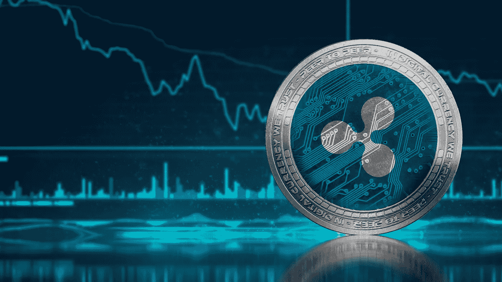
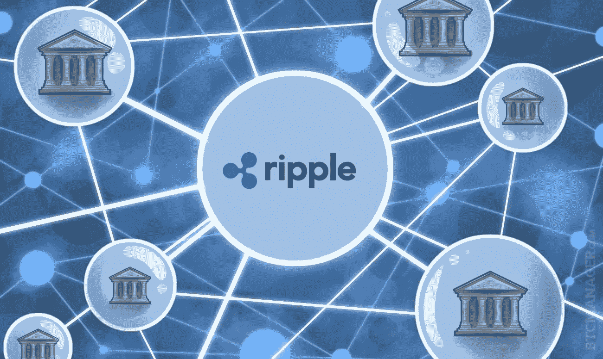
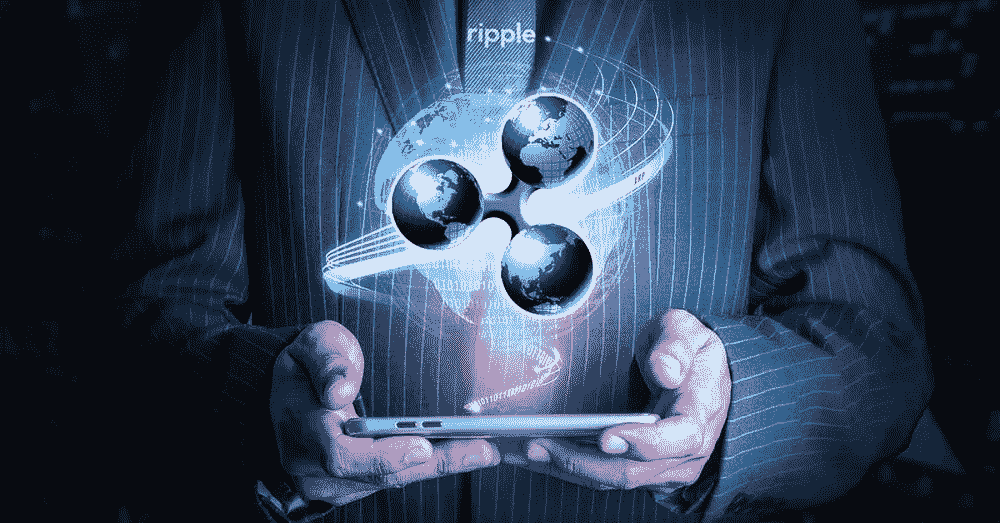
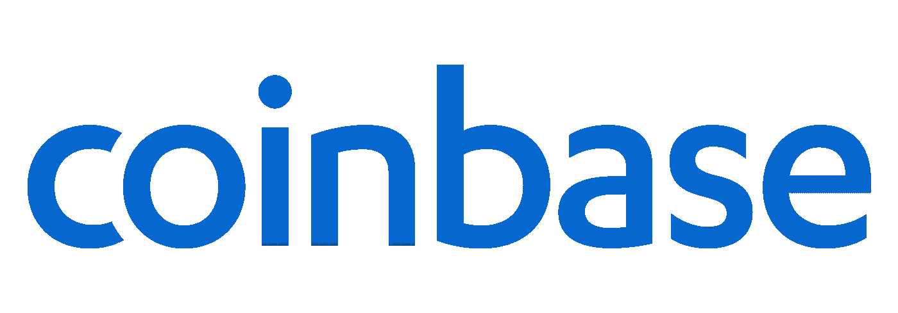

# 如何用 Ripple 赚钱:权威指南[2020]

> 原文：<https://medium.datadriveninvestor.com/how-to-make-money-with-ripple-the-definitive-guide-2020-933bd7b96a0d?source=collection_archive---------1----------------------->

ipple 是加密货币行业真正的成功故事之一，它是 2004 年推出的一个默默无闻的项目，最终成为未来 100 年全球金融的支柱。

随着 XRP 价值的增长，它的曝光率和被采用率也在增长，用 Ripple 赚钱的方式也在增长。

虽然世界各地的许多人已经通过在 XRP 交易和投资获得了收入，但还有其他赚钱的方式，也可能是有利可图的，并且可能适合那些不一定想投资的人。

 [## 总部位于瑞士的 ETP 进入加密交易市场|数据驱动的投资者

### 虽然金融市场几乎没有沉闷的时刻，特别是在引入…

www.datadriveninvestor.com](https://www.datadriveninvestor.com/2019/03/10/swiss-based-etp-enters-the-crypto-trading-market/) 

因此，我们将探索 Ripple 是什么，包括其历史和背后的技术，以及 Ripple 在银行业发展的许多合作伙伴关系，以及 2020 年在线买卖 XRP 的[最佳地点。](https://primexbt.com/platform)

# 什么是涟漪？

[Ripple](https://ripple.com) 是世界第三大加密货币 XRP 背后的项目，该货币目前市值超过 90 亿美元。

该项目是为数不多的获得加密货币行业以外的高度关注、投资和采用的加密货币之一，这在很大程度上是因为它们与金融界有着深厚的联系。

Ripple 的总部设在加利福尼亚，现已发展到拥有 350 多名员工。虽然许多其他加密货币都专注于去中心化，但 Ripple 使用了集中式模型来提供技术稳定性并提高其网络性能。

事实证明，这种结构对银行业很有吸引力，因为银行业在很大程度上与 Ripple 合作，并正在开发世界银行系统的未来。

## Ripple 的历史是怎样的

2012 年，克里斯·拉森、杰布·麦卡勒和亚瑟·布里托创造了 XRP 加密货币。虽然 2012 年看起来像是回到了今天加密货币的历史，但 Ripple 的真正起源要追溯到近十年前，当时 Ryan Fugger 创建了一个名为“RipplePay”的项目。

杰布·麦卡勒在杰布创建的臭名昭著的 Mt Gox 交易所被出售后，于 2011 年加入 RipplePay 团队。

Larson 于 2012 年被 Jeb 聘用，OpenCoin，Inc .成立，开始致力于增加 RipplePay 的现有系统，最终成为我们今天所知的 Ripple 协议。

2012 年至 2015 年间，Ripple 获得了超过 5600 万美元的风险投资，自那以来，它已发展成为世界上最重要的加密货币之一。

Ripple 在风险投资方面的成功凸显了其核心团队的技能，他们能够将该项目定位于 2017 年以来加密货币市场的巨大增长。这是对 Ripple 团队与银行和金融界机构建立重要合作伙伴关系的称赞。

## Ripple 是如何产生的？

Ripple 最初是一个名为 RipplePay 的平台，Fugger 设想它是一个分散的同行网络，可以基于每个成员的可信伙伴网络转移价值。

在 Fugger 带来 McCaleb 之前，他自己花了 7 年时间在 RipplePay 上工作，这将极大地改变项目的轨迹。

McCaleb 不仅找到并招募了 Larson，而且在他们之间，Ripple 从一个默默无闻的支付网络转变为获得大量关注和资金，并重新定义了加密货币的含义。

McCaleb 和 Larson 之间的合作标志着 RipplePay 从以前的范围转向现代化和扩展的 Ripple 最终将成为的愿景。

# 是什么赋予了 Ripple 价值？

## Ripple 的技术

Ripple 的技术有 4 个重要组成部分:XRP、Ripple 协议共识算法(RPCA)、XRP 分类帐和 RippleNet。

XRP 是用于推动涟漪网络的加密货币。资产可以通过 XRP 转换成其他资产，从而实现多种不同货币之间的流动转换系统。

RPCA 是 Ripple 的比特币采矿或其他加密货币的赌注。本质上，RPCA 控制着数据和价值在涟漪网络中的移动方式。由于 RPCA 固有集中化，可以实现比典型的共识机制高得多的事务吞吐量。

RippleNet 是世界各地的交易提供商网络，允许进行廉价、快速的支付。RippleNet 由一组金融机构组成，这些机构作为一个系统协同工作，实时从多种不同货币进行价值转移。

XRP 分类账是 RippleNet 成员之间所有交易的记录，并且是分散的。它允许系统正确运行，并在所有成员之间提供透明度。

Ripple 系统的这四个组成部分协同工作，允许在全球范围内快速、安全地转换和转移资金，这在传统银行之间建立了一个网络，并有可能成为未来全球资金流动方式的蓝图。

## Ripple 的合作伙伴关系

Ripple 最大的优势之一是他们与标志性的金融行业机构建立了大量的合作伙伴关系。

其中包括速汇金、SBI 控股、欧洲进出口银行、Cuallix 和西联汇款，资金来自安德森·霍洛维茨、比特币机会基金、IDG 资本伙伴、谷歌风险投资、Vast Ventures 和光速风险投资伙伴。

前几轮融资也从北海巨妖交易所的创始人之一 Jesse Powell 和“秘密耶稣/犹大”Roger Ver 那里获得。

这些合作伙伴只是众多将 Ripple 的生活定义为渗透金融领域并向其介绍区块链技术价值的伙伴之一。

# 用 Ripple 赚钱最好的方法有哪些？

# 交易波动

## PrimeXBT

[PrimeXBT](https://primexbt.com) 在 2019 年和 2020 年超过了其他加密交易平台，成为世界上最大的加密保证金交易平台，还列出了包括外汇对、股票指数和商品在内的各种传统资产。

PrimeXBT 列出了[的一系列加密资产](https://primexbt.com/leverage-trading-crypto-indices-forex)，包括 XRP，以及其他如 BTC、瑞士联邦理工学院、LTC 和 EOS，并对所有加密资产提供高达 100 倍的杠杆作用。

这是 XRP 最高的杠杆，可以创造其他地方没有的高级收入流。

该平台以用户友好的界面和强大的交易引擎而闻名，每秒可执行多达 12，000 笔交易，平均每笔交易不到 7.12 毫秒。

PrimeXBT 拥有业内最低的[费用](https://primexbt.com/fees)，对包括 XRP 在内的所有资产仅收取 0.05%的统一费率，这对于卓越的保证金交易平台来说是一个巨大的吸引力，吸引了大量交易者的注意，这些交易者通常习惯于支付高达 10 倍的交易费用。

PrimeXBT 显然也在设计高质量的客户服务系统方面进行了大量的考虑，最近在 Cryptomist 的在线研究中击败了其他 4 个加密保证金交易平台，以更好地了解该行业的客户服务状况。

在过去一两年的下行趋势市场中，许多其他平台似乎已经放下了脚步，而 PrimeXBT 却一路飙升，在同一时期成为该行业用户和交易量增长最快的平台之一。

## 比特币基地

[比特币基地](https://coinbase.com)多年来一直是加密行业的核心部分，最近将其交易所从 GDax 更名为比特币基地 Pro——集中其品牌。

长期以来，比特币基地一直被视为高端交易工具的优质供应商。出于这个原因，许多不介意支付高额费用的机构投资者已经开始使用比特币基地，增加了该平台的整体流动性。

比特币基地和比特币基地专业版有直观的用户界面，交易引擎和用于比特币基地的技术制作精良。

客户支持长期以来一直是该平台的一个问题，有报告称，用户在合理的时间内请求支持时一直没有得到支持。

人们强烈希望这是比特币基地能够纠正的事情，因为这损害了他们原本相当清白的声誉。

总的来说，比特币基地专业版是一个很好的交易加密资产的平台，像 XRP，值得考虑，如果你计划在未来交易 XRP。

## 投资 Ripple

## 霍德林

与所有加密货币一样，最常见的投资策略之一是长期购买和持有，这不仅是一些新交易者的首选，也在加密领域获得了自己的崇拜地位。

随着时间的推移，随着这种加密资产的价值急剧增加，XRP 的投资和管理已经变得有利可图。

虽然在 Ripple 的长期投资可以非常有利可图，但使用 XRP 可用的许多交易策略中的一种，可以在投资的同一时期内获得更大的收益。

这么说吧，如果你很乐意买下 XRP，安然度过不可避免的跌宕起伏，那么这可能是你的一个好策略。

## 在下一轮牛市到来之前买入 XRP

加密货币继续由比特币引领，比特币本身在其整个生命周期中遵循 4 年的周期，这意味着它和整个加密市场在过去十年中一直在乘坐过山车。

上一次高峰是在 2017 年，当时比特币达到了近 2 万美元的历史新高，XRP 达到了 3.84 美元的历史新高。

如果这种模式继续下去，我们目前处于低点，将在 2021 年 12 月达到新高峰。

这意味着现在可能是密码行业未来 6 年创造财富的最好机会。

## 涟漪广告观看

Ripple 广告观看听起来很简单——作为观看广告的回报，用户在 XRP 获得报酬。

这是一个简单而有效的赚取 XRP 的方法，不需要像交易一样投资金钱，只需要投资时间。

用户可以每天观看大量的广告，以增加他们的总收入，也可以只观看少量的广告，而不必投入太多的时间。

## 波纹水龙头

[XRP 水龙头](https://www.earncrypto.com/earn-free-ripple/)除了所有奖励在 XRP 支付外，其他水龙头都一样。

水龙头基本上是一个平台，用户可以来完成简单的快速任务，以便接收少量的加密货币。

当每个奖励都很小的时候，通过完成许多不同的任务，挣得的总数可以累积到相当可观的数目。

任务可以包括在社交媒体上分享一些东西，点击链接，以及创建一个图形或某种内容。

## XRPTipBot

XRP 的另一种创收方式是使用 XRPTipBot。

Reddit、Discord 和 Twitter 上的用户在 XRP 互相发送提示，这些奖励可能是出于一系列原因产生的，包括发布优质内容、提供方便的建议和信息、向更多受众展示一个新平台，或者只是因为他们喜欢它。

通过使用这些平台并找到使用 XRPTipBot 的人，可以创建高质量的内容并与他们分享，希望得到提示。

虽然这可能不像交易和投资那样有利可图，但这是一种更通用的赚取 XRP 的方式，而且不需要任何投资。

# 总之:如何用 Ripple 赚钱

在区块链与现有机构的金融整合方面，Ripple 将在 2020 年主导加密领域。

对于那些已经持有 XRP 的人来说，这是一个好消息。随着 Ripple 的风险敞口增加，XRP 的价值也会增加。

对于那些有兴趣在下一轮牛市到来之前获得一些 XRP 的人来说，使用上述方法之一可以让你囤积 XRP。

当选择一个[平台进行交易](https://primexbt.com/trade-bitcoin-with-leverage)或投资时，只需看看我们上面列出的建议，哪些是网上交易 XRP 的最佳平台。