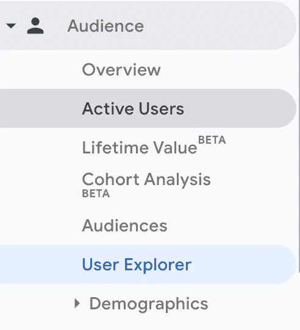
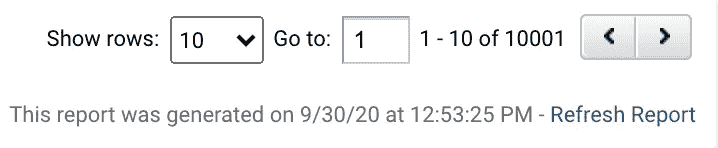
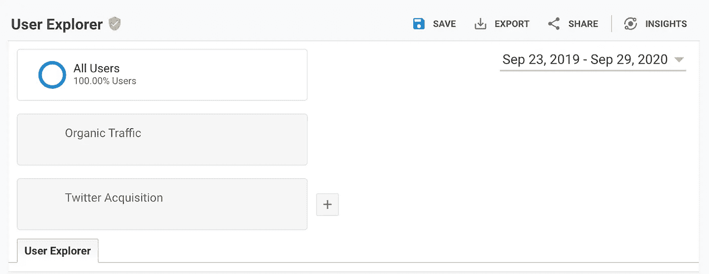
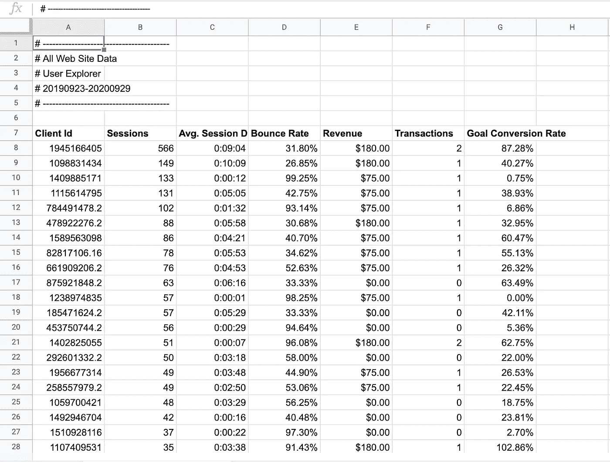
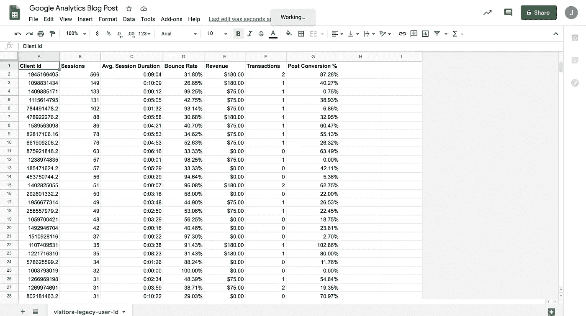
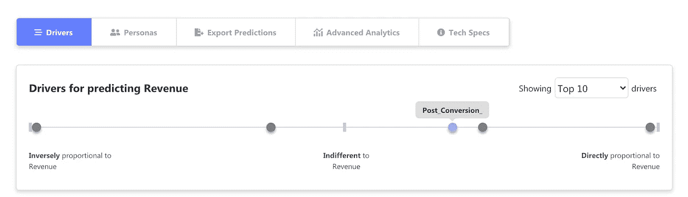
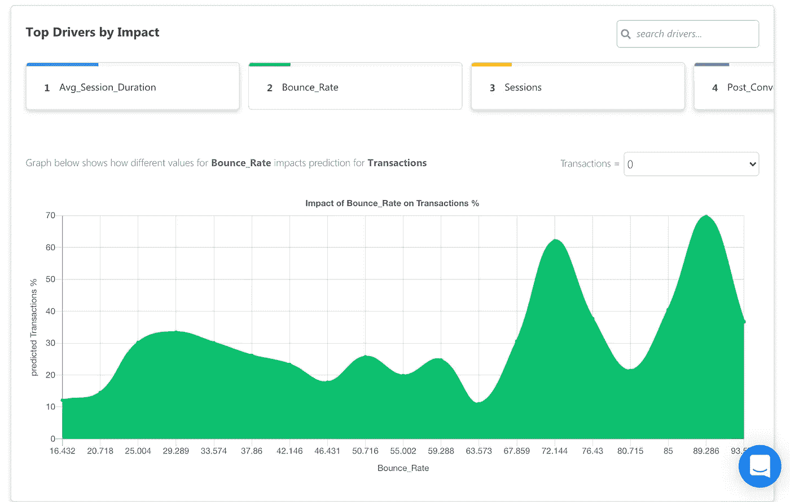

# 如何用你的谷歌分析数据做预测

> 原文：<https://medium.datadriveninvestor.com/how-to-make-predictions-with-your-google-analytics-data-214221cedfc3?source=collection_archive---------7----------------------->

## 操作指南

## 从为机器学习格式化你的谷歌分析数据，到你可以做出什么类型的预测。

上周，我们讨论了如何从你的打字回复中做出[数据预测。我们希望继续利用现有的数据收集工具进行数据预测的趋势。](https://obv.ai/how-to-make-predictions-from-typeform-responses)

我们将教你如何:

*   将您的数据导出到 Google 电子表格
*   为有意义的预测设置数据格式
*   你可以用谷歌分析数据预测什么

让我们得到它！💪

# 谷歌分析是数据收集过程的重要组成部分

Google Analytics (GA)是网站和应用程序数据的重要组成部分，了解受众如何发现您的网站、他们如何与您的内容互动、哪些内容会导致他们购买、他们使用您的产品的时间等基本信息。

这是最简单的分析工具之一，当然也是最常用的工具之一。如果您的站点没有连接 GA，[单击此处](https://support.google.com/analytics/answer/1008015?hl=en)了解如何连接。

因为 GA 非常擅长收集大量有价值的数据，并允许你细分受众和时间，所以它是机器学习的天然选择。

# 如何导出和格式化数据

虽然 GA 是一个非常强大的工具，但它确实有一个学习曲线。知道你可以用这些数据完成什么可能会令人困惑。GA 帮助您可视化数据和分段，但该工具也有细微差别。

如果你不认为自己完全精通 GA，看看这个[的超赞指南](https://moz.com/blog/absolute-beginners-guide-to-google-analytics)。

## **导出您的数据**

首先，我们要假设我们想要预测是什么因素导致了网络访问者的转变。这将教你如何导出和格式化你的数据上传到明显的人工智能。

在左侧导航栏中，在**报告**下，点击**受众**下拉按钮，然后点击**用户浏览器**。

这将带您进入**用户浏览器**报告页面，其中有一个行和列的表格。

 [## 擅长谷歌是一种技能|数据驱动的投资者

### 擅长‘谷歌’是一种技能。是的，你听到了。知道什么和如何谷歌或搜索的东西是一个…

www.datadriveninvestor.com](https://www.datadriveninvestor.com/2020/08/11/being-good-at-google-is-a-skill/) 

重要的是要注意遵循我们的 1，000 行乘 5 列规则来进行有意义的预测。该表将只显示 10 行。在导出这些数据之前，您需要执行以下操作。

1.  更改行号。在表格底部，将**显示行数**调整为 1000 或更多。如果行数低于 1，000，您将无法上传到明显的 AI 并做出预测。如果可以，选择 1000 行以上。数据越多，预测就越准确。

2.选择日期范围。在右上角，您可以调整要导出的数据集的日期范围。如果没有超过 1，000 行，可以将日期范围调整为跨越更长的时间段，以获得更多数据。如果你有大量的流量，拥有足够的数据应该不成问题，但如果你是一个新的网站或中小型企业，有一个更大的日期范围将是有用的。

3.最后，选择你希望如何划分你的用户。你可以简单地选择**所有用户**或者更具体的东西。这里我们有一些你可以执行的用户细分类型的例子。你可以从有机接收的用户，付费广告，或者社交媒体渠道进行数据预测。如果你想变得超级特定，你可能需要创建自己的群组。我们有来自特定网站的用户群，看看他们购买的可能性有多大。

好了，现在你可以导出了。只需点击**输出**按钮，然后按照下一页步骤操作。您将可以选择导出为 CSV 文件，但是，我们仍然需要做一些轻微的清理，然后才能为明显的人工智能准备数据集。

## **格式化你的数据集**

这是为了这篇博文而创建的虚假数据。

到目前为止，您应该已经使用导出的数据创建了 Google 工作表。它应该看起来像这样。

This is fake data used for purpose of writing this post.

幸运的是，数据集已经带有一个标识符列，其形式为**客户机 Id** 和 5 列。您可以通过设置目标来添加更多列。我们在**目标转化率**栏中的目标就是用户每次访问我们网站时访问博文的百分比。这个目标有助于我们了解阅读我们的帖子与转化的关系。您还需要设置交易数据，将任何属性与**收入**和**交易**相关联。

GA 使得为 ML 格式化你的数据非常容易。您所要做的就是删除第 1-6 行，使列名成为第一行，然后将您的目标列重命名为整个团队都能理解的名称。在这种情况下，我们将其重命名为类似于 **Post Conversion %的名称。**

现在你的数据集应该看起来像这样。

准备好后，点击导航栏左上角的**文件**按钮。点击**下载**，然后点击**逗号分隔值**选项，您的 CSV 文件将保存到您的电脑中。

# 上传你的谷歌分析数据并做出预测

接下来是主要事件。让我们看看用你的遗传算法数据你能得到什么样的预测。

前往[显然 AI](https://obv.ai/login) 并上传 CSV 文件开始进行预测。

上传 CSV 文件并设置参数后，您可以决定要预测的列。我们预测了**的收入**，并使用**的客户 ID** 作为标识符列。

你可以立即看到什么因素导致收入。在这里，我们的目标是让用户访问博客帖子，现在我们可以证明，那些阅读博客帖子的人更有可能为收入做出贡献。

*更进一步*，你可以在 GA 中对你的网站内容进行分组，并更具体地了解哪种内容会产生收入。

您还可以预测交易，并看到用户的跳出率越高，他们不进行交易的可能性就越小。

*   哪些岗位更有可能表现最好
*   什么类型的用户更有可能进行交易
*   哪些页面与大部分收入相关
*   流量峰值与交易和收入有什么关系

你可以预测的其他事情:

还有更多。希望你现在已经开始做出自己的预测了！😉

我们将继续分享如何为明显的人工智能使用数据收集工具，因为我们相信无代码机器学习最困难的部分是知道如何从你的数据中采取行动，并有一个干净的数据集为预测做好准备。

*原发布于*[*https://www . appearly . ai*](https://www.obviously.ai/post/how-to-make-predictions-with-your-google-analytics-data)*。*

## 访问专家视图— [订阅 DDI 英特尔](https://datadriveninvestor.com/ddi-intel)