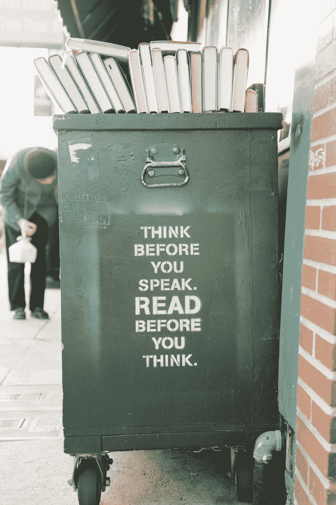

# 如何充分利用你的休息时间

> 原文：<https://medium.datadriveninvestor.com/how-to-make-the-most-of-your-down-time-ebc5a343505?source=collection_archive---------9----------------------->

Photo by [Kyle Glenn](https://unsplash.com/@kylejglenn?utm_source=medium&utm_medium=referral) on [Unsplash](https://unsplash.com?utm_source=medium&utm_medium=referral)

## 为什么这可能是您业务的最佳时机

JC 和我笑得很厉害。他刚刚告诉我“花冠一代”，这是不可避免的后病毒婴儿潮的术语。我想我会崩溃的。

老实说，如果你有伴侣，有生育能力，好色，无聊，你还能怎么打发时间？被困在里面不确定的时间？

我可能好色无聊，但不是伴侣。好吧好吧。我 67 岁了。我也没有生育能力。这给我留下了停机时间。

天哪，这是多么好的礼物啊。这个星期我忙得不可开交，当我正要把我的房子出售时，我没有时间做任何正确的事情。呃，现在不行。

 [## 在创业之旅中，拥抱学习|数据驱动的投资者

### 好像建立一个数百万美元的公司还不够困难，企业家必须额外照顾他们的…

www.datadriveninvestor.com](https://www.datadriveninvestor.com/2018/10/16/on-the-entrepreneurial-trek-embrace-the-learning/) 

作为一名工作主要围绕旅游的企业家，公平地说，目前情况看起来并不乐观。我的 Medium stats 的读者人数已经减少到不到他们的一半，我的收入也是如此。

有道理。当现在最大的冒险是寻找卫生纸时，探险旅行并不是最重要的。保护自己免受那些从你流血的手中夺走包裹的人的伤害。

我没找到，我也不在乎。

我真正关心的是我和 JC 在讨论什么。他刚刚不得不取消了多个会议，结果，他的收入从这个月的 7k 美元骤降至 1700 美元。充其量也就是。

如果你是一名企业家，我敢打赌你会有同感。我当然可以。

所以我们在讨论:机会是什么？

善意地说，这并不意味着我怎么能为了卫生纸和 Purell 去欺骗愚蠢的人呢？

这并不意味着*我如何利用处于极度恐惧中的人？*

它的意思是，我怎样才能超越我自己非常真实的恐惧，找到一种服务他人的方式，并可能在这个过程中重塑我的生活和工作？

如果你熟悉坎贝尔·约瑟夫的作品和[英雄的旅程](https://www.sps186.org/downloads/basic/807350/TheHeroJourney.pdf)，你就会知道所有伟大故事的故事主线。艰难时世造就英雄。他们是奔向灾难的人。

昨晚我看了马克·沃尔伯格主演的《爱国者日》。这个关于 2013 年 4 月波士顿马拉松爆炸事件的故事的主题之一是，炸弹爆炸后，普通的波士顿人跑进了烟雾中。*向着*受伤。他们立即处理事务，尽力安抚、照顾和支持伤者，直到救护车到来。**波士顿强者。**

这些是我认识的美国人。

同样是这些普通的德克萨斯人和志愿者，他们在齐腰高的水中大步行走，营救被休斯顿洪水围困的人们。

这些是我认识的美国人。

虽然疫情实际上要求我们隔离自己，但问题是，我们能做些什么来帮助人们度过难关呢？你和我有什么技能可以帮助那些被困在家里、处于困境中的人？

我和 JC 不得不重写我们今年商业计划的很大一部分，很多人也是如此。他和我想做的是开始寻找其他可用的东西。我们还能解决什么问题。谁是市场以及我们如何提供服务。我们怎样才能有用？

虽然许多人可能会被诱惑去制作花冠，这很好，但也许是时候问一系列新的问题了:

1.  我为人们所做的事情如何适应我们现在所处的世界，并且可能会生活一段时间？
2.  我在周围看到了什么样的问题？有没有一个问题是我唯一能解决的？
3.  如果我不得不在家呆一段时间，而不是玩《糖果粉碎》或看《T2:权力的游戏》的重播，我该如何重新安排、重新利用这段时间来重塑我的事业呢？
4.  如果我以前经历过巨大的变化、转变或损失，我从自己身上学到了什么，我现在可以利用，并帮助其他人学习，那些没有我经历的人？

JC 分享说，去年有一段时间，情况让他和他的爱人几乎被困在他们的房车里，几乎无家可归。感觉很恐怖。你的世界从底部滑落，所有相关的抓手都被移除。

就像试图发送一个很难的，应该有锚的线。突然他们都消失了。

Photo by [Joseph Gruenthal](https://unsplash.com/@josephgruenthal?utm_source=medium&utm_medium=referral) on [Unsplash](https://unsplash.com?utm_source=medium&utm_medium=referral)

# 自由落体可能是可怕的。

这一点之所以重要，是因为 JC 和我一样，经历了很多艰难的时刻。这恰恰是让你我对别人有用的那种东西。你是如何在严重的经济衰退中幸存下来的？你是如何白手起家的？

现在，你是如何在你的行业中生存下来的？你能提供什么帮助？在经历艰难时期，你学到了什么，这对别人有什么帮助？你能把它变成一份兼职的电话咨询工作吗？

考虑到时代的发展，你所提供的东西的哪些方面可能会被重新包装成更及时的其他用途？

也许是时候放下你一直在做的事情，尝试一些新的东西了？有时像这样的情况是全新想法和产品的温床。人们的需求可能会发生变化，尤其是如果他们要在家呆一段时间的话。你可以用什么样的创造性方式来服务？

哪些机构压力过大，需要帮助？哪些组织资源紧张？你能帮忙吗，尤其是通过电话？

*(我想到了送避孕套，请原谅我的双关语，但我跑题了。尽管这可能会阻止人口的小规模增长。)*

如果你看了那份问题清单，脸色苍白，让我建议:*打电话给人们*。*和你的客户谈谈，如果你能联系到他们的话*。四处打听。如果这种情况持续一段时间，人们将开始看到真正的影响。就正在发生的事情和他们的需求采访他们。在这一切的某个地方有一个想法，一个解决方案，或者他们问题的部分解决方案的潜力。

如果可以的话，你需要直接与人交谈的原因是你需要听到他们的语气。他们最害怕的是什么。你不能在电子邮件和推特上分享。这是发自内心的，可怕的，真实的。你一定要听听。因为最让他们害怕的可能是你能帮助他们解决的问题。

有时候会没有答案，做不了英雄。有时你和我偶然发现一个我们可以看到的解决方案，因为我们不像我们的客户那样在杂草中。有时候，能让*听到*远比什么都重要。

如果我们能找到一种方法让自己忙碌起来，乐于助人，有所作为，你和我都会感觉好很多，尤其是当这么多其他人正经历焦虑发作的时候。关注他人可以减轻我们的压力。我们当然担心。帮助帮助我们忘记，有用让我们感到真正的英雄。

用坎贝尔关于主人公旅程的观点来思考这个问题。每个英雄的故事都包含可怕的麻烦和损失。必须的。英雄就是这么炼成的。

你的客户，你的顾客是卢克·天行者。他有麻烦了。你不是英雄，他们才是。你是尤达。你的工作是帮助卢克成为卢克。你是向导，不是那个人。卢克有大麻烦了，想不出办法。

当你专注于帮助人们讨论、识别和澄清问题时，你也更有能力帮助找到解决方案。在艰难时期，这种技能真的很值钱。我们都需要一个尤达。甚至尤达偶尔也需要一个尤达，就像编辑需要编辑一样。

当然，尤达本身就是一个英雄。通常，这些英雄成为向导是因为他们经历了考验。这当然是问题的关键。向导的角色更加重要，因为向导创造了许多英雄。

一个更近的电影例子是甘道夫对佛罗多。再说一次，甘道夫以他自己的方式，打败了巴尔罗克，在这个过程中死去又重生，是他自己的英雄，但他永远是向导。

这对你我会有什么影响？

让我们来看看实时发生的事情:

例如:餐馆陷入困境。今天早上，我在国家公共电台听到了一篇关于餐馆的报道，其商业模式是 80%在家里吃饭。你可以说我疯了，但是如果我有一个健康的员工，我要做的第一件事就是和我的伙伴们聚在一起，想出我们能为他们提供什么，我们如何安全地把它送到他们那里，或者准备好让他们来取。在佛罗里达，正如一个朋友刚刚告诉我的，大多数老年人不知道如何煮鸡蛋，他们经常在外面吃饭。那是我的家乡，我非常清楚她的意思。这是一个真正的挑战。不能在外面吃饭，加上害怕孤独，增加了患抑郁症的可能性。

看行情？你看到解决办法了吗？听着，我们可以在汤里哭。或者我们可以向所有潜在客户群发送电子邮件或传单，告诉他们*别担心！我们在这里支持你！下面是我们能做的让你吃到甘蓝沙拉和你最喜欢的千层面！今晚我们能为你做什么？*

我可能会考虑与当地教会、政府机构合作，看看谁需要什么，以及我如何与他们合作。

一些简单的事情，如获得喜爱的食物，可以极大地平静，积极和有益的。熟悉的事物——尤其是食物——对减轻焦虑和压力有着不可思议的作用。

# 如果你认为这只是为了赚钱，请。你没抓住重点。

而是找到一种服务他人的方式。我们*所有*都需要指导。我们*都*需要彼此。我们中的许多人将会发现一种全新的谋生方式，那就是做出巨大的改变。在我看来，尤其是在艰难时期，这是建立社区的最佳方式。

你怎么能成为你生意中的尤达/甘道夫呢？你的客户？在恐惧时期，你如何让人们保持就业、参与和生产？这才是真正的英雄。他们就是从这样的时代崛起的。

你的企业可能无法实现这种转变。这真的取决于。然而，当事情真的变得艰难时，我们中真正的英雄开始寻求解决方案。

善良的是，其余的人看网络电影，生更多的孩子，囤积卫生纸。

你会是哪一个？

Photo by [TK Hammonds](https://unsplash.com/@tkristin?utm_source=medium&utm_medium=referral) on [Unsplash](https://unsplash.com?utm_source=medium&utm_medium=referral)