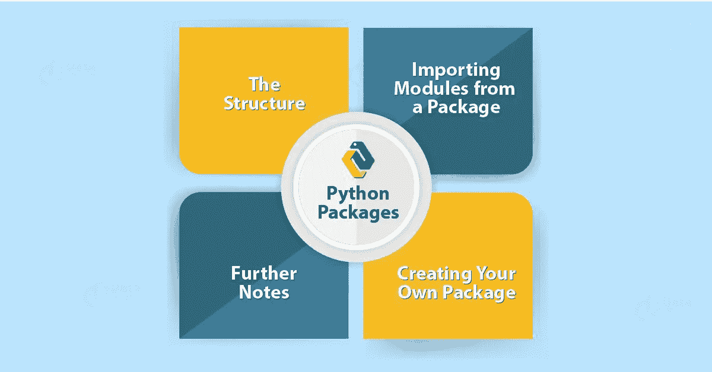
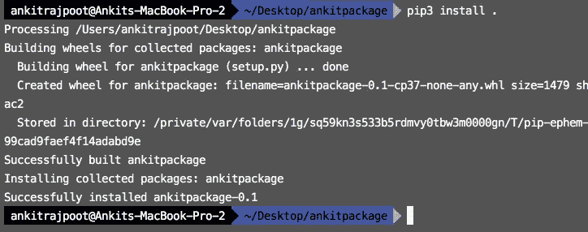
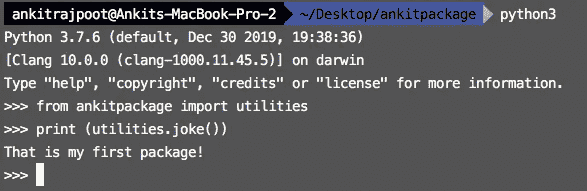
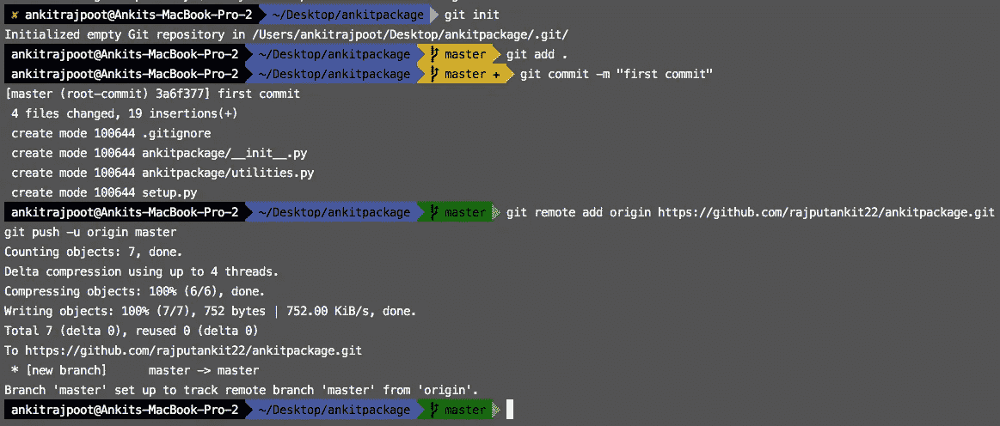
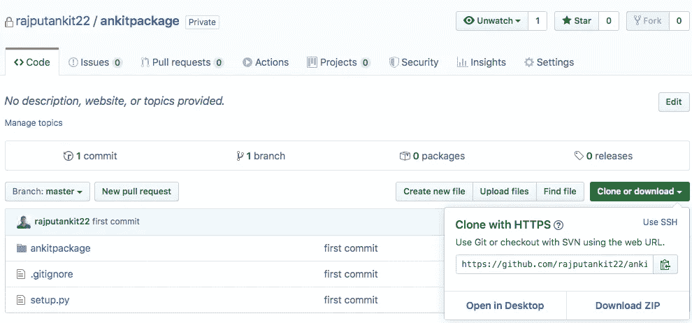
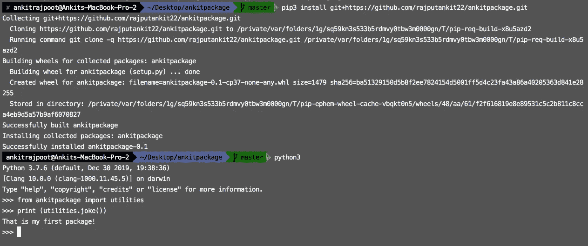
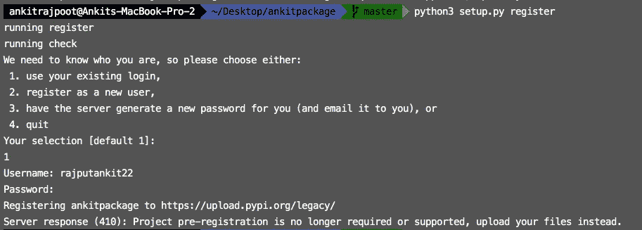
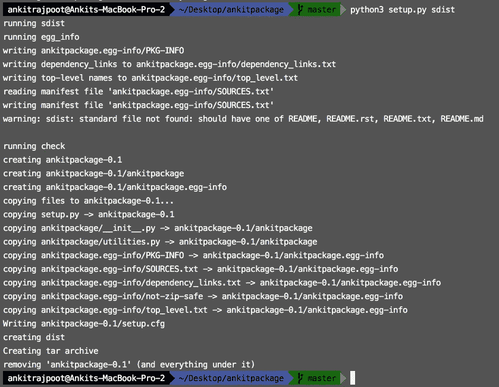
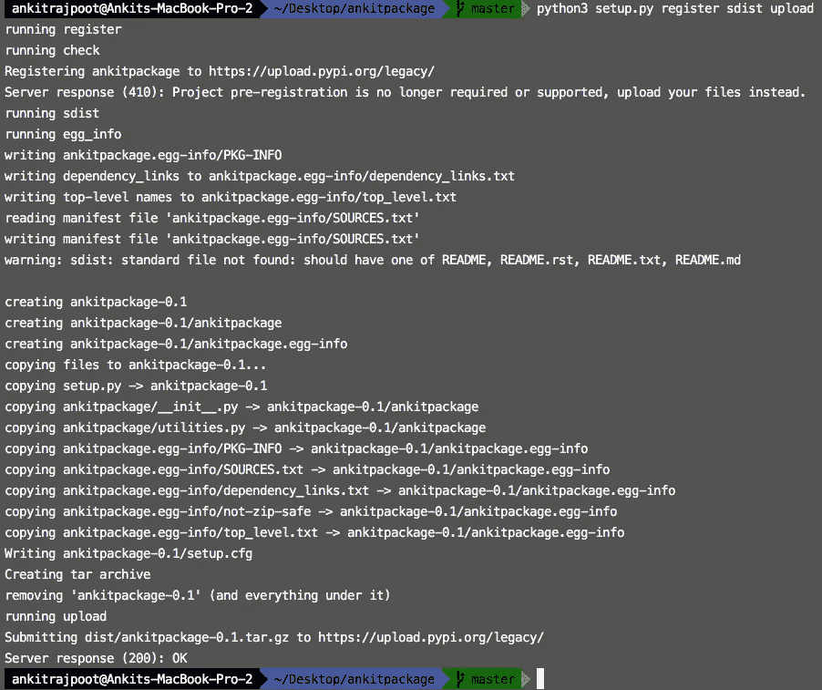
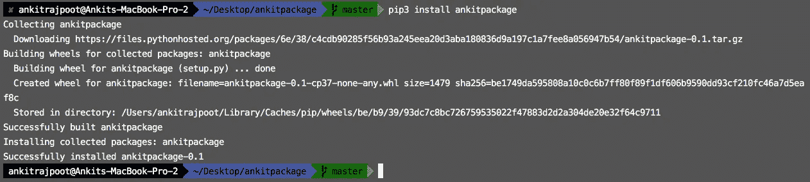

# 如何用 Python 制作包

> 原文：<https://medium.datadriveninvestor.com/how-to-make-the-package-in-python-a82292aeb775?source=collection_archive---------7----------------------->



在本文中，我们将看到如何在 GitHub 和 PiPy 上制作包并公开它。包是模块的集合，模块是函数和类的集合。如果不广泛使用库，构建今天的软件是不可能的。库极大地减少了团队将工作投入生产所需的时间和精力。通过利用开源社区，工程师和科学家可以将他们独特的贡献推向更多的受众，并有效地提高他们代码的质量。各种规模的公司都使用这些库来将他们的工作置于现有功能之上，从而使产品开发更加高效和集中。

## 步骤 1:-创建包框架

**挑名字**

Python 模块/包名称通常应遵循以下约束:

*   全部小写
*   在 PyPI 上是独一无二的，即使你不想公开你的包(你可能想以后私下指定它为依赖)
*   下划线分隔或根本没有单词分隔符(不要使用连字符)

我们决定将我们的代码转换成一个名为`**ankitpackage**`的模块。

`**ankitpackage**`的初始目录结构应该如下所示:

```
**ankitpackage**
├── **ankitpackage**
 └── __init__.py
├── setup.py
```

顶层目录是我们回购的根目录，如`ankitpackage.git`。子目录也称为，是实际的 Python 模块。

## 步骤 2:-填写描述细节

主设置配置文件`setup.py`应该包含一个对`setuptools.setup()`的调用，如下所示:

```
from setuptools import setup

setup(name='ankitpackage',
      version='0.1',
      description='First python package',
      url='http://github.com/storborg/funniest',
      author='Ankit',
      author_email='ankit@example.com',
      license='MIT',
      packages=['ankitpackage'],
      zip_safe=False)
```

## 步骤 3:添加附加文件

额外的文件应该总是添加到内部的`ankitpackage`目录中。

例如，让我们将我们的一个函数移动到一个新的`utilities.py`子模块中，这样我们的目录层次结构如下所示:

```
**ankitpackage**
├── **ankitpackage**
 └── __init__.py
 └── utilities.py
├── setup.py
```

在`utilities.py`中:

```
def joke():
    return ('That is my first package!')
```

# **本地导入**

现在，我们可以通过运行以下命令在本地安装该软件包(供我们的系统使用):

```
$ pip3 install .
```



现在安装后，我们可以在系统的任何地方使用它。

```
>>> from ankitpackage import utilities>>> print (utilities.joke())
```



# 在 GitHub 上发布

## 开源代码库

GitHub，Inc .是一家总部位于美国的全球性公司，使用 Git 为软件开发版本控制提供托管服务。

[](https://www.datadriveninvestor.com/2019/02/21/best-coding-languages-to-learn-in-2019/) [## 2019 年最值得学习的编码语言|数据驱动的投资者

### 在我读大学的那几年，我跳过了很多次夜游去学习 Java，希望有一天它能帮助我在…

www.datadriveninvestor.com](https://www.datadriveninvestor.com/2019/02/21/best-coding-languages-to-learn-in-2019/) 

## 忽略文件(。gitignore 等)

**。gitignore file** 是一个文本**文件**，它告诉 Git 忽略项目中的哪些**文件**或文件夹。一个当地人。 **gitignore 文件**通常放在一个项目的根目录下。您还可以创建一个全局的。 **gitignore 文件**和该**文件**中的任何条目都将在您的所有 Git 存储库中被忽略。因此，我们的目录层次结构如下所示:

```
**ankitpackage**
├── **ankitpackage**
 └── __init__.py
 └── utilities.py
├── setup.py
├── .gitignore
```

在`.gitignore`中:

```
# Compiled python modules.
*.pyc# Setuptools distribution folder.
/dist/# Python egg metadata, regenerated from source files by setuptools.
/*.egg-info
```

现在，通过以下命令在 GitHub 上推送您的包。

```
$ git init
$ git add .
$ git commit -m "first commit"
$ git remote add origin [https://github.com/rajputankit22/ankitpackage.git](https://github.com/rajputankit22/ankitpackage.git)
git push -u origin master
```



## 从 GitHub 安装我们的 Python 库

我们的库托管在 GitHub 上，我们只需使用`pip3 install git+`，后跟 GitHub repo 上提供的 URL(可通过点击 GitHub 网站上的*克隆或下载*按钮获得):



# 在 PiPy 上发布

`setup.py`脚本也是我们在 PyPI 上注册包名和上传源代码的主要入口点。

到`register`包(这将保留名称，上传包元数据，并创建 pypi.python.org 网页):

```
$ python3 setup.py register
```



如果您以前没有在 PyPI 上发布过东西，您需要按照这里提供的步骤创建一个帐户。

首先使用以下内容创建一个源分布:

```
$ python3 setup.py sdist
```



这将在我们的顶级目录中创建`dist/ankitpackage-0.1.tar.gz`。如果您愿意，可以将该文件复制到另一台主机上，尝试解压缩并安装它，以验证它是否适合您。

然后，该文件可以通过以下方式上传到 PyPI:

```
$ python3 setup.py sdist upload
```



## 从 PiPy 安装软件包

此时，该套餐的其他消费者可以安装带有`pip`的套餐:

```
$ pip3 install ankitpackage
```



本文描述了如何用 python 创建包，以及如何为其他开发者和我们的同事推送 GitHub 和 pipy。

***欢迎在评论区提出任何问题或疑问，或者你可以在脸书上 ping 我。***