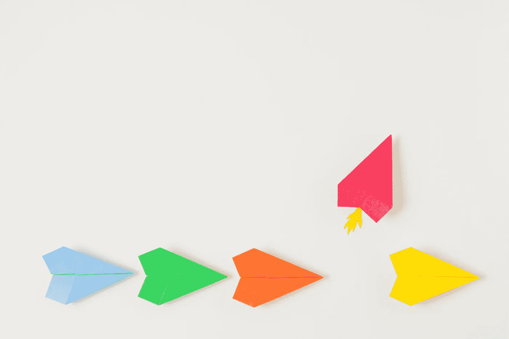
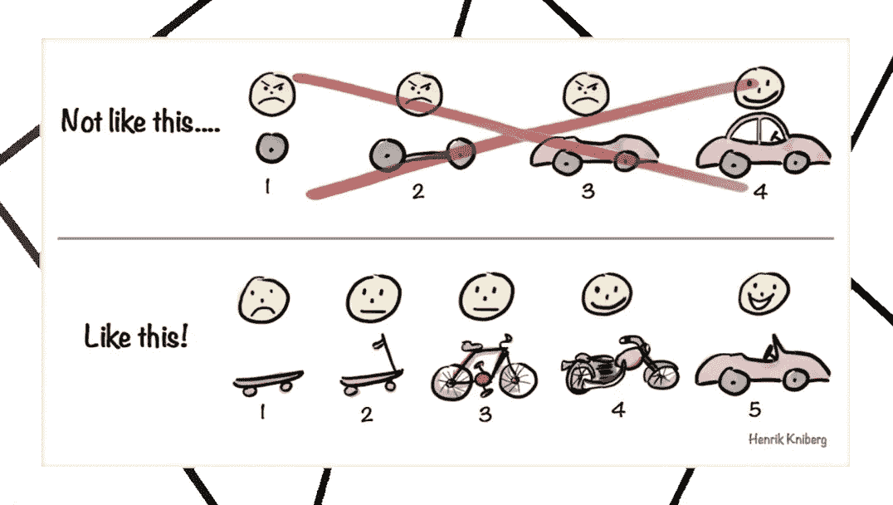
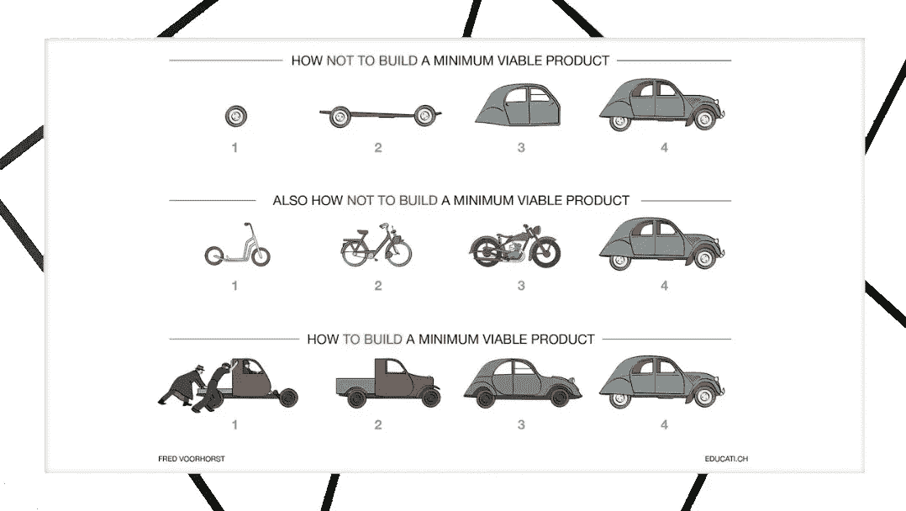
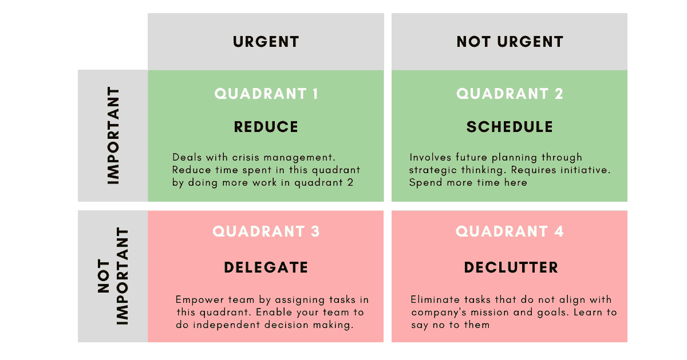

# 如何让用户爱上你的 MVP:)。

> 原文：<https://medium.datadriveninvestor.com/how-to-make-the-users-love-your-mvp-8b33674cc9ad?source=collection_archive---------3----------------------->

在我们看来，MVP 是一个老生常谈的话题。在过去的 5 年中，任何与软件开发有关的人都有 99%的可能性听说过这 3 个字母。但是，尽管信息丰富，人们在创建项目时仍然会陷入“理想产品”的陷阱。

在本文[中，我们](https://geniusee.com)讨论在试点进入市场时，最低可行产品应该是什么。

让我们从一个基于 MVP 原则的创业公司发展路径的病毒式草图开始，它在互联网上流传，你可能也遇到过。

90%的作者在他们的出版物中使用上面的插图，这误导了读者。

 [## 如何为你的成功项目建立一个敏捷团队|数据驱动的投资者

### 运动。改变。适应。这种模型使开发人员能够对变化或突发问题做出响应，而不需要太多…

www.datadriveninvestor.com](https://www.datadriveninvestor.com/2019/12/25/how-to-build-an-agile-team-for-your-successful-projects/) 

# 我们来分析一下，好吗？

**顶线和 MVP 没有任何共同之处。**这就清楚了。它描绘了一个经典的开发周期。在下面的例子中，作者出于上下文的考虑，使用它作为一种夸张。当然，在图片只显示车轮的第一阶段，任何可行性最低的产品都是不可能的。该产品在完成其使命(即让您能够驾驶)之前，要经历 3 个开发阶段(车轮、车身、发动机)。

**但是第二行也没有很正确地反映 MVP 的原则。**为什么我们对最低可行产品的理解与这样一个概念不一致？假设它反映了一个产品的发展道路，很明显它已经经历了 4 个基本的变化。结果，它的创造者们收到了三组通用商品的竞争者:1-一辆滑板-踏板车-自行车；2 —摩托车；3 —汽车。

是的，正如我们所知，买家买的不是产品，而是解决他们问题的方案。溜冰鞋似乎解决了基本需求(比步行移动更快)。但毕竟，溜冰鞋和汽车是完全不同的交通工具，面向不同的受众，驾驶目的的具体细节也完全不同。各种产品满足舒适性、价格、维护复杂性、速度等需求的方式并不相似。因此，每种产品都有自己的目标受众。

这款车吸引了更广泛的用户:老年人和年轻人，独自或结伴旅行的人，去上班或去随机目的地旅行的人——他们需要速度、舒适和在任何天气条件下驾驶的可能性。这种滑板是专为一个人设计的，通常是儿童或青少年，其目的是为了娱乐。将产品改造成一辆需要燃料、昂贵维护和用户至少 17 岁的汽车的前景可能不会受到滑板观众的欢迎——更不用说汽车本身的价格了。那些需要汽车的人最初不会注意你的滑板车。没错，这几个产品每个都可以有 MVP，但彼此都不是 MVP。

这幅图片的作者 Henrik Kniberg 反复写道，他的图像并不总是在正确的上下文中得到解释。事实是，他在其中注入了一个隐喻的含义，其中开发的目标不是制造一辆汽车，而是解决“从 A 点到 B 点”的问题。这个问题最简单可行的解决方案是一个溜冰鞋。也就是把产品搜索的某个概念，以一种抽象的、非常简化的形式，转移到了图片上。不用说，溜冰鞋或滑板车不是汽车的 MVP。图中只是展示了这样的想法，作为产品创作的一部分，你可以做几个支点，最终找到 MVP。

这个 MVP 的修订版对我们更有吸引力:

在产品业务中，一个产品的 MVP 就是产品本身，只是做了一些简化、删减，而且更便宜。高层建筑的 MVP 是同样的高层，但不是 24 层，而是 5 层，没有电梯，垃圾滑道和其他便利设施。汽车的 MVP 就是汽车。首先，它可以由木板和一个粗糙的现成框架制成，带有一个较弱的发动机(或根本没有发动机)，带有一套家具中的座椅。但是它区别于滑板或踏板车的三个关键功能——速度、空间和长途旅行——已经具备了。

# 用 MVP 包装什么让用户想尝试？

有了 MVP 的概念，现在让我们来讨论如何确定一个试点产品的填充，区分功能的优先级，并根据需求制作产品的第一个版本。

首先要做的是找出什么工具、特性和能力对你的产品来说是必要的。

# 帕累托原则

“20%的努力给了 80%的结果，剩下的 80%的努力只给了 20%的结果。”这是一个经验主义的原理，也就是说世界上很多现象，包括发展，都服从这个比例。80%的用户只会使用 20%的功能。因此，你不需要在发布前花几个月的时间将你的产品打磨得晶莹剔透。写下未来应用程序功能的完整列表，并确定那 20%将覆盖用户需求的 80%。

# MVP =必需+简单

你听说过优先级矩阵吗？这是一种流行的任务优先级技术，它在“必需的”和“简单的”尺度上分配特性。画两个轴，横轴表示特定功能实现的复杂度增加，纵轴表示从期望到要求的路径。将所有计划的功能分散在此图上，回答两个问题:

-实现起来难还是容易？

-对用户来说是可取的还是必要的？

有了基于这个矩阵的现成列表，您就可以放心地联系开发人员了。

# 赖斯得分公式

Rice Score 公式是另一种为 MVP 排列思想和特征优先级的有效方法。您需要用四个因子来评估每个函数，并将这些值代入一个简单的公式中。

*   **Reach —您将改善多少用户的生活？**
    (在一段时间内进行评级，并从指标中获取数字，而不是进行猜测)
*   **影响——您对用户的生活改善了多少？**
    (非常多= 3 倍，很多= 2 倍，一般= 1 倍，有点= 0.5 倍，不够= 0.25 倍)
*   **信心——您有多大信心假设是真的，产品会火起来？**
    100% =高信心，经调查或研究证实，80% =一般信心，50% =低信心，50%及以下=大量怀疑)
*   **工作——实施将花费多少工时、工作日或仅仅几天？**
    (1 人日=这是一个开发人员的一天)

# 而不是结论

MVP 方法扮演了一个安全气囊的角色，允许你充分预测产品的商业和技术潜力。所以我们在给客户做简报的时候，坚持认为还是从它开始开发比较好。当然，我们还会帮助确定关键功能。如果您计划创建一个最低限度可行的产品，那么最好的选择是基于 NoCode 技术来构建它。如今，无代码应用程序开发平台需求很大。他们允许你更快更便宜地创建任何复杂的 web 应用程序，现有的 NoCode 自由职业者交流帮助你选择适合你的业务需求的技术和经验证的专家。我们敢假设，简化和降低开发成本的趋势只会加剧。现在是利用其潜力的时候了。

在我们的 [Geniusee 博客](https://geniusee.com/blog)上阅读更多有趣的文章。

**访问专家视图—** [**订阅 DDI 英特尔**](https://datadriveninvestor.com/ddi-intel)