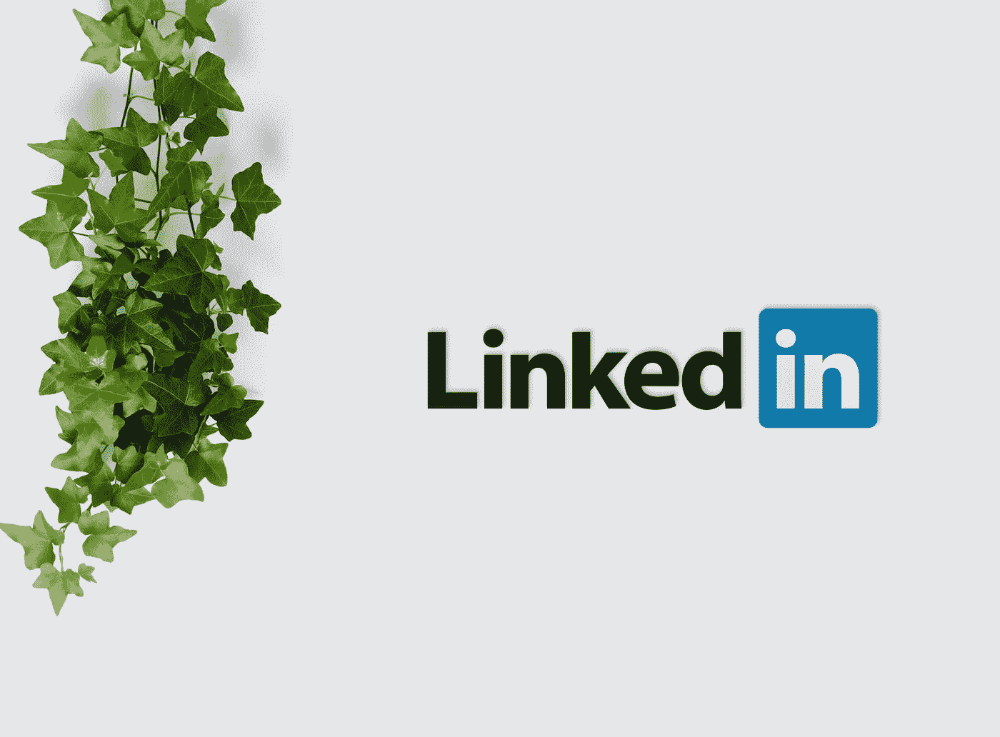

# 如何让自己在 LinkedIn 上更‘招人待见’？

> 原文：<https://medium.datadriveninvestor.com/how-to-make-yourself-more-hirable-on-linkedin-ca645eef0772?source=collection_archive---------3----------------------->

## 有效使用 LinkedIn 作为“工作板”的综合指南。

Photo by [inlytics](https://unsplash.com/@inlytics?utm_source=medium&utm_medium=referral) on [Unsplash](https://unsplash.com?utm_source=medium&utm_medium=referral)

如果我施法让你回到 20 年前，你最想念的是什么？我打赌你的 iPhone 是第一个出现在你脑海里的东西？这就是为什么你和我是非常不同的人。

你看，我一点也不在乎没有 iPhone。当时让我对生活感到恐惧的是，人类怎么没有***【LinkedIn】***来获得合适的工作。我是说，我不知道 90 年代的人是如何找工作的。

我希望你不要认为我很粗鲁，但在目前竞争日益激烈的时代，如果你自称为*什么的，但你不在 LinkedIn 上，请把“专业”这个词从你的称呼中去掉。*

*现在，你可能在想这么夸张是怎么回事？因为不幸的是，仍然有成千上万的人认为 LinkedIn 是一种可选的奢侈品，而不是绝对的必需品。是的，我在这里用了 ***【必然】*** 这个词，我甚至用 ***【绝对】*来点缀。***

* [## 是的，我们可以！SBIR 和 STTR 对美国小企业的资助|数据驱动的投资者

### 在 20 世纪 80 年代，当伯顿·A·魏斯布罗德首次出版《非营利经济》时，他写道，美国经济是由…

www.datadriveninvestor.com](https://www.datadriveninvestor.com/2020/08/10/yes-we-can-the-sbir-and-sttr-grants-for-american-small-business/) 

据我所知，你们中的大多数人可能在生活中的某个时候尝试过 LinkedIn。现在你又想当着我的面说它没用。但如果我告诉你，它对你不起作用的原因不是 LinkedIn 呢？果然是 ***你！***

你需要明白的是，LinkedIn 不像 Twitter，在那里你可以转储任何你想要的信息。这是一个专业平台，需要你投入时间和精力来精心制作一份散发着 ***“可雇佣性”的个人资料。***

我没有心情让你淹没在一大堆让你在 LinkedIn 上更容易被雇佣的建议中。不过，你能搞定五个吗？太好了，那我们开始吧。* 

# *1.视觉效果大有帮助*

*让我们从基础开始。*

*我见过人们在 LinkedIn 上犯的最常见的错误之一是不张贴 ***【专业】*** 展示图片。*

*我不想打破你的幻想，但这不是一个社交网络。根据这个词的任何定义，LinkedIn 都不符合被称为社交网络的要求。是个 ***专业网。****

*在为 LinkedIn 选择个人资料图片时，请记住，没人在乎你完美的沙滩照。这可能看起来微不足道，但如果你在 LinkedIn 上发布一张坦诚的照片，你将立即失去可信度。*

*就我个人而言，我喜欢你的遮阳篷；相信我。它们在你身上看起来棒极了。不幸的是，他们不属于 LinkedIn。*

*最后，如果你在 LinkedIn 这样的专业网络上展示你最喜欢的演员或者超级英雄的照片，我甚至不会对此发表评论。在那种情况下，你已经无可救药了！*

*我认为，意识到一张照片是否适合 LinkedIn 的最简单方法是问自己，他们是否会让你在护照上放这张照片？换句话说，选择一张你直视镜头的高清图片，并在你胸部周围的某个地方进行剪切。*

*但是等等，这项工作还没有结束。在你开始吸引潜在雇主的注意之前，我们还需要编辑你的 LinkedIn 个人资料。*

*第二步是放一张合适的 ***封面图片。*** 我知道封面照片是否能极大地提高你在 LinkedIn 上的可雇佣性是有争议的。但你不能否认，这让你的个人资料在视觉上更有吸引力。*

*此外，与坚持默认的封面照片相反，它会让任何访问你的个人资料的人立即尖叫，你实际上投入了时间在 LinkedIn 上创建了你的个人资料。*

*对于封面照片，我建议选择与你的职业主题相匹配的图片。例如，我是一名全职自由撰稿人。因此，我的 LinkedIn 个人资料封面是一张办公桌的照片，上面有一台笔记本电脑、一个记事本、一支笔和一个有序放置的咖啡杯。明白了吗？*

# *2.然而，这并不全是视觉上的*

*图像已经处理好了。现在让我们向下滚动，开始在 LinkedIn 上插入与工作相关的信息。*

*但在你这么做之前，我希望你明白一个事实，你的潜在雇主是来见人的，而不是机器。*

*建议在 LinkedIn 上用正式语气，当然。但是要避免走极端，尤其是在 ***【关于】*** 部分，这看起来像是机器人写的。*

*与流行的观点相反，你的 LinkedIn 个人资料应该与你的潜在雇主对话，而不是听起来像一个无聊的、技术性的阅读。*

*一旦你脱离了机器语言，你就可以更灵活地在你的简历中战略性地放置与你感兴趣的工作相关的关键词。是的， ***搜索引擎优化*** 来救场了。你在相关搜索中排名更高的机会刚刚得到了巨大的提升。*

*当谈到在 LinkedIn 上加载你的学术和专业信息时，有两件事要记住。首先，仅在教育部分输入学士及以上学历。这将有助于避免弄乱你的个人资料。*

*我只会建议，如果你的高中非常受欢迎，可以帮助你在 LinkedIn 上建立一个更强大、更广泛的职业网络，那就把你的高中也包括在内。*

*其次，在经验部分，不要做一个只输入公司名称和职务的懒鬼。花点时间详细阐述你的角色。你有什么样的责任？你处理过什么样的项目？你受过什么样的训练？*

*学会从你的 ***雇主的角度*** 思考。如果你处在他们的位置，你会想在一个不完整的个人资料后面开始一段对话吗？很清楚地知道你冒着最终意识到他不适合这份工作的风险，而你只是把时间浪费在一次没有任何结果的谈话上？*

*让我们尊重这样一个事实，招聘人员的工作性质决定了他们是非常忙碌的人。你不能只在 LinkedIn 上强调你学术和职业生活中的点点滴滴，然后指望他们跑来找你。*

# *3.监控你在 LinkedIn 上的活动*

*每次我上 LinkedIn，滚动我的新闻源，总有一两个家伙在平台上发布 ***有趣的模因*** 。你能怪我冒心绞痛的风险吗？*

*这就是我一开始强调 LinkedIn 是 ***而不是*** 社交网络的原因。你想发布一个迷因，你的猫的一个片段，一个有趣的视频，你有很多其他的途径。去脸书，Instagram，WhatsApp，抖音，Snapchat，Twitter。*

*但请避开 LinkedIn 上的这类帖子。如果这是你在 LinkedIn 上发布的那种内容，你将浪费你投资在用 ***专业性*** 装饰你的个人资料页面上的全部时间。*

*重点是，LinkedIn 不是和你的朋友开怀大笑的平台。没什么平台随便滴 ***【嘿那儿】*** 短信闲聊。这当然不是寻找约会的平台。实际上，我认为在 LinkedIn 上约别人出去是一种不恰当的行为。*

*这就像你遇到了一个来你公司面试的人，相反，你开始和他们调情。爬出来了吗？*

*所以，下次你有一点额外的时间，你想把 LinkedIn 当成一个社交网络，我希望你退出 feed，转到你的个人资料页面。开始集思广益，进一步提升你的个人资料。*

*你有可以展示的 ***证书*** 吗？为什么你没有参加与你正在寻找的工作类型相关的课程？*

# *4.但是，嘿，也不要放弃它*

*回到我刚登陆 LinkedIn 的时候，一想到自己表现得不专业，我就害怕自己几乎从不使用 LinkedIn，除非有潜在雇主联系我，向我提供工作机会。*

*但这也没有发生。*

****为什么？****

*因为 ***LinkedIn 的算法*** 用你在平台上的活跃度作为衡量标准，来决定你在相关搜索中的排名。由于我在创建个人资料后很少登录 LinkedIn，潜在雇主在相关搜索中看到我的个人资料的可能性微乎其微。*

*你可以把它看作是监控你在 LinkedIn 上活动的延伸。是的，你必须避免在平台上发布随机的、不相关的内容。但这并不意味着 ***完全抛弃*** 就没事了。*

*你在 LinkedIn 上的活动可以围绕你的工作。例如，作为一名内容作家，我经常在 LinkedIn 上发布我发表的作品。甚至我在 Medium 上写的这个博客。这会出现在我的 LinkedIn 个人资料里。*

*在研究过程中，如果我遇到一篇特别有用的文章，比如说关于 ***搜索引擎优化(SEO)*** 的文章，我总是会在 LinkedIn 上分享给我的同行。成功完成一个项目，获得加薪，升职，一个相关的工作故事，这些都是 LinkedIn 上总是受欢迎的信息。*

*除此之外，你应该在 LinkedIn 上保持活跃，建立联系，扩大你的人脉。尝试与和你从事相同职业的人联系。特别要关注那些目前在 LinkedIn 上针对的 ***公司工作的人。****

*你和他们的员工联系得越多，你的能见度就越好，你最终从他们的招聘人员那里得到消息的机会就越大。*

*我绝对 ***不是*** 在这里为 LinkedIn 做广告，但我还是会推荐成为高级会员。因为这样你就能看到谁查看了你的个人资料。从那时起，你在玩一场 ***的心理学游戏中处于一个更好的位置。****

*也许他们第一次就传了你的资料。但是一旦你给他们发送了连接请求，你就会再次出现在他们的屏幕上。如果你在 LinkedIn 上很活跃，你的名字就会经常出现在他们的视线中。*

*这就像一个微妙的操纵，让他们选择你的个人资料。在某些时候，你永远不知道，他们最终会联系你。*

# *5.有人能为你担保吗？*

*还记得有一次你想从一家你从未尝试过的商店买一块手表吗？可以理解，你想确保你不会后悔购买。所以，你去网上找评论。*

*在这方面，你在 LinkedIn 上的潜在雇主没有任何不同。*

*你可能有一份看起来很专业的个人资料，你的学术和工作信息可能是 ***准确地说是*** 符合雇主的要求。然而，他不愿意接近你，因为你没有推荐信、背书或技能测试来为你担保。*

*在这种情况下，你就是守夜人。你可以尽情吹嘘你的质量、可靠性和风格。但是顾客不会买任何东西，除非他找到一群和他有同样想法的人。*

*简单地说，你的话不足以证明你的技能。毕竟，在你的 LinkedIn 个人资料上突出你想要的任何技能都是免费的。谁敢说你不会作弊？*

*为了补救，我养成了周末在 LinkedIn 上查看 ***相关技能测试*** 的习惯。不到一个月，我所有的基本技能都在 LinkedIn 上得到了验证。一旦一个潜在的雇主现在登陆到我的个人资料上，他会提前知道我会把我的钱用在我的嘴上。*

*谢天谢地，作为一名自由职业者，我有幸与数百名客户共事。在我看来，这是我在 LinkedIn 上获得数百次支持和推荐的机会。*

*我的工作报酬是 ***不再仅仅是金钱*** 了。我也总是在 LinkedIn 上请求支持，这对于获得下一份工作甚至更好的任务有很大帮助。*

*这里要记住的重要一点是，除非被要求 ，否则你的许多同行和同事可能不会有兴趣在你的 LinkedIn 个人资料 ***上留下背书。要求一个也没什么不专业的。不，你不是在请求帮助。你在要求本该属于你的东西。****

*所以，这就对了。这就是在 LinkedIn 上成倍提高你的 ***【可雇佣性】*** 所需要的一切。*

*基本的东西，真的。然而，我们很多人都失败了，只是因为我们不愿意花一点时间来改善我们的形象。*

*最重要的是，LinkedIn 比任何求职网站都更适合你。所需要的只是你的一点时间和注意力。为了得到你梦寐以求的工作，这是你无法承受的代价吗？*

***访问专家视图—** [**订阅 DDI 英特尔**](https://datadriveninvestor.com/ddi-intel)*