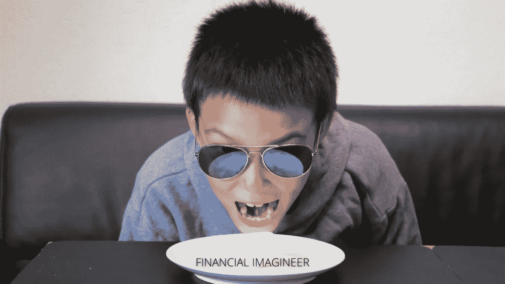
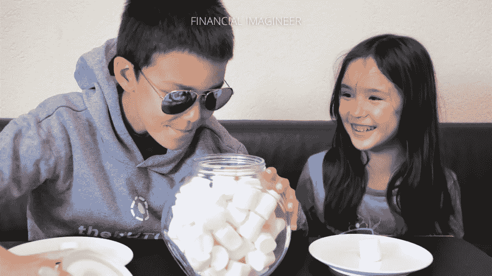
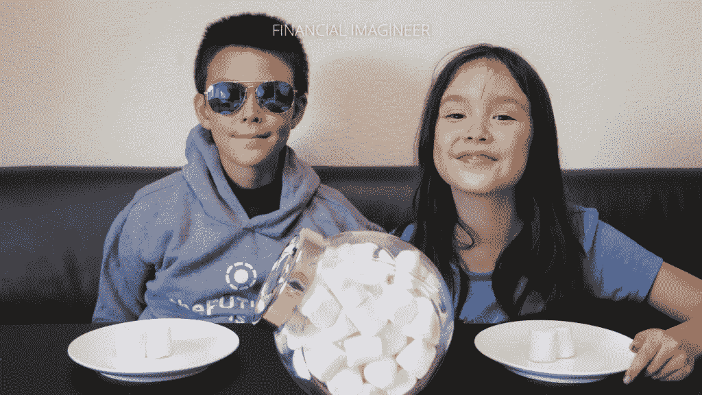
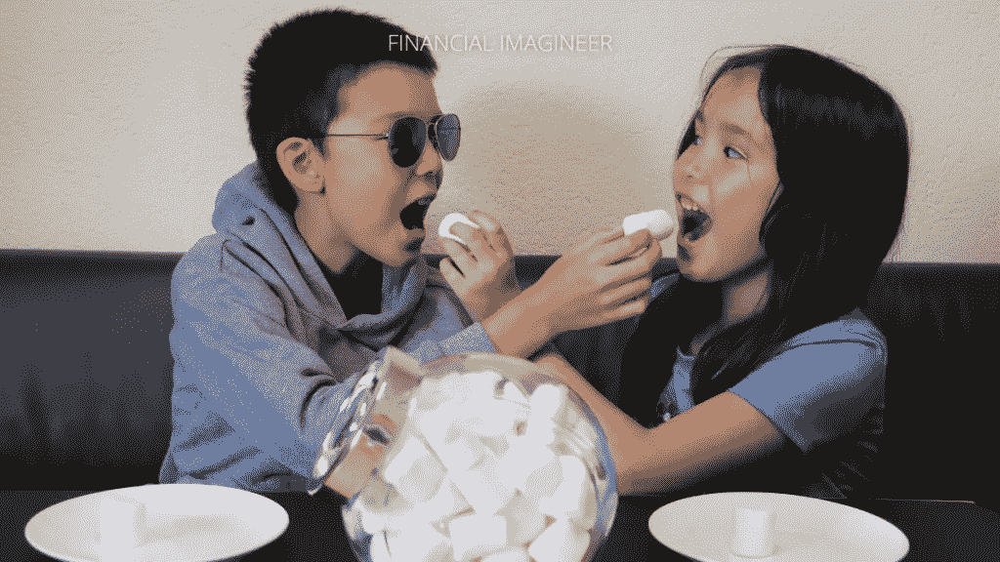

# 如何用棉花糖测试自己——金融幻想家

> 原文：<https://medium.datadriveninvestor.com/how-to-marshmallow-test-yourself-financial-imagineer-a79b4d1e232d?source=collection_archive---------29----------------------->

“棉花糖测试”最早是由斯坦福大学教授沃尔特·米歇尔在 20 世纪 60 年代末进行的。多年来，由于其结果，它成为延迟满足主题最著名的研究之一。

是关于什么的？它是关于测量年轻的孩子如何利用他们的意志力来推迟他们的满足感，以及这对他们在生活的许多领域的潜力有什么影响。

测试很简单:一个孩子被带到一个房间，给了他一个盘子，上面有一个棉花糖。然后它被要求做出一个简单的选择:现在就吃掉你面前的这个棉花糖，或者等 15-25 分钟，以便在上面得到第二个棉花糖！

简而言之:每个孩子可以选择现在吃一个棉花糖，或者以后吃两个棉花糖。大多数孩子选择以后吃两个棉花糖。然而，他们被单独留在某个地方 15 到 25 分钟(取决于年龄),不可抗拒的甜棉花糖就在他们面前…

然后测试测量孩子能够等待的秒数。几十年后，研究人员重新审视这些孩子的生活。他们可以证明，一个孩子在五岁时吞下棉花糖之前能够等待的时间越长，对他们成年后的一些非常重要的生活结果具有显著的预测作用。

他们发现，能等(更长时间/第二个棉花糖)的孩子更有可能通过更难的考试，有更好的社交技能，更自信，更成功，更健康，是的:更快乐！

当然，这个测试可能有一些局限性，但是，关键的本质是正确的。在这篇文章的最后，我们将会看到更多挑战这个测试的关键思想。

# 如何通过棉花糖测试？

首先，很简单:不要吃棉花糖！

这听起来很简单，但对一个小孩来说并不像你想象的那么简单。

研究人员强调了关于孩子如何成功通过测试的两个重要发现:

首先，看不到奖励会让孩子们等得更久。这意味着，不要一直看着该死的棉花糖。想办法欺骗你的大脑改变你的想法。

 [## 加密过山车 ETH2.0 测试网的麻烦，动荡的市场，美联储谈论 CBDCs |数据…

### 是只有我这么想，还是外面的情况越来越乐观了？从酒吧凳体育创始人戴夫波特诺伊泵他最喜欢的…

www.datadriveninvestor.com](https://www.datadriveninvestor.com/2020/08/20/crypto-rollercoaster-trouble-on-the-eth2-0-testnet-volatile-markets-the-fed-talks-cbdcs/) 

第二，使用分散注意力的策略对孩子们等待的时间也有积极的影响。一些孩子开始唱歌，用手和胳膊遮住眼睛，开始踮起脚尖，向天花板祈祷等等。一个小女孩甚至骗自己睡着了——正如安德烈·科斯托拉尼所证实的，这是一个非常成功的获得高额回报的方法:

> *“买股票，吃点安眠药，别再看报纸了。许多年后，你会发现你很富有。”*
> 
> 安德烈·科斯托拉尼

成功的关键似乎是能够专注于长期目标，尽管短期的注意力磁铁。

这是一种交换。

大多数人天生选择即时满足而不是其他。

如果你找到了欺骗自己短期“受苦”的方法，你就能在以后打开通往更多快乐乐土的大门:

*   如果你现在锻炼，你会变得更健康。
*   如果你努力学习:你可以去你梦想的学校。
*   如果你聪明地工作:你会有一个伟大的职业生涯，甚至开创自己的事业。
*   如果你不出去吃饭:你会节省更多。
*   如果你现在不买那个玩具:你会投资更多，变得富有。
*   如果你不浪费你的时间和精力:你的梦想将会成真！

虽然我们彼此都不一样。补救方法是一样的。

关键是找到你能够延迟满足的领域。

自我控制是成功的关键。

如果你能抵制短期的诱惑，你会走得很远！

# 如何教授棉花糖试验的发现

虽然教授上述信息和事实很容易，但难的是教授你可以用来实际改善你的行为和结果的方法。

斯坦福心理学专家认为，21 世纪父母需要教给孩子的最重要的技能是“变得不可分离”。在我们现代社会，这是一个棘手的问题，因为街上的新货币是“注意力”。更重要的是，花些时间学习专注于自己或者以这样或那样的方式教你的孩子这项技能是非常重要的。

俄勒冈大学的迈克尔·波斯纳和他的同事用一种违反直觉的方法来教授注意力，他们对 4-6 岁的孩子进行了研究，目的是用电子游戏来教他们更好地集中注意力。在其中一项练习中，孩子们必须使用操纵杆来控制猫头顶的雨伞，目的是让猫在跑来跑去时保持干燥。孩子们可以集中注意力，让猫保持干燥。这样的课程使孩子们的技能得到了实质性的提高，包括更高的非语言智商水平。

另一种方法是通过故事教学。

例如，芝麻街创造了饼干怪兽必须学会控制自己的环境。他不能马上吃掉他的饼干——就像马上吃掉第一个棉花糖一样——他必须表现好并等待。他的目标是加入“饼干鉴赏家美食俱乐部”,是的，为此你必须能够等待你的饼干。在这一集里，饼干怪兽学会了一些策略，比如“框架”，他假装棉花糖只是一幅画——因为如果它只是一幅画，你就不能吃它。饼干怪兽也有欺骗自己的想法，让自己相信饼干是有臭味的鱼，那么他就根本不想要它们。

对你自己和孩子来说，关键的概念是在享受乐趣的同时，接触展示自我控制的策略。最好的策略包括两者:伟大的可教性和内在的自我激励。孩子——和成年人——一定想改变自己。

最终，这样的练习将有助于培养性格、勇气、毅力和对挫折的忍耐力。)、感激、乐观、兴奋以及如何为新项目积蓄能量。

比简单地教你的孩子一些东西更重要的是:你要去示范它。如果你承诺了什么，你就得信守承诺。如果你违背了自己对孩子的承诺，那就很难指望你的孩子会延迟满足。

最后:孩子们必须明白他们的行为是有后果的。

如果他们以建设性和创造性的方式行事，结果是好的。如果他们以消极的方式行事，后果是“不太好”。作为父母，你的职责是创造这样的环境，让他们意识到他们所做的事情和最终发生在他们身上的事情之间存在联系。通过这种方式，他们可以将这些教训内化，并有更好的机会在以后过上他们梦想的生活。

这是我写的另一篇关于如何教孩子变得真正(经济)独立的文章。

# 棉花糖如何考验自己？

如上所述，延迟满足有很多方法。本质是不要把所有事情都推迟到 25 年后，现在绝对不享受。

那不是生活的方式！

然而，你可以做很多小事，现在就用棉花糖来测试自己，以下是我个人认为最重要的五件事:

## 1]你看到了想买的东西:

试着不去看它，隐藏它，等待——坚持几天，让你的情绪冷却下来。

在 80%以上的情况下，你可能会再次忘记它。如果没有，也许有，买吧。

## 2]你查看你的账户，发现你的股票涨跌了很多——你想采取行动:

花些时间再想想你当初为什么买这些股票？试着想一想，你的任何长期假设是否发生了戏剧性的变化？是你的情绪而不是你的理性思维在引导你吗？控制你的情绪，检查[恐惧和贪婪](https://www.financial-imagineer.com/2020/09/19/fear-and-greed/)指数。或许可以睡一觉。大多数情况下，你的结论和以前一样。如果没有，也许就采取行动吧！

## 3]夜深了，你想去网飞放松一下——但是你现在也有那个好主意…

不要强调太多，但是要这样做:先花 5 分钟，坐下来，把你的想法写下来。一旦你把它写出来，你就可以知道你是愿意现在就去实现你的想法还是继续看《网飞》。也许你太累了，宁愿睡觉也不愿看电视，这样你就可以一大早就开始构思了？

## 今天是这个月的最后一个星期五，你刚刚收到你的月薪。

很高兴看到你的现金账户被填满了。周末快到了。你想出去吃晚餐，理个发，买些新衣服，挥霍一下，也许为周日的早午餐准备一些独家的[手工面包](https://www.financial-imagineer.com/2020/08/09/bake-yourself-rich/)——毕竟，这是你应得的！对吗？

棉花糖先测试一下自己怎么样？怎么会？是的，这是你应得的:首先支付你自己！自动每月从你的工资账户中扣除一部分到你的储蓄和投资账户中。在你花钱之前，投资于你的[丰富的收入流系统](https://www.financial-imagineer.com/2020/08/01/how-to-build-your-abundant-waterfall-of-income-streams/)。那就去玩吧！

## 最后但同样重要的是，我们都是人，是的，你会失败。这是自然的。

然而，痛打自己，对自己苛刻也无济于事。这是浪费能量。实现目标的百分之八十是基于你的态度。态度决定高度。如果你计划实现雄心勃勃的目标，你需要时间来建立足够的自制力、纪律性和专注度。

> 成功包括从失败走向失败而不丧失热情。
> 
> *温斯顿·丘吉尔*

有些人对棉花糖试验的结果持有合理的保留意见。正如本文开头所承诺的，免责声明如下:有人认为，成功父母的孩子通常在棉花糖测试中表现更好，不是因为他们能更好地控制自己的意志力，而是因为这些孩子周围都是“值得信赖的成年人”。因此，孩子们相信第二个棉花糖将来会在那里。

尽管如此，我坚信，掌握自我控制，以毅力、勇气和耐力为长期目标而努力，比不努力更有回报。在我小时候，我爸爸也让我测试过棉花糖。这是你可以学习并传给下一代的东西。

结尾的谚语是这样的:

> *“人生无常，先吃你的甜品吧！”*

然而，人类的平均寿命稳步增长。我们现在比以往任何时候都有更多的“未来”可以支配。因此，尽管生活充满不确定性，试着关注你未来的享受，描绘你想象中的生活——这样你就能更好地忍受这个实验，这个方法。

请以一种有趣的方式可持续地做。

多吃棉花糖！

明天——不是今天！

训练自己！

让它变得有趣。

马特(男子名ˌ等于 Matthew)

如果你喜欢这篇文章，请考虑通过电子邮件订阅我的博客，喜欢我的[脸书页面](https://www.facebook.com/financialimagineer/)或者在[推特](https://twitter.com/FI_imagineer)上关注我。

*原载于 2020 年 9 月 23 日 http://www.financial-imagineer.com***。**

***访问专家视图—** [**订阅 DDI 英特尔**](https://datadriveninvestor.com/ddi-intel)*