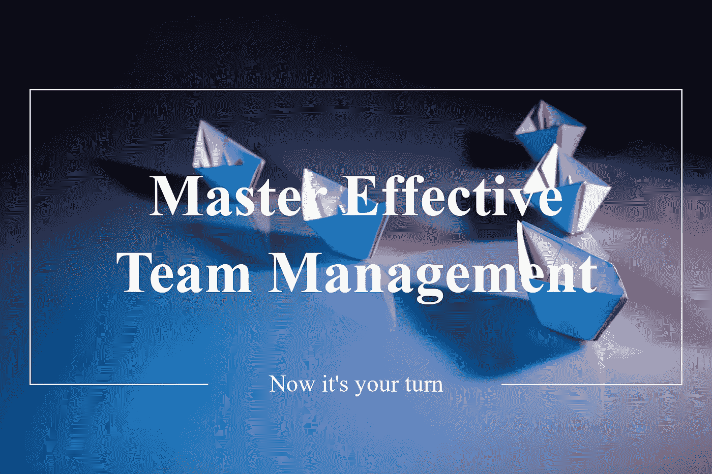

# 如何掌握有效的团队管理

> 原文：<https://medium.datadriveninvestor.com/how-to-master-effective-team-management-2fa3f5cca95f?source=collection_archive---------19----------------------->

Master effective team management — now it’s your turn

团队管理往往是你可以用正确的工具来学习的东西。这是大多数企业和公司的基础，在这里你与人们一起完成重要的任务。这是一个独特的回报和令人满意的职业道路和技能。作为一名企业家和团队经理，你有机会激励和影响团队更上一层楼。领导力是团队管理的一个重要部分，但是记住你应该领导人们和管理过程总是值得的。正如彼得·德鲁克(Peter Drucker)如此雄辩地指出的:

> 管理就是把事情做对；领导力就是做正确的事情。

在这篇文章中，你一定会学到如何有效地管理你的团队，以便他们能为你的企业或组织取得最好的结果。

# **创建一个适应性强的计划**

你可能知道一句谚语:

> 如果你没有计划，那么你就计划失败。

团队内部也是如此。每个取得巨大成功和荣誉的优秀团队都需要一个可靠的计划。作为团队经理，你将负责与团队一起制定详细的计划。看看适应性强的计划的考虑因素:

*   **从为什么开始:**出色地执行与为你的企业或团队找到目标一样重要。许多团队都是从一个大的愿景开始，并把小目标归于它。这一步必须坚持，这样你的团队才能确切地知道你的组织的目的。你会发现一个更积极、更投入的团队，他们总是以一种目标驱动的方式工作。
*   有战略眼光:一起制定战略的团队是一个团结一致的团队。总是花时间制定一个坚实的团队目标和实现目标的小目标。一个伟大的战略是有抱负的，并将让你的团队继续前进。记住，它也是多变的，你必须定期会面来跟踪进展。
*   **始终衡量成功:**正如规划对于您的愿景、战略和团队目标至关重要一样，您也必须有一种方法来直观地衡量这些成功点。您可以通过在每周团队会议、联系会议中跟踪成功措施，以及分享团队绩效的每周更新来实现这一点。

现在你有了一个适应性强的计划，让我们看看你应该如何有效地授权。

# **委派给合适的人**

大多数经理把授权作为减少工作量的一种方式。然而，当你授权给合适的人时，它可以成为一个强大的工具来授权给你的团队。此外，它可能会让你腾出一些时间来进行更具战略性的思考。委派是一门艺术，随着时间的推移你可以掌握，我们相信有一些关键的方面你应该记住。有效授权的好处包括:

*   有时，当你管理一个团队时，它会变得很忙，而人员管理有许多动态。有效地授权有助于你掌控自己的工作重点，因为你可以与未来的团队经理分享你的工作量，同时也授权给他们。
*   **你的团队感到被赋予了权力:**如果你在公司的不同部门工作过，你会发现员工非常不投入，他们很想知道你在做什么。他们甚至渴望成为团队经理。如果你能把自己的角色想象成一个导师和指导者，你可能就处在一个理想的位置，在你指导他们的时候帮助你的团队成长。
*   **更好的沟通和信任:**不要犯错，导师，委派工作并不容易。通常需要几个月的时间来微调各个方面。然而，一旦一切就绪，你肯定会看到你的团队关系开花结果，因为它改善了你的沟通方式和整体信任。因为你会花更多的时间参与，你的沟通会改善，你会对你的团队了解更多。

现在是我们更进一步，更详细地研究沟通的时候了。

# **创建沟通模式**

团队就像一个活生生的有机体，他们需要参与才能继续前进。这是存在于你的公司中的一个小型社会。作为团队经理，你肯定会发现一系列的沟通挑战，这些挑战可能会让你感到惊讶，但也会让你感兴趣。也就是说，你只需要有一个开放的心态来征服优秀沟通的要素。以下几个方面证实了有效沟通的重要性:

*   清晰:当团队成员工作时，清楚地知道需要什么是至关重要的。这可能意味着一个平淡无奇的完工项目和一个巨大成功的项目之间的区别。当你知道你的生意有多大风险时，清晰的沟通就变得必要了。
*   **更好的团队合作:**当每个人都很好地沟通时，团队合作得更好是非常正确的。这意味着工作完成得更快，产出的质量更高，过程中讨厌的分歧或挑战更少。
*   **客户维系:**通常，当团队无法有效沟通时，您的客户会感受到影响，可能不想与您做生意。改善团队沟通模式可以创造奇迹，积极吸引客户，让他们始终拥有世界级的体验。

一旦你应用了计划、授权和有效沟通这三个步骤，你就已经为最终的协作模式建立了一个优秀的计划。

# 创建协作模型

也许你遇到过团队不团结的情况。这可能会影响你周围的整体情绪。更不用说浪费的时间，不便，和一般的不愉快。但事实并非如此。团队可以协作，不管他们看起来多么不同，或者他们可能察觉到多少挑战。这实际上是为你的团队创建一个模型，并确保每个团队成员都知道如何有效地处理各种情况。你的角色是尽可能少的摩擦来促进这个过程。如果你做对了，你可以得到以下好处:

*   良好的团队精神:快乐的员工可以移山，好消息是协作和团队合作的感觉可以帮助创造快乐的员工，他们总是做得更多。你会看到你的团队的总体情绪发生了变化，并且你会因此成为一个更快乐的团队经理。
*   **员工保留:**说到前一点，当一个团队参与进来，并全力协作时，员工倾向于留在公司。这是显而易见的，因为越来越多的员工感觉与团队的目标和愿景联系在一起，并且有一种普遍的同志情谊。
*   **增加公司的整体利润:**自然，当团队快乐、敬业并留在你的公司时，你会感受到整个组织的利益。这表现为利润率的提高，因为工作标准会随着时间的推移而提高，而且不断雇佣新员工的成本也会降低。

总的来说，有效的团队协作有很多好处，但最好是具备所有必要的要素。

# 结论和最终想法

很明显，世界正在快速变化，敏捷团队经理需要在全球范围内帮助和支持团队做好他们的工作。因此，有必要遵循团队管理流程。这样做，你将提高领导和管理不愉快的团队情况的能力，并将它们转化为解决方案。你已经学会了如何创建一个适应性强的计划，并在你朝着正确的方向前进时稳定你的团队。毫无疑问，这将有助于你有效地授权给你的团队。在这个过程中，当你把目光放在达到下一个管理水平时，你将为管理团队做好准备。当然，沟通在你做的每一件事情中都至关重要，正如你可能已经注意到的那样，它将培养持续很长时间的积极和迷人的关系。最后，团队管理的所有要素将汇集在一起，创造成功的秘诀，你将拥有一个有效协作并实现所有团队目标的团队。

简而言之，这是有效的团队管理，但要实践它，你可能需要广泛的详细计划，遵循一步一步的方法。因此，我们为现在的经理、企业家和即将成为经理的人创建了一个全面而实用的指南，其中充满了现实生活中的管理实例。如果你喜欢这篇关于如何掌握有效团队管理的文章，你肯定会喜欢我们的新书，它更详细地强调了这些方面。请随意查看[掌握有效的团队管理](https://amzn.to/2SEmDwa)。