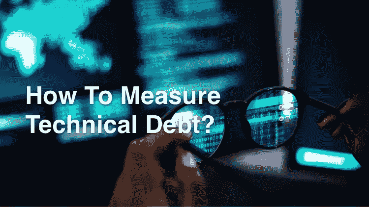
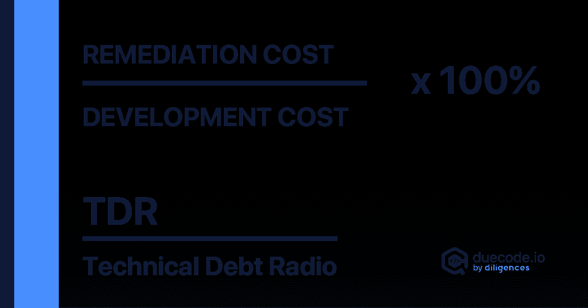
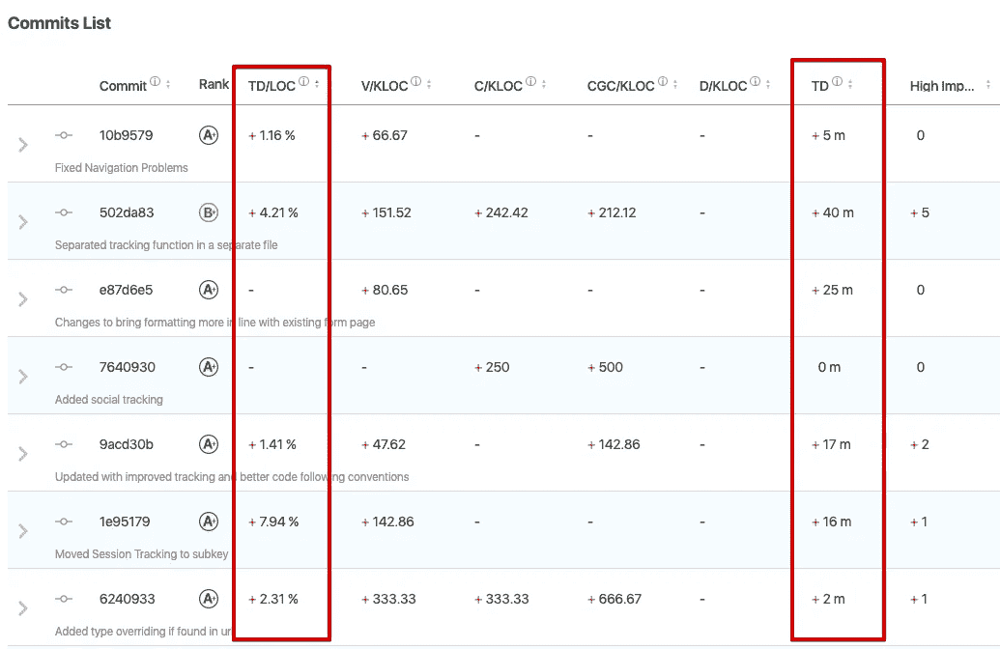
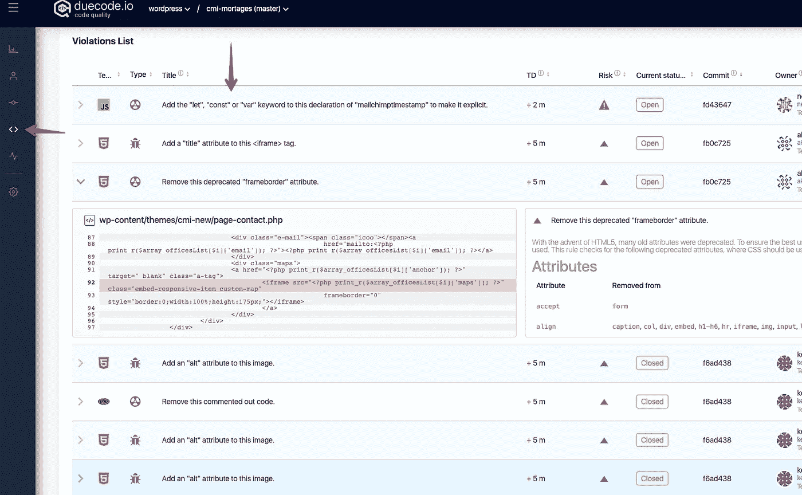

# 如何衡量技术债？

> 原文：<https://medium.datadriveninvestor.com/how-to-measure-technical-debt-92b739654c7c?source=collection_archive---------52----------------------->

如果你有任何 IT 经验，你可能听说过技术债务，但是当产品管理是你不熟悉的东西时，对你来说有大量的新事物，特别是如果你从未从事过 IT 行业。

如果你和软件开发有密切的联系，你肯定知道这个主题。但是，如果你来自销售部门或任何其他非技术部门，你可能会感到困惑。

我假设这是你找到这篇文章的主要原因！因此，让我们带你进入技术债务的世界。

技术债怎么定义？“技术债务”(也称为技术债务或代码债务)显示了当软件工程团队依赖有助于在短期内实现快速项目交付的简单解决方案时会发生什么；然而，从长远来看，这些方法并不是最好的解决方案，因此会造成技术债务。

基本上，技术债务是公司获得的费用，因为软件开发人员决定通过选择捷径来构建软件，采取更简单和更快的方式来按时交付，而不是详细、先进和优秀的方式。一旦软件被开发出来，公司就会在以后的阶段产生这笔费用。所以对公司来说是债务，可以事前核算。它支付公司为满足实际业务需求而必须长期支付的后期债务。

# 现在你对技术债务这个术语已经很熟悉了，你该如何衡量它呢？

我相信你知道一句广为流传的名言:“如果你不能度量它，你就不能修复它。”在我们支付技术债务之前，我们需要首先测量任务的当前状态。软件工程师几乎不可能手工度量技术债务。这样做将需要我们深入代码库，检测所有可能的错误，毕竟，逐步估计每个可能的问题。这是低效的，并且不可能同时解决每个发展中的问题。有效的

# 追踪你的科技债务

对开发者来说，最重要的事情之一是最初用有效的方法跟踪技术债务，而不是随随便便就拿走。如果不按时参加，可能会在后期给公司造成巨大损失。市场上有各种工具可用于[评估 T.D.](https://duecode.io/blog/how-to-measure-technical-debt/) 。使用它们可以帮助公司管理与其他现有债务的债务。这样，你就可以建立 T.D .的优先级，以一种运作良好的方式工作。

# 技术债务的类型

现在我们已经理解了术语“技术债务”，让我们了解更多关于它的各种类型。

# 1.已知债务:

有时候，开发者很清楚他们以后会招致技术债务。这对他们来说并不奇怪，因为这是为了满足快速交付时间表而提前预期和设计的。不过，这不一定是坏账，除非它得到充分的监控和控制。

# 2.未知债务:

当产品被开发时，它可能发生被有效地构建，但是由于代码中的一些 bug 和错误，技术债务发生了。这在产品被创造出来的时候是不知道的。因此，这是未知债务，因为它之前没有被预期。

# 3.不可避免的债务:

开发人员在按照预期交付项目时会面临各种挑战。然而，代码可能会过时，或者使用第三方系统，这样的系统会崩溃或不能按时升级。这些因素[导致技术债务](https://duecode.io/blog/how-to-avoid-technical-debt/)，这是不可避免的，以至于元素不受开发者的控制。

# 以下是我们可以用来衡量技术债务的简单步骤

# 第一，衡量技术负债比率(“TDR”)

有各种可用的工具来评估技术债务比率，如 [duecode.io](https://duecode.io/) 、 [JShint](https://jshint.com/) 、 [CodeClimate](https://codeclimate.com/) 和 [Checkstyle](https://checkstyle.sourceforge.io/) 对计算技术债务和计算你的技术债务比率非常有帮助。

TDR 是调整软件的价格与组装新软件的价格之间的比例，可由以下公式定义:

技术负债率=(修复成本/开发成本)×100%

TDR 是必不可少的，因为它向您展示了将意大利面条式的代码转换成编写良好的代码所花费的时间。

# 第二，决定何时支付

公司的管理和技术领导应该为何时支付技术债务定义一个合适的等级。根据企业会计，每个企业都遵循一个可接受的债务等级。必须对技术债务进行评估，以确定适当的回报时间。

# 第三，优先考虑你的债务

从提高效率和提高代码质量的角度来看，理解哪些债务最有必要首先消除是至关重要的。通过利用前面步骤中的机会，重点应放在最优先的元素上。

# 技术债。现实生活中的例子

在 [duecode](https://duecode.io/) 中，我们使用技术债务和每行代码的技术债务等指标。

**技术债务**。需要努力解决所有的代码问题。
以分、小时、天为单位(1 天= 8 小时)。

**每行代码的技术债务**。归因于代码的技术债务的数量被标准化为代码行数。值越低越好。积极的动态是价值随着时间的推移而下降。技术债务是在代码中发现的技术缺陷的负担。比较开发商和项目才是主要的价值。

[登录](https://duecode.io/auth/signin)到您的 [duecode](https://duecode.io/) 账户，并转到[提交](https://duecode.io/project/commits)。在这里，您可以找到这些指标，并且可以分析每个提交。

要查找导致技术债务的所有违规，请转到[违规页面](https://duecode.io/project/violations)。

没有 [duecode](https://duecode.io/) 账号？[现在就报名](https://duecode.io/auth/signup)试试吧。它是免费的。

# 概括起来

大多数 It 企业都有技术债务，这是很正常的，也是意料之中的。测量和监控技术债务可能看起来很麻烦，但是如果你不去关注和跟踪它，它将会持续影响你产品的质量。因此，有必要给予技术债务透明性和可度量性，以便业务和软件工程师都可以积极主动地工作，并使其处于控制之下。

记住，忽视技术债务比减少它花费更多的钱。

*原载于 2021 年 1 月 5 日*[*https://due code . io*](https://duecode.io/blog/how-to-measure-technical-debt/)*。*

在 [**编码、软件和移动开发**](https://app.ddichat.com/category/coding-software-mobile-development) 中安排 DDIChat 会话:

 [## 专家-编码、软件和移动开发- DDIChat

### DDIChat 允许个人和企业直接与主题专家交流。它使咨询变得快速…

app.ddichat.com](https://app.ddichat.com/category/coding-software-mobile-development) 

在此申请成为 DDIChat 专家[。
与 DDI 合作:](https://app.ddichat.com/expertsignup)[https://datadriveninvestor.com/collaborate](https://datadriveninvestor.com/collaborate)在此订阅 DDIntel [。](https://ddintel.datadriveninvestor.com/)