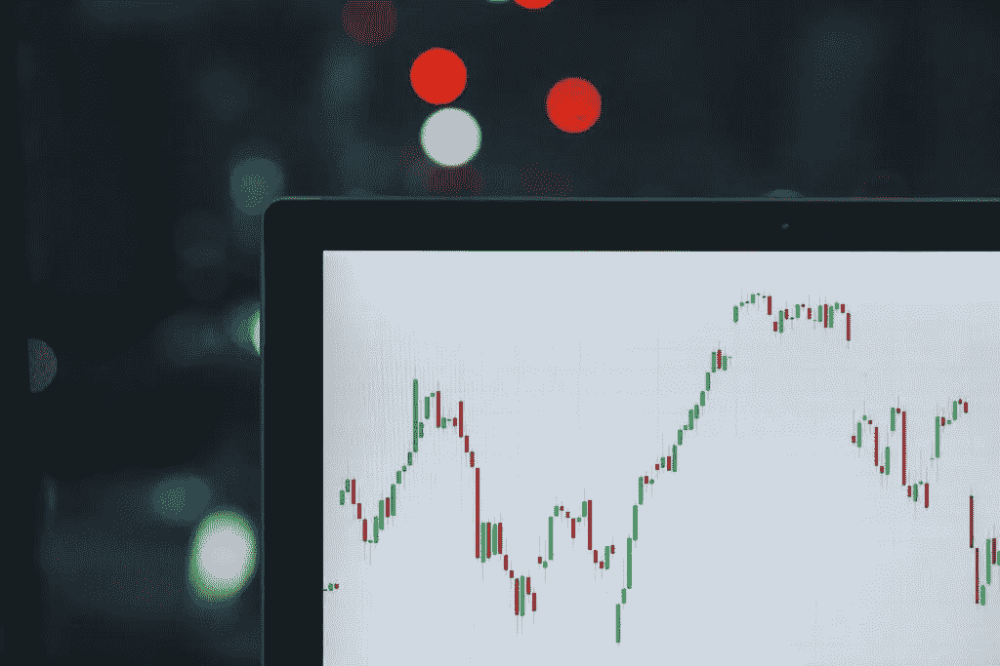

# 如何衡量投资一支股票的风险

> 原文：<https://medium.datadriveninvestor.com/how-to-measure-the-risk-of-investing-in-a-stock-805396048bfe?source=collection_archive---------22----------------------->

Photo by [M. B. M.](https://unsplash.com/@m_b_m?utm_source=unsplash&utm_medium=referral&utm_content=creditCopyText) on [Unsplash](https://unsplash.com/s/photos/stock-risks?utm_source=unsplash&utm_medium=referral&utm_content=creditCopyText)

> “风险来自于不知道自己在做什么。”—沃伦·巴菲特

在金融领域，风险的定义通常与给定时间框架内资产价格相对于其历史平均值的波动性相关联。因此，如果一只股票的价格在一段时间内从其平均价格上下波动很大，它就被认为比市场上价格稳定的股票风险更大。

虽然这个概念似乎有道理，但我认为，有比价格波动更相关的其他因素来衡量投资一支股票的风险。

# 自己做研究

降低风险的一个非常重要的事情是对我们考虑购买的公司进行研究。重要的是要了解这家企业如何赚钱(它的产品和服务是什么)，以及它是否有一个伟大的管理团队和坚实的资产负债表。

 [## 投资区块链前要问的三个简单问题(也是一个困难的问题)|数据…

### 现在是了解区块链的最佳时机。不同货币之间的增长率，比如…

www.datadriveninvestor.com](https://www.datadriveninvestor.com/2020/03/12/three-simple-questions-and-one-difficult-one-to-ask-before-investing-in-a-blockchain/) 

正如巴菲特所说， ***【永远不要投资你不懂的生意】*** 。

通过研究和了解业务，我们可以更好地估计其公允价值，这使我们认识到降低投资风险的另一个重要因素:**价格！**

# 购买安全系数大的产品

如果我们能以公允价值的较大折扣收购一家伟大的公司，我们就减少了下跌空间，增加了获得更高回报的可能性。

这样，我们无法非常准确地估计公允价值的风险也降低了，并且我们给了自己额外的余量，以保护我们免受我们在研究中可能遗漏的任何重要信息的影响。

# 在购买任何股票之前，问自己以下 5 个问题

总之，在购买股票之前，我们可以问自己几个好问题:

*   我们能很好地理解业务吗？
*   这家公司在 5 年后会比现在更重要吗？
*   公司的增长计划是什么？
*   股票的交易价格是否大大低于我们对其公允价值的估计？
*   负面影响最小吗？

感谢阅读！

如果你需要一个分析公司的起点，并估计它们的公允价值，请查看我最初的[博文](https://vitorpedro.com/how-to-measure-the-risk-of-investing-in-a-stock/)。在这篇文章的最后，我提供了几个网站，提供了很好的投资信息。

*原载于 2020 年 4 月 20 日 https://vitorpedro.com***。**

*这不是投资建议。这只是我对这个话题的一点浅见。*