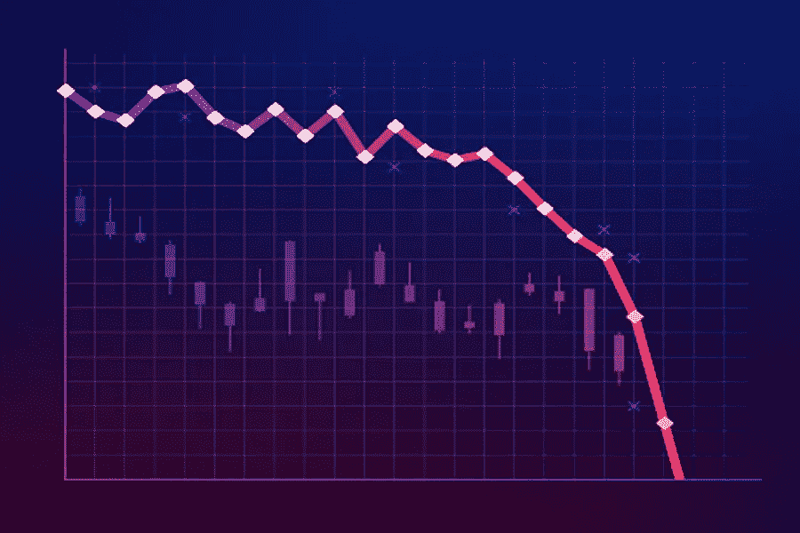

# 如何在心理上处理股票市场的损失

> 原文：<https://medium.datadriveninvestor.com/how-to-mentally-handle-losses-in-the-stock-market-65b54a9e61c?source=collection_archive---------3----------------------->

你不能总是赢，但你总能反弹

事后来看任何决定都更容易。你推迟买入股票或者在错误的时间卖出股票，当看到亏损时，你很容易感觉糟糕。

每个投资者都将面临亏损。就连巴菲特也损失惨重，包括在疫情前买入航空股，然后在疫情中期以低价卖出。

虽然大多数人关注巴菲特的成功和与他相似的投资者，但他们也都遭受了巨大的损失。

没有投资者会逃脱损失，但每个投资者都可以决定如何处理当前的损失，并在以后反弹。

 [## 收盘，但没有雪茄-股票市场目标在停滞的 COVID 救济中创新高|数据驱动…

### 专家聊天程序:一个协作市场，在这里人们可以和能够解决他们问题的专家聊天。是……

www.datadriveninvestor.com](https://www.datadriveninvestor.com/2020/08/18/close-but-no-cigar-stock-market-targets-record-highs-amidst-stalled-covid-relief/) 

# 不要对自己太苛刻

当你在低点卖出股票或在高点买入股票时，你这样做是因为过去的信息与现在的信息不同。

我们之所以可以看后见之明，是因为新的信息在最初的决策之后就出现了。

在欺诈指控出现之前，一些投资者相信了尼古拉的增长故事。当然，也有一些警示信号，比如估值过高，以及第一份财报的唯一收入是首席执行官为自己购买太阳能电池板。

然而，这些警告信号并没有同时出现，仍然有上升的前景，如通用汽车的合作伙伴关系和尼古拉的原型视频。该公司后来承认视频是假的。

一个错误不是死刑。在股市中，错误经常出现，但如果你继续关注机会，你的收益将超过你的损失。

# 还记得你为什么要搬家吗

每个投资者都有不同的标准。有些人会错过苹果拆分前的大规模上涨，因为他们不喜欢投资大型科技公司。

同样，一些投资者更喜欢买入并持有。有这种心态的投资者不会在苹果股票接近 130 美元/股时卖出。

如果你觉得你最近被烧伤了，看看你的标准。如果你按照你的标准行事，你就不应该沮丧。

你为自己的投资制定了一套规则，并遵守这些规则。如果没有一个标准，投资者可能会将资金投入到他们几乎不了解的投机性投资中。

当然，你可以对你的标准做一些调整，因为没有什么标准是一成不变的。一些投资者有旨在保护风险的标准。他们可能会牺牲一些收益，但在市场低迷时期，他们不会像典型的投资者那样损失惨重。

自 3 月份以来，坐拥大量现金的投资者已经错过了许多机会。

然而，这可能没什么，因为这有助于他们晚上睡得更好，因为他们知道自己有现金保护自己免受经济低迷的影响，并可以抢购折价股票。

你不必把每一块钱都投入股市，或者接受某种投资策略，因为其他人从中获得了丰厚的回报。

# 不要拿自己和其他投资者比较

类似于上一点，避免比较。比较每个投资者的总回报很容易，但重要的是要明白每个投资者有不同的目标。

每个人都想成为通过交易期权将 2，000 美元变成 100，000 美元的投资者(是的，这些类型的回报可以通过交易期权来实现)。

然而，并不是每个投资者都有这种策略的风险承受能力。2000 美元很容易变成 0 美元，获得这种收益需要把握市场时机，购买正确股票的期权。

如果你不交易期权，你就不应该和一个交易期权的投资者比较你的回报。你唯一应该比较回报的人是你自己。永远努力让自己变得更好，而不是去追赶别人。

# 休息一下

对大多数人来说，投资股市并不是他们的全职工作。如果你在这条船上，那么不要把股市当成你的全职工作。

几天不看投资组合或不做任何投资是件好事。你可以把休息时间和周末结合起来。例如，你可以周五和下周一休息。由于市场在周六和周日关闭，你将有 4 天的休息时间。

如果你在度假，不要把所有的时间都花在看股票市场或担心它。享受生活，不要把轻微的上涨或下跌看得太重。

人生苦短，没必要为你错过的 5%的损失或 20%的收益而烦恼。当你准备好再试一次时，只要回到击球手的位置。

**进入专家视角—** [**订阅 DDI 英特尔**](https://datadriveninvestor.com/ddi-intel)