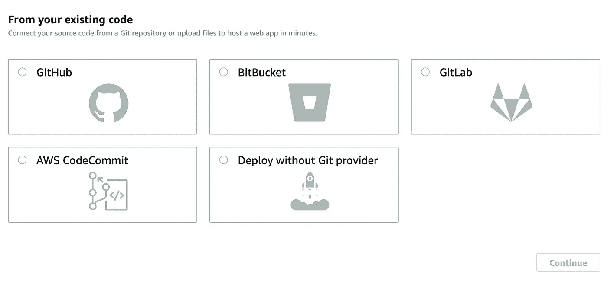
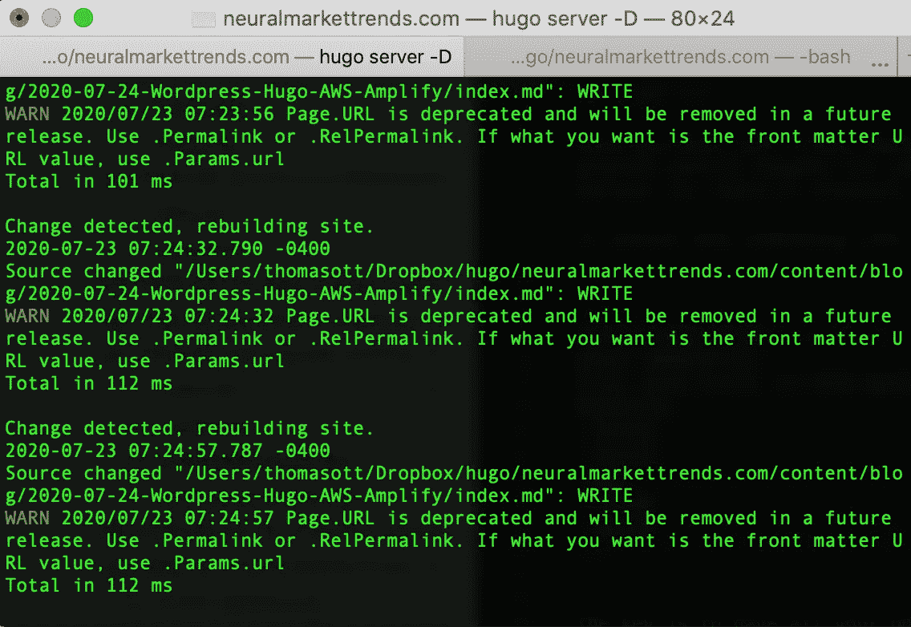
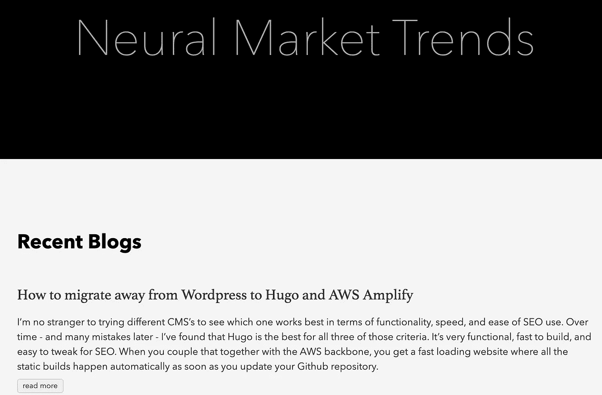

# 如何从 WordPress 迁移到 Hugo 和 AWS Amplify

> 原文：<https://medium.datadriveninvestor.com/how-to-migrate-away-from-wordpress-to-hugo-and-aws-amplify-62b0360a3b9f?source=collection_archive---------4----------------------->


Old school blogging…

## 使用“现收现付”AWS Amplify 来托管我的博客和网站

我对尝试不同的 CMS 并不陌生，看看哪一个在功能、速度和 SEO 易用性方面效果最好。随着时间的推移——以及后来的许多错误——我发现 Hugo 是所有这三个标准中最好的。

它非常实用，构建速度快，并且易于进行 SEO 调整。当您将它与 AWS 主干耦合在一起时，您会得到一个快速加载的网站，只要您更新您的 GitHub 库，所有静态构建都会自动发生。我写这篇文章是关于我如何从 WordPress 迁移到 Hugo 并使用 AWS Amplify 托管我的博客和网站。


# 简介— WordPress 年

我在 WordPress 上开始这个博客，然后转移到 Jekyll，然后回到 WordPress，等等。你可以通过查看我的 [CMS 标签](https://neuralmarkettrends.com/tags/cms/)来了解我对尝试不同 CMS 平台的“热情”,但事实是 WordPress 对于新手来说非常容易上手并快速运行。

一些流行的博客和网站可靠地运行 WordPress，并用它管理所有的内容。这就是为什么它超级有粘性，而且有一些很棒的主题可以开箱即用。当你想“升级”或优化你的 WordPress 安装时，你开始遇到问题。

例如，它依赖于一个数据库后端，每次你访问网站时，它都会动态地提供页面。这一切都很好，直到您意识到您为此付出了加载时间代价。这可能需要一段时间。此外，你还必须担心黑客的恶意代码注入，他们会在你的网站上兜售最新的阴茎增强药物或比特币骗局。这些代码注入是我开始考虑迁移到静态博客生成器的主要动力。


如果你想用 WordPress 做 SEO，你必须了解 PHP。我想这没什么，但我从来没有真正关心过 PHP，觉得它很无聊。如果你在同一条船上，你将不得不使用像 Yoast 这样的插件。这很好，直到你意识到你必须开始为它付费才能从中获益。你需要修改你的页脚吗？你需要使用一个插件。想要备份整个网站吗？你必须使用另一个插件(并且通常要付费)。在你知道之前，你已经有了 10 个或者更多的插件，除了你为主机支付的费用之外，这些插件还在耗费你的金钱。

所有这些你需要的插件最终也会降低你网站的速度，这在很大程度上影响了你的 SEO。在一天结束时，你没有钱，有一个缓慢的网站。当然，它可能看起来很漂亮，但如果你想增加有机流量，你必须专注于伟大的和有价值的内容，加载速度快，是搜索引擎优化优化，成本低得多，让你的生活变得简单。

# Hugo 和 AWS Amplify(还有 Github)

让我第一个警告你。在 AWS Amplify(和 GitHub)上运行 Hugo 不像用插件运行 WordPress 那么容易。如果你对你的 WordPress 基础设施和流程满意，现在就关闭你的浏览器，继续前进。然而，如果你想对你的博客/网站有一个精细的控制，并且对做一点“黑客”感到舒服，那么请继续阅读。

我决定用 Hugo 来简化我的博客。我不再需要处理插件并为它们付费。当然，这迫使我更加亲力亲为，如何最大化 SEO，如何利用[独立网络](https://neuralmarkettrends.com/joining-indie-web/)，甚至[网络货币化](https://neuralmarkettrends.com/coil-webmonetization-hugo/)。我现在还必须手动备份，而不是使用 Vaultpress，但有了 Github，这变得非常容易，可以自动完成。

为 Hugo 生成的网站写内容就像做梦一样。构建时间很快，它有强大的[图像处理能力](https://neuralmarkettrends.com/responsive-images-hugo/)，如果我运行开发服务器，我可以在部署它之前检查一下我的站点会是什么样子。所以我可以做很多‘离线的事情’，并且知道一旦我把我的更新推送到我的 GitHub repo，AWS 就会自动重建并部署我的站点。

当然，我必须支付 AWS Amplify 的使用费，但这比在 Dreamhost 使用 VPS 要便宜得多(16 美元/月)。抱歉，梦幻主持人，但我想你今年不会被续约了。

# 安装 Hugo

重要的事情先来。移动需要一些时间，如果你遵循这些步骤，应该没有问题。然而，为了防止任何意外，我们将从设置一个“暂存”环境开始。我们的目标是用 Hugo 和 AWS Amplify 来复制你现有的 WordPress 站点，这样当它全部启动并运行时，你就可以“切换”到它。

请遵循以下步骤:

1.  将 Hugo 下载到你的本地机器上，然后阅读如何建立一个网站的快速入门介绍
2.  抓取一个[主题并为你的 Hugo 安装](https://gohugo.io/getting-started/quick-start/#step-3-add-a-theme)
3.  根据你的喜好配置 [config.toml](https://gohugo.io/getting-started/configuration/#configuration-file) 文件，特别是关于你的[永久链接结构](https://gohugo.io/content-management/urls/#permalinks)是怎样的
4.  使用`hugo server`启动 Hugo dev 服务器，然后导航到 [http://localhost:1313](http://localhost:1313)

您应该会看到一个空的*本地*网站在那个网址上运行。

我犯的一个最大的错误是没有仔细阅读 config.toml 中的 permalink 结构设置。我为自己重新组织的帖子创建了几个小时的规范别名。因此，请密切注意 config.toml 文件中永久链接的配置。

# 注册一个 AWS 帐户

下一步很简单，在这里注册一个 [AWS 账户](https://portal.aws.amazon.com/billing/signup?redirect_url=https%3A%2F%2Faws.amazon.com%2Fregistration-confirmation)。我们稍后再讨论这个问题！

# 注册一个 GitHub 帐户

这一步也很简单，你需要注册一个 [GitHub 账户](https://github.com/)。您可以使用 Gitlab、Bitbucket 和其他工具，但我在个人和工作项目中使用 GitHub。它真的很容易用来备份你的代码和文件，但有点难以使用。你需要熟悉 Git，我计划将来写一个 Git 教程。



# 如何将帖子从 WordPress 迁移到 Hugo

现在我们进入有趣的部分，将你的 WordPress 文章和页面移植到你的本地 Hugo 安装中！首先，你需要从数据库中提取你的 WordPress 文章。WordPress 有一个通用的导出功能，但是它不会将 WordPress 字段映射到 Hugo 字段。你需要的是使用 WordPress 的 [Hugo 导入器。](https://gohugo.io/tools/migrations/#wordpress)

如果 WordPress 导出器不工作，尝试使用 [WordPress to Jekyll exporter 插件](https://wordpress.org/plugins/jekyll-exporter/)，然后使用 [Jekyll to Hugo](https://gohugo.io/tools/migrations/#jekyll) importer。

一旦你有了你的文件，打开一个看看 YAML 前端的格式是否正确。YAML 前端是所有细粒度控制发生在你的雨果供电的网站。在这里你可以控制 SEO 元数据的所有方面，以及目录、关键词、类别、Slugs(永久链接)、标题、草稿、别名等选项。

它应该是这样的:

```
--- Title: Post Title Date: 2020-07-21 Slug: post-title << this builds to /content-directory-post-is-in/post-title/index.html Keywords: 
- Word1 
- Word2 
Tags: 
- Word1 
- Word2 
---
```

关键是让你所有的帖子元数据都在帖子顶部的`---`之间。注意，这将是一个扩展名为`.md`的降价文件。如果你不熟悉减价，你可以[在这里](https://en.wikipedia.org/wiki/Markdown)阅读。习惯 markdown 需要一段时间，但是一旦你习惯了，你就永远不用担心你在“前端”写的东西的格式，当你的帖子被翻译成 HTML 时，markdown 会为你处理所有的事情。

将所有导出的帖子移动到 Hugo 的本地实例*中，并将它们放在`/content/posts/`目录中。注意，Hugo 喜欢内容组织，你应该考虑是否要使用内容文件夹。你可以在这里阅读[内容组织](https://gohugo.io/content-management/organization/)。*

# Hugo 的开发服务器

一旦帖子进入`/content/posts/`目录，您应该会在您的终端上看到 Hugo 重建站点。



然后，它将生成网站作为一个实时预览。任何保存的编辑都将自动重建，您可以实时看到您的结果。最重要的是调试部分。既然雨果是用 go 写的，就不‘忍愚’，不完美就会破。这有好有坏，好是因为它会告诉你到底哪里出了问题。这是不好的，因为你需要先修复这个错误，然后才能在生产中建立你的网站。



我一直使用这个开发服务器。它让我确认我将要推送到 GitHub 的内容是否是我想让全世界看到的。这是我测试新的部分模板、新的短代码和 Hugo 新特性的地方。开发服务器将成为您最好的朋友，您可以在这里阅读更多关于它的[功能。](https://gohugo.io/commands/hugo_server/#hugo-server)

# 使用 GitHub 备份你的站点

我用 GitHub 写代码和项目相关的东西。Git 的概念非常棒。它的版本控制、过程控制和备份都集于一身。诚然，GitHub 是我日常工作流程中的一个额外步骤，但它确保我的博客随着时间的推移保持一致。没有奇怪的打嗝，除非我搞砸了！如果我搞砸了，Git 有一个“回滚功能”,所以我可以快速撤销我的错误。随着年龄的增长，我越来越意识到 Git 是这里真正的力量，尤其是如果你在一个繁重的开发环境中。


你不会把 Hugo 的整个本地安装和你的内容与 Github 库同步。你将听到的术语是，你将“把你的代码推到远程回购”GitHub 是一个*远程*仓库，你也可以在这里*推送*你的内容和文件。

你可以使用 git 命令行，但是我喜欢使用 GitHub 桌面。让事情变得简单！

1.  首先，您将在 GitHub Desktop 中创建一个*本地*库
2.  您将选择整个 Hugo 网站的文件夹，我将我的文件夹命名为`neuralmarkettrends.com`，当我创建本地回购时，它会自动将远程回购命名为相同的名称。
3.  然后你点击“发布”,它将在 GitHub 上创建远程回购。注意:您的站点尚未备份
4.  要在您的 *remote* repo 中备份站点，您需要创建一个提交消息，然后推送它
5.  一旦你把它推到你的 GitHub repo，它应该填充

确保你的存储库被标记为私有，这样就没有人能看到你的帖子和内容。

成功！

# 如何用 AWS Amplify 将 Hugo 投入生产


一旦我在 GitHub 上备份了我的博客，我就按照 [AWS Amplify 指令](https://gohugo.io/hosting-and-deployment/hosting-on-aws-amplify/#readout)成功生成了网站！

我做了一个很大的调整。AWS Amplify 使用 Hugo 版本 0.55，这与许多更好的主题不兼容。我不得不将版本号为 0.74.2 的 Hugo 升级。这并不难，我所要做的就是进入构建设置，然后[按照这些说明](https://gohugo.io/hosting-and-deployment/hosting-on-aws-amplify/#using-a-newer-version-of-hugo)操作。

# 结束注释

我出于自私的原因迁移到 AWS Amplify。我正准备以 200 多美元的价格在 DreamHost 更新我的 VPS，并认为这有点高。使用 AWS Amplify，根据我过去的流量，我预计每月支付 5 美元左右，如果它变得更活跃，那么我会支付更多，但也没关系。

迁移到这里的额外好处是，我在 AWS 主干上获得了极快的加载时间。我得到了 1 秒的移动设备加载时间和毫秒的桌面设备加载时间。Wowsers！

但是…

我意识到，对于许多非黑客类型的人来说，进行这种迁移是很棘手的，但是如果您愿意，您可以学习。在这篇文章中，我们没有提到的一件事是使用 AWS Amplify 的自定义域。这是一个有点棘手的设置，我会写另一个帖子。不过，这些步骤应该会让你进入 AWS Amplify 上你的 WordPress 博客的镜像站点。

*原载于 2020 年 7 月 22 日 https://neuralmarkettrends.com*[](https://neuralmarkettrends.com/blog/wordpress-hugo-aws-amplify/)**。**

***跟着我***

*[](https://medium.thomasott.io/subscribe) [## 每当托马斯·奥特发表文章时，就收到一封电子邮件。

### 编辑描述

medium.thomasott.io](https://medium.thomasott.io/subscribe)* 

***阅读更多精彩教程***

*[](/how-to-dump-medium-or-substack-for-ghost-4172762ca2c6) [## 如何为 Ghost 转储介质或子堆栈

### 控制您的内容并构建您自己的订阅模式

medium.datadriveninvestor.com](/how-to-dump-medium-or-substack-for-ghost-4172762ca2c6) [](/installing-ghost-cms-on-aws-lightsail-f8631cea0fde) [## 在 AWS Lightsail 上安装 Ghost CMS

### 一个关于如何使用这个令人敬畏的 CMS 的详细教程

medium.datadriveninvestor.com](/installing-ghost-cms-on-aws-lightsail-f8631cea0fde)*