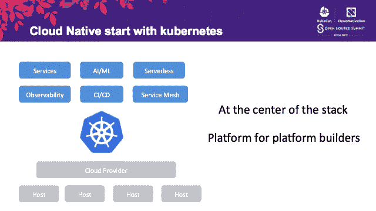
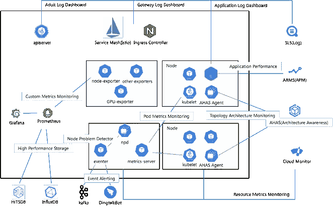
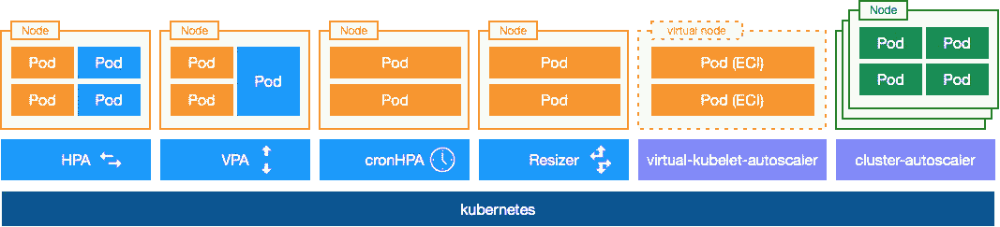
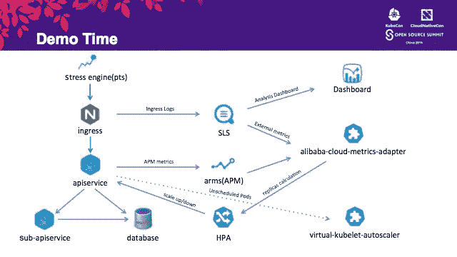

# 如何在 Kubernetes 中监控和自动扩展云原生应用

> 原文：<https://medium.datadriveninvestor.com/how-to-monitor-and-autoscale-cloud-native-applications-in-kubernetes-a276ed971500?source=collection_archive---------9----------------------->

# 前言

虽然越来越多的开发人员不断接受和认可云原生应用的设计概念，但需要注意的是 [Kubernetes](https://www.alibabacloud.com/product/kubernetes?spm=a2c41.13977158.0.0) 已经成为整个云原生实施堆栈的中心。云服务功能通过云提供商、CRD 控制器和运营商从标准的 Kubernetes 接口展现给服务层。开发者基于 Kubernetes 构建自己的云原生应用和平台。因此，Kubernetes 现在是构建平台的平台。让我们了解一个云原生应用程序如何在 Kubernetes 中无缝集成监控和自动伸缩功能。

 [## 信息图:云之旅|数据驱动的投资者

### 聪明的企业领导者了解利用云的价值。随着数据存储需求的增长，他们已经…

www.datadriveninvestor.com](https://www.datadriveninvestor.com/2018/09/22/infographic-journey-to-the-clouds/) 

本文是刘忠伟(莫元)在 KubeCon 的演讲*“Kubernetes 中的云-原生应用监控和自动伸缩”*的各种摘录的汇编。刘是阿里云容器平台 T5 的技术专家。

# 面向 Kubernetes 的阿里云容器服务:监控概述

面向 Kubernetes 的阿里云容器服务主要支持以下两种类型的集成。

# 云服务集成

面向 Kubernetes 的阿里云容器服务集成了四种云监控服务，包括[简单日志服务](https://www.alibabacloud.com/product/log-service?spm=a2c41.13977158.0.0)(SLS)[应用实时监控服务](https://www.alibabacloud.com/product/arms?spm=a2c41.13977158.0.0)(ARMS)[应用高可用服务](https://www.alibabacloud.com/products/ahas?spm=a2c41.13977158.0.0)(AHAS)[云监控](https://www.alibabacloud.com/product/cloud-monitor?spm=a2c41.13977158.0.0)。

SLS 主要负责收集和分析日志。在 Kubernetes 的阿里云容器服务中，SLS 收集三种不同类型的日志:

*   核心组件的日志，例如 APIServer
*   接入层日志，如服务网格/入口
*   应用程序的标准日志

除了收集日志的标准链接，SLS 还提供上层日志分析功能。默认情况下，它提供基于 APIServer 的审计分析功能、访问层的可观察性显示和应用层的日志分析。在面向 Kubernetes 的阿里云容器服务中，日志组件是默认安装的，开发者只需要在创建集群时检查即可。

ARMS 主要负责收集、分析和显示应用程序的性能指标。目前主要支持 Java 和 PHP 的集成，在 JVM 层收集指标，比如 GC 次数、应用的慢速 SQL、调用栈等。它在性能调优中起着非常重要的作用。

AHAS 是一个架构感知的监控服务。一般来说，Kubernetes 集群中的大部分负载类型都是微服务，微服务的调用拓扑也比较复杂。因此，当集群的网络链路出现问题时，最大的挑战是如何快速定位、发现和诊断问题。AHAS 通过网络的流量和趋势显示集群拓扑，提供更高级别的问题诊断。

# 开源解决方案集成

开源解决方案的兼容性和集成也是阿里云容器服务对 Kubernetes 的监控能力的一部分。主要包括以下两部分。

## Kubernetes 内置监控组件的增强和集成

在 Kubernetes 社区中，`heapster/metrics-server`是一个内置的监控解决方案，核心组件，如 Dashboard 和 HPA，依赖于这些内置监控功能提供的指标。由于无法保证 Kubernetes 生态系统中组件的发布周期与 Kubernetes 的发布完全同步，一些具有监控能力的消费者在 Kubernetes 中出现了监控问题。因此，阿里云在 metrics-server 上进行了增强，以实现版本兼容。此外，对于节点诊断，阿里云容器服务增强了 NPD 覆盖，支持 FD 文件句柄监控、NTP 时间同步验证和入站/出站网络能力验证。此外，它使 eventer 开源，以支持将 Kubernetes 事件数据离线传输到 SLS、Kafka 和 DingTalk，从而实现 ChatOps。

## 普罗米修斯生态系统的增强和整合

为了支持 Kubernetes 生态系统中的标准第三方监测平台 Prometheus，阿里云容器服务提供了集成图表，供开发者一键集成。此外，还有以下三个级别的增强功能:

*   增强的存储和性能:支持产品级存储能力(TSDB 和 InfluxDB)，提供更持久高效的监控存储和查询。
*   增强的收集指标:修复 Prometheus 设计中的缺陷导致的一些不准确的监控问题，为出口商提供单 GPU 卡、多 GPU 卡和共享分片。
*   上层增强可观测性:支持基于场景的 CRD 监测度量集成(云原生监测能力，如 Argo、Spark、TensorFlow)实现多租金可观测性。

# 阿里云容器服务 Kubernetes 中的自动缩放概述

面向 Kubernetes 的阿里云容器服务主要包括以下两类自动伸缩组件。

# 调度层自动缩放组件

对于调度层自动缩放组件，所有自动缩放操作都是与 pod 相关的，不管具体的资源情况如何。

*   水平窗格自动缩放(HPA): HPA 是一个用于水平缩放窗格的组件。除了社区支持的资源指标和自定义指标，面向 Kubernetes 的阿里云容器服务还提供了外部指标适配器，以支持云服务指标作为确定自动扩展的标准。目前支持多个产品不同维度的度量指标，比如 Ingress 的 QPS 和 RT，arm 应用的 GC 时间和慢速 SQL 时间。
*   * *垂直窗格自动缩放(VPA): VPA 帮助垂直缩放窗格。它主要用于扩展和升级有状态服务。
*   cronHPA:它是一个针对周期性负载的预定伸缩组件。它通过资源画像预测常规的负载周期，并通过定期扩展节省资源成本。
*   Resizer:它是集群核心组件的缩放控制器。它有助于根据 CPU 核心和集群节点的数量实现线性和梯度扩展。目前，CoreDNS 等核心组件的扩展是其主要目标场景。

# 资源层自动缩放组件

资源层自动缩放组件支持关于 pod 和特定资源之间关系的操作。

*   Cluster-auto scaler:Cluster-auto scaler 是目前比较成熟的节点伸缩组件。当 pod 资源不足时，它有助于扩展节点和调度无法调度到新弹出节点的 pod。
*   Virtual-Kubelet-Autoscaler:是面向 Kubernetes 的阿里云容器服务的开源组件。类似于 Cluster-Autoscaler 的原理，当一个 pod 由于资源问题无法调度时，它不会弹出一个节点，而是将 pod 绑定到一个虚拟节点，并通过 ECI 启动 pod。

# 演示展示案例

上图显示了一个简单的演示，其中应用程序主题是 APIservice。APIservice 通过子 APIservice 调用数据库，接入层通过 Ingress 管理。使用 PTS 模拟上层产生的流量，通过 SLS 收集接入层的日志，通过 ARMS 收集应用性能指标。最后，通过 alibaba-cloud-metrics-adapster 暴露外部指标，触发 HPA 重新计算工作负载副本。当扩展的 pod 占用所有集群资源时，virtual-kubelet-autoscaler 会触发生成 ECI，以托管超出集群容量规划的负载。

# 摘要

为 Kubernetes 使用阿里云[容器服务上的监控和自动缩放功能非常简单。开发者只需一键安装相应的组件图，即可获得完整的访问权限。凭借多维度监控和自动扩展功能，云原生应用以最低的成本获得了更高的稳定性和健壮性。](https://www.alibabacloud.com/product/kubernetes?spm=a2c41.13977158.0.0)

# 原始来源:

 [## 如何在 Kubernetes 中监控和自动扩展云原生应用

### 阿里巴巴开发者 2020 年 2 月 3 日 132 同时越来越多的开发者不断接受和认可…

www.alibabacloud.com](https://www.alibabacloud.com/blog/how-to-monitor-and-autoscale-cloud-native-applications-in-kubernetes_595788?spm=a2c41.13977158.0.0)