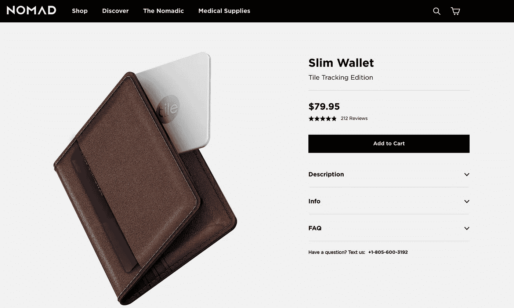
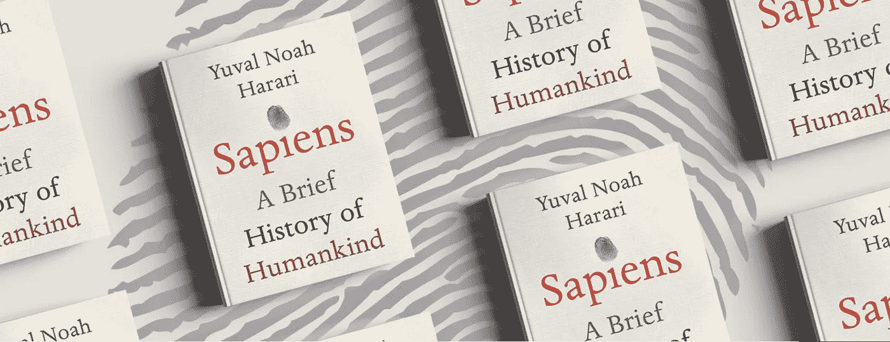
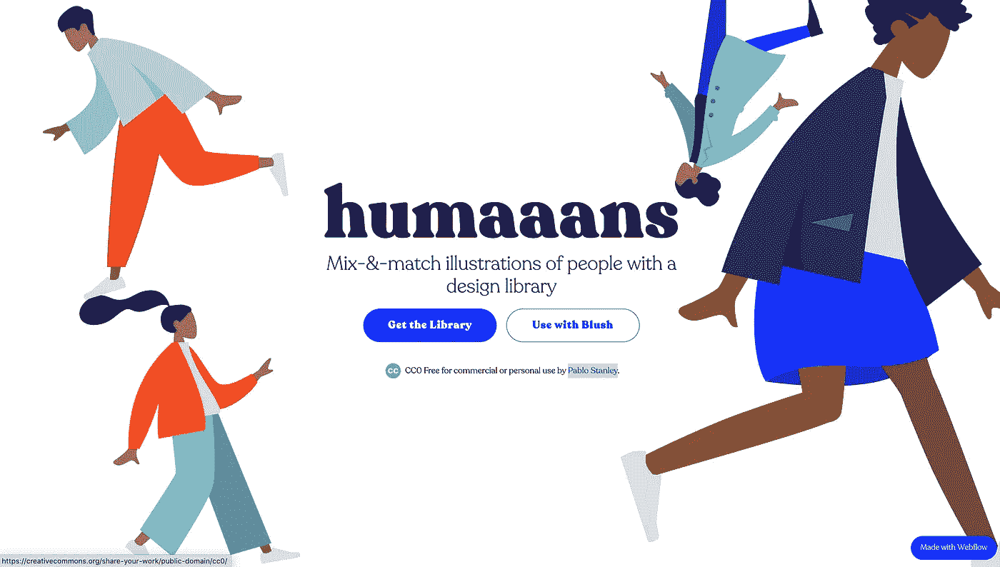
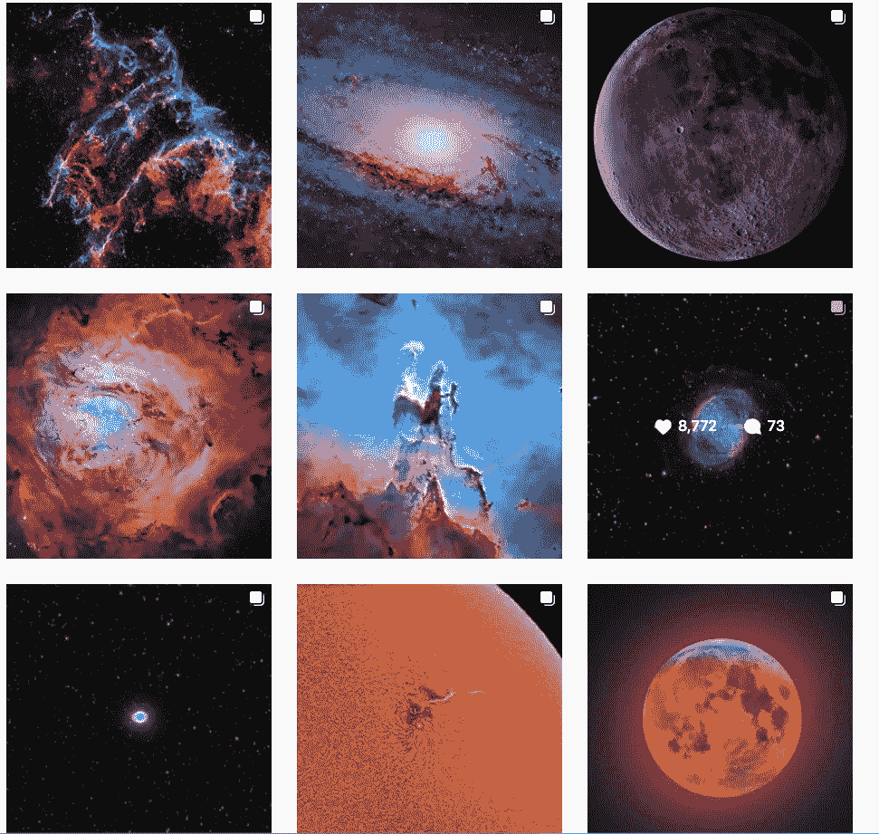

# 如何与汽车经销商谈判

> 原文：<https://medium.datadriveninvestor.com/how-to-negotiate-with-car-dealers-never-lose-your-wallet-learn-about-human-history-5ed7a0df3b5d?source=collection_archive---------11----------------------->

## 本周，我将分享和谈论一个网站，一个实体产品，一本书，一个免费的设计库&一个 Instagram 帐户。

Image by [Reimund Bertrams](https://pixabay.com/users/8385-8385/?utm_source=link-attribution&utm_medium=referral&utm_campaign=image&utm_content=853188) from [Pixabay](https://pixabay.com/?utm_source=link-attribution&utm_medium=referral&utm_campaign=image&utm_content=853188)

# 1.不纠结

[Unhaggle](https://unhaggle.com/) 为您的新车提供免费的工厂发票价格报告。等等，工厂发票价格报告是什么意思？它基本上是一份报告，告诉您经销商为获得一辆汽车可能向制造商支付了大约多少价格。现在，下一个合乎逻辑的问题是为什么我需要知道这些？嗯，当你打算购买一辆新车时，如果你知道经销商支付给制造商的金额和经销商给你的价格，那么通过简单的数学计算，你就可以知道经销商有多少利润，这将有助于你达成一笔好交易。

By [Unhaggle](https://unhaggle.com/)

当我在购买一辆新车的过程中 [Unhaggle](https://unhaggle.com/) 帮了我很多，我能够与经销商谈判，并最终以一个公平的价格得到了这辆车。我强烈推荐这个网站给想买新车或其他车辆的人。

# 2.带磁贴追踪功能的 Nomad 钱包

[Nomad](https://nomadgoods.com/products/slim-wallet-tile) 生产漂亮的皮革配件，包括钱包、手机壳、充电线和 apple watch 表带。他们有一个细长的皮革钱包，带有内置的跟踪器，万一钱包被盗或丢失，它可以帮助你定位钱包。对于那些不知道 tile 是什么的人来说，tile 是一个小型的蓝牙跟踪设备。你可以连接到 Tile 并使用它来跟踪你的财产——经典的例子是你的钥匙和钱包。

[Nomad](https://nomadgoods.com/products/slim-wallet-tile)

这款[内置磁贴追踪功能的 Nomad 钱包](https://nomadgoods.com/products/slim-wallet-tile)是像我这样经常丢钱包的人的必备配件。我在两个月内丢了两个钱包，并决定投资一个。不知是幸运还是不幸，自从我买了钱包后，我就没有使用追踪功能的必要了。

# 3.现代人的

《智人》是由[尤瓦尔·诺亚·哈拉里](https://www.ynharari.com/)写的一本关于人类历史的书。我总是有这样的疑问:我们是谁？我们是如何到达这里的？这一切是如何开始的？这些问题不是哲学或精神上的，而是纯粹的学术问题。如果你也有类似的问题，那么这本书是给你的。它带你穿越从石器时代到现代世界的人类历史。

[Sapiens](https://www.amazon.ca/Sapiens-Humankind-Yuval-Noah-Harari/dp/0771038518/ref=sr_1_1?dchild=1&keywords=Sapiens&qid=1601233777&sr=8-1)

如果我只能向某人推荐一本书，那么这本书就是了。与前半部分相比，这本书的后半部分有点枯燥，但是相信我，它会回答你所有关于我们(人类)的问题。

# 4.人类

继续上一点中关于人类的主题，在过去的几年中，在网页设计中有一种使用人类插图的趋势。网络上到处都是插图和人类。

[humaaans](https://www.humaaans.com/)

如果你想在你的任何网络项目中使用插图人物，那么[巴勃罗·许仁杰](https://twitter.com/pablostanley)已经创建了一个非常容易使用的设计库，名为“ [humaaans](https://www.humaaans.com/) ”。使用该库是免费的，您可以根据需要定制插图。对于任何数码产品设计师来说，这都是一个非常有用的工具。

# 5.宇宙 _ 背景

如果你对天体摄影感兴趣，那么你一定要在 Instagram 上关注安德鲁·麦卡锡。他拍摄了令人惊叹的星系、恒星和行星的照片。

[Andrew McCarthy](https://www.instagram.com/cosmic_background/)

自从我发现了这个账户并开始在 Instagram 上关注它，我的 feed 就充满了类似于上图的令人兴奋的宇宙图片。如果你想通过手机探索宇宙之美，那么就给这个账号一个 follow 吧。