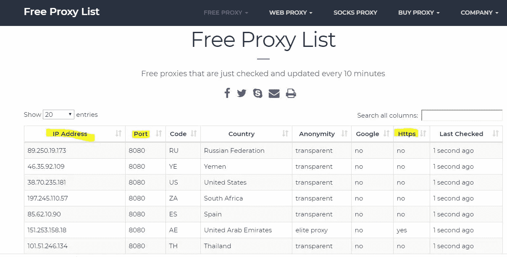
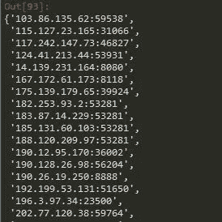
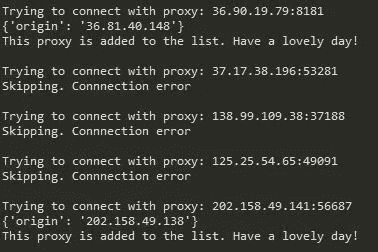

# 如何在抓取网页时不被抓到？

> 原文：<https://medium.datadriveninvestor.com/how-to-not-get-caught-while-web-scraping-88097b383ab8?source=collection_archive---------0----------------------->

Photo by [Nicolas Picard](https://unsplash.com/@artnok?utm_source=medium&utm_medium=referral) on [Unsplash](https://unsplash.com?utm_source=medium&utm_medium=referral)

说到数据源，在网站上，有一个巨大的有用数据的宇宙，任何人只要有互联网连接和一个基本的设备就可以访问。但是，网站没有为您提供保存这些数据供个人使用的功能，如果您仍然需要手动从数百个页面中复制/粘贴数据进行研究，这可能会令人沮丧。

目前，以编程方式从网站中提取您需要的数据，并在您的项目中充分利用它作为外部信息源，这是最热门的话题之一。这个过程通常被称为**网络抓取**，从非法/合法的角度来说，这是一个相反的话题。大网站大多使用反网页抓取工具来避免被网页抓取。

这篇文章的范围是关于**如何在抓取网页时不被抓住的方法。在制造我们的机器人之前，我们需要理解它的逻辑。**

网站可以跟踪你的 IP 信息，你用相同的 IP 访问的网页，你的用户代理信息，你的请求频率和许多其他指标。你可以认为 IP 是你的互联网身份，从同一个 IP 发送到一个网站的任何系统请求都可以很容易地被反网页抓取工具检测到，你将被禁止使用 IP。

我们的机器人应该模仿人类正常的上网行为，这样它就不会引起任何网站的注意或怀疑。更清楚地说:**想象你自己在访问一个网站的页面，每次你改变页面时都使用免费的 VPN 服务。在两个页面之间等待一段随机时间，并从网站复制/粘贴数据**。

## 步骤:

*1-找到一个免费的代理提供商网站*

*2-刮去代理人*

*3-检查代理并保存工作中的代理*

*4-设计您的请求频率(尽量使其随机)*

*5-动态轮换代理，并通过这些代理发送您的请求*

6-自动化一切

## 让我们找一个免费的代理提供商

在这个练习中，我们使用[https://free-proxy-list.net/](https://free-proxy-list.net/)。如你所见，网站布局非常简单:

我们需要动态地抓取这些数据(IP 地址、端口和 Https 信息),并使用这些数据向我们真正感兴趣的其他站点发送请求。请记住，代理每 10 分钟更新一次，网站主页会显示 20 到 80 个条目。

## 抓取代理

让我们开始用 Python 开发，并试着好好利用*请求*和*美丽组*库。

*   get _ proxies()函数向“[https://free-proxy-list.net/](https://free-proxy-list.net/)的主页面发送请求。
*   返回主页的 html 代码并记录为*响应。*
*   用 *beautifulsoup* 解析页面的 html 代码，在返回的 IP 地址中，干净地提取端口和 Https 数据
*   还会检查代理是否与 https 网站兼容(https =是)。

Scraped proxies from the main page

这里我们有来自网站主页的代理。我们现在需要再次检查它们是否真的在工作。

## 让我们检查代理，并得到工作的！

为了获得有效的代理，我们将向一个名为“[https://httpbin.org/ip](https://httpbin.org/ip)”的 webiste 发送一个请求。这个网站显示当前的 IP，观众正在连接到互联网。你可以自己试试，找出自己的 IP 地址！

如果对此网站的测试请求得到响应，代理将被保存到 working _ proxies 列表中。在这里，您可以找到实现这一点的 Python 代码:

通过这两个函数(get _ proxies()、check _ proxies())，我们刚刚构建了一个 API，它首先访问免费代理提供商的网站，然后抓取 IP，之后通过发送一个请求来检查它们，并只返回有效的 IP。

Tracking how it’s working

很明显，一些代理会引发连接错误。这主要是由免费代理造成的。API 工作正常，但是如果你提取太多的数据，高级/付费代理服务应该是主要的选择。另一个选择可以是为你的代理搜索机器人实现一个人工智能来理解哪一个是最好的。

下一步是组织**请求频率**并将我们的请求分发给我们真正感兴趣的网站。这种方法将使机器人更加匿名:

## 使用领域

*   定价研究
*   市场调查
*   市场规模
*   标杆管理

Web 抓取在合适的人手里，可以作为一个非常有用的工具来动态编译有意义的信息。在这样做的时候，永远记住不要损害网站或违反他们的条款。