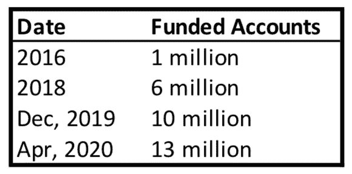

# 如何在 Robinhood |数据驱动的投资者上不破产交易期权

> 原文：<https://medium.datadriveninvestor.com/how-to-not-go-broke-trading-options-on-robinhood-data-driven-investor-f11c0518369a?source=collection_archive---------4----------------------->

新手交易的五个简单规则

Photo by [Aidan Bartos](https://unsplash.com/@bartos?utm_source=unsplash&utm_medium=referral&utm_content=creditCopyText) on Unsplash

新冠肺炎疫情关闭了大多数工作场所。许多人现在在家工作，或者根本不工作。大型社交活动，包括体育赛事、音乐会、酒吧、餐馆和赌场都被关闭，以减缓冠状病毒的传播。虽然餐馆开始重新开业(截至 2020 年 6 月)，但大多数主要的娱乐来源仍然关闭。

 [## 使用谷歌搜索趋势预测首次申请失业救济人数|数据驱动的投资者

### 几年来，我的重点一直是使用多种替代数据来预测宏观经济统计数据…

www.datadriveninvestor.com](https://www.datadriveninvestor.com/2020/03/25/using-google-search-trends-to-predict-initial-jobless-claims/) 

人们都在做些什么来娱乐呢？根据一家流行媒体的叙述，数百万“无聊的年轻人”已经开始日内交易股票和期权。今年 4 月，免费交易平台 Robinhood 宣布，他们在今年前三个月增加了 300 万个资金账户。

如果你是这些新交易者中的一员，那么作为一个老的、不无聊的、有经验的和成功的期权交易者，我想提供五个简单的规则来帮助你在你新发现的爱好(或职业，视情况而定)中取得成功。

## 1.不要冒超出你承受能力的风险。

这个简单的规则是最基本的规则，但也是最重要的。看看你的个人财务状况，留出足够三至六个月的生活费，然后将多余的钱存入你的罗宾汉或其他经纪账户。只有当你有更多的可支配收入时，才增加更多的现金。如果你需要钱付房租、买食品杂货或婴儿食品，*不要把钱存入你的罗宾汉账户*。

为了确保你的损失不会超过你的承受能力，请遵循以下推论:

1.  不要办理保证金贷款。当然，你可以用罗宾汉的钱做更大的交易，但你必须以 5%的利息偿还所有贷款，即使你的交易完全亏损。截至 2019 年底，Robinhood 已向他们的交易客户贷款 6.56 亿美元。希望这些借款人明白其中的风险。
2.  不要进行无限风险的交易。其中包括做空股票或指数，以及卖出裸看涨期权。Robinhood 不允许无限风险头寸，但大多数其他经纪商允许在保证金账户中持有无限风险头寸。
3.  同样，要警惕明确但高风险的期权头寸，如卖出裸卖权。卖出看跌期权从技术上来说是一种确定的风险，因为标的股票不会变成负值，所以你可能损失的金额是固定的。但是，如果您的账户中没有现金来支付价内卖出看跌期权的转让，那么您可能会面临潜在的巨额保证金贷款，甚至是追加保证金通知，您必须立即向您的账户中增加更多的资金，或者清算您的其他头寸以保护经纪业务。

## 2.研究期权的工作原理(至少是基本原理)。

互联网上有大量免费的期权交易教育资源。每个经纪人，包括罗宾汉，都有关于交易的教程和文档。投入时间去学习。至少，您应该知道:

*   看跌期权和看涨期权的区别。
*   卖出期权和买入期权的区别。
*   当一个期权在到期时处于价内或价外时会发生什么。
*   期权如何定价？
*   期权费的数学方面，包括“希腊人”和隐含波动率(IV)。
*   什么是时间价值和内在价值。
*   波动性如何影响期权的价格运动。
*   如何管理你使用的期权策略？

这是否意味着你必须是一个专家或数学家来交易期权？绝对不行。但是你受的教育越多，你就会越成功。

## 3.理解情绪及其对决策的影响。

当交易对你不利时，失望、恐惧或焦虑是很自然的。同样地，一个不稳定的头寸会导致非理性的繁荣，进而产生做更多的欲望。在这两种情况下，你的情绪都会妨碍你做出正确的决策，尽管当你面临损失头寸时，情绪会变得更加强烈。

这是最难执行的规则之一，因为我们只是人类，情绪在我们做出的每一个决定中都发挥着作用。为了对抗情绪对你决策的负面影响，制定一个交易计划，写下来，并坚持下去。不带感情地实施你的计划(或者尽可能接近它)。损失*是*将要发生的，因为它们发生在每个人身上。作为交易者，你的目标是盈利多于亏损，而不是挽救每一笔亏损的交易，把它变成盈利。

做交易日志，记录每一笔交易和你管理每笔交易时所做的决定。随着你从成功和失败的交易中获得经验和学习，你的交易计划应该发展和改变。

 [## 成功交易者的五个特征

### 或者，如何不死于飞行滑翔伞

medium.com](https://medium.com/@Tim_Garlick/character-traits-of-an-exceptional-stock-or-options-trader-e4a4846ddf5e) 

## 4.了解你的经纪账户结单。

你的账户页面上有很多数字。确保你知道这些数字对你的财务健康和债务意味着什么。可能有行项目，例如:

*   现金
*   购买力
*   保证金要求
*   可提取现金
*   当日交易可用现金
*   所用黄金(罗宾汉专用)

诸如此类。阅读你的经纪人的文件，彻底了解他们给你看的每个数字的含义。如果你不确定，寻求帮助。你可以联系经纪人，在 reddit 或其他论坛上发帖，或者问问有经验的朋友或亲戚。请确保您知道它们的含义，因为有时这些数字可能会很吓人。

最近，一位年轻的罗宾汉交易员自杀了，因为他的账户页面显示现金余额为负 73 万美元。据一名亲属说，这名 20 岁的男子似乎误解了他的账户位置，他说，“他认为他暴露了，他认为结束自己的生命将保护他的家人免受暴露。”从新闻报道中还不清楚实际发生了什么，但当交易的抵押品方面悬而未决时，负平衡很可能是暂时的。值得称赞的是，Robinhood 不允许风险最高的期权交易，但大多数其他经纪商允许。

## 5.不要 YOLO(太多)。

有许多网站论坛、不和谐服务器、Reddit subs 等等，人们在那里谈论他们的交易。人们很容易被别人(假定的)成功所迷惑。记住，你在屏幕上看到的人都只是互联网上某个随机的家伙。他们很可能对自己的交易撒谎，或者展示纸上交易账户的截图，在那里你可以进行风险更大的交易，因为不涉及金钱。

有一个与交易相关的子 reddit 叫做 [r/wallstreetbets](https://www.reddit.com/r/wallstreetbets/) ，交易者在这里抛出诸如 YOLO 或者“你只能活一次”之类的术语加入潜艇并跟随可能会很有趣。你甚至可能想要分享自己。我不会成为那个说你愚蠢并告诉你不要那样交易的老家伙。如果你还年轻，没有什么责任(比如要养活孩子)，那么像他们一样从事一些令人兴奋的交易可能会很有趣，这些交易有巨大但低概率的利润潜力。

如果你选择 YOLO，请遵循以下准则:

1.  在你开始投机之前，先遵守上面的规则 1-4，*。*
2.  *承认 YOLO 式的交易更像赌博，而不是交易，把资金和交易活动也当成赌博。*
3.  *将你的投机敞口限制在你整个投资组合的一个固定百分比。例如，如果你有一个 10，000 美元的账户，选择一个你愿意完全输掉的金额(1000 美元？一半？全部吗？)对于这些活动，然后输了也不要踢自己。*
4.  *承认你几乎肯定会失去你所有的投机资金。在 r/wallstreetbets 上，有许多帐户从 1 万美元到 10 万美元到 3 千美元的人的故事。如果在那之后你不能与自己和平相处，那就不要 YOLO。*

## *总之…*

> *记住，在牛市中赚钱很容易，但当不可避免的黑天鹅或熊市或衰退来袭时就不那么容易了。*

*当你年轻的时候，你认为市场只会上涨，因为你所看到的大部分都是上涨。你绝对可以在交易中赚钱，如果你从一路上犯的错误中吸取教训，随着经验和专业知识的积累，你可以在未来赚更多的钱。*

*好好享受，自娱自乐。学习，然后学习更多。也许你甚至可以成为一名零售交易员。*

# *想了解更多有关选项的信息吗？*

*蒂姆·加尔利克投资和交易股票和期权已经超过 25 年了。访问 Tim 位于 [The Options Hive](http://www.theoptionshive.com) 的网站，在那里你可以找到免费的教育、工具和资源来学习更多关于股票期权交易的知识。*

# *你可能会喜欢的 Tim 的其他文章:*

* [## 你能以交易期权为生吗？

### 是的，但是…如何成为期权交易者。

medium.com](https://medium.com/@Tim_Garlick/can-you-make-a-living-trading-options-d84286d808b2)  [## 零售期权交易者的一天

### 以交易为生是什么感觉？交易选择既刺激又无聊，两者都很好。看看一个人如何…

medium.com](https://medium.com/@Tim_Garlick/a-day-in-the-life-of-a-retail-options-trader-ded38782b144)  [## 股票交易者:你能相信谁？

### 提示:不是互联网

medium.com](https://medium.com/datadriveninvestor/stock-traders-who-can-you-trust-946289053ee2) 

罗宾汉金保证金费率按 [*支付罗宾汉金*](https://robinhood.com/us/en/support/articles/paying-for-robinhood-gold/)*(robinhood.com)*

*[罗宾汉 X-17A-5 第三部分备案](https://cdn.robinhood.com/assets/robinhood/legal/FY19%20RHS%20Audited%20Statement%20of%20Financial%20Condition.pdf)(robinhood.com)*

*年轻的交易员认为自己在罗宾汉身上积累了巨额亏损，于是自杀身亡(CNBC.com)*

**原载于 2020 年 7 月 1 日 https://www.datadriveninvestor.com***。***

## **获得专家观点— [订阅 DDI 英特尔](https://datadriveninvestor.com/ddi-intel)***