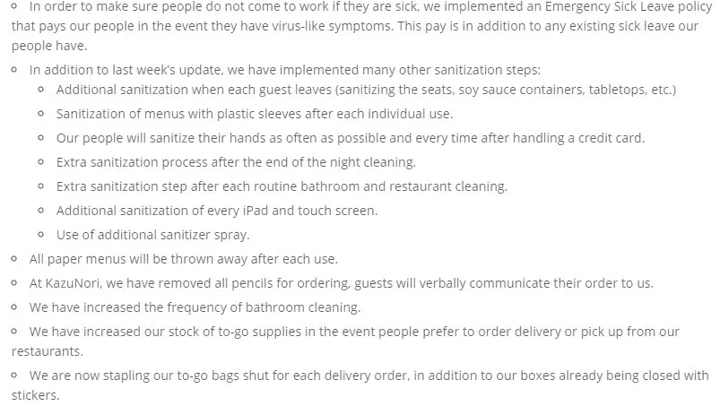
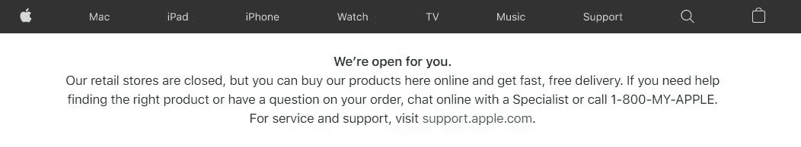
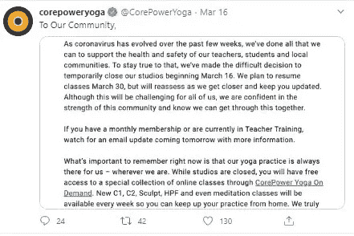
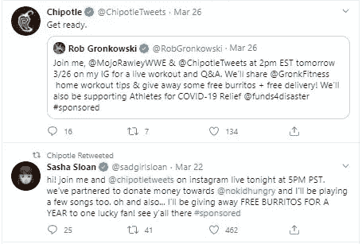

# 如何在危机时刻培养人际关系

> 原文：<https://medium.datadriveninvestor.com/how-to-nurture-relationships-during-a-time-of-crisis-cb56f4b33797?source=collection_archive---------14----------------------->

## 新冠肺炎危机结束后，你如何确保顾客对你的品牌保持忠诚？

Photo by [Austin Distel](https://unsplash.com/@austindistel?utm_source=medium&utm_medium=referral) on [Unsplash](https://unsplash.com?utm_source=medium&utm_medium=referral)

新冠肺炎改变了每个人的生活方式。随后，你的目标受众的需求也发生了变化。

你的大多数潜在客户不会考虑买什么车，穿什么衣服，或者买什么科技产品。

因此，营销人员也在与一种新常态作斗争。他们正在重新评估他们的策略。

如果你发布了你两个月前就计划好的东西，它可能就不再相关了。另外，你可能会显得麻木不仁。

 [## 数据驱动始于数据素养|数据驱动的投资者

### 光是听到“数据”这个词就令人生畏。老实说，只有 21%的全球员工对自己的工作充满信心

www.datadriveninvestor.com](https://www.datadriveninvestor.com/2020/03/22/data-driven-starts-with-data-literacy/) 

美国廉价航空公司 [Spirit Airlines](https://www.cbsnews.com/news/coronavirus-pandemic-spirit-airlines-ad-mistake-never-a-better-time-to-fly/) 付出了惨痛的代价才明白这一点。他们发出了一封写于危机开始前的促销邮件。

上面写着，“这是飞行的最佳时机。”

尴尬吧？

在这个充满挑战的时期，你需要专注于接触你的客户，并与他们建立牢固的关系。

不确定怎么做？

在本期播客中， [Photofy](https://photofy.com/) 的 CMO 泰德·鲁宾就这个话题给了我们一些可行的建议。

他宣扬关系回报或 RoR 的概念，并就此写了几本书。在这一集中，他讨论了在危机期间如何利用 RoR 来提高客户忠诚度。

在我们深入讨论之前，让我们先定义一下关系回报率:

# 什么是关系回报？

根据[泰德·鲁宾](https://tedrubin.com/return-on-relationship-the-new-measure-of-success/)的说法，关系回报是一个品牌因培养关系而积累的价值。这是一个品牌通过忠诚、分享和推荐逐渐获得的价值。

用于衡量品牌与客户关系的统计数据包括转发量、视频浏览量、正面评级、关注者和其他类似指标。

这些指标表明了品牌努力创造价值的有效性以及观众的反应。如果品牌致力于发展与客户的长期关系，他们也可以获得更高的投资回报率。

这就把我们带到了下一个问题。

在危机时期，你如何建立和加强这些关系？

让我们来看看。

# 危机期间如何改善与客户关系的有效技巧

在不确定时期，任何营销人员最不想做的事情就是表现得投机取巧或麻木不仁。

这意味着回顾策略，改进信息传递，变得有创造性。

你需要找到一种方法，在不显得投机取巧的情况下，让你的听众记住你。

但是你是怎么做到的呢？

以下是一些建议:

# 1.以客户为中心

在播客中，Ted 说他理解企业在赔钱。但他建议企业主不要诉诸硬销售技巧。

泰德认为，试图出售人们现在不需要的东西，很可能会损害你的声誉。这种影响可能会超过你可能带来的一点点收入。

你的重点应该是成为一个好的社区成员，让客户知道你正在采取什么措施来帮助他们保持安全，而不是销售。

同情受影响的人，并表明你的公司理解这种情况。

向洛杉矶和纽约的寿司连锁店 Sugarfish 学习吧。

他们定期发布更新，告诉他们的客户他们正在采取哪些预防措施来确保客户的安全。

*Image via* [*Sugarfish*](https://sugarfishsushi.com/covid-19/)

这种行为可以让你的顾客放心，增强他们的忠诚度。

为了提高你们关系的回报，确保你用简短的信息传达你的安全措施。

你还应该想办法直接帮助你的客户。

例如，Lyft 提供免费乘车，以便弱势群体能够出行并获得基本商品。

# 2.通过多种渠道主动沟通

在这种时候，你的企业需要利用数字渠道与消费者沟通。

随着越来越多的人呆在家里，他们的信息和娱乐来源很可能是数字频道。

花些时间通过社交媒体、你的网站和电子邮件主动与你的听众交流。告诉他们你是否已经关门或者你的营业时间已经改变。

告知客户他们如何与你的业务保持联系，因为他们大部分时间都呆在家里。

他们可以在您的[电子商务平台](https://shanebarker.com/blog/ecommerce-platforms/)上下单吗？你送货吗？他们还能访问你的客户服务吗？

尝试有效地沟通所有细节。

[例如，苹果](https://www.apple.com/newsroom/2020/03/apples-covid-19-response/)关闭了所有的零售店，并通过网站上的信息鼓励用户使用他们的在线商店。

*Image via* [*Apple*](https://www.apple.com/)

3.利用视频会议和实时视频

为了提高你的关系回报，继续让客户以数字方式轻松访问你的服务。你也应该向他们提供价值，这样他们就不会忘记是什么让他们选择你的公司而不是竞争对手。

为了保持联系，可以观看直播视频，或者在[举办网络研讨会](https://shanebarker.com/blog/webinar-hosting-websites/)。

利用 Instagram Stories 和脸书直播等功能吸引客户，建立品牌信任，并销售您的产品。

例如，CorePower Yoga 关闭了他们所有的工作室，但鼓励学生访问他们的在线课程，并继续在家练习。

不希望有这种选择的成员可以冻结其成员资格，直到以后。

*Image via* [*Twitter*](https://twitter.com/CorePowerYoga)

4.创新

为了提高你的关系回报，寻找新的方式为客户提供产品/服务，帮助他们解决问题。寻找有帮助和有用的方法。

向他们展示你是如何在保持价值主张的同时进行创新的。

例如，Chipotle 目前举办虚拟活动，除了分散顾客对当前危机的注意力，还为他们提供赢得食物的机会。

*Image via* [*Twitter*](https://twitter.com/ChipotleTweets)

正如人们所说，需求是创新之母。

在暂时停止汽车制造后，[福特和通用汽车](https://www.designnews.com/covid-19/ford-and-gm-resuscitate-shuttered-auto-plants-make-covid-19-respirators/29455018762765)开始制造呼吸机来帮助冠状病毒患者。[全球酿酒商](https://www.nbcnews.com/news/us-news/distilleries-using-high-proof-alcohol-make-hand-sanitizer-n1161371)也通过生产洗手液来帮助应对短缺。

通过给他们的生活注入希望，你可以让消费者知道你关心他们，并为解决问题做出贡献。

不要害怕问你的客户你能做些什么来支持他们。通过满足他们的需求，你可以为你的客户关系打下坚实的基础。

# 现在就建立关系，为未来做准备

根据 Ted 的观点，即使你不寻求回报，你也应该培养人际关系。

即使你没有盈利，你也需要想办法应对疫情造成的混乱。

向你的客户表明，你准备好超越盈利，以确保他们感到安全，并找到解决他们当前问题的方法。

这样做会激发对你的品牌的信心，并加强与他们的关系。它可以帮助你培养好感，这将确保他们在未来仍然是忠诚的客户。

**关于作者**

谢恩·巴克是[内容解决方案](https://contentsolutions.io/)和[礼品公司](http://gifographics.co/)的创始人兼首席执行官。你可以在[推特](https://twitter.com/shane_barker)、[脸书](https://www.facebook.com/ShaneBarkerConsultant/)、 [LinkedIn](https://www.linkedin.com/in/shanebarker/) 、 [Instagram](https://www.instagram.com/shanebarker/) 、 [iTunes](https://podcasts.apple.com/us/podcast/shane-barkers-marketing-madness-podcast/id1472142690) 上和他联系。