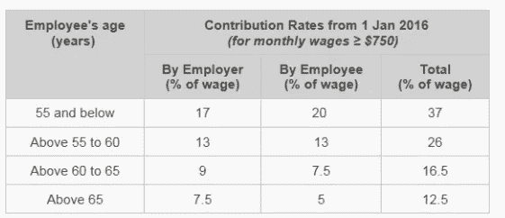
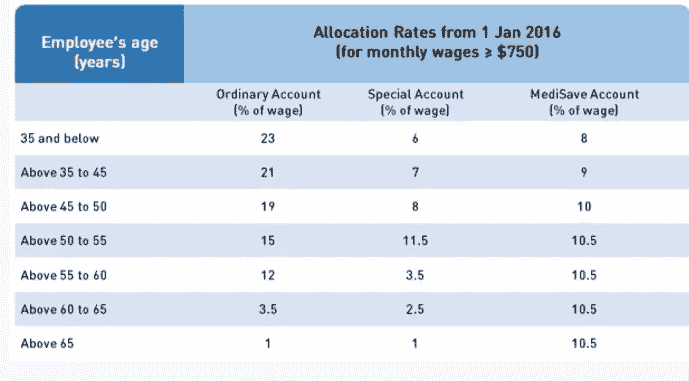
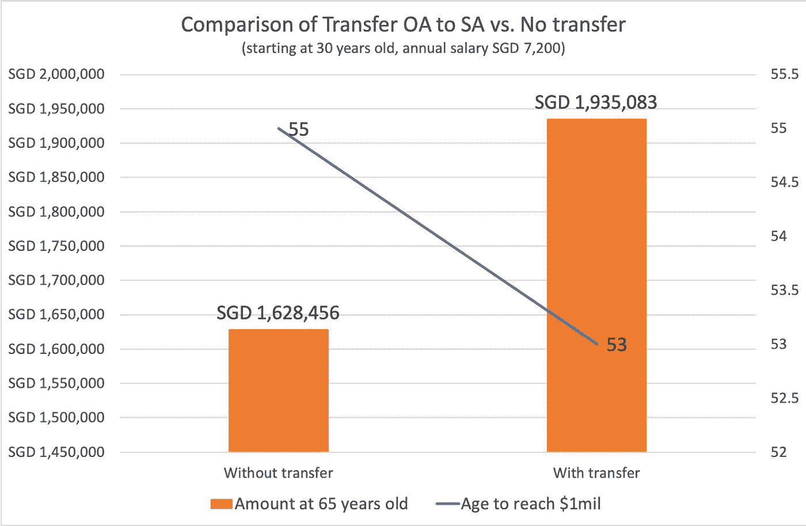
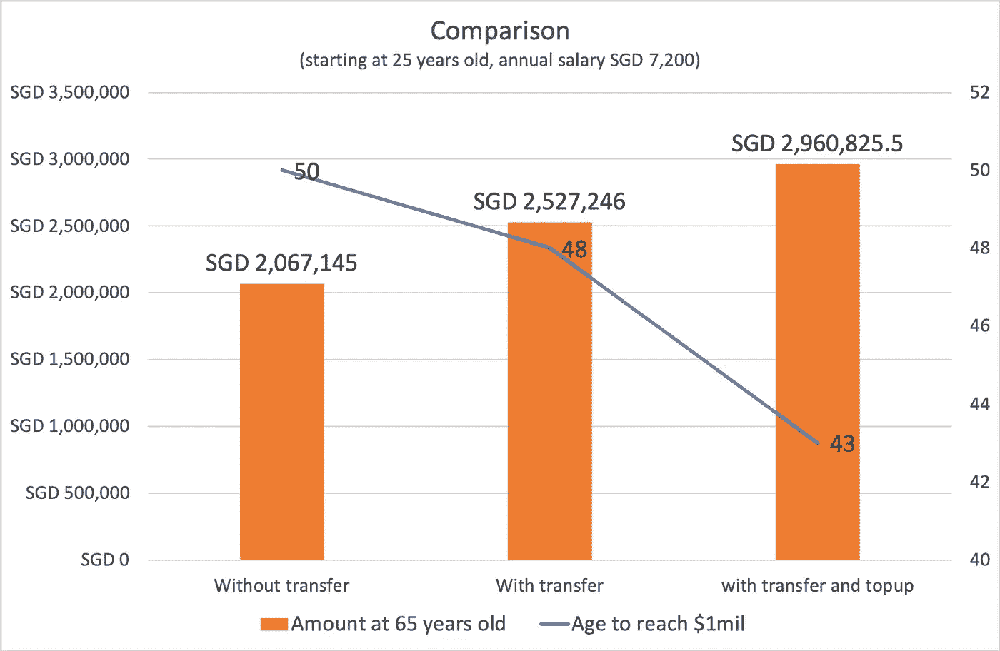

# 如何优化并拥有 100 万新币的公积金

> 原文：<https://medium.datadriveninvestor.com/how-to-optimize-and-have-sgd-1-million-in-cpf-9fad317d9873?source=collection_archive---------10----------------------->

## 中央公积金是新加坡的养老金制度，为老年人的生活和医疗费用提供收入。与一些欧洲国家相比，新加坡养老金制度的利率相对较高。这是积累 SGD 100 万的关键。但是不止如此。

Photo by [Skyler W](https://unsplash.com/@skylerw?utm_source=unsplash&utm_medium=referral&utm_content=creditCopyText) on [Unsplash](https://unsplash.com/s/photos/singapore?utm_source=unsplash&utm_medium=referral&utm_content=creditCopyText)

由于相当“复杂”的中央公积金系统，大多数人不明白它是什么，他们可以用它来做什么，或者他们如何优化它。当他们向中央公积金缴款而不是以最佳速度增长时，这是浪费时间。

# 中央公积金一瞥

对于公共关系和新加坡公民来说，缴纳中央公积金是强制性的。百分比因年龄段而异。不仅如此。雇主也为雇员的中央公积金缴纳一大笔钱。缴费率见下表。这适用于从第三年和公民公关。

source: CPF Board

中央公积金有三个账户:普通账户、特别账户和医疗储蓄账户。您的 CPF 资金根据下表进行分割:

source: CPF Board

# 贡献限制

这并不是说你挣得越多，你的公积金就越多，它的上限是 6000 美元。如果你每月收入超过 6000 美元，你的缴款额将与收入 6000 美元的人相同。

您可以自愿充值，公积金缴款总额上限为 37，740 新币。

如果你 30 岁，月收入 6000 新加坡元，你每年的公积金将是 26，640 新加坡元(总工资的 37%)。但是，它低于 37，740 瑞士法郎的最高限额。可以自己充值 11100 新币。这部分叫自愿捐款。你会看到如何自愿捐款可以使你的公积金退休金额大不相同。

# 每个账户的利率

公积金账户里的钱是有利息的，利率一点都不差，多亏了新加坡政府。

普通账户:2.5%

特别账户:4%

医疗储蓄账户:4%

而你公积金里的第一笔 6 万新币，利率多了 1%。

您可以将资金从 OA 转移到 SA 以获得更高的利率，条件是您对资金的访问权限有限。因为在 OA 和 SA 中使用基金的标准是不同的。

由于复合效应，如果你开始得早，你的公积金将会增长到一大笔钱。如果您不提取并每年自愿捐款，您甚至可以加快这一过程。

# 拥有数百万新加坡元的中央公积金

我制作了 5 个场景来向你展示

1.  将资金从 OA 转移到 SA 与不转移
2.  用自愿捐款充值，而不是充值
3.  在 25 岁和 30 岁时开始缴纳公积金

**1。从 OA 转移到 SA 与不转移的比较**

在职成年人 Peter 和 Rachel，均于 30 岁开始缴纳 CPF，年薪为 72，000 新加坡元。简单示例中没有工资变化。为简单起见，计算中不考虑第一笔 60，000 新币 1%的额外利率。

Peter 将他的资金从 OA 转移到 SA，以获得每年更高的利率。瑞秋没有。

source: own computation

**下载电子表格计算自己的养老金金额** [**这里**](https://fantastic-creator-4488.ck.page/fa91d82dfd) **。**

当他们 65 岁时:

*   瑞秋的公积金有 160 万新加坡元，55 岁时达到 1 百万。
*   彼得的公积金有 190 万新加坡元，他 53 岁时达到 100 万新加坡元。

通过将资金从 OA 转移到 SA，由于 1.5%的利率差异，Peter 比 Rache 多获得了 30 多万新币。

 [## 如何在不牺牲孩子或财务的情况下安全理智地离婚|数据驱动…

### 在美国，七月是以孩子为中心的离婚月。作为 cdfaⓡ的专业人士，我可以向你保证，从长远来看…

www.datadriveninvestor.com](https://www.datadriveninvestor.com/2020/07/28/how-to-divorce-safely-and-sanely-without-sacrificing-your-children-or-your-finances/) 

**2。自愿捐款充值与不充值**

工作的成年人汤姆、丽莎和埃德温都在 25 岁开始缴纳 CPF，年薪为 72，000 新加坡元。简单示例中没有工资变化。为简单起见，计算中不考虑第一笔 60，000 新币 1%的额外利率。

Tom 将他的资金从 OA 转移到 SA，以获得每年更高的利率，他充值了 11，100 新加坡元，达到了 CPC 缴款的最高金额。

Lisa 只将资金从 OA 转移到 sa，她不充值。

埃德温什么都不做。

source: own computation

**下载电子表格计算自己的养老金金额** [**这里**](https://fantastic-creator-4488.ck.page/fa91d82dfd) **。**

当他们 65 岁时:

*   汤姆的中央公积金有 290 万新元，他 43 岁时达到 100 万新元
*   丽莎的中央公积金有 2，530 万新加坡元，她 48 岁时会达到 100 万。
*   埃德温的中央公积金有 200 万新加坡元，他 50 岁时将达到 100 万。

**3。在 25 岁和 30 岁时开始缴纳中央公积金**

尽管 Rachel 和 Edwin 没有为 CPF 采取任何行动，但由于起步较早，Edwin 比 Rachel 多了约 370，000 新元。因为他在最初 5 年的早期贡献在接下来的 35 到 40 年里滚雪球般地变成了一大笔钱。

# 结论

*   早开始为公积金做贡献比晚开始有巨大的优势。
*   将 OA 转移到 SA 可以帮助您的 CPF 资金在几年内更快地增长
*   在汤姆和丽莎的案例中，将公积金加到最大额度会导致 50 万的差额。

如果你还在 20 多岁和 30 多岁，你应该专注于最大限度地贡献你的公积金，并将资金从 OA 转移到 SA。这样，你的公积金资金将有很多年的增长时间，当你退休时，你将有一笔可观的退休金额，当你没有体力，可能也没有精神力量再去工作了。为未来的自己建立一个强大的安全网总是很重要的。

你甚至可以用你的公积金投资 ETF，它可能会给你带来高于 4%的年增长率。有很多方法可以优化和激活你的公积金资金。但是你不应该冒太大的风险，因为它们是你的退休基金。

如果您计划使用公积金资金购买住房或其他用途，计划金额，不要将所有资金从 OA 转移到 SA，请根据您的个人需求阅读每个帐户的详细信息，然后您可以优化您的公积金。

**下载电子表格计算自己的养老金金额** [**这里**](https://fantastic-creator-4488.ck.page/fa91d82dfd) **。**

要了解更多关于金钱的技巧，请关注我的账户或收听我的播客，我们在这里谈论金钱、职业和企业家精神:[https://www.fasttrack.life/](https://www.fasttrack.life/)

## 访问专家视图— [订阅 DDI 英特尔](https://datadriveninvestor.com/ddi-intel)