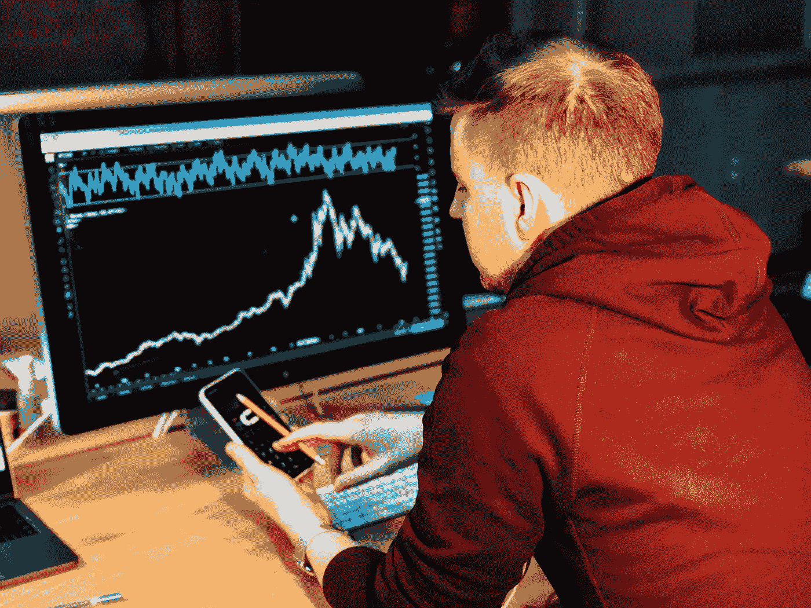

# 如何克服股市亏损

> 原文：<https://medium.datadriveninvestor.com/how-to-overcome-losing-money-in-the-stock-market-b5c41cc6b6f2?source=collection_archive---------6----------------------->

## 帮助你摆脱亏损并回到正轨的策略。

Photo by [Chris Liverani](https://unsplash.com/@chrisliverani?utm_source=unsplash&utm_medium=referral&utm_content=creditCopyText) on [Unsplash](https://unsplash.com/s/photos/stock-exchange?utm_source=unsplash&utm_medium=referral&utm_content=creditCopyText)

我问过的人的共识是，股市是人们赔钱的地方。他们并没有完全错。像任何事情一样，有赢家，也有输家。

有耐心的人会赢，没有耐心的人会输。

股票市场是一个简单的概念，你低买高卖。不幸的是，有些人太沉迷于他们的损失，并继续追逐他们以弥补他们的损失。

这不像去赌场赌 1000 美元的黑色。市场中涉及到更多的风险管理和预测。我在股票市场上有输有赢，但我的初始投资仍有 40%的回报。

以下是如何克服股市亏损，逐步提升你的投资组合价值。

# 评估你为什么亏损

在遭受重大损失后，人们很容易对亏损耿耿于怀，并放弃股市。当我在一个变焦期权上损失了 200 美元，几天后就价值 3000 美元时，我几乎要退出了——这笔交易的保证金价值约为 2800 美元。

## 人们赔钱的常见原因

*   他们不相信自己的直觉，过早退出。
*   他们处于亏损状态的时间太长了。
*   他们报复交易，非理性地试图挽回损失。
*   他们没有对所投资的公司做足功课。

一定要确保对一家公司进行尽职调查。如果它们没有增长，也没有任何理由让它们的价值上升，那就不要买入。你需要知道你在寻找什么催化剂来决定它是否值得你花费时间和金钱。

T2 的退出战略比进入战略重要得多。如果你在某项交易或期权上赚了 100%,兑现利润，不留一点钱是个好主意。你是对的！接受你的奖励，继续寻找下一个机会。

**炒作股票**是一个非常棘手的情况。例如，一群投资者跳进了另一家名为 Nikola 的电动汽车公司。这家公司在几天内从 20 美元涨到 70 美元。接下来，你知道，许多股东投资了一家即将倒闭的公司。

 [## 收盘，但没有雪茄-股票市场目标在停滞的 COVID 救济中创新高|数据驱动…

### 专家聊天程序:一个协作市场，在这里人们可以和能够解决他们问题的专家聊天。是……

www.datadriveninvestor.com](https://www.datadriveninvestor.com/2020/08/18/close-but-no-cigar-stock-market-targets-record-highs-amidst-stalled-covid-relief/) 

# 只坚持交易几个公司

你不想分散自己的精力，过多地涉足不同的行业。这是**过度多元化**的一个例子。专注于你相信的几个行业和业务。

管理你的风险在几个不同的股票领域中，正确一次比尝试正确七次更重要。如果你试图预测未来的七种运动，对你没有任何好处。最好在一两个交易上全力以赴，希望你的功课有所回报。

**要想在市场上赚大钱，你不必什么都知道。**

取而代之的是，你只需要知道几样东西，并且理解得极其透彻。例如，如果你是一个游戏玩家或电脑奇才，非常了解 AMD 和 NVIDIA，那么不要去猜这些公司，而不要去猜下一个将会是哪家制药公司。

**了解你的目标—** 如果你不知道你在寻找什么价格或催化剂，把钱投入市场是没有意义的。人们希望并祈祷一切顺利，但最终却失去了自己的血汗钱。

一次只关注一家公司，这样你就可以轻松地从他们的成功中获利，并在他们失败时买入。这是一个跌宕起伏的游戏。时机很重要，但你的尽职调查更重要。

# 你能活着看到明天

不要像华尔街的投资者一样，在不受你控制的交易上拿你一生的积蓄冒险。在这一点上，它变成了赌博，你很容易向耐心的股票交易者付钱。

股市不是一个快速致富的计划。否则，每个人都会这么做并从中获利。没那么容易。学习如何持续积累财富需要时间和承诺。你将不得不投入时间，赔钱，并吸取教训。

会有**好日子、**和**坏日子**。你必须考虑到好日子和坏日子。最重要的是，你有史以来的投资组合正在上升！

# 外卖食品

股票市场的投资和交易伴随着奇迹和心碎。不要试图成为其中之一。

只需关注持续的增长，并为自己长期以来的进步感到自豪。

*   评估你的损失，尽一切努力避免再犯同样的错误。
*   只交易几家公司，否则你会不知所措，看不到你的目标。
*   不要拿你的钱去冒险，因为那是赌博，你更容易把你的钱交给别人。

市场现在很不稳定，交易者们，注意安全。

如果你喜欢这个故事，这里还有一些你可能也会喜欢的文章！

 [## 交易期权可以成就你，也可以毁灭你

### 我如何在华尔街投资 1 万英镑，但却被期权交易套牢，损失了大约四分之一的利润

medium.com](https://medium.com/long-term-perspective/what-i-learned-about-trading-options-on-robinhood-21992471905f)  [## 投资股票要遵循的首要规则

### 为你辛苦赚来的钱制定策略，给你在股票上获利的最大可能性…

medium.com](https://medium.com/long-term-perspective/the-1-rule-to-follow-when-it-comes-to-investing-in-stocks-2908b37ec4fc)  [## 投资股票应该给你信心，而不是不断的担心

### 技巧 1:设置好，然后忘记它

medium.com](https://medium.com/datadriveninvestor/investing-in-stocks-should-be-fun-and-youre-overcomplicating-it-aa5d4e0ffc88) 

## 访问专家视图— [订阅 DDI 英特尔](https://datadriveninvestor.com/ddi-intel)